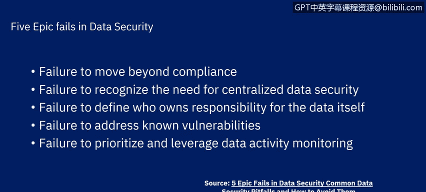

# IBM网络安全分析师专业证书课程6：《网络威胁情报课程（IBM）》｜ibm-cyber-threat-intelligence｜ - P8：7_数据安全常见陷阱.zh - GPT中英字幕课程资源 - BV1jN411679K

Hello， in previous sections we have discussed what data security and protection is。

 what we are protecting against， and why we are dueling all of this。

 We have also discussed some top challenges。In this segment。

 we will discuss some of the common pitfalls in data security。

Important to note that this is not a comprehensive list of pitfalls。

 also it addresses them from a high level rather than getting down into technical details。

The first pitfall to consider is the failure to move beyond compliance。

 We talked about compliance with privacy regulations as one of the top challenges。 Well。

 compliance with laws， regulations and commonly accepted industry standards is a start。

 but it is not enough。Our most important goal is to reduce the risk of security breaches。

That means reducing the likelihood of security failures in minimizing the cost of recovering from security breaches。

Now， regulation compliance is an important part of that。

Regulation and standard compliance efforts can provide a foundation on which to plan and implement a data security protection solution。

 reducing the likelihood of security failures。Additionally。

 regulations and standards may address what measures must be put in place to deal with security breaches when they occur。

And providing regulatory compliance is a big part of establishing due diligence。

But our organizations have unique data security requirements。

 and the responsibility to meet these requirements ultimately lays with us；

 we likely have data assets that are not addressed by the regulatory standards。

 but which still are valuable and are at risk if not protected。

Failure to move beyond compliance is shortighted。Furthermore。

 regulations and standards do not keep up with an ever changing and evolving threat environment。

We need to be farightd and proactive in aggressively identifying， modeling。

 and preparing for existing threats while researching， educating ourselves about。

 and predicting future threats。We cannot afford to wait and let the laws， regulations。

 and standards catch up with the threats。That will never happen。Ideally。

 we should be at a point of readiness where we can inform and contribute to the future evolution of standards and regulation。

Good risk assessment， continuing an iterative vulnerability assessment program。

 and sensible control measures take us beyond checking the box for regulatory compliance to a culture where we drive the solution。

Another pitfall is the failure to recognize the need for centralized data security。

Organizational data and IT structure tends to be siloed and distributed。It is easy。

 especially in the complex operational environments。

 to assume that the other guy has security covered or to take a sin no evil or everything's fine so far approach。

 These attitudes can lead to critical gaps in security coverage and worse finger pointing when the inevitable breach occurs。

Organizations must make data security a priority， invest overall responsibility in a single supervisory。

 high level role on or near the executive level。This senior manager must have the authority to determine and implement necessary security strategy。

Generally， the Se manager for Security is not the CEO。

 but rather a full time job that reports directly to the CEO， or at least the CIO。

Full support of the CAEO and other high level positions for this role is essential。

This role defines the vision for security and makes sure it is brought to reality。

The role also understands that the threat environment evolves and grows。

New types and sources of data must be quickly integrated into the overall data security and protection solution。

That means the solution must be flexible enough to adapt to these changes。

Appropriate products must be implemented that allow central management of security policies。

The organization should have some sort of security intelligence and event management or SIEM solution to centralize alerts and coordinate mitigation measures。

Auditing solutions must be set up to allow a comprehensive。

 rigorous view of the data security situation throughout the organization。

Associated with failure to centralize is the failure to define who owns responsibility for the data itself。

 it is necessary but not enough to have an overall security manager。

 we must also define explicitly and in detail who has responsibility for sensitive sensitive data assets。

Many standards and regulations call for the explicit creation of a chief data officer， CDO。

 or data protection officer DPO， whose full-time job is just that they will often report directly to the overall security manager this CDO or DPO must be technically qualified and understand lines of business they must assess risk and develop a comprehensive data security strategy at the technical level。

A fourth pitfall is the failure to address known vulnerabilities；

 we might envision that cyber criminals use secret vulnerabilities。

 unknown to anyone other than themselves and other illicit actors。However。

 the vast majority of exploits use known vulnerabilities。

 Melware and ransomware targets vulnerabilities at least six months old。

 These are often vulnerabilities for which patches already exist and are widely known。

 Vulnerabilities for which patches existed have accounted for many high level breaches。

 Think about it。 The vulnerabilability was known。 The patch existed， yet the breach still occurred。

 but while necessary to patch quickly， it can be difficult。

 You must have an accurate inventory of products you use。

 You need detailed technical knowledge of the vul products。

 You must test patches to ensure they work and do not break existing functionality。

You must have a plan to install the patches。 You must know the status of resources procured from third-party partners As an example。

 if you use a cloud service in your business system。

 you must understand the cloud environment and work with the cloud provider to ensure that critical components are protected from known risks。

 This requires understanding what data assets you have and what baseline states should be expected。

 You must implement a program of frequent vulnerability assessment scans。

 This means coordinating with line of business owners and other stakeholders and a robust change in configuration management program。

Finally， there is the pitfall of failing to prioritize and leverage data activity monitoring。

After discovering， classifying， assigning responsibility。Implementing compliance measures。

 analyzing threats， and placing appropriate access controls and protocols on data。

 it is tempting to consider the job done， but you are defending your data and any good defense requires continued and active monitoring。

Monitoring data access is difficult technically。Out of billions of transactions。

 only a few might be suspicious。Filtering activity data in order to process it is a challenge CPU。

 RA， network bandwidth and disk must be used as efficiently as practical to keep the monitoring solution from overwhelming the resources available。

Furthermore， you must put in measures to monitor privileged users。

 even figuring out what to monitor and how to monitor it can be daunting。

But this is critical data is especially vulnerable to inside attacks。

 such as those from privileged users， whether it is a malicious action by a disgruntled employee or an outside actor using a compromised privileged account。

There are many facets of monitoring data activity， including blocking or quarantining users performing suspicious activities。

 identification of outliers that might signify illicit activity。Masking data in real time。

 preserving data for audit， and integrating with event consoles to notify response teams in a timely manner。

To meet this challenge， we must use a stepped approach。

 starting with the most sensitive data sources， perhaps just one or two。

 and targeting other data sources in their turn。Iteration will allow you to incorporate new data sources into your monitoring scheme as well as refined monitoring policies。

Identify high risk user accounts and turn off or restrict unneeded access points。

Monitor holistically， tracking not only databases but sensitive data and files， Hadoop， NoSQL。

 and cloud platforms。Use the data glan from monitoring to produce useful reports and set up a process for distributing these reports to stakeholders for careful audit。

In summary， we have discussed five leading pitfalls and how to guard against them in the next segment we will discuss industry specific challenges。

