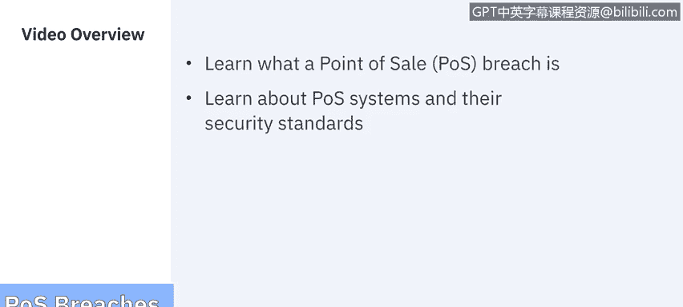
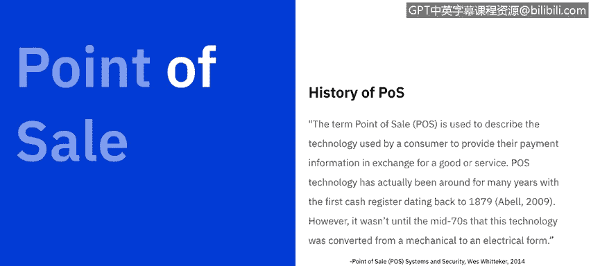
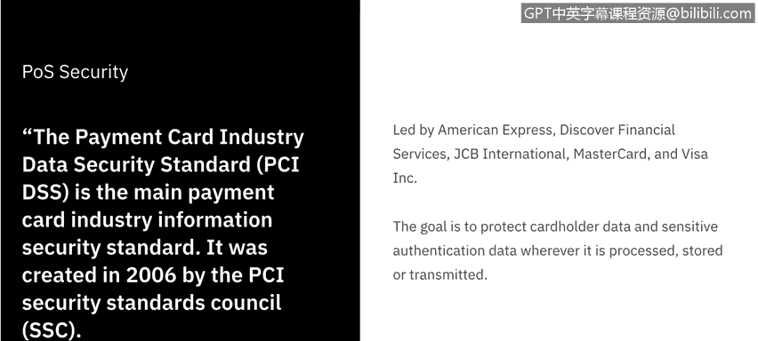
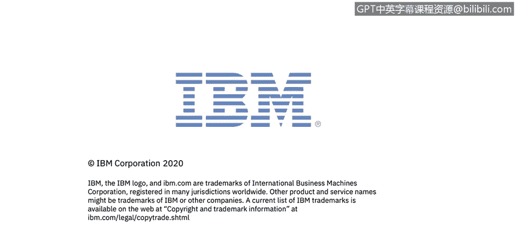

# IBM网络安全分析师专业证书课程7：《网络安全顶级项目：入侵响应案例研究》｜ibm-cybersecurity-breach-case-studies｜ - P12：11_POS违规概述.zh - GPT中英字幕课程资源 - BV1MN41167mY

Welcome to Point of Sa breach brought to you by IBM。In this video。

 we'll be learning what a point of sale breach is and learn about the P Os systems and their security standards。

 Let's get started。

The main objective of the point of sale breaches is to steal your 16 digit credit card number。

60 per of point of sale transactions are performed via credit card。

 which means big business for cyber criminalals。 The industry's most affected by P。

 O S data breaches are usually restaurants， retail stores， grocery stores and hotels。

 but data breaches actually happen more frequently to small and medium sized businesses。

 because they are easier to compromise than the computer networks of larger retailers。

In the Sands Institute White Paper， West Whittaker wrote the term point of sale is used to describe the technology used by a consumer to provide their payment information in exchange for a good or service。

P O， S technology has actually been around for many years with the first cash register dating back to 1879。

 However， it wasn't until the mid 70s that this technology was converted from mechanical to an electrical form。

Over the next several years， support for barcode scanning and payment card reading was added。

Modern POS systems today are all upelled to the same security standard。

The payment card industrydustry Data Security Standard or the PCI DSSS is the main card industrydutry Information security standard it was created in 2006 by PCI Security Standard Council。

The PCI Security Standards Council is LED by American Express Discover Financial Services。

 JCB International Mastercard and Visa Incorporated。

The goal is to protect cardholderer data and sensitive authentication data whenever it is processed。

 stored or transmitted。In order to create the new standard。

 PCI DSSS came up with a list of controls and processes for the industry to adopt。

Let's cover those， next。According to the PCI DSSS， merchants。

 service providers and other entities involved with payment card processing must never store sensitive authentication data after authorization。

This includes the three or four digit security code printed on the front or back of a card。

 The data stored on a card's magnetic stripe or chip。

 also called full track data and personal identification。 P numbers entered by the card holder。

 Major categories of security controls and processes are as follows。One。

 build and maintain a secured network and systems。Two， protect cardholderer data。3。

 maintain a vulnerability management program。4， implement strong access control measures。

5 regularly monitor and test the networks and 6 maintain an information security policy。

In order for these security controls and processes to be met。

 the PCI DSSS had 12 different requirements to meet。The requirements are as follows。

Install and maintain a firewall configuration to protect cardholderer data。

Do not use vendor S defaults for system passwords and other security parameters。

Protect stored cardholderer data。Enccrypt transmission of cardholderer data across open public networks。

Use and regularly update antivirus software。Develop and maintain secure systems and applications。

Restrict access to cardholderer data by business need to know。

Assign a unique I to each person with computer access。Restrictt physical access to cardholderer data。

Track and monitor all access to network resources and cardholderer data。

Regularly test security systems and processes。And lastly。

 maintain a policy that addresses information security。Even with these 12 different requirements。

 the ever changing landscape of cybersecurity threats has us asking。Is the PC I D S S enough。

 according to some industry professionals。The answer is no。

A blog post from the Aneneo Group says that in 2018。

 cyber attacks increased by 32% in the first few months of the year compared to the same period in 2017。

Threats from criminals are constantly evolving and becoming more sophisticated。

Being only PC I compliant is not enough， and businesses need to take additional security measures to protect sensitive cardholderer data and their payment technology investment。

 Here are a few ways businesses can protect their payment infrastructure。

 The first way is a semi integrated payment approach。With this， sensitive card data is isolated。

 encrypted and sent directly from the terminal to the intended processing host or gateway。 This way。

 the payment or card data never touches the point of sale system。

 keeping it safe from any vulnerabilities。The second possibility is the integration of a point to point encryption。

A point to point solution helps protect the card data while it's on the move during the payment process。

It's an industry proven solution that helps protect sensitive car data from cyber criminals。

Another approach is tokenization， which goes hand in hand with the point to point encryption。

It replaces the sensitive information with a secure encrypted token protecting it from cybercris when the data is at rest。

 after many data breaches over the years， current PCI standards do not allow businesses to save and store credit card details unless they are tokenized on their POOS systems or databases after the transaction。

When a data is tokenized， it becomes useless to any cyber criminal as it can only be decoded by the payment processor。

Another option is MDM management or mobile device management。 In a lot of instances。

 many businesses may use consumer grade mobile devices to work with their POS systems。

This is where MDM can come in handy。 MDM is a type of security software that allows businesses to remotely deploy and securely manage their mobile POS solutions。

The software solution also helps businesses protect their mobile POS solutions from security threats。

And last， and possibly something that no business should go without is further employee education。

Effective training of employees regarding basic security protocols can help curb mistakes and better protect your business。

 Next， let's dive in to how these P O S breaches are happening by digging into P。 O S。 malware。

 We'll see in the next video。

