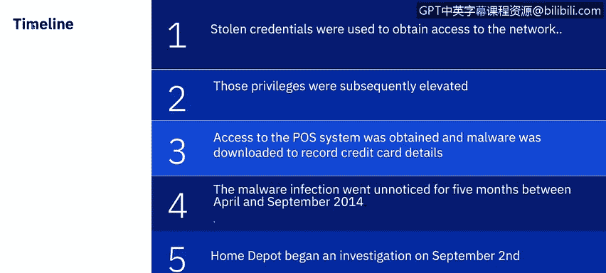

# IBM网络安全分析师专业证书课程7：《网络安全顶级项目：入侵响应案例研究》｜ibm-cybersecurity-breach-case-studies｜ - P14：13_POS案例研究家得宝.zh - GPT中英字幕课程资源 - BV1MN41167mY

A point of sale case study of Home Depot brought to you by IBM。In this video。

 you will understand the timeline of events of the point of sale or P O S attack。

 Learn about what actions were taken by the threat actors and learn what the impacts are from a P O S attack。

If we explore the summary of the attack， we will find a couple of similarities to the target attack。

 which occurred in 2013。 Home Depot is one of the many victims to a retail data breach in 2014。

 The unfortunate thing is the way the attackers infiltrated the P O S networks and how the attackers were able to steal the payment card data included some of the same methods used in the target data breach。

 The attackers were able to gain access to one of Home Depot's vendor environments by using a third party vendor's logging credentials。

Once they were in the Home Depot network， they were able to install memory scraping malware and over 7500 self check out P O S terminals。

 This malware was able to grab the data from 56 million credit and debit cards。😊。

The mallllware was also able to capture 53 million email addresses。

The stolen payment cards were used to put up for sale and bought by carters。

 Carters are active participants on websites referred to as carding forums。

 Most carding forums facilitate the sale of stolen identities。

 compromise credit card numbers and false logins。The stolen email addresses were helpful in putting together large fishingish campaigns。

Next， let's take a look at the timeline of the attack。As we discussed。

 the stolen credentials from one of the retailer' vendors was used to obtain access to the network。

Those privileges were elevated and used to access the POS system where malware was downloaded to record credit card details。

The malwware infection went unnoticed for five months between April and September 2014。

Home Depot explained that the investigation started on September 2。

 and they were still trying to discover the actual scope and impact of the breach。On September 8。

 2014， Home Depot released a statement indicating that its payment card systems were breached。

Home Depot explained that they would be offering free credit services to affected customers who used their payment card as early as April of 2014 and apologized for the data breach。

Once the attackers gained access to the Home Depot network。

 they exploited a zero day vulnerability in Windows。

 which allowed them to pivot from the vendorspec environment to the Home Depot corporate environment。

 A zero day vulnerability as a computer software vulnerability that is unknown to or an unaddressed by those who should be interested in mitigating the vulnerability。

 including the vendor of the target software until the vulnerability is mitigated。

 hackers can exploit it to adversely affect computer programs， data。

 additional computers or a network。 This previously unknown weakness within Microsoft Windows enabled the attackers to escalate privileges。

 move laterally through the network and identify 7500 self checkout lanes。😊。

There were several countermeasures Home Depot could have had in place to prevent the breach from happening and to have been able to detect the breach sooner。

 minimizing the impact。Vulnerability management。 There was no proof of regularly scheduled vulnerability scanning of the P O S environment。

 Furthermore， research indicates Home Depot did not have a vulnerability management program。

 performing monthly vulnerability scans of the P， O S environment。

 They could have used the results of those scans to show management the significance of the gaps in that environment and possibly started to mitigate the risk of the environment before the breach occurred。

System configuration。 Home Depot didn't have secure configuration of the software or hardware in the P O S terminals。

 They didn't have a proper network segregation between the Home Depot。

 corporaterate network and the P O S network。 The lack of network segregation was another big gap in this breach。

 Home Depot should have had the P O S environment on its own restrictive virtualized local area network。

 or Vlan。Home Depot did have semantic and point protection installed in their environment。

 But the problem is， they did not have an important feature turned on in the product called network Thr protection。

 Another secure configuration missing was the use of point to point encryption。

 The operating system running in the P， O S devices was Windows X， P。 at the time。

 Windows X P machines were highly vulnerable to attacks。

 So the fact that Home Depot's P O S registers were still running this operating system added to their vulnerability to attack。

Creentials， Home Depot was not properly managed as third party vendor credentials and should have allowed only minimal access to that vendor account。

 We have discussed in earlier courses the principle of lease privilege。

 an important concept in computer security is the practice of limiting access rights for users to the bare minimum permissions they need to perform their work。

Even if Home Depot couldn't have prevented the attack。

 they still should have had monitoring capabilities。

 so it did not take five months to detect an intrusion。

 having the capability to forward any network or host activity in the P O S environment to asim would have been beneficial to Home Depot and could have allowed them to detect the breach sooner。

 minimizing the impact。

So what were the estimated costs of the Home Depot breach。 The Home Depot data breach was huge。

 It was the largest retail data breach involving a point of sale system that has been seen so far。

 malware had been downloaded that allowed cyber criminals to obtain over 50 million credit card numbers from Home Depot customers and around 53 million email addresses。

 Home Depot agreed to pay out 19。5 million to customers that had been impacted by the breach。

 The payout included the cost of providing credit monitoring services to those affected by the breach。

Home Depot is also paid out a minimum of 134。5 million to credit card companies and banks。

 The settlement amount permitted banks and credit card companies to submit claims for $2 per compromise credit card without having to show proof of losses suffered。

 If banks can show losses， they will have up to 60% of losses compensated。

The total cost of the retail data breach is approximately 179 million。

 although that figure did not incorporate all legal fees that Home Depot had to pay and neither does it include undisclosed settlements。

 The final cost of the retail data breach was much bigger。

 most likely closer to the 200 million mark。What's harder to determine is the reputation damage。

Following any data breach， customers often take their business to a different company。

 Many consumers impacted by the breach have chosen to shop elsewhere。

 A number of studies have been carried out in the follow up from a data breach。

 One high trust study states that the companies may lose 51% of customers following a breach of sensitive data。

In addition to the additional vulnerabilities mentioned of putting together a vulnerability management program and identifying the least privilege each person needs to access systems。

After the target in Home Depot breaches， a new type of credit card was beginning to replace the traditional magnetic strip。

 which was common in the United States。 The chip and pin card。

 which contains an embedded security chip。 In addition to the traditional magstrite。

 This embedded security chip ensures that the card cannot be duplicated as it masks the payment data uniquely for each transaction。

 In addition to chip cards， vendors began promoting an alternate method to payment cards。

 using mobile payment methods like Apple Pay and Google Wall。 This smart device could be a phone。

 tablet or even a watch， with both of these mobile payment systems。

 they never pass your credit card number to the margin。

Additional security was also provided by point to point or P2 P encryption。

 P2 P encryption encrypts car data at the point of the swipe all the way to the bank for approval or denial of the transaction with P2 P encryption。

 payment card data is never exposed and is encrypted before it reaches memory。

 The only risk still remains with P2 P encryption as if some were to install a credit card skimmer on the actual pinpa。

 which is still occurring in 2020， primarily at gascations and places where the keypad does not have an inperson attendant。

 These alternate methods were outcomes in the most common method used in the large scale retail breaches。

Next item we'll explore third party breaches and I will be back to discuss the Que data breach。

