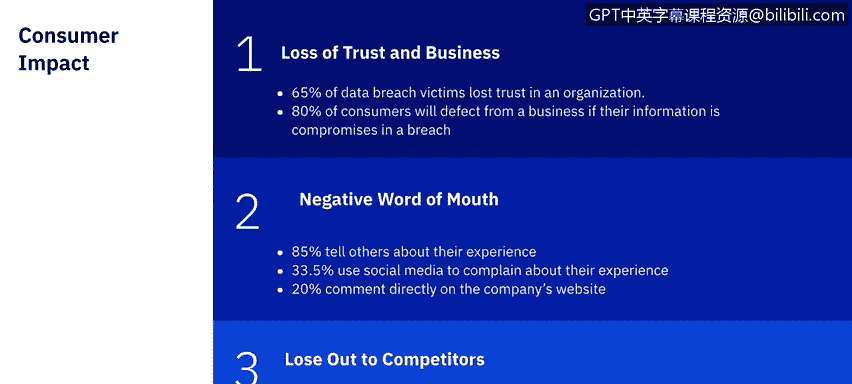

# IBM网络安全分析师专业证书课程7：《网络安全顶级项目：入侵响应案例研究》｜ibm-cybersecurity-breach-case-studies｜ - P16：15_第三方违规影响.zh - GPT中英字幕课程资源 - BV1MN41167mY

Welcome to third party B Impact brought to you by IBn。In this video。

 we'll be learning about the impact third party breaches can have on individuals and businesses。

Third party breaches remain a dominant security challenge for organizations。

 with over 63% of breaches linked to a third party。

To prevent or mitigate the severity of a third party breach or cyber exploit。

 organizations can implement a variety of cybersecurity risk management controls。

 such as assessing compliance with regulations， vetting third party security practices。

 and establishing data breach cyber exploit incident response procedures。

I'd like to start off by discussing the landscape in the industry。 So heres some quick facts。

In financial services， they reported the second most third party breaches despite their third party spending the most time on assessments over 17。

000 hours per year。In health and pharma， they're less likely to have a third party breach and most likely to use a combination of tools to assess third parties。

In the public sector， they use a combination of tools to assess third parties and tend to believe the results areval。

In retail， they reported the most third party data breaches。

 despite their third party spending over 16578 hours on assessments。And then in tech and software。

 they are the most likely to have multiple third party date breaches and over 41% still use manual procedures to assess third parties。

In the same study， they determined that third party breaches remain an expensive problem。

IT security professionals still believe their TPCM programs are immature。

And using a combination of automated tools provides better results。

Risk prioritization processes are viewed as critical， but current processes are ineffective。

If third party security gaps are discovered， organizations are not proactive in mitigating these risks。

No one function controls the budget for third party cyber risk management programs。

Investing in better assessment and vetting tools can increase effectiveness of third party cyber risk management while decreasing the cost of maintaining the programs。

And there is a massive disparity between the resources vest， both human and financial。

In a 2019 Pment Institute research study on third party breaches within health care。

The respondents said that one third would actively mitigate or mediamediate the security gap。

 getting involved themselves。Another third approximately said that they would terminate the relationship with the vendor outright。

While the other approximate third said that they would work with the third party to fix whatever issues there were。

You would think that the percentage of companies just terminating the relationship with the vendor outright would be much higher。

 but this actually correlates well with how consumers react to third party breaches as well。

In a 2016 security magazine survey on how cyber security breaches affect consumer trust。

 they broke down the results in the three categories， losss and trust of business。

 negative word of mouth， and losing out to competitors。😔。

65% of data breach victims lost trust in the organization。

80% of the customers will defect from a business if their information is compromised in the breach。

85% tell others about their experience， 33。5 use social media to complain about their experience and 20% comment directly on the company's website。

52% of customers would consider paying for the same products or services from a provider with better security。

And 52% of customers said that security is an important or main consideration when purchasing products or services。

Additionally， the survey findings also highlight the potential long term financial impact of data breaches on major brands。

 with 59% of consumers warning they would take legal action against the company if the data breach resulted in their personal data being used for criminal purposes。

72% of consumers also reported they will now share fewer personal details with companies。

 which could hit the revenues for organizations from social media platforms to search engines that rely on collecting detailed consumer data for advertisers And while 65% of data breach victims said they lost trust in an organization。

 in the target breach， which was one of the most largest significant breaches of our time。

40% cent of its customers said that it didn't matter to them。

Now that we've learned about third party breaches and the impacts they can have。

 let's take a look at a real life example in the next video。 We'll see you there。

