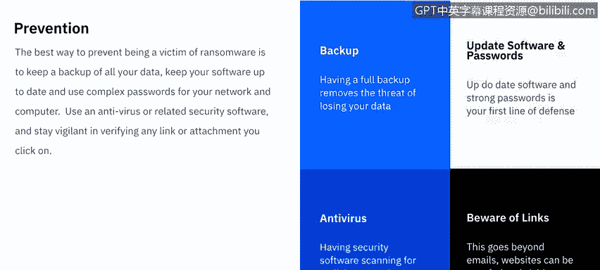

# IBM网络安全分析师专业证书课程7：《网络安全顶级项目：入侵响应案例研究》｜ibm-cybersecurity-breach-case-studies｜ - P18：17_勒索软件概述.zh - GPT中英字幕课程资源 - BV1MN41167mY

Welcome to ransomware， brought to you by IBM。In this video， we'll learn what ransomware is。

 The various methods ransomware uses to hold your data hostage。And last。

 we'll learn how users become the targets of ransomware。Let's get started。

The Department of Homeland Security defines ransomware is a type of malware that infects computer systems。

 restricting users access to the infected systems。Typically。

 these alerts state that the user's systems have been locked or that the user's files have been encrypted。

Users are told that unless a ransom is paid， access will not be restored。

The ransom demanded from individuals varies greatly。

 but is frequently 2 to $400 and must be paid in a virtual currency， such as Bitcoin。

Ransomware usually falls into one of three different types of categories， crypto， Walker。

 and Linkware or Dosware。Crypto ransomware is ransomware that will encrypt specific files or groups of files on your computer and refuses you access until you pay the ransom。

Locker ransomware， on the other hand， will just lock you out of your entire device you won't have access to get into your computer unless the ransom is paid and the last is leakware Docsware where they threaten to release footage of you from your own webcam or any incriminating files that you may have on your computer。

 they may release those to the public or specific people unless the ransom is paid。

There are many different ways a user can fall victim to ransomware。

 though most can be avoided with proper security education and protocols。

Here are some of the broad categories that usually people will fall victim to。

The first and one of the most common we've actually already covered in previous videos are phishing attacks。

 This is where the cyber criminals will send an email trying to get the end users to divulge a personal information or take action of some sort。

 In this case， it would be clicking on an attachment or a link that would take them to a sofed website where they can install the ransomware。

The second category and likely most common， is the remote desktop protocol。

This is where cybercriminals are able to access your device over your network。

 likely due to poor password policies on either your device or the network。

Once they have access to your computer， they can install a ransomware themselves and the rest is up to you。

One of the more broader categories is software vulnerabilities。

 this ranges from keeping your native operating system up to date so that it patches any known vulnerabilities。

To keeping your third partyy software up to date， there's a largepoofing campaign that always targets things like Adobe Flashplayer。

 for instance， which if you have on auto updates or you know you updated。

 you won't be tricked into clicking on apoof link or email which would download any ransomware。

The last category is malicious links Now these hyperlinks can be found pretty much everywhere。

 they can be in the email scams that people are sending you trying to fish your information。

 they could be on spoofed websites trying to get you to click on them so they can download the ransomware they could be on social media or instant messaging or somebody could text them to you。

 so theres endless possibilities and opportunities for you to click on something that would download ransomware。

There's not a lot you can do if it happens to you。 But as they say。

 the best offense is a good defense。

The best way to prevent being a victim of ransomware is to keep a backup of all your data。

 Keep your software up to date and use complex passwords for your network and computer。

 Use antivirus or related security software and stay vigilant in verifying any link or attachment you click on。

Let's break these down， starting with backup。The number one defense against any ransomware is having a full system back up。

 This takes the winds out of the sails of anybody trying to threaten to extort you for data that you already have a copy of。

 So in this case， you wouldn't be losing any data。 You would only be losing time and a little bit of your sanity。

Updating all your software and using strong passwords for your computer， your applications。

 and your network is cyberbersecurity 101。This will essentially rule you out as being low hanging fruit。

And likely you'll have to be a cause of spear fishing。

 Some will have to actually need to target you specifically for something as opposed to just somebody who didn't protect their stuff and was easy pickings for somebody。

Antivirus software， there are many， many options out there and having that security software scanning for malicious attachments or changes to your computer。

Really combats phishing attempts。 And last， being aware of hyperlinks。

 We know we talked about this a little bit， but it can't be stressed enough that sometimes it's not even the act of downloading。

 but rather just visiting apoof website that can start the download of ransomware。

 So if you get an email from a suspicious source or if it looks authentic。

 And you're not sure why you're getting it， just open up your internet browser and go to the website directly as opposed to using the provided link。

Now that we've had a nice overview of ransomware， let's break down the specific examples of the most common types of ransomware out there。

 We'll see in the next video。

