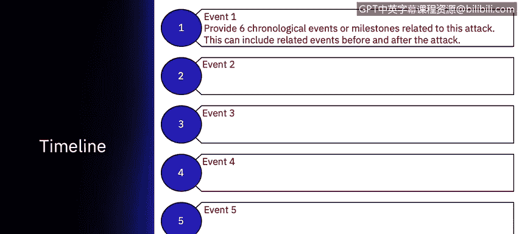
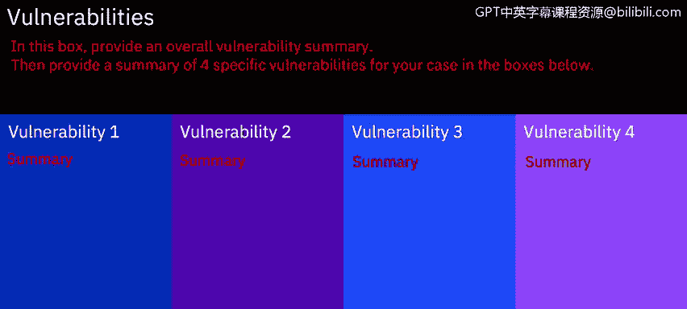

# IBM网络安全分析师专业证书课程7：《网络安全顶级项目：入侵响应案例研究》｜ibm-cybersecurity-breach-case-studies｜ - P21：20_对等数据泄露应用项目简介.zh - GPT中英字幕课程资源 - BV1MN41167mY

Welcome to you the Peer to peerer Applied project。In this video。

 you will understand the requirements of the applied project of your skills to research and prepare a case study based on a data breach。

What Ill take you through now is the actual template that is part of your applied project With this template。

 you will put together a case study based upon research of all the materials that you've received in this course。

 as well as any other courses you've taken around cyberseity。

This presentation is available in PowerPoint keynote。

 as well as if you have neither of those programs， you can use Google Sheet。

 which is open source Pre software。😊，You will begin by identifying a company or affected parties that have incurred a data breach in the last seven years。

😊，You will then describe the attack category that caused the data breach。

And give some specifics about that attack category。

 including what are the vulnerabilities of that attack category has run other examples。

 as well as an industry statistics that most of them can be found within the X force intelligence report that has been identified as part of this course。

You will add a company description and a summary of the incident and data breach。

Make sure to use the case studies that have been presented as part of this course as examples of how to fill out this information that will be reviewed by your peers。

Next， describe the timeline。 So what was the series of the events leading up to the data breach。

 as well as events that happened after the date of breach was identified。

 things such as Was the data breach identified within the corporation or company。

 Was the data breach identified by an outside party。

 include information about when the data breach occurred when the attack occurred。

 What are the summary of the pertinent information around the data breach。

Next， talk about the vulnerabilities。 What was the overall vulnerability for the corporation or company。

 Was it potentially that their systems were not hardened。

 Was it that they were lacking security software。 Was it that it took several months to identify the breach。

 You can see that there may be various options for this summary。

 And then pick out four specific vulnerabilities， Anything from people not being educated to， again。

 not having an antivirus patch on the server that was attacked。

 So you will see that each particular data breach will be unique。

 And you will need to call out specific vulnerabilities for that。

Data breach。Next， talk about the costs again， depending on when the data breach occurred。

 If it's a recent data breach， there may be limited information about the cost to that company or organization。

However， if the data breach was in the past， you should be able to see a series of different costs that resulted over the years。

 including litigation costs， potential costs to pay out for credit card information that was obtained by the attackers。

 as well as different costs that the corporation may have incurred in some instances for loss of business。

 Finally， you will need to discuss prevention tactics。 In this category。

 it could be anything from the corporation needed to have an incident response plan。😔。

Or it could be that the analysts missed several events from the same I P address。 Again。

 this is a unique situation， and there may be hundreds of different prevention techniques。

 depending on the attack that you select， as well as the company data breach that you found in the news。

Once you filled out the template。Save or export the presentation to a P D F file and post it back into your course。

 You will next have two peer reviewers take a look at your course and grade you on how much information that you've provided and the accuracy of that information based upon their knowledge。

There will be partial credit for each slide， and you will need to obtain 80% on average in order to pass this course。

Now， go ahead and start researching and filling out your applied project。

