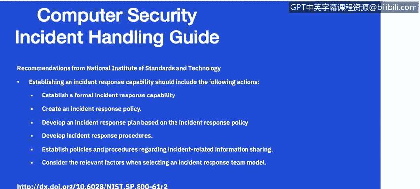
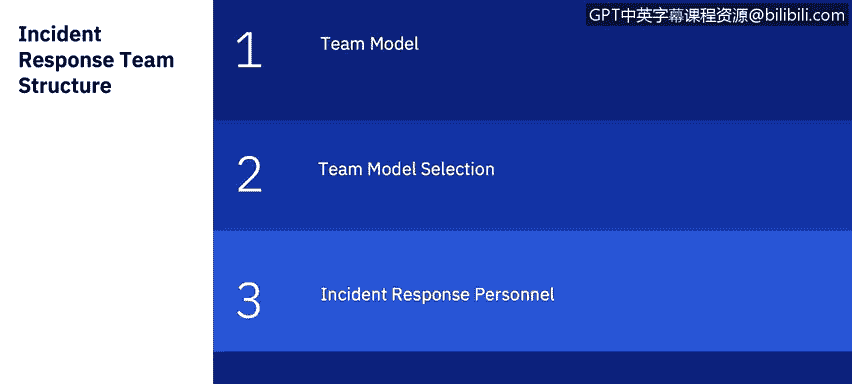

# IBM网络安全分析师专业证书课程7：《网络安全顶级项目：入侵响应案例研究》｜ibm-cybersecurity-breach-case-studies｜ - P22：0_03_nist-incident-response-lifecycle-teams.en_subtitled - GPT中英字幕课程资源 - BV1MN41167mY

Welcome to the National Institute of Standards and Technology NIST Inscident Hand Guide overview brought to you by IBM In this video。

 we will review the National Institute of Standards and Technology Inscident Handing Guide。

Let's review a few challenges for incident response。If you have taken the penetration testing。

 incident response and forensics course， this may be a review of incident response。 However。

 it is important to set the ground rules for this course。

 Eablishing an incident response capability should include the following actions。

Creating an incident response， policy and plan。Once you create an incident response policy。

 the incident response policy is the foundation of the incidentci response program。

 It defines which events are considered incidents， establishes the organizational structure for incident response。

 defines roles in responsibility， and lists the requirements for reporting incidents among other items。

 and lists the requirements for reporting incidents among other items。Also。

 you will want to develop an incident response plan based on the incident response policy。

 The incident response plan provides a roadmap for implementing an incident response program based on the organization's policy。

 The plan indicates both short and long term goals for the program。

 including metrics for measuring the program。You also want to develop procedures for performing incident handling and reporting。

The incident response procedure， the incident response procedures provide detailed steps for responding to an incident。

The organization should communicate appropriate incident details with outside parties。

 such as the media， law enforcement agencies and incident reporting organizations。

 All of this information should be established ahead of time in these policies and procedures。

 The team should comply with existing organization policy interacting with the media and other outside parties。

 Such as only authorized people talking to the media。As part of this process。

 you will set guidelines for communicating with outside parties regarding incidents。

 You will provide pertinent information on incidents to the appropriate organizations。

 including agencies like the US Cyberse Infrastructure and Security Agency。As part of your policy。

 you should determine whether you're going to use an information sharing and analysis center。

 which is a nonprofit organization that provides a central resource for gathering information on cyber threats to critical infrastructure and providing two way sharing of information between private and public sector。

There are several things that you need to look at as part of selecting a team structure and staffing model。

 which we will dive into deeper later into this video。

 Consider the relevant factors when selecting an incident response team model。

 Or to carefully weigh the advantages and disadvantages of each possible team structure model and staffing model in the context of the organizations need and available resources。

 which we will be discussing in more detail later in this video。

You will select people with appropriate skills for the incident response team。

 The credibility and proficiency of the team depends on a large extent on the technical skills and critical thinking abilities of its members。

 Crit technical skills include system admins。 Network admins， programming。

 technical support and intrusion detection。 teamwork and communication skills are also needed for effective incident handling。

 necessary training should be provided to all team members。

Established relationships and lines of communication between the incident response team and for groups。

 both external and internal prior to a security incident。

 Every incident response team relies on the expertise， judgment and abilities of other teams。

 including management， information assurance， I T support， legal， public affairs and facilities。

 management。Make sure to determine what services the incident response team should provide。

 Although the main focus of the team is incident response， most teams perform additional functions。

 Ex include monitoring， intrusion detection， distributing security advisories and educating users on security。

 Let's dive a little deeper into the incident response team structure。

 an incident response teams should be available for anyone who discovers or suspects that an incident involving the organization has occurred the incident handlers。

 analyze the incident data， determine the impact of the incident and act appropriately to limit the damage and restore normal services。

For your team models， theres a couple of different team models that most organizations will use。

 Either a central incident response team where they handle incidents throughout the organization。

 This model is usually used by small organizations that are usually in one geography。

Or a distributed incident response team where the organization has multiple incident response teams responsible for either a business unit and large organization。

Or geographically dispersed。There should be a coordinating team identified。

The Computer Security Incident Response team is a group of the IT professionals that provides an organization with the services and support surrounding the prevention and management and coordination of these potential cybersecurity related emergencies。

When selecting appropriate structure and staffing models for an incident response team。

 organizations may look at three staffing models。They may look to see if they use in house employees if they partially outsource it for the incident response work to another organization。

If an organization outsources a portion of the incident response work。

 the most prevalent arrangement is for the organization to outsource 24 hours a day。

 seven days a week monitoring of intrusion detection sensors。

 firewalls and other security devices to an offsite managed security services provider。

 sometimes referred to as an MP。 Some organizations is a third option。

 completely outsource their incident response work， typically to an onite contractor。

 This model is most likely to be used when the organization needs a full time onsite incident response team。

 but does not have enough available qualified employees。

 when selecting the appropriate structure and staffing models for an incident response team。

 organizations should consider。The need for the 24 by 7 availability。

 whether they will have full time versus part time team members for part time in existing groups such as the I T helped us connect as a first point of contact for an incident reporting。

 They also may look at employee morale。Incccident response work is very stressful。

 as usually it will require on call responsibilities of the team members。

 Many organizations will also struggle to find willing and available experienced and properly skilled people to participate。

 particularly in the 24 hour support。Segregating roads。

 particularly reducing the amount of administrative work the team members are responsible for performing。

 can be a significant boost to that morale。Costs may also be a major factor on whether employees are required to be on site 24 by7 versus using an outsourced organization that may support multiple clients。

Incident handling requires specialized knowledge and experience in several technical areas。

 The breadth and death of knowledge required varies based on the severity of the organization's risks。

Members of the incident response team should have excellent technical skills。

 such as system administration， network administration， programming。

 technical support or intrusion detection。 Every team member should have good problem solving skills and critical thinking abilities。

 It not necessary for every team member to be a technical expert。

 Incident response team members should have other skills in addition to technical expertise。

 teamwork skills are of fundamental importance because cooperation and coordination are necessary for successful incident response。

 Every team member should also have good communication skills。

These communication skills are important because the team will have to interact with a wide variety of people。

 and writing skills are important when team members are preparing advisories and procedures。

The main focus of incident response team is performing incident response。

 but is fairly rare for a team to perform incident response only。

 Some incident response teams also perform the intrusion detection。Advisory distribution。

 where a team may issue advisories within the organization regarding new vulnerabilities and threats。

