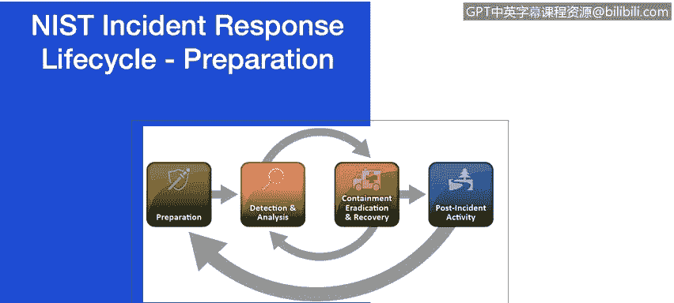
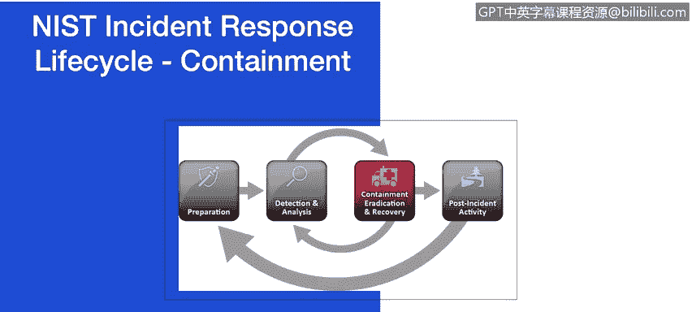
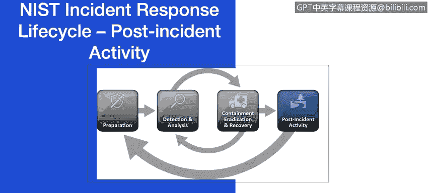

# IBM网络安全分析师专业证书课程7：《网络安全顶级项目：入侵响应案例研究》｜ibm-cybersecurity-breach-case-studies｜ - P23：1_04_nist-incident-response-lifecycle.en_subtitled - GPT中英字幕课程资源 - BV1MN41167mY

We will look at the major phases of the incident response process， preparation。

 detection and analysis， containment， eradication and recovery and post incident activity in detail。

 Since this may be a review for many of you， I will point out key requirements。For a fo。

 you can consult either the previous course or the NIS incident handling guide。Preparation。

 incident response methodologies typically emphasize preparation。

 not only establishing an incident response capability so that the organization is ready to respond to incidents。

 but also preventing incidents by ensuring the systems。

 networks and applications are sufficiently secure。

 Let's review some of the basic requirements of the preparation phase。

Incident handler communication facilities as you as you look at the case studies in this course and as you are preparing to put together your own case study。

 it is important to look at where organizations may have failed to meet these basic requirements。

 contact information and on call information， What if you suddenly cannot get to your cell phone data。

 your tablet or laptop that this information is stored on。

 Will you be able to contact the information needed to successfully reach your teams。

 Just something to think about as you prepare for incident response。

 You will also need to be able to report status on an incident。

 This is important to quickly engage the right resources if your organization is suffering from a cyber attack。

Do you have a secure war room to gather the right people in the event you need the skills of multiple people。

 and where will you store any forensic evidence if your organization is later called to produce evidence in the event of a data breach。

 All of these questions need to be answered prior to a security incident arises within your organization。

You will need to have the right incident analysis， hardware and software。

 You will need spare workstation servers and networking equipment or the virtualized equivalents。

 which may be used for purposes such as restoring backup ups and trying out malware。Packet。

 sniffers and protocol analyzers are also needed to capture and analyze network traffic。

 These are just some of the few examples of what you will need from a hardware and software perspective And finally。

 review your incident analysis resources。 Do you have network diagrams and lists of critical assets。

 cryryptographic hashes for critical files and access to images of clean O S and application installations for possible restoration and recovery purposes。

Incidents can occur in countless ways， so it is infeasible to develop step by step instructions for handling every incident。

 Organs should be generally prepared to handle any incidents。

 but should focus on being prepared to handle incidents that are common attack vectors。

 The attack vectors listed not intended to provide definitive classifications for incidents。

 Rather they simply list common methods of attack， which can be used as the basis for defining more specific handling procedures。

Attrition， which is an attack that employs brute force methods to compromise。

 degrade or destroy systems， networks or services。 brute force attacks against an authentication mechanism such as passwords。

 is common。You should also look at email attacks， which is an attack that is executed via an email message or attachment。

 For example， exploit code designed as an attached document or link to a malicious site in the body of an email message。

 We will explore these attack vectors， as well as a couple of other attack vectors。

 as you proceed through this course。 A couple of other attack methods that we have not talked about could pertain to lost or theft of equipment。

 The loss or theft of a competing device or media used by an organization such as a laptop。

 smartphone or authentication token should be reported to the organization immediately and handle this part of your security incident handling。

Also， an attack that does not fit into any of these other categories。

 How will your incident response team handle any attacks that have not been identified and step by step procedures are written。

For many organizations， most challenging part of the incident response process is accurately detecting and assessing possible incidents。

 determine whether an incident has occurred。 And if so。

 the type and extent and magnitude of the problem， This will become clear in multiple case studies within this course。

 What makes this so challenging is a combination of three factors。

 Indents may be detected through many different means with varying levels of detail。

 The volume of potential signs of incident is typically high and deep specialized technical knowledge and extensive experience are necessary for proper and efficient analysis of incident related data。

Signs of an incident fall into one of two categories， precursors and indicators。

 A precursor is a sign that an incident may occur in the future。

 An indicator is a sign that an incident may have occurred or may be occurring now。

If precursors are detected， the organization may have an opportunity to prevent the incident by altering its security posture to save a target from attack。

 Examples are web server log entry that showed the usage of a vulnerability scanner。

 a threat from a group stating that the group will attack the organization。

 While precursors are relatively rare indicatorators are all too common。

An indicator might involve anti software alerts， which it detects that a host is infected with malware。

An application log with multiple failed login attempts from an unfamiliar remote system。

 or a network administrator notices an unusual deviation from typical network traffic flows。

Incident detection analysis would be easy if every precursor and indicator were guaranteed to be accurate。

Unfortunately， this is not the case。 Intrusion detection systems may produce false positives or incorrect indicators。

What makes incident detection analysis so difficult？😊。

Each indicator ideally should be evaluated to determine if it's legitimate。

The total number of indicators may be thousands or millions per day。

 finding the real security incidents that occurred out of all the indicators can be a daunting task。

 preparationation and execution frameworks， which will provide additional defence tip for attackers is essential part of the preparation phase In the next video。

 we will review the IBM X Force Is Cyberat preparation and execution frameworks。

 which will provide additional defence tip for attacks。

An essential part of containment is decision making。 Should we shut down the system。

 Should we disconnect from a network or disable certain functions on a network。

 Such decisions are much easier to make if they are predetermined strategies and procedures for containing the incident。

Containment strategies vary based on the type of incident。

Criteria for determining the appropriate strategy include potential damage to and theft of resources。

 need for evidence， preservation， time and resources needed to implement the strategy and duration of this solution。

 Are there emergency workarounds。 Are there a temporary workarounds to be removed in two weeks。

 Is there a permanent solution in certain cases， some organizations redirect。

 Although the primary reason for gathering evidence during an incident is to resolve the incident。

 it may also be needed for legal proceedings， evidence should be collected according to procedures that meet all applicable laws and regulations that have been developed from previous discussions with legal staff and appropriate law enforcement agencies so that any evidence can be admissible in court。

After an incident has been contained， eradication may be necessary to eliminate components of the incident。

 such as deleting malware and disabling breached user accounts。

 as well as identifying and mitigating all vulnerabilities that were exploited。

One of the most important parts of incident response is also the most often omitted。

 learning and improving。 Each incident response team should evolve to reflect new threats。

 improve technology and lessons learned。 Small incidents need limited post incident analysis。

 with the exception of incidents performed through new attack methods that are of widespread concern and interest。

After serious attacks have occurred， it is usually worth while to hold post mortem meetings that cross team and organizational boundaries to provide a mechanism for information sharing。

 Organs should establish policy for how long evidence from an incident should be retained。

 Most organizations choose to retain all evidence for months or years after the incident ends。 Next。

 we will review the use of the cyber attack preparation and execution framework developed by the IBM export irris team。

