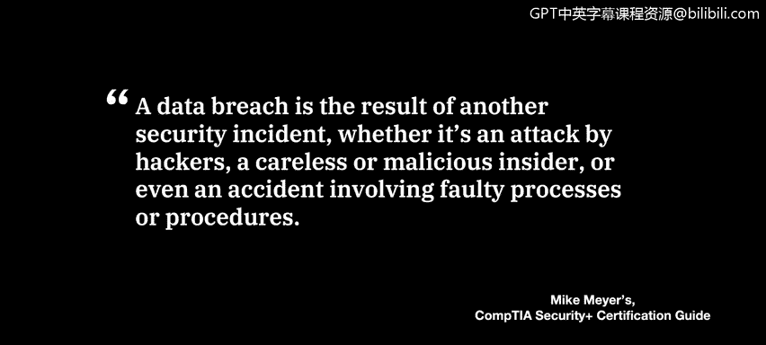
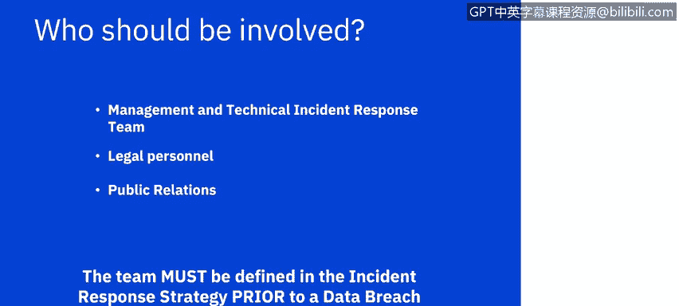
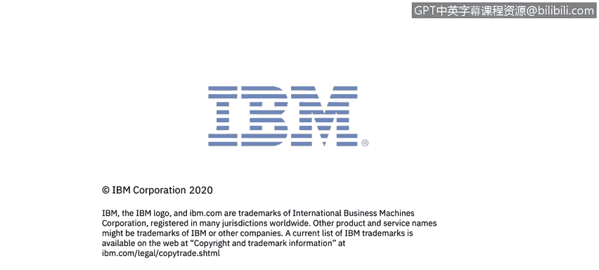

# IBM网络安全分析师专业证书课程7：《网络安全顶级项目：入侵响应案例研究》｜ibm-cybersecurity-breach-case-studies｜ - P25：3_02_what-is-a-breach.en_subtitled - GPT中英字幕课程资源 - BV1MN41167mY

Welcome to Data Brees brought to you by IBM。In this video。

 you will learn to define a breach in its common characteristics。

And discuss an organization's response to a breach。

A data breach is one of the most commonly occurring security incidents。

 You will hear about data breaches in the news almost on a daily basis。

 especially when bad actors are taking advantage of a global situation such as the Covid-19 pandemic。

However， data breaches are not new to the news media and have been affecting the public for some time。

 as a cybersecurity professional， especially as an analyst。

 it is important that you review case studies of past data breaches。

 as well as a curtain of news and threat intelligence site reports of new breaches in real time。

Mike Myers， in this security plus certification review book defines a data breach as a data breach is the result of another security incident。

 whether it's an attack by hackers， a careless or malicious insider。

 or even an accident involving faulty processes or procedures。

An organization will respond to an external or internal attack， for example。

 a system hardening procedures or education of employees。

 however a data breach requires actions above and beyond what is required by a typical security incident。

How an organization responds to the data breach will be affected by whether the data belongs to only that organization or both inside and outside the organization。

Organization only data breaches might result in a loss of revenue or intellectual property for the company only。

 and even though it is a serious issue， it may not have the criminal and legal issues involveded that a breach will have if it is inside and outside the organization。

Affects data from both inside and outside the company。

 such as a data breach involving personal identifiable information like medical records。

 credit card data or personal data， such as Social Security number。

 driver's license number with this type of data breach。

 an organization will be liable for potential fines， legal sanctions， crime punishment。

 but will also lose the goodwill of their stakeholders and customers。

 Each situation will be unique and can take several years to understand the full extent of the damage to the company。

The team responding to the breach will have to follow the processes and procedures already established for a security incident such as gathering data from systems。

 closing down I P ports， establishing firewall rules to block data or a number of other system hardening measures。

 However， they may have to perform additional forensics。

 including what type of data was potentially exposed to an attacker。

 and was the attacker able to download the data to their systems or the dark web。

 The team may also have to engage the executives to decide the next course of action。

 especially in the event of an attack， such as ran somewhereware。

 which Adam will explore in detail in a module later in this course。

 where a decision has to be made on how to proceed since the outcome and next steps might be quite different。

 depending on the organization's decision or the attacker's reaction to that decision。Finally。

 typically security incidents don't require communication outside of the organization。

 but with a data breach， the organization is legally bound to communicate to a number of outside parties。

 depending on the type of data， including law enforcement such as the FBI and the US。

 government agencies around healthcare data and financial banks for credit card data。

 since the laws may be quite different in every country。

 all of the possible combination should be examined by the team prior to needing the information in the event of a breach。

So who should be involved， We talked about earlier， who should be involved in a security incident。

 but a data breach would include different communications and protocols for that communication。

 As a security analyst， you will want to engage your management team as soon as you realize a data breach has occurred。

 legalal and public relations teams will want to review all communications prior to any one communicating outside of the security incident response team。

You will discover， as you continue at this course。 The communication will extend way beyond the day。

 The breach was discovered， whether by your team or reported by the attacker to the press and may be unique due to these circumstances and or the nature of the data that is stolen by the attacker。

Most important is that the team who needs to know and who needs to communicate outside of the company has to be determined before a data breach occurs。

The next two videos will be the beginning of your case study reviews。

 We will then start reviewing in depth types of attacks， case studies for the attackers。

 all to prepare you for your applied project of a case study you need to research and document on your own。

