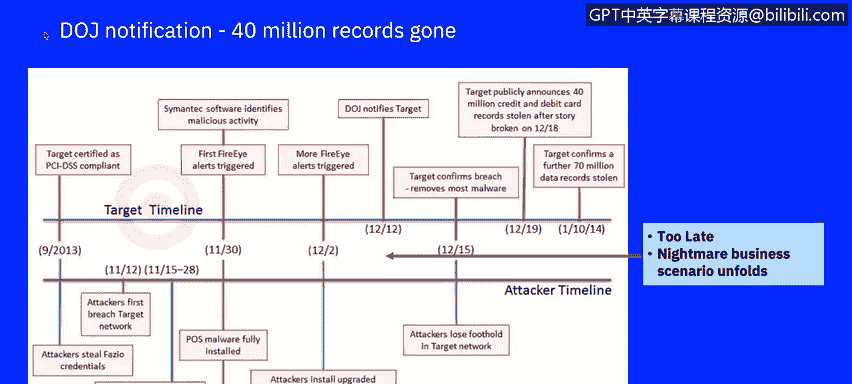
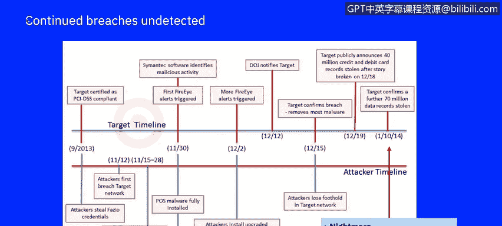
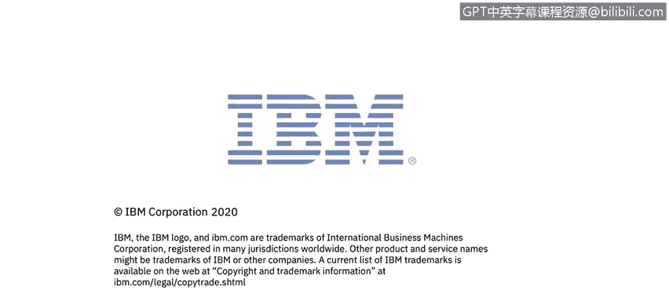

# IBM网络安全分析师专业证书课程7：《网络安全顶级项目：入侵响应案例研究》｜ibm-cybersecurity-breach-case-studies｜ - P26：4_01_target-attack-timeline.en_subtitled - GPT中英字幕课程资源 - BV1MN41167mY

Welcome to Ana a real world large scale attack of target brought to you by IBM。

In this series of videos， you will learn to analyze the target attack scenario。

Even though you might wonder why we use a case study of the target breach that happened in 2013。

 it is very important as an illustration of what can happen to a corporation that experiences such a large attack。

 The facts of the breach were publicly announced， which allows us to give an extensive timeline for educational purposes。

 Many university programs still use this breach as well。 During this course。

 you will be introduced to a total of five breach case studies and one wateringhu attack example。

 The information on these breaches were public and cited in various publications。

 and is part of online blogs。 Pay special attention in the format in which the breaches are presented。

 as you will need to put together your own case study at the end of this course as part of your grade for this course。

The case study research will help you learn a critical skill in a cybersecurity analyst's job in recognizing and categorizing types of vulnerabilities and associated attacks。

 You will not be expected to put together as detailed of a timeline since an attack you research may not have been as publicly documented or may have occurred recently。

 which will result in your documentation of current litigation or costs of the breach that may still be reported in the future。

 A breach may result in an impact to your corporation for years to come。

 Let's take a look at this very public breach。The Target Corporation is an American retailing company。

 founded in 1902 and headquartered in Minneapolis， Minnesota and is second largest discount retailer in the United States。

 Target operates 1916 stores in the United States and also began operations in Canada in March of 2013。

In December 2013， a data breach of target systems affected up to 110 million customers。

 According to the Ex Forcece Thrt Intelligence In produced by IBM exportports Incident Res and intelligence services In 2020。

 The retail industry was the second most attacked of all industries。 According to 2019 export data。

 This sector was affected by 16% of all attacks on the top 10 industries。

 a marked increase from its fourth place rank in 11% of attacks in 2018。

 This industry experienced the second largest number of network attacks in 2019。

The retail industry made it to the second position in 2019 based on export force iris data and publicly disclosed data breach information。

 The most common type of threat actors targeting retail organizations are financially motivated cyber criminalals who target the industry to obtain consumer personally identical information or P I payment card data。

 financial data， shopping history and loyalty program information。

 Cycminals typically use this data to take over customer accounts。

 defraud customers and reuse the data and various identity， theft scenarios。

 A popular attack technique used by cybercminals to target retailers in 2019 was point of sale malware and e-commerce payment card skimming each aiming to siphon payment card information during the transaction via physical payment terminals or online respectively you will be asked to refer to the export threat intelligence In and other white papers frequently in these courses and could。

the information on the industry breach you choose for your peer to peer project。

As you see in the data for 2019， the attack that happened in Taet is still prevalent today。

In November and December of 2013， cyber thiefs executed a successful cyber attack against Target。

 one of the largest retail companies in the United States。

 The attackers gained access to Target's computer network。

 stole the financial and personal information of as many as 110 million target customers and then removed the sensitive information from Targets network to a server in Eastern Europe。

John Mulligan， Targ's executive vice president and chief financial officer。

 testified that his company had in place multiple layers of protection， including firewalls。

 Mawware detection， software， intrusion detection and prevention capabilities and data laws prevention tools。

 He further stated that the target had been certified in September 2013。

 as compliant with the payment card industry data security standards or PC DS SS。

 which credit card companies require before allowing merchants to process credit and debit card payments。

 and yet a breach occurred。 We will discuss a similar breach at Home Depot Later in the course to showcase a couple of items。

 even though a breach is very public it might not stop another corporation from experiencing the same attacks。

 and no corporation is safe from cyber attacks。You may have learned the phases of the intrusion kill chain by Lockheed Martin in earlier courses。

 We will use this model as a basis for our discussion of this breach。

Roughly at the same time when Target was PC I DS SS certified。

 the first phases of the attack were executed in the first reconnaissance phase。

 the attacker gathered as much information about the victim。 In this case。

 the attackers were able to find information about a target's third party vendor through simple Internet searches。

 Target even displayed a public Internet portal for vendors。

 which gave away the kind of software that was used for their online vendor billing。

 E with this knowledge， the attacker then started their reconnaissance on one particular vendor Fasio。

 In the weaponization phase， the attackers created malware stricken emails likely attaching a P Df or Microsoft Office document。

 In the first part of the delivery phase， the attacker sent infected emails to the vendor and a so called phishing attack。

 Once deployed the malware started to record passwords and provided the attackers were theirkey to target's external billing system。

 In the second part of the delivery phase。 The attackers left。😊。

ge their access to the vendor system to enter targets network We security at the periitive Tas network may have contributed to the attacker's success in breaching the most sensitive area of Tas network containing cardholderer data using the vendor's credentials to gain access to Ta's In network。

 It appears the attackers then directly uploaded their Ram scraping malware to the Ps terminals。

In the exploitation phase， the Rams scrappy malware and exfilation malware began recording millions of card swipes and storing the stolen data for later exfilation。

 Report suggest that the attacker maintained access to the vendor system for some time while attempting to further breach targets network during the installation phase。

 It is unclear exactly how the attacker could have escalated into access from the external billing system to deeper layers of targets internal network。

 But given the installation of the black Pos malware and targets Ps terminals。

 the compromise of 70 million records of nonfinancial data and the compromise of the internal target servers used to gather stolen data。

 It appears that the attackers succeeded in moving through various key target systems。

 by exploiting default account names and targets I management system。

 based on the reported timeline of the breach， the attackers had access to targets's internal network for over a month and compromise。

Internal servers with exfiltration malware by November 30。

While the exact method by which the attackers maintain command and control is unknown。

 it is clear that the attackers were able to maintain the line of communication between the outside Internet and Targs cardholderer network。

 the attackers transmitted the stolen data to outside servers。

 at least one of which was located in Russia， in plain text via FTP。

 a standard method for transferring files over the course of two weeks。On December 12。

 the US Department of Justice notified Ta that their stolen credit card credentials have been identified on a Russian dark website where they were offered for sale。

 at this point in time， no one a target had realized that there was an attack。

 Target immediately started intense investigations and was able to stop further activities to expfiltrate data。

 and three days later， most of the malware had been removed。

 It was at this time when Target found out not only about the loss of 40 million credit card records。

 but also an additional 70 million customer data records without financial information。

 Revisiting the investigative timeline shows the first security relevant events from Fire eyee and semantic endpoint were recorded on November 30。

Firewall and endpoint and analyst may have disregarded these events as false positives。

 because no action was initiated。 The reason for that can be founded in the complexity where those point solutions do not communicate with one another。

 It is hard to retrieve additional activity information about the proceeding and following traffic and to realize business and network context by just looking at an individual incident without any correlation。

 The ability to include business context and risk management can show if any high value assets are exposed by a certain attack pattern。

 Network context shows if those assets can be can be physically reached by the mallware。

 Without the means for correlating the individual events， the attack was ignored。

Once the exfiltration began， the target security tools recorded more alerts， But again。

 without proper correlation to the earlier events and network traffic logs。

 there was simply not enough visibility into the ongoing malware deployment and date of exfiltration。

 This resulted in the fact that the ongoing attack was still being ignored。

At the time when the Do O J called the target executive management， it was too late to react。

 The started forensic investigation enabled the security team to find malware on P O S terminals and on back end data servers。

 as well as ongoing exfiltration transmissions to external FTP servers。

 The communication lines were then severed， and the malware removed from the systems。

Only within their forensic activities， the security staff found out about the additional 70 million non financial data records that had been compromised。

 It was an awakening of the worst case business scenario Any organization could possibly face in the next video。

 we will review the vulnerabilities costs。 and a few of the preventive techniques which would have allowed Ta to discover the attack sooner or in the best case prevented the attack。

