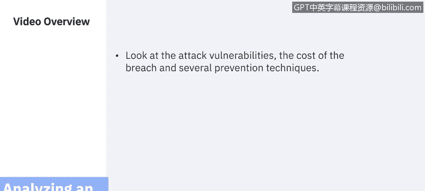
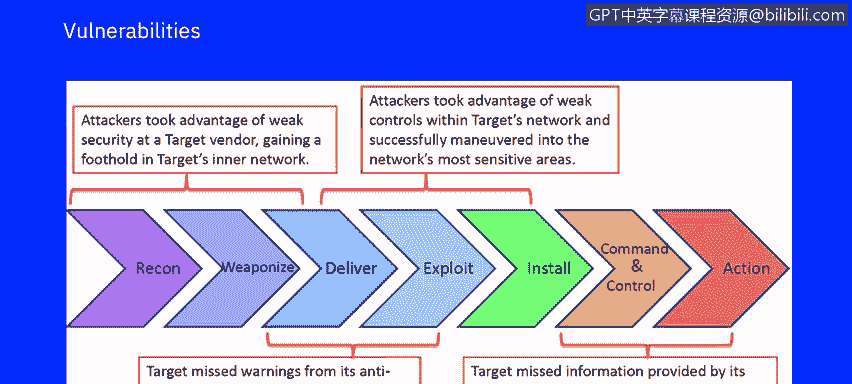
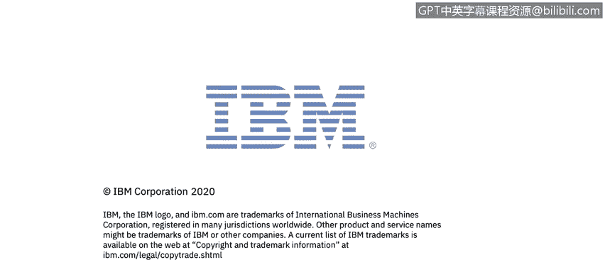

# IBM网络安全分析师专业证书课程7：《网络安全顶级项目：入侵响应案例研究》｜ibm-cybersecurity-breach-case-studies｜ - P27：5_02_target-attack-vulnerabilities.en_subtitled - GPT中英字幕课程资源 - BV1MN41167mY

Welcome to analyzingly a real world large scale At of target part2。In this video。

 you will learn to look at the attack vulnerabilities。

 the cost of the breach and several prevention techniques。 In summary。

 several situational actions and reactions LED to the disaster。 First。

 the attackers took advantage of weak security at a target vendor and thus gaining an initial foothold into Targ's inner I T network。

 This happened while Target missed initial warnings from their anti intrusion software that attackers were installing malware on their deployed assets。

 Then the attackers took advantage of further weak controls within target network and successfully maneuverreed into the network's most sensitive areas。

 During the final phase of the attack。 Target missed more information by its anti intrusion software about the attackers escape plan。

 allowing them to steal as many as  a hundred and 10 million customer records。

Let's review some of the costs that were incurred by a Taet。 In May of 2017， Target was to pay 18。

5 million to settle claims by 47 states and the District of Columbia and resolve a multi state investigation。

 According to the starrevinne in 2019。 Target noted that it reached a settlement and class action lawsuit brought by banks for about 58 million in May of 2016。

 It also reached confidential settlements with major card issuers such as Vi， Mastercard。

 American Express and discover as well as a number of individual banks in total Taet has reported that it incurred about 292 million in expenses related to this breach。

 about 90 million of which were offset by insurance。Target continued to sue their insure in 2019。

 Target is suing its longtime insurance company for denying claims to reimburse target for tens of millions of dollars paid out for new payment cards as part of settlements over the retailer's 2013 data breach。

In a target note that is paid out， a total of 138 million。

 including attorney's fees to banks to settle claims related to the state of breach。

 While some of the costs were paid for or reimbursed by insurers。

 the Minneapolis based retailer said at least 74 million that it had paid to settle claims over the cost of replacing payment cards has not been picked up by insurers。

As you can see from this information， even though the breach occurred in 2013。

 there's still ongoing litigation today day。What could have prevented the large breacher allowed target to discover the breach quicker。

 security logs and events， network flow data， vulnerability data， network topology。

 asset profile with business contacts， risk ownerships， including the POS devices， correlation rules。

 as you saw in the example of a Sim other courses。User behavioral analysis。

 which could have allowed target to rely less on humans seeing in the correlation between log alerts。

 increase incident relevance， as we've seen in our videos around incident response handling。

 one incident case in analysis workflow， In forensics， rapid confirmation of attack。

 and massive reduction of window of exposure。NextexO will be discussing a watering hole attack that affected the financial and technology sectors。

 again is used to illustrate what has happened in the past and what breaches can still occur today。

