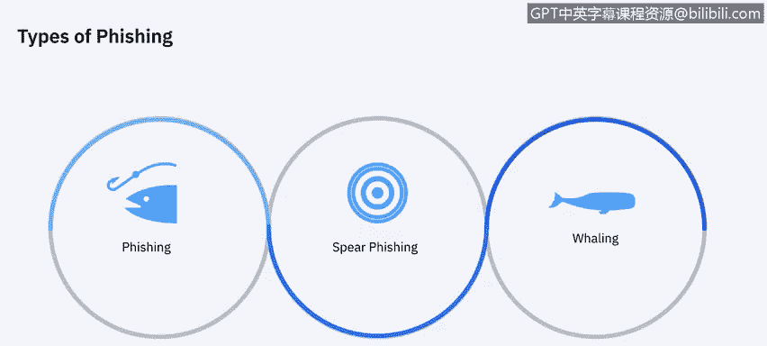
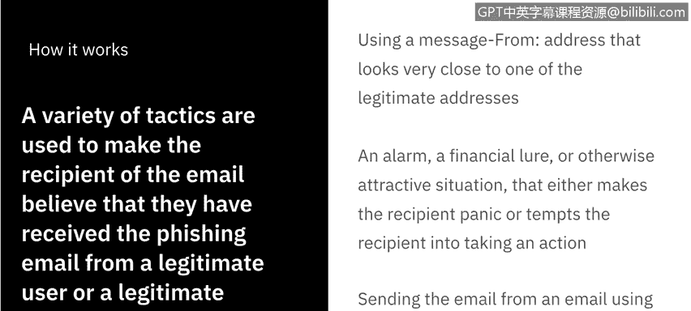

# IBM网络安全分析师专业证书课程7：《网络安全顶级项目：入侵响应案例研究》｜ibm-cybersecurity-breach-case-studies｜ - P29：7_01_phishing-scams-overview.en_subtitled - GPT中英字幕课程资源 - BV1MN41167mY

Welcome to Fishing scams overview brought to you by IBM。In this video。

 we'll learn about the history of phishing scams， we'll learn about how they're conductive and why they're so effective。

Let's get started。Fishing， also known asbrapoofing or carting。

 is a term used to describe various scans that use primarily fraudulent email messages sent by criminals to trick you into divulging personal information。

The criminals use this information to dis steal your identity， ro your bank account。

 or take over your computer。Before we go breaking down what machine schemes are and how they impact us。

 it's good to know where we started。So phishing comes from the analogy that the internet scammers are using email lures to fish for passwords and financial data from the sea of Internet users。

 It was first used by hackers to describe stealing America online accounts by acquiring their usernames and passwords。

Now while most are done with emails， some scams are using instant messaging， fake news bulletins。

 and social communities like social media to fool users into divul personal information。

While the term fishinging gets thrown around quite a bit。

 it's actually being used in the general sense。When you look into it。

 there are actually multiple different types of phishing attacks or phishing scams。First。

 it's what we defined in the beginning of this video and what we use in a general sense。

 phishing the attempt to get information from end users by some sort of deceit or call to action。

 something of that， which we will get into later。 but there's also a spearfishishing。

 which is actually something that is not done on a mass distribution， hoping to catch something。

 It's a targeted attack to a specific user or group。And then by extension。

 whaling is specifically spearfishing for high， high executive levels that would have the most access to any given information。

 think the sea level executives of any given company。So with that in mind。

 let's talk about why it's so impactful and then we'll go from there。

So here's how it works， a variety of tactics are used to make the recipient of the email believe that they have received the phishing email from a legitimate user or domain。

 including like using a message from a address that looks very close to the legitimate addresses they're used to seeing。

Or there could be an alarm， a financial lure or otherwise attractive situation。

 which will expand on in the next side that either makes the recipient panic or tempts them into taking action。

Or they could be sending email from an email using a legitimate account holder's software or credentials。

 so if the source or the domain was hacked and somebody was acting as a man in the middle。

 you would have no way of knowing it was somebody getting your information because you thought it was legitimate。

But let's expand into those types of triggers or alarms or lures that so many people fall for。

So here's how they get you。 There are a lot of tactics threatat actors will use to lure you in to taking action。

 Here's a list of some of their most common strategies。

 I am betting that many of you have experienced or received these in your inbox。Multiple times。

 so number one， they say they've noticed some suspicious activity or login attempts。

This is very common coming from service providers， something like Netflix or your bank or your university。

 something that you log into routinely， you'll get a spoof email saying，Hey。

 we've noticed some suspicious activity， please log in to validate thus giving up your credentials。

The second one， clean there's a problem with your account or your payment information。

This is something where you know， companies that often handle recurring payments。

 they can poses them or as your credit card saying that you know something didn't go through or your bank。

The third one that you must confirm some personal information this is very broad can be used in a lot of different contexts The next one is including a fake invoice so this is something where generally would go hand in hand with a little bit of social engineering when somebody finds that you're partaking in a service or attend something regularly and they're able to create a fake invoice to email you for you to give up not only your personal identify information but your financial information as well。

The next one is wanting you to click on a link to make a payment。

 this is literally just capturing your credit card data so a big one back in the day was PayPal they sent a lot of links out or there was a lot of phishing scams impersonating or spoofing PayPal I personally fell for this one back in college and I remember it vividly。

The next one they say you're eligible to register for a government refund。

 this is particularly topical as COVID-19， you know put the world in a recession and here in the United States。

 there was stimulus checks that were issued out and the bad actors are taking advantage of that。

 sending phishing emails telling people that they need to register on the fake government website to be able to get their check and thus you giving up their information。

And the last one's offering a coupon for free stuff because let's be real。 We all like free stuff。

 So it happens。 So these are just some of the most common ways there are hundreds and they come in all shapes and sizes。

 and the best thing we can do is educate ourselves and be vigilant。

Fishing scams are so effective because spoof domains can be difficult for users to visually discern。

 and often they mere legitimate domains used by the impersonated company。

 An authentic looking website can help convince any user to divulge a personal data on a malicious website if it resembles the original closely enough。

And in IBM study， they looked at the top 10 spoofed brands out there， Google。Far and away。

 the largestpoofed company， largely people， think of Gmail， their email service。

And people trying to get their credentials for those， YouTube。

 which is also technically a Google company followed by Apple， Amazon， Spotify， Netflix， Microsoft。

 Facebook， Instagram and Whatsapp。 So you can see all of these are their services。

 they are social media， they're things that we actively engage in on a day to day basis， which does。

It lends to the sense of urgency to want to get these things taken care of because they carry a certain weight in our lives。

 and outside of。

Bad actors becoming more and more convincing with the emails and the companies that they're spoofing in the websites they're creating。

 but they're now deceiving what we've always known to be true， which is that the H T。 T P。 S。

 which that S is for secure。 It used to be what we used to identify what was a secure website and that gave us peace of mind。

And so what it was， HTTPS as a background is used to secure communications by encrypting the data exchange between a person's browser and the website he or she is visiting。

It's especially important on sites that offer on sales or password protected accounts。

 Sting H TDP on phish sites provides insight into how fishers are fooling internet users by turning an internet security feature against them。

 So while we've always known to be true that H TDPS S meant cool， I'm on a secure site。

 I'm being safe。In Q4 of 2019， over 70% of websites that were hosted by Fishers。We're using HDPS。

They're evolving to catch more of us。And so with that。

 I think the next thing we actually need to do is look at an email and start to identify what we need to be on the lookout for and we'll do that in the next video。

 we'll see you soon。

