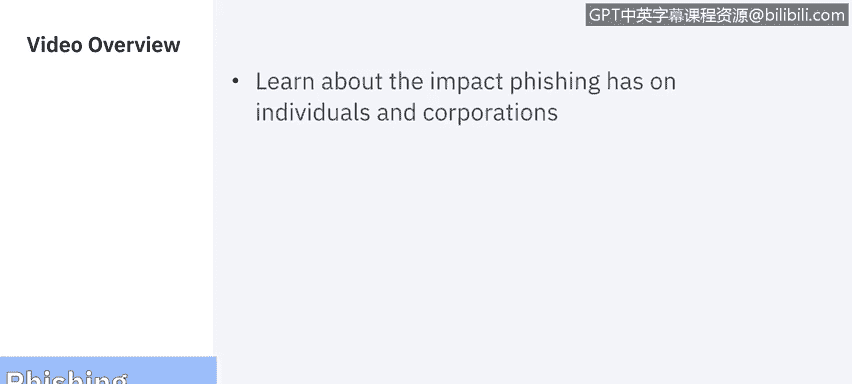
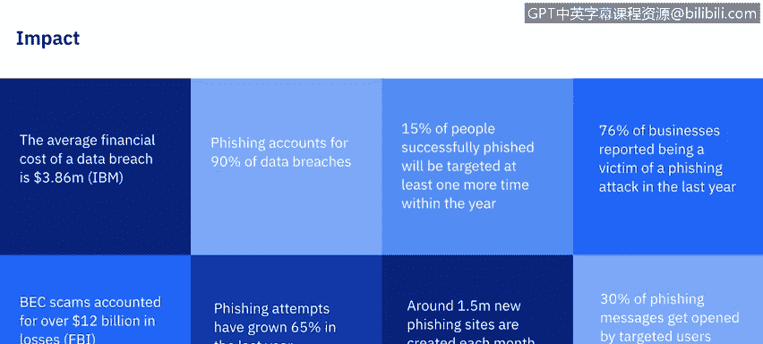
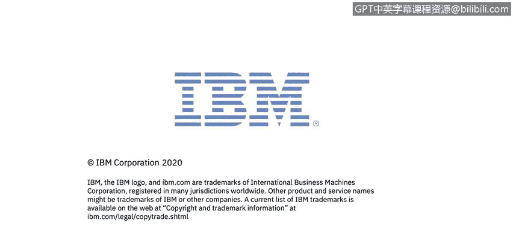

# IBM网络安全分析师专业证书课程7：《网络安全顶级项目：入侵响应案例研究》｜ibm-cybersecurity-breach-case-studies｜ - P31：9_05_impact-of-phishing.en_subtitled - GPT中英字幕课程资源 - BV1MN41167mY

Welcome to the I of fishing brought to you by IBM。In this video。

 we'll be learning about the impact fishingishing has on both individuals and corporations。

 Let's get started。

The nature of ph fishingish itself has changed moving far beyond traditional phishing for username。

 passwords， credit card numbers via fraudulent websites and more into sophisticated cybercrime attacks that mount advanced。

 persistent threats against organizations and steal individuals financial identities with devastating consequences for both users and organizations。

To give you an idea on just how bigman impact fishing has， take a look at these statistics。

The average financial cost of a data breach is 3。86 million in a study conducted by IBM。

Fishing accounts for 90% of all data breaches。And 15% of people successfully fished will be targeted at least one more time within the year。

76% of businesses reported being a victim of a phishing attack within the last year。

And BEC scams or this email crime accounted for over 12 billion in losses， according to the FBI。

Fishing attempts have grown 65% over 2018。And around 1。

5 million new fishing sites were created each month。And last。

 30% of phishing messages get opened by targeted users。

If those statistics weren't shocking enough， take a look at these from the anti fishinging work group's fourth quarter 2019 report。

We can see the number of unique fishing websites that were detected。

From October to December ranged from 39，000 all the way up to 76，000。

The number of unique phishing email reports or campaigns that were received from the anti fishingishing workgroup。

By consumers。You see stayed pretty consistent across the board around 45，000。Now。

 the number of brands targeted by fishing campaigns are in the 300s，333，325 and 341。

 we in our first video， where we went over the overview of the top spoofed brands。

 So those were just the top here， the anti fishing work group is reporting that Q4 alone of 2019 over 300 individual companies were spoofed。

 and those were only the ones that were reported。Not all the ones that exist。

 pretty scary when you think about it。You might be asking， what's that mean for me。

Let's break down the impact by individuals and by corporations。For individuals， far and away。

 the biggest impact is identity theft。There were 650572 cases of identity theft in 2019 alone。

 Those aged 30 to 39 reported the most cases of identity theft last year。Georgia， Nevada。

 and California are the top three states for identity theft。With over 270000 reports。

 credit card fraud was the most common type of identity theft last year。

 and it more than doubled from 2017 to 2019。Almost 165 million records containing personal data were exposed through data breaches in 2019。

The Capital  One Cy incident was the biggest data breach of 2019。

 as it it exposed the personal data of approximately 100 million consumers in the United States。

Unauthorized access is on the rise and is the leading cause of exposed records with personal information and data breaches。

We can see in the chart here the most common types of identity theft。

 credit card fraud and everything that doesn't fit in a category are the top two。

 loan and lease fraud， phone and utilities fraud and bank fraud make up most of the smaller reports with employment or tax fraud and government documents。

At the very last， but as you can see， the discrepancy between credit card fraud and everything else is pretty huge。

As for the business impact， phishing emails are still the main weapon threat actors are using。

The FBI estimates cyber criminalmins have stolen more than 12。

Billion from companies over a five year span using phishing attacks and business email compromise。

These are no longer isolated as incidents。A study by the University of Maryland concluded that an attack occurs。

 on average， every 39 seconds。Nearly half of all small businesses have been attacked with disastrous results。

60% of small and medium sized businesses that get hacked go out of business after just six months。

And speaking of business impacts in the next video， we'll be covering the case study。

 Facebook and Google becoming the victims of a massive fishing scam。We'll see you there。

