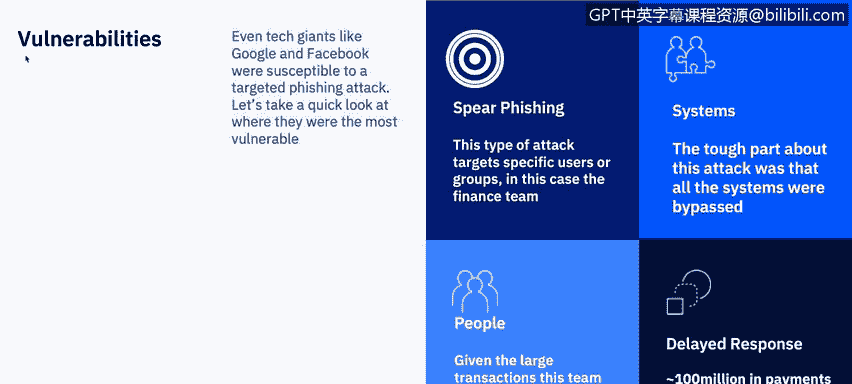

# IBM网络安全分析师专业证书课程7：《网络安全顶级项目：入侵响应案例研究》｜ibm-cybersecurity-breach-case-studies｜ - P32：10_01_phishing-case-study-google-facebook.en_subtitled - GPT中英字幕课程资源 - BV1MN41167mY

A phishing case study of Facebook and Google brought to you by IBM。In this video。

 you will understand the timeline of events of the fishing scam。

 Learn about what actions were taken by the threat actor and the companies and learn what the impacts of the attacks were。

As Adam mentioned in his last video， the results of a ph attack can be costly and have major impacts for both the individual who has foul and victim to the attack and the organization or company who was falsely represented。

 I'm Correne from IBM's security learning services team。

 and I will be taking you through several case studies throughout the course。

 You should note the format of the case studies as I am reviewing them。

 you will be asked in your peer to peer project， not only to review a specific type of attack in more detail。

 but to represent public data on a company or individual that was a victim of the attack。

 let's take a detailed look at what happened as part of the ph attack。In summary。

 according to the US attorney's office for the Southern District of New York。

 scammer stole over $100 million from Facebook and Google in a creative way。 Basically。

 they emailed the tech giants and asked for it。 The scheme that included setting up a fake business and sending ph emails to employees of Facebook and Google。

 And the scheme ultimately duped those multimillion dollar companies out of more than 100 million in total between 2013 and 2015。

 Here is a timeline of the attack。Prosecutors accused Rymss Kas in 2016 of incorporating a company that posed as another company。

 Taiwan based Quaant Comp， which actually does business with Facebook and Google。

Authority says Reym Saskas served as the sole member of the board of directors of the fake company。

 He opened， maintained and controlled various accounts at banks in the name of the fake company。

Starting in 2013， Rammss Kas and his co conspirators created fairly convincing forgery emails。

 They used fake email accounts which looked like they were sent by employees of the actual Quata company in Taiwan。

They sent phing emails with fake invoices to employees at Facebook and Google who regularly conducted multimillion dollar transactions with Quata。

 After receiving the emails， those employees responded by paying out more than $100 million to the fake company's bank accounts。

Prosecutors furthermore said in their statement that Rems's cause work also emowed forged invoices。

 contracts and letters that falsely appear to have been executed and signed by executives and agents of the companies he was impersonating and fleecing。

The scheme tried to avoid suspicion from banks by creating false supporting documents for the transactions。

 which even had fake corporate seals embossed with the names of those companies。

The scam took $98 million from Facebook in 2015。 Rammss Cas extracted $23 million from Google。

 but both companies have recovered most of that money since the scheme was discovered。

 and Rammss Cus was arrested。He was ultimately sentenced to 30 years in prison in July of 2019。

Even tech giants like Google and Facebook were susceptible to a targeted fishing attack。

 Let's take a quick look at where they were， the most vulnerable。No。

 some of the breathless headlines about。Rumsas Ca' case。

 indicating that he just asked for the money are selling short the sophistication with which he conducted his bradulensky。

 A lot of careful forgery and knowledge of the internal finance workings of the involved companies is needed to pull these attacks off。

The FBI warns that attackers will often use malware or compromised accounts to breach the target network in advance and lay low。

 observing the billing systems and internal communications for weeks before making any kind of move。

For Google and Facebook， the main vulnerabilities were。Searfishing。

 the attack targeted the finance team as they would have the authority to pay the invoices。Systems。

 due to the fact that this was a business， as usual， any threat systems were bypassed。People。

 this was a normal part of the finance team's job dealing with quantta。

 So no one suspected the threat and delayed response。

100 million in payments were taken from Facebook and Google due to a lack of detection。

So what was the cost of this breach。The scam took $98 million from Facebook in 2015。

 as I noted before， and Rymss Cuss extracted over 23 million from Google。

Both companies have recovered most of the money since the scheme was discovered。

 and Rme Saskos was arrested and pled guilty。 He was sentenced to 30 years in prison for his actions。

And I would add a fourth cost of negative publicity。 Any time there's a media about a breach。

 the company's vulnerabilities are exploited。So what are some of the ways that this breach or other fishing attacks can be prevented。

 So let's review a few of them。Most countries and localities have protections against the registration of identical or overly similar company names。

Rmss Kos took advantage of relatively loose rules in Litia。

 which has had ongoing issues with fraudulent company registrations driven by its popularity as a place to launder money。

 Communications coming from countries known for this sort of fishing scam， can be an early morning。

 particularly if business partners were not previously known to have a presence there。

If a fraudster does manage to orchestrate a scheme such as this， early detection is critical。

 These attacks is usually carried out by organized groups that will immediately use mules to launder the money once received。

 Reg reviews of invoices and payment related communications for accuracy can help tremendously in this case。

Checking documents to verify that all the contact information remains consistent over time can provide vital early warning that something is off。

 It is also possible to adjust payment processes to bake protections against business email compromise into normal procedure。

One idea is to implement two factor authentication whenever a payment is made， for example。

 require phone verification。😊，Let's also discuss some other phishing attack prevention techniques。

 E systems can be tweaked to do things like automatically flag any messages where the from and reply addresses do not exactly match or to automatically display text coming from an internal company account in a certain color。

 This will help to more quickly identify communications from a phishing site。

Employees should be educated in training sessions conducted with mock fishing scenarios。

Your organization can deploy a spaM filter that detects viruses， blank senders。

 or other information that may not be standard email practices。

All systems should be kept current with the latest security patches and updates。

 An antivirus solution should be installed with regularly scheduled signature updates and monitoring of the antivirus status on all equipment。

A security policy should be developed that includes。

 but isn't limited to password expiration and complexity。

 A web filter may be deployed to block malicious websites。

 All sensitive company information should be encrypted。And finally。

 convert HTML email into text only email messages or disable HTML email messages。

Please check out the additional resources to see two full articles outlining this fishingish scam and also an article on Litivia。

😊，Adam will now discuss an overview of a point of sale attack。

 I will be back to discuss another case study later in this course。 Thank you。

