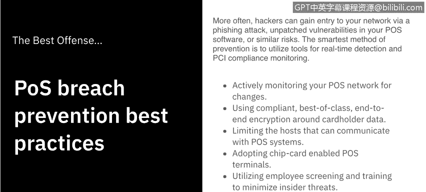
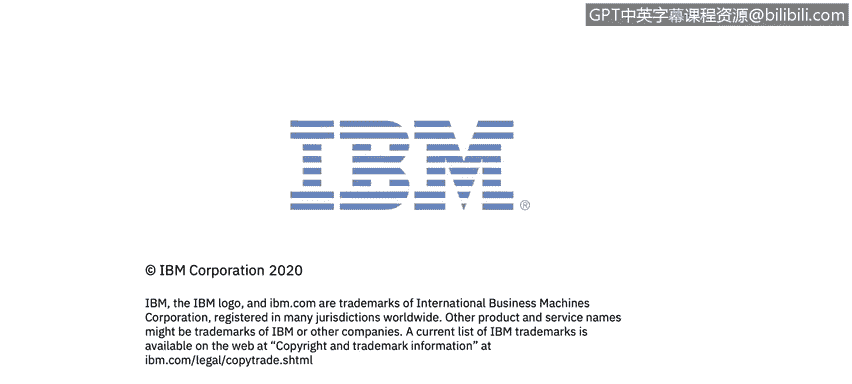

# IBM网络安全分析师专业证书课程7：《网络安全顶级项目：入侵响应案例研究》｜ibm-cybersecurity-breach-case-studies｜ - P34：12_02_pos-malware.en_subtitled - GPT中英字幕课程资源 - BV1MN41167mY

Welcome to PO malware， brought to you by IBM。In this video。

 we'll learn how malware makes its way onto P O S devices。

 We'll learn about the different families of P O。 S malware and then what happens to the information once it's stolen。

Let's get started。Point of sale systems require some sort of connection to a network in order to contact external credit card processors。

This is necessary in order to validate credit card transactions。

Sufficiently skilled indetered attackers can go after businesses POSOS terminals on a large scale and compromise the credit cards of thousands of users at a time。

The same network connectivity can also be leveraged to help exfiltrate any stolen information。

Most point of sale systems run on Windows or Linux， making them essentially small computers。

 Cyber criminals usually gain access to a company through their network。Once inside。

 the point of cell malware can select which data to steal and upload to a remote server。

Most point of cell Maware comes equipped with back dooror and command and control features。Now。

 the industry uses end to end encryption of sensitive payment data。

 which comes from the card's magnetic strip or chip when it's transmitted， received or stored。

 decryption only occurs in the point of sale device's random access memory or Ram。

 where it's processed。P O S Maware specifically targets the RamM to steal the unencrypted information。

 a process called RamM scraping。These are the most common and readily available families of point of sale malware。

The Alena family Maware scans the system's memory to check if the contents match regular expressions。

 which indicate the presence of card information that can be stolen。V skimmer。

If it does not find its server， it checks for the presence of a removable drive with this specific label。

 If this drive is found， it drops a file that contains any stolen information onto it。

 allowing for a method of offline data exfiltration。With the Dexter family。

 its information theft activities are not limited to just stealing card information。

 it also steals various system information and installs a key logger onto affected systems。The FY。

 S N A malware uses the Tor network to communicate with its C and C server。

 and it makes detection and investigation difficult by making all the network traffic made by the malware extremely difficult to analyze。

The deimbel malware and checks if sandboxing or analysis tools are present on a machine before running。

 making detection and analysis that much more difficult。And the most popular。

 the Black POS uses file transfer protocol to upload information to a server of the attackers choosing。

 this allows attackers to consolidate stolen data from multiple POS terminals on a single server。

A couple things to note， one， POSOS malware is rarely used without the aid of other malware。And two。

 we call these families of malware because they are adapted and updated over time。

 let's go ahead and look at some of those updates。As you can see。

 most of the malware that we discussed or aliases of the malware we discussed have been adapted。

 updated， or changed over time into new and improved versions that either offer new functionality or are more difficult to detect。

One thing they all have in common， though， is they are there to steal financial data。Now you may ask。

 well， what happens if my data is stolen through a POS breach？

Let's cover that now。Once your data has been stolen。

 the criminals will sell the information to brokers who buy the payment card information in bulk and sell the information to Carters。

These are people who use a Carter website， such as the one on the left here。

 to obtain payment information， which they will purchase prepaid credit cards with。

Those credit cards will be used to buy gift cards。Which are then used by goods to sell for profit。

To make it more difficult to track， the items are not shipped directly to the end user。

 They're shipped to a reshipper who then ships it to the end user making the transaction very difficult to follow from end to end。

So then how do we prevent P O S breaches， It turns out the best offense Its a good defense。

More often， hackers gain entry to your network via phishing attack。

 unpatched vulnerabilities in your POS software， or similar risks。

The smartest method of prevention is to utilize tools for real time detection and PCI compliance monitoring。

A list of best practices is as follows。Actively monitor your POS network for changes， use compliant。

 best of class and end encryption around cardholderer data。

Limit the host that can communicate with your POOS system。Adopt chip card enabled POS terminals。

Utilize employee screening and training to minimize insider threats。

And train employees to immediately detect and report possible signs of tampering。

