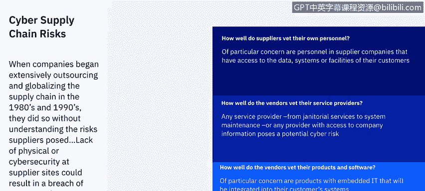
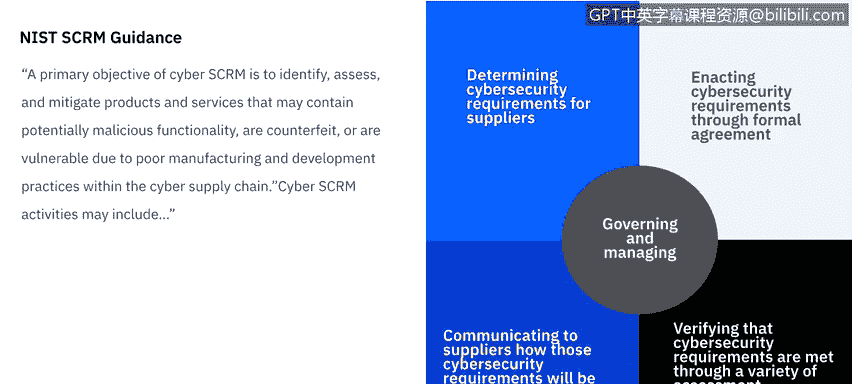
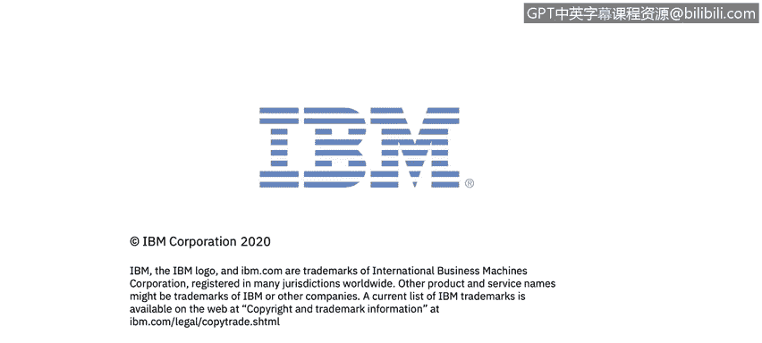

# IBM网络安全分析师专业证书课程7：《网络安全顶级项目：入侵响应案例研究》｜ibm-cybersecurity-breach-case-studies｜ - P36：14_01_3rd-party-breach-overview.en_subtitled - GPT中英字幕课程资源 - BV1MN41167mY

Welcome to third party Bes brought to you by IBM。In this video。

 we'll learn what constitutes a third party breach， We'll review response methodologies。

 and then learn what types of breaches are most common for third party vendors。Supply chain attacks。

 also known as value chain attacks or third party attacks。

A attacks that originated from one of your third parties that has access to your system。

 which includes data management companies， law firms， email providers， web hosting companies。

 subsidiaries， vendors， subcontractors， any external software or hardware used in your system。

 even the JavaScripts added to your website to collect analytics， and the list goes on。

In a 2018 Pneman Institute study，64% of businesses said they were mostly concerned with a third party misusing or sharing confidential information with other third parties。

Of those that they surveyed， 41% actually encountered that issue。

So while it was the number one concern across all the companies。

 it was number two in events that actually happened to give you more context in the landscape of third party breaches。

 Consider these quick statistics。$21 million is the average annual spending on vetting the third party of companies。

 however 64% say the processes used are only somewhat or not effective at all。

40% of organizations use manual procedures like spreadsheets and 51% employ risk scanning tools to vet their third parties。

 However，34% said the results of these tools were only somewhat valuable。

 while 20% said the results don't provide any insights。

 Third parties are spending $15000 hours a year on completing assessments at an average cost of $1。

9 million annually。 However，55% of these assessments only somewhat or do not accurately reflect their security posture。

Only 8% of assessments resulted in action， such as disqualification of a vendor or a requirement to remediate the security gaps。

 However， if assessments revealed gaps， only 26% of respondents say their organizations terminated the relationship。

To get a better idea of what these breaches look like， I'll refer to a norm shieldeld study。

 The top three uses by a third party were cloud based storage， service or hosting providers。

Online payment， credit card processing or point of sale systems。

Or JavaScript on websites used for web analytics， visitor tracking， etc。

While 2018 and 2019 brought record breaking third party breaches。

2020 is already off to a scary start。 This graph is by no means a comprehensive list of every third party breach that's happened this year so far。

 but it's a good representation of the heavy hitters that have happened already。

 starting with Instagram in January。 and the biggest and latest is Marriott in April of 2020。

Personal information and financial information seemed to be the trending data that was leaked through every one of these breaches。

 Some are even more severe with Social Security numbers and driver's license numbers being exposed。

 leading to a high increased chance of identity theft。

 So how did third party breaches become such an issue。

While when companies began extensively outsourcing and globalizing the supply chain in the 80s and 90s。

 they did so without understanding the risks suppliers posed。

 lack of physical or cybersecur at supplier sites could result in a breach of corporate data systems or product corruption in the beginning。

 only the most basic questions were asked， Like how well do suppliers vet their own personnel of particular concern or the personnel and supplier companies that have access to data systems or faculties of their customers。

They ask， how well do the vendors vet their service providers。

 Any service provider from janitorial services to system maintenance or any provider with access to company information poses a potential cyber risk。

And how well do the vendors vet their products in software。

 a particular concern of products with embedded I that will be integrated into their customer systems？

As more and more concerned grew， we moved from questions to building frameworks and best practices。

 The National Institute of Standards and Technology created a supply chain risk management guidance。

 It says that a primary objective of the cyber supply chain risk management is to identify。

 assess and mitigate products and services that may contain potentially malicious functionality or a counterfeit or vulnerable due to poor manufacturing and development practice within the supply chain。

Cyber supply chain risk management activities may include。

Determining cybersecurity requirements for suppliers。

Inact cybersecurity requirements through formal agreements such as contracts。

Communicating to suppliers how those cybersecurity requirements will be verified and validated。

 think of auditing， and verifying that cybersecurity requirements are met through a variety of assessment methodologies。

And then governing and managing all of the above。The third party ecosystem is an ideal environment for cyber criminals looking to infiltrate an organization。

 and the risk only grows as these networks become larger and more complex， saysy Dove Goldman。

 VP of innovation and alliances of Ous to stay ahead of the risk。

 companies and executives need to collaborate around plans for third party detection and mitigation that supports automation technology in strong governance practices。

In 2018， companies and executives did collaborate to come up with a list of best practices on how to altogether avoid a third party breach。

 The first was an evaluation of the security and privacy practices of all third parties。

There's a need to conduct regular audit and assessments to evaluate security and privacy practice of third parties。

The second is an inventory of all third parties with whom you share information。

 we need to track all third parties that have access to sensitive data and how many of these parties are sharing that data with others。

The third is a frequent review of third party management policies and programs。

 implement formal processes to regularly evaluate security and privacy practices of third party and nth parties。

 particularly to address new technologies and innovations like the Internet of Things devices。

Next is the third party notification when data is shared with Nth parties。

 we need to mandate that third parties provide information and transparency into their nth party relationships prior to sharing sensitive data。

And last， an oversight by the board of directors wing to involve senior leadership and boards of directors in third party risk management programs。

 high level attention to third party risks may increase the budget available to address these threats。

