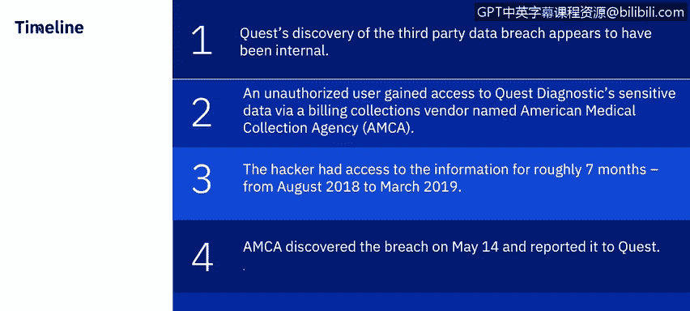
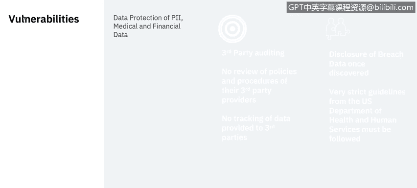
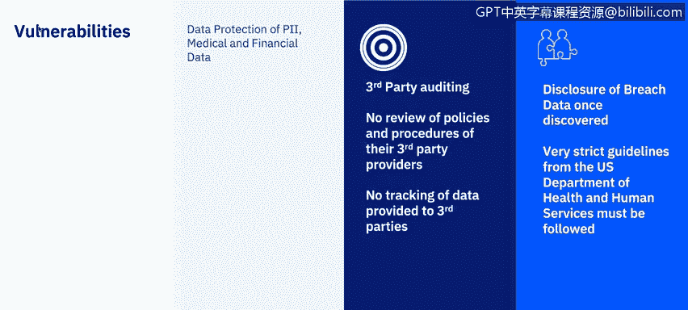

# IBM网络安全分析师专业证书课程7：《网络安全顶级项目：入侵响应案例研究》｜ibm-cybersecurity-breach-case-studies｜ - P38：16_01_3rd-party-breach-quest-diagnostics.en_subtitled - GPT中英字幕课程资源 - BV1MN41167mY

A third party case study of Que diagnostics brought to you by IBM。In this video。

 you will understand the timeline events of the Que diagnostic breachch。

 Learn about what actions were taken by the threat actors and learn what the impacts are from a third party attack。

First， let's explore the summary of the attack。Qust diagnosticgnostics is one of the largest providers of clinical laboratory testing services in the United States the sensitive data of 11。

9 million patients was accessed， ranging from credit card numbers to bank account information。

 and even Social Security numbers。The timeline for this breach is as follows。

Unlike many of these incidents， Ques discovery of the third party database appears to have been internal。

 An unauthorized user gained access to Ques's diagnostic sensitive data via a billing collections vendor named American Medical Collection Agency or AMC A for short。

The hacker had access to the information for roughly seven months from August 2018 to March 2019。

AMCA discovered the breach on May 14 and reported it to Ques。

The first the public heard of the breach was when Ques disclosed it as part of an early June filing with the Securities and Exchange Commission。

The main vulnerabilities revolve around the data that Que diagnostics and as third parties have access to P I。

 which is personally identifiable information， is any data that can be used to identify a specific individual。

 So security numbers， mailing or email address and phone numbers have most commonly been considered PI。

 but technology is expanded the scope。 They also have access to medical data and financial data。

 including credit card data。

If we look at some of the explicit vulnerabilities around the third party provider。

 the first one is a lack of auditing of that party。

 An unknown party gained illlicit access to the AMCA website and executed a man in the middle attack focused on payment pages。

 The attackerss loggged payment and personal information entered by the visitors。

 Ques states that their internal medical records， such as laboratory test results were not accessed during the third party data breach。

 but the attackers had access to any medical information that might have been entered on the AMCA site。

 Ques has since ceased to send collection requests to AMCA and AMCA has removed their Web payments page and this contracted an outside security firm for an audit。

 AMCA stated that they do not yet know exactly how the unauthorized user gained access。

Qus also had a responsibility of reporting a breach involving made medical data According to the US Department of Health and Human Services。

 filing a breach of unsecured protected health information。

 covered entities must provide notification of the breach to affected individuals， the secretary。

 and in certain circumstances to the media。In addition。

 business associates must notify covered entities if a breach occurs at or by the business associate。

What was the cost of this breed， This appears to be quite a mother load of data。

 as this breed seems to touch in all three critical components of customer data。

 Personal identifiable information， credit card data and health information。

There are obvious risks of identity theft and account takeover。

 but the combination of information exposed as a result of the third party data breach could lead to some particularly worrying phishing attacks。

Medical data is a powerful tool for fishers in conjunction with the financial and personal information that this third party data breach made available。

 Fishers and scammers could easily pose as the targetss physician or insurance company。

 citing private medical details to inspire confidence。

 Blackmail is also a possibility if public figures were among the victims of this breach。

Financial cost to Que is not yet known。 Florida law firm Morgan and Morgan filed a class action lawsuit on June 12。

2019 in New Jersey against Quest diagnosticgnoss。 after the laboratory testing company disclosed that it experienced a data breach that exposed 11。

9 million patients according to the Connecticut law Tribune。

The attorney general in Connecticut and Illinois have also opened investigations into the security incident In the 36 page lawsuit。

 Ques Dgnostic is accused of failing to properly notify patients of the breach。

 The Connecticut law Tribune reports。 Ques diagnosisus said hackers had access to the AMCA Web payments portal between August 1 2018 and March 302019。

 It cited that the data breach was a direct result of defendant's failure to implement adequate and reasonable cybersecurity procedures and protocols necessary to protect patients personally identifiable information。

 within the lawsuit。The picture is bleak for third party provider AMCA American Medical Collection Agency filed for Chapter 11 protection after an eight month long system hack breached the personal financial。

And health data of up to 20 million Que diagnostics。

 lab Corp and bio referenceference patients according to Bloomberg。

 filed in the southern District of New York。 The petition explained that AMCA is seeking to liquidate assets and liabilities worth up to $10 million due to a cascade of events。

After the breach， Retrieval Masters Critors Bu Bureau wrote in a Cor filing that the company had incurredcurd enormous expenses that were beyond the ability of the debtor to bear。

 The company has spent 3。8 million to mail over 7 million individual notices to individual breach victims。

 The bankruptcy filing also revealed that Labcorp Que and two of its other largest clients。

 stopped doing business with AMC A due to the breach， which fueled the bankruptcy petition。

These prevention recommendations are based upon a special analysis of those organizations that have been able to avoid a third party data breach in the past 12 months or ever。

 These high performing organizations implemented governance and I T security best practices that were strongly correlated with a reduced incident of third party data breaches。

😊，Here are some of them。Evaluations， security and privacy practices of all third parties。

They conduct regular audit and assessments to evaluate security and privacy practices of third parties。

 an inventory of all third parties with whom we share information。

You must track all third parties that have access to sensitive data and how many of these parties are sharing this data with others。

Frequent review of third party management， policy and programs。With this。

 we must implement formal processes to regularly evaluate security and privacy practices of third and1th parties。

 particularly to address new technologies and innovations like Internet of things， devices。

Third party notification when date is shared with end parties。

Must mandate that the third parties provide information and transparency into their Nth party relationships prior to sharing sensitive data。

And oversighted by the board of directors involved the senior leadership and board of directors and third party risk management programs。

 High level attention to the third party risk may increase the budget available to address these threats。

Next， animal will provide a video of the overview of ransomware。

 I will be back a little later to give you a case study on ransomware with the city of Atlanta。😊。

Thanks for listening to this video。

