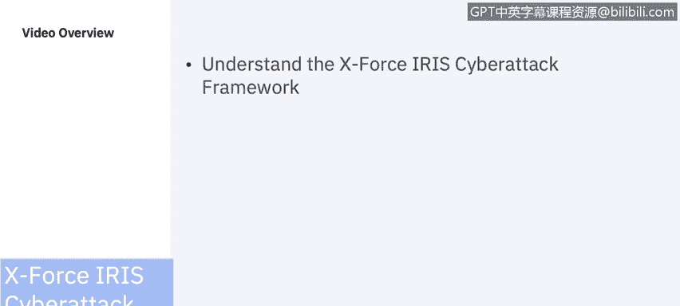
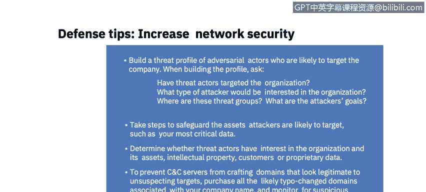
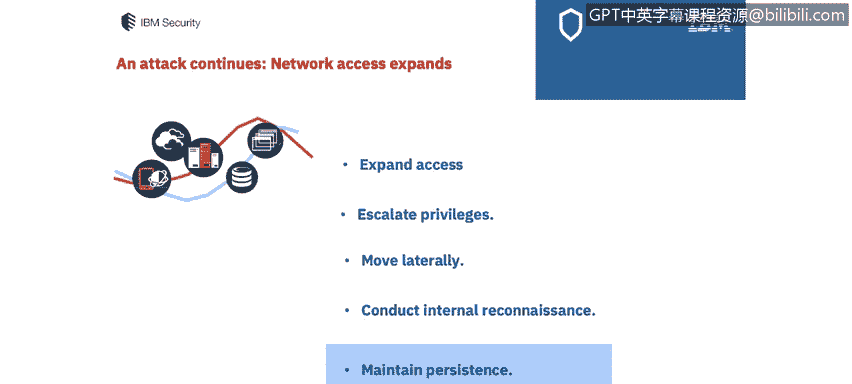
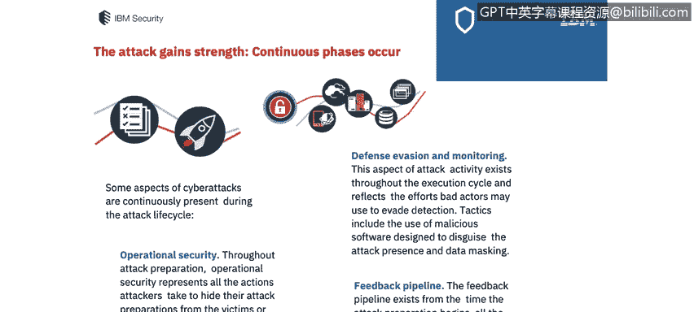
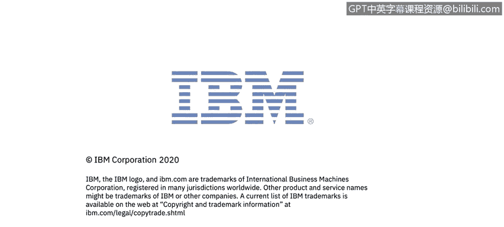

# IBM网络安全分析师专业证书课程7：《网络安全顶级项目：入侵响应案例研究》｜ibm-cybersecurity-breach-case-studies｜ - P3：2_IBM X力量IRIS网络攻击框架.zh - GPT中英字幕课程资源 - BV1MN41167mY

Welcome to IBM X Force Iris Cyberattack preparation and execution frameworks brought to you by IBM。

In this video， you will learn to understand the Ex Force Iis cyber attacktack framework。

 It is important as assistant system analysts to understand cyber attackt frameworks。

 We will review the cyber attack framework。 And I would highly recommend you refer to the full framework in the future。

 to build an effective cyberatt security strategy。 Organs need to thoroughly understand exactly how cyber attacks occur from the attacker' perspective。

 Exps within the IBM X force incident response and intelligence services。

 Ex force iris team have developed a comprehensive framework to address all actions attacker takes。

 empowering security analysts and threat hunters with the insight they need to narrow risk exposure and thwart ever increasing cyber attacks。

 The framework outlines each phase of the cyber attacks of security analysts can examine them in a repeatable and comprehensive way。

 The phases in a cyberat don't necessarily happy。😊。

Or at to pinia on how the attack progresses， the phases may occur simultaneously or through multiple iterations or maybe is skipped entirely。

Expers Iris has put together an e book， which explains each step that occurs during a cyber attack from beginning to end and offers guidance on staying ahead of today's threats。

Attack beginnings。 The bad actor sets the stage before an attack。

 Ba actors are carefully determining their objective， such as theft of intellectual property。

 The first part of the attack is a preparation framework After undertaking attack preparation。

 the bad actor will launch the attack to determine a target and prepare an attack。

 The preparation framework examines the step that cyber attackers move through beginning with。

The attacker determines objective。 The attacker identifies the target。

 determines attack requirements and creates an initial attack plan。

 The attacker then prepares the attack。 This stage includes all the known methods that attackers use to advance from target selection to launching their attack。

They may include conducting external reconnaissance。Aligning tactics， techniques and procedures。

 preparing malware and software tools， in this case to prepare their attack。

 attackers will define the tools set they plan to use to compromise and move through a network。

 Aters can use malware， repurpose software tools that of legitimate purposes or employ a combination of both。

 and finally， they prepare the attack infrastructure。

The attacker may build a command and control network。

 We'll see in an example or in case study of a watering hole attack where the attacker did just that。

 here well review some of the defense tips to increase the network security based upon this state of the framework。

 You can build a threat profile of actors who are likely to target the company。

When you're building that profile， some of the questions you'll want to ask yourself are have threat actors targeted the organization in the past。

 what type of actors would be interested in the organization， where are these threat groups。

 what are the actors goals？Take steps to safeguard the assets。

 Aters are likely to target some of the most critical data so where is that data stored。

 determine whether threat actors have interest in the organization， Are there assets。

 intellectual property， other customer data or proprietary data that's something that an attacker would wish to gain access to。

To prevent CC servers from crafting domains that look legitimate to unsuspecting targets。

 purchase all the likely type of changed domains associated with your company name。

And monitor for suspicious domain registrations。Let's take a look at the next phase of the attack。

 launch and execute attack。 the compromise begins。Launch attack Once the attack infrastructure is ready。

 the attacker launches an attack against the target。

 either directly or indirectly and defines the attack as successful or failed。

 Some of these types of attacks we will be exploring in greater detail in the remainder of the course。

Let's take a look at really the quality threat intelligence。

 which is key to enabling factor for the proactive threat hunting programs。

On completion of successful compromise， a cyber attack execution framework commences in the event of a failed attempt。

 the attacker may revisit previous steps to refine the attack strategy and determine the point of failure in order to resume a attack。

They may look at the access environment。 They may execute the initial compromise again。

 and they may establish an actual foothold。 Let's take a look at the defence tips to increase network security at this phase。

 One to harden the attack surface and deter most attackers from viewing the organization as an easy target。

 This can be accomplished through patch management。

 We can include the patch management performance metrics in the system administration process and use automated checks for patches。

We can apply the concept of lease privilege， which we've visited before in prior courses。

 We can disrupt attacks， implement strong endpoint detection and mitigation strategies。

 as we've looked at in a couple of the courses around end point security。

 and we can employ a threat to hunting program to aid a threat identification and mitigation program。

As the attack continues， network access expands。The attacker may expand access。

 Once an attacker has gained a foothold in the network。 The next step is to expand network access。

 This stage includes the methods attackers use to proceed from the initial compromise to executing their objectives。

 They might escalate privileges。 The attacker gains greater access within the comp network。

 Credential dumping， bypassing passwords with a previous stolen hash and corrupting an internal application or system are all tactics that can be used to escalate network access privileges。

They may also move laterally through the network。 We will see this happen in our third party case study that we review later in this course。

 They may conduct internal reconnaissance。 The attacker may collect additional information about the network using tactics such as querying the network for O and ports。

 file browsing for data or pursuing service tickets for specific resources and they maintain persistence。

 So attackers complete actions to strengthen and maintain their foothold ensuring continued access to the environment。

 So what are some defense tips to increase network security at this phase。

 you can refine your threat hunting program as unknown threats are discovered。

 mitigategate associated threat indicators as signatures into detection and protection platforms to automatically identify any other instances。

 you can also invest in a centralized logging and analysis platform to automatically prioritize data and place it into tears。

😊。

You can whitelist and create a baseline for normal activity and perform frequency analysis。

 and finally you can enforce strong user password policies by enabling multifactor authentication and educating and restricting password roles for your employees。

😊。

As the attack gained strength， continuous phases occur。

 Some aspects of cyber attacks are continuously present during the attack life cycle。

Operal security Through attack preparation， operational security represents all the actions attackers take to hide their attack preparations from the victims or cybersecurity defenders。

We can look at defense e and monitoring， tactics include the use of malicious software designed to disguise the attack。

 presence in data masking， typical actions include deleting logs and hiding or disguising malicious code。

There's the feedback pipeline。 The feedbacklet back pipeline exists from the time and attack。

 preparationation begins all the way through the execution stage。Once inside a network。

 attackers reassess their goals and tactics， compare results with the mission objective and possibly return back to improve any attack phase。

So again， let's look at the defense tips to increase our network security to disrupt defensive invasion monitoring tactics。

 make sure you always analyze all network traffic and endpoints and search often for anomalous behavior。

 You can set up a honeypot， a deceptive file or system designed to truck attackers into accessing it。

 This will can trigger an immediate alert to your security personnel。

 You can monitor restrict unusual data transfers。 You can look for creation of specific files。

 You can investigate spikes and emails to external addresses。

 You can monitor for the creation of auto forward rules。 And finally。

 you can monitor for excessive traffic， losing from one FTP or DNS server。

In this phase the attacked objective execution， the attacker completes the。He executes the objective。

 Once the execution phases are completed successfully， the attacker moves towards the final goal。

 which could be anything from theft espionage， messaging， Runing company's reputation。

 There's many different objectives that your threat actor may have for an organization。

 You must establish your cyber attack strategy to effectively prevent bad actors from enteringing your network take a holistic view of cyber attack techniques from an attacker's perspective。

 Some of the case studies that will be showing you in the attacks that will be exploring in detail will help you come up with this strategy and also be educated when your organization introduces their strategy to you。

 you will be familiar with some of the most common attack strategies。So finally。

 let's look at the defense tips and increase network security We'll build and train a dedicated team to respond to security incidents。

 We've taken a look at the incident response team that the NIST organization has recommended that you put in place will practice relevant attack scenarios use a table you should practice relevant attack scenarios using tabletop exercises or simulations at mimicco cyberatt。

 Another way to do that is to review the case studies and put together your own case studies of attacks that have occurred in corporations in the past。

 you can thoroughly examine available forensics to understand attack details establish mitigation priorities provide data to law enforcement and plan risk reduction strategies。

 you will be looking at in your case study where this forensic details is available for specific breaches that have occurred。

 You can also consider an incident response retainer with trusted security。

PartThis will help you because you will be able to take advantage of the knowledge of your trusted partner and to share data across companies that may prevent an attack in the future。

In the next video， I will take you through a case study of the target breach that happened in 2013 in order to show you a real life example of what an attacker was able to do and what the cost of that breach and that attack was to the corporation。

