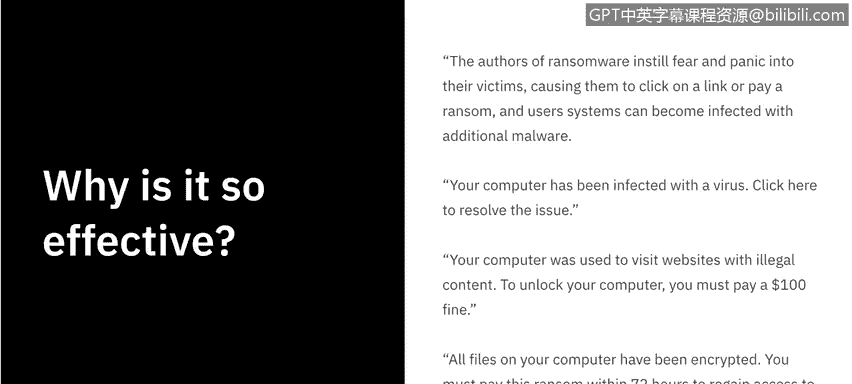
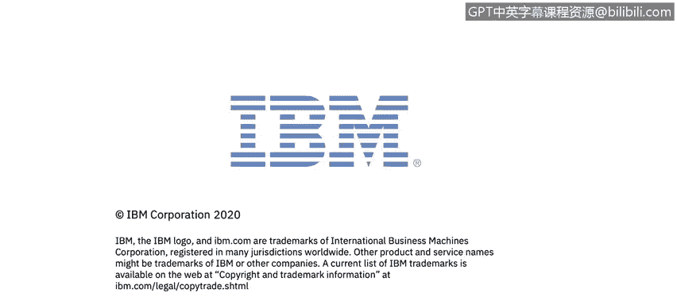

# IBM网络安全分析师专业证书课程7：《网络安全顶级项目：入侵响应案例研究》｜ibm-cybersecurity-breach-case-studies｜ - P40：18_03_examples-of-ransomware.en_subtitled - GPT中英字幕课程资源 - BV1MN41167mY

Welcome to ransomware examples brought to you by IBM。In this video。

 we'll learn what the most common ransomware are and the various techniques they use to exploit users for money。

On the Department of Homeland Securities's ransomware homeage。

 it says that ransomware can be devastating to an individual or an organization。

 Anyone with important data stored on their computer or network is at risk。

 including government or law enforcement agencies and health care systems or other critical infrastructure entities。

Recovery can be a difficult process that may require the surfaces of a reputable data recovery specialist。

 and some victims pay to recover their files。However。

 there is no guarantee that individuals will recover their files if they pay the ransom。

So why is ransomware so effective？The authors of ransomware instill fear and panic into their victims。

 causing them to click on a link or pay a ransom。 and user systems can become infected with additional malware as a result。

Often they'll be presented with messages that say your computer has been infected with a virus。

 click here to resolve the issue。Or your computer was used to visit websites with illegal content to unlock your computer。

 you must pay $100 fine。All files on your computer have been encrypted。

 you must pay the ransom within 72 hours to regain access to your data。

The authors of ransomware will back you into a wall and use fear tactics to try and elicit a ransom。

In the previous video， we discussed the different types of ransomware such as crypto ransomware。

 locker ransomware， and leakware。Now it's time to look at specific examples of ransomware。

The first example is Lockhe。 This ransomware was capable of encrypting over 1 60 different file types。

It used phishing to target those with designer， engineering or developer file types。

Arguably the most infamous of ransomware。Wannara spread across 150 countries in 2017。

They capitalized on out of date software in the healthcare industry。

 costing 4 billion in losses worldwide。The bad rabbit ransomware used fake Adobe flashlash websites to install ransomware。

 tricking users into thinking they needed to complete an update。

 When they clicked on the install button， it would install the ransomware instead。Rek spread in 2018。

 and it was specifically focused on Windows。 What it did was disable the system restore button。

 So that way， when you saw you become a victim of the ransomware。

 you did not have the ability in your current operating system to complete the backup。

What was particularly malicious was that it encrypted networked drives as well。

 Troldash was popular in 2015 and went for quantity over quality。

They did this by catching victims through spam， email links and attachments。

The jigsaw ransomware was named after the saw horror films。

 It torments its victims by deleting files incrementally。 More and more with each hour。

 the ransom was not paid。The crypto locker spread through email attachments。

 Over a half a million computers were impacted。But it was countered by law enforcement who was able to see the network of all crypto locker computers that were helping proliferate the ransomware and were able to distribute keys to the victims unbeknownst to the cyber criminals。

The Peya was a precursor to Golden eye and it was one of the just straight encrypted the entire hard drive。

And when it resurfaces golden eyee， it was around the same time Wannara was popular。

They targeted pretty high profile users and locked them out completely。The last one was Gancraab。

 which claimed to have used the user's webcam to record personal and private moments and threatened to release that footage unless a ransom was paid。

Even as scary as the landscape of ransomware is。 the future isn't any more promising。

As organizations become increasingly more dependent on tech solutions。

 the scope for ransomware only increases。 So it's just a matter of time now before the internet of things becomes the ransomware of things because the increasing use of internet connected。

 industrial， controlled systems， smart buildings and vehicles。

 including autonomous vehicles is creating new areas for possible exploitation。

Things like remote locking of vehicles， homes and buildings could be abused for extortion。

Manipulation of building automated systems such as those controlling the HVAC， which is the heating。

 ventilation in AC。Could serve as a basis for new schemes。

In a 2018 White Paper titled Rasomware in Enprise Perspec by Stephen Copp。

 He discussed what some of the recommended responses would be to this evolution of ransomware。 First。

 start to address the potential threats in your risk management， strategy and planning。

Get a handle on how ranssonable assets are now， your Internet of things devices。

 single or home office routers， any robots control systems or autonomous systems。

 track the vulnerability reports related to those outs and keep up with the patching and firmware。

Last segment the internet of things， devices and other new technologies from your production networks that way if one is compromised。

 the other has a chance。Now， we're going to take a look at a real world example of a massive ransomware tech against the city of Atlanta。

 We'll see in the next video。

