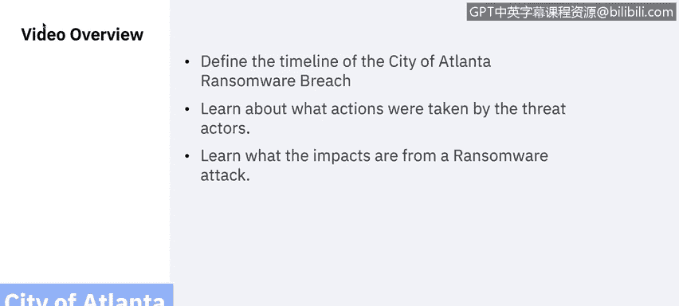
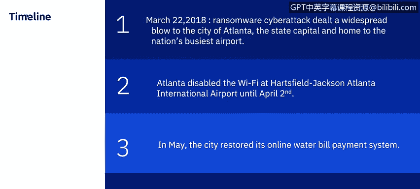
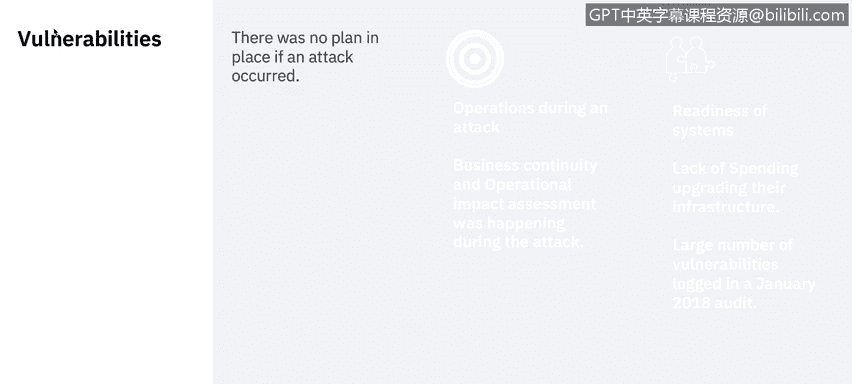
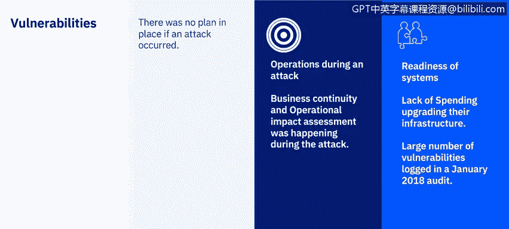
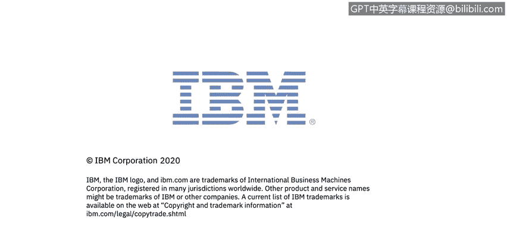

# IBM网络安全分析师专业证书课程7：《网络安全顶级项目：入侵响应案例研究》｜ibm-cybersecurity-breach-case-studies｜ - P41：19_01_ransomware-case-study-city-of-atlanta.en_subtitled - GPT中英字幕课程资源 - BV1MN41167mY

Welcome to Ransomware case Study， City of Atlanta， brought to you by IBM。In this video。

 you will learn to define the timeline of the city of Atlanta Rasomware breach。

 learn about what actions were taken by the threat actors and learn what the impacts are from a ransomware attack。

In the early morning of March 22，2018， the city of Atlanta suffered a widespread ransomware attack。

 The ransomware incident knocked out services such as warrant issuances， water requests。

 new inmate processing court fee payments and online bill programs across multiple city departments。

 The virus used to attack the city was the Sam Samam ransomware。

 which differs from other ransomware and that it does not rely on fishing。

 but rather utilizes a brute force attack to guest week passwords until a match is found。

 It is known to target weaker I T infrastructures and servers。To unlock the city systems and data。

 Heers demanded 51，000 in Bitcoin， which the city refused to pay。

Now let's review the timeline of the attack。In the early morning of March 22。

 a large ransomware cyber attack dealt a widespread blow to the city of Atlanta。

 the state capital and home to the nation's busiest airport。

 The breach shuttered many devices at City hall for about five days and an extensive infection elsewhere across the enterprise。

 It significantly impacted law enforcement temporarily returning police to writing incident reports by hand and costing the department access to nearly all its archived in vehicle video。

 It also affected internal and external facing applications alike。

 forcing the manual processing of cases at Atlanta Mu court and stopping online or in-per payments of tickets。

 water bills and business licenses and renewals。Out of caution。

 officials also disabled the Wi Fi at Hartsville， Jackson。

 Atlanta International Airport until April 2。😊，In May。

 the city restored its on water bill payment system。

 and the court's on bill payment option and docket boards weren't returned to service until June。

 Let's go ahead and review some vulnerabilities that we've seen with this attack。

 There was no plan in place if an attack occurred。 There are many lessons learned for the city of Atlanta that we will explore later。

First， vulnerability is operations during the attack。 Despite the breach。

 Atlanta's 911 system and its emergency response were unaffected， and major utilities。

 including water and sewer services， continued unabated。

 This was possible because Atlanta retained the manual processes and institutional knowledge it needed to revert to traditional methods of service provision and in plans in place to keep doing business while the incident unfolded。

 The city responded to the breach。 business continuity and operational impact assessment were going on simultaneously。

A lot of municipalities and private sector counterparts get so caught up in the response effort that they don't recognize that as part of that response。

 you should immediately begin thinking about how you are going to continue operations。

 According to Ria Akin， Atlanta's director of the Office of Emergency Preparedness。

They also didn't understand the impact of the threat on all operations。

 systemss were being evaluated as the threat was happening。

 They also had some vulnerabilities around the readiness of systems。Leading up to the attack。

 the Atlanta government was criticized for a lack of spending on upgrading its IT infrastructure。

 leaving multiple vulnerabilities open to attack。In fact。

 a January 2018 audit found 1500 to 2000 vulnerabilities in the city's systems and suggested that the number of vulnerabilities had grown so large that workers grew complacent。

 So what was the cost of this breach。 The Sam Samam ransomware attack that took down the city of Atlanta's computer network in March could cost taxpayers up to 17 million up from earlier estimates of $2。

7 million。 The latest cost estimate includes about 6 million and existing contracts for security services and software upgrades and 11 million in potential costs associated with the attack。

 including new desktop laptops， smartphones and tablets。

 This would mark one of the US costlies cyberat affecting a local government in 2018。

 Despite city officials declining to pay the ransom demanded by the attackers。

Restoring services after ransomware attacks is always financially and reputationly expensive because of the cost of down time during recovery。

 calculated to be about $10000 per day。 The city of Pensacola and Florida， for example。

 was hit by a Mays ransomware attack and a ransom demand of $1 million in December of 2019 as of 2019 tax spiked this year。

 with more than 70 state and local governments hit with ransomware。

 According to the I T Security company Barracuda Network。

So let's look at some of the things that could have been prevented when it comes to best practices to avoid a debilitating cyberte。

 outright prevention should be a goal， says Verizon's Spitzler。

I T officials must know their network architecture。

 invest in email infrastructure and remain vigilant at all levels。

 scrutinizing emails and their attachments and looking for browser vulnerabilities。

 Multifactor authentication is immensely valuable， and segmentation is crucial， he added。 Finally。

 state and local government should have security zones。

 segmented well within their own networks to hinder bad actors from moving laterally。

 should they open one device by brute force。 If you cannot get on one system then cannot use that system to get on another。

Also， agencies are urged to have a plan to do backups， to back up data regularly and make it secure。

 and to be prepared to quickly take infected machines off the network should an incident or breach occur。

Local governments are also more frequently opting to pay the ransomware。

 rather than rebuild their systems after seeing Atlanta spend multimillion dollars to restore its systems。

 rather than pay the $52000 ransom。 Let's take a look at how the city of Atlanta is moving forward。

Atla officials highlighted the importance of protecting government data and information and bringing discipline to an agency's approach to cybersecurity。

 According to Raley， the city's approach to cybersecur rest on three pillars。

 governance with compliance， vulnerability management and overall threat management。

 In addition to limiting the financial impact of an incident or breach。

 a cyber insurance policy cans serveve as a road map and help an agency develop the sustained drive it needs to further its cybersecur goals。

 Part of the takeaway would be， yes， get insurance。

 but use an insurance in the process of getting it to take a more critical look at what youre doing as a municipality。

Also stressed by Hadley is the value in connecting with potential partners in the public and private sectors before an incident or a breach occurs and of identifying available resources before they may be critically needed。

 but equally valuable is the idea of taking a step back from a smaller day to day tasks of enterprise level I T management and cybersecurity to see the larger view。

 Getting the big picture can better inform sea level executives on the individual surfaces in their enterprises。

 It can also help identify existing I T investments and and identify any roadb such as siloine and help reduce unnecessary applications。

Since becoming Atlanta's CIO in October 2018， Atlanta chief information officer Gary Brarantley has focused on building a continuity plan。

 so city officials know how to continue operating city services even if a cyber attack takes down their networks。

 He compared preparation efforts to school safety drills when theres a distrous situation。

 those kids know exactly what to do， he said， because their practiced it before。 Wendy Whitmore。

 IBM's vice president of Ex force threat intelligence set on this that running through drills can reveal critical weaknesses that allow cyber attacks to take place。

 as well as simple prevention efforts that can protect against extensive damage。

 when an attack happens， city employees might find they don't know how to reach their colleagues without cityis devices and email accounts。

 for example， or an agency might know to keep backups of its data， she said。

 but if the backups are connected to a compromise network that could be corrupted along with。

Everything else。Next， I will be discussing with you the peer to peer case study that you will be responsible for providing to review research and analyzing skills。

