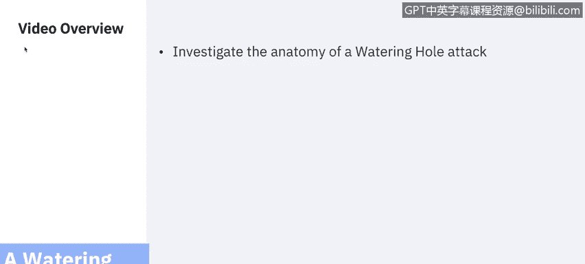
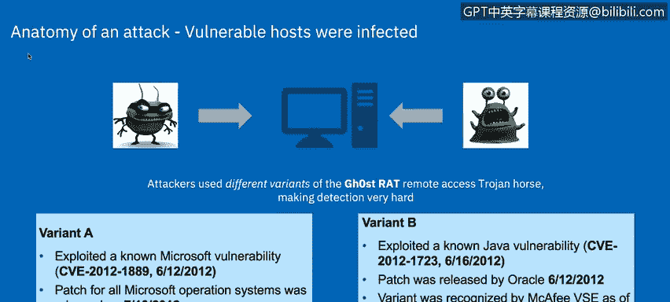
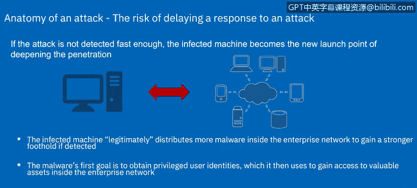
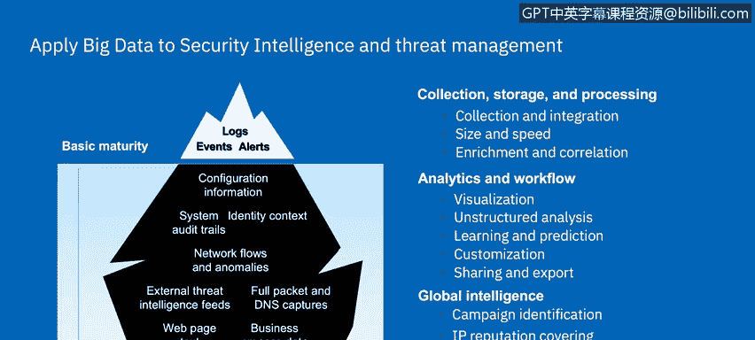
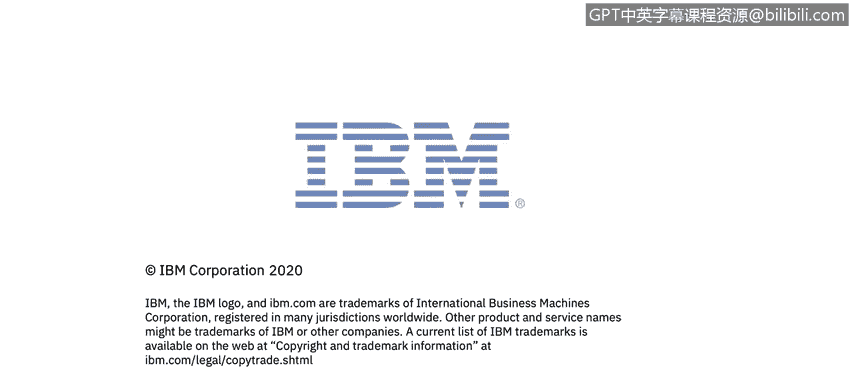

# IBM网络安全分析师专业证书课程7：《网络安全顶级项目：入侵响应案例研究》｜ibm-cybersecurity-breach-case-studies｜ - P7：6_水坑攻击.zh - GPT中英字幕课程资源 - BV1MN41167mY

Welcome to a wateringhu attack brought to you by IBM。In this video。

 you will investigate the anatomy of a wateringhu attack。

We can study a real world attack scenario to explain the following details。

 how to instigate a successful attack by infecting portable computers outside of an organization's physical network infrastructure using a wateringhu attack。

How this infected computer then spreads the malicious code and how it contacts a remote command and control server once it returns to the organization's environment。

 how the overall timeline works for the bad guys and that this type of attack can only be mitigated by correlation and collaboration or security intelligence inside an organization using a variety of detection tools across several I T disciplines。

😊，This example of a watering hull attack that took place in 2012 and was subsequently analyzed by the IBt Max Force Research team。

Fraulent malware download maybe as part of a dayPg。

 a PDF or just by visiting a website that downloads a malicious JavaScript that is not detected by antivirus software。

Next beer fishing， it lurries in people to click on something interesting。And finally。

 the network attack vectors command and control malware used unusual ports on the client's machine to communicate with remote control servers。

 The next slides look at the timeline。 the actual vulnerabilities that were involved in the malicious communication scheme occurred。

😊，In contrast to the length of the breach for a target。

 you can see from the timeline how fast and efficiently the attackers used a zero day vulnerability to infiltrate many organizations。

In July 13 through 15， several regional consumer financial services websites were hacked。

 The hackers planned a hidden eyeframe on the consumer portal。During this time frame。

 customers of the bank are redirected to a malicious download site when they visited to do their online banking。

Finally， infections were detected at several companies。

Let's look at what the vulnerable hosts were that were infected。

 Attackers used different variants of the ghost rat， Re access Trojan horse。

 making detection very hard。 What is ghost rat， ghost rat or remote access terminal is a Trojan remote access tool used on Windows platform and has been used to hack into some of the most sensitive computer networks on earth。

 Let's take a brief look at the capabilities or reach of a ghost rat。

The ghost rack can can take full control of the remote screen on the infected bot， provide real time。

 as well as offline keystroke logging can provide live feed of webcam microphone of an infected host It can download remote binaries on the infected remote host and it can take control of remote shut down a reboot of a host。

 It can also disable infected computer remote pointers and keyboard input can enter into a shell of remote infected host with full control。

 It can provide a list of all the active processes and clear all existing SSDT of all existing hooks。

 So let's talk about a little bit about the variants that we saw within this watering hole attack。😊。

Vararian A exploited a known Microsoft vulnerability and was not recognized by any antivirus vendors。

 variant B exploited a known job of vulnerability， and some patches were available。

 but not with all antivirus softwares。

In this instance， after being infected， compromise hosts may contact with a remote command and control server in China。

Infectant machines attempt to communicate with one of two Chinese command and control CNC servers。

If communications are successfully established， the CNC server gains complete real time control of a system on the protected network。

The mallware， a remote access Trojan， allows a remote attacker to access data， log system activity。

 capture key logs， take screenshots， activate the system's camera。

 and record from the system's microphone。Finally， the remote attacker can also drop additional downloads and programs on the controlled machine this is all done for further attacks。

If the attack does not detect it fast enough， the infected machine becomes the new launch point of deepening the penetration。

The following details describe how each of these attack vectors can be countered by proper measures。

The infected machine legitimately distributes more malware inside the enterprise network to gain a stronger foothold。

 if detected。Enpoint management negation， additional software gets installed on machined by remote wallware in control。

 endpoint management software should immediately detect any new software deployments。

 report them and either remove them or deny the network access。

The mallworth's first goal is to obtain privileged user identities。

 which it then uses to gain access to valuable resources inside the enterprise network。

Privileed user access。 if a machine of a privileged user is bound。

 that credential is going to open many doors for the attackers control。

 a privileged user access control system can negate the chance of any attack or gaining privileged access because those Is have to be signed out through a particular process using multifactor in authentication and other security means Another control could be if privileged user access is maliciously gained。

 a data access monitoring solution can realize that large amounts of privileged data is being accessed and a behavioral pattern that does not reflect usual routines and report on it。

Most attacks use ports and scans that typically are not executed from either the infected machines or user Is。

 We can look at network anomaly。 Un ports or scan activity is detected from I T systems that usually do not display such activity。

 Another control we can look at is the flow control systems shows traffic records involving on site and offsite I T systems and immediately logs and reports us。

 These attacks are rarely an isolated event， and the attack organization is one of out of many who are being probed by those remote command and control systems。

So one control would be public threat research， feeds the recognized I P addresses imports into a blacklist and malicious host that can be incorporated into the organization's security intelligence solution。

 Only the correlation to all these events in almost real time enables an organization to detect and hopefully stop threats before they can be exploited and cause any damage。

 Next， we will look at a summary of those challenges in a broader term。

Generally， security intelligence has focused on real time or near real time security analysis。

 but now new motivations exist for extending the role of security intelligence。 First。

 data is available to be processed。 security data will need to be persisted for longer times to detect longer running attack patterns。

 New cyber data sources have more security relevance。 Now， such as DNS。

 business application data can be correlated with security data and unstructured content。Second。

 there is a need for more advanced analytics that does not make sense to to employ in a real time environment。

 depth of analysis performed by sophisticated algorithms。

 such as regression analysis or predictive algorithms will be longer running and might offer greater security insights。

 Newer analytic behaviors on the part of security analyst need to be supported。In the next video。

 Adam will review an overview of phishing scams and I will be back later to describe the next case study。

