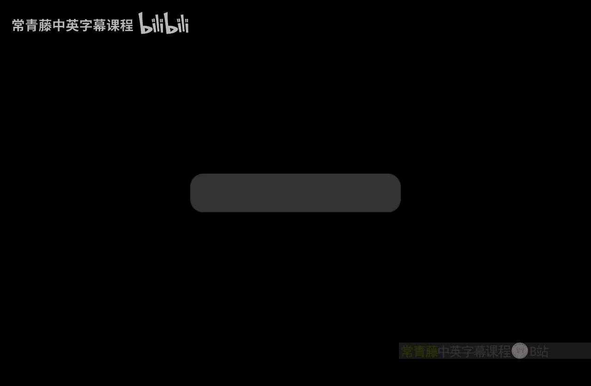
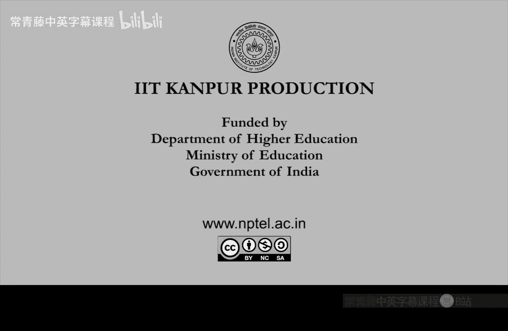

# 001：课程概述与动机

在本节课中，我们将学习计算复杂性理论的基本概念，了解其研究动机，并预览整个课程的核心内容。

## 课程概述

欢迎来到计算复杂性理论课程。本课程在印度理工学院（IIT）的课程编号为C640。这是一门中级课程，难度适中，既非基础入门，也非高级专题。它通常安排在“计算理论”课程之后。如果你已经学习过计算理论，那么本课程中的一些概念会更容易理解。否则，我会在第一周快速回顾一些基本模型，如图灵机、时间和空间等计算资源。之后，我们将开始构建新的概念和复杂性类。

## 什么是计算？

如今，我们每天都在使用计算。计算本质上是在计算机类设备上运行的一个过程。随着新设备的出现，我们对“计算机类设备”的定义也在不断变化。例如，以前的手机不被视为计算机，但如今的智能手机功能已与计算机相当。无论设备如何，在机器上运行的过程就是计算。它是一个可以解决任何可自动化问题的过程。

## 什么是复杂性？

复杂性指的是这个过程所需的资源。最常见的资源是**时间**，即解决问题需要多长时间。例如，当你打开浏览器在谷歌搜索时，谷歌需要多长时间才能给出结果？这就是时间。对于谷歌而言，除了时间，**空间**也是一个重要资源，因为算法需要多少空间决定了谷歌需要购买多少服务器。因此，时间和空间是主要的资源。

此外，计算机进行随机选择的能力也非常重要。许多实际算法确实会进行随机选择。在这种情况下，**随机性**也是一种资源。事实上，在本课程中，我们将多次提及随机性，它是一个非常重要的资源。

## 从计算理论到复杂性理论

上一门课程——计算理论——的研究动机是：**每个问题都有解决方案吗？** 这里的“解决方案”不仅指数学上的解，也指在计算设备上运行的计算过程。计算理论中并未提及时间、空间等资源。

而**复杂性理论**的研究动机是：一旦存在一个解决方案或过程，**最经济的解决方案是什么？** “经济”可以体现在时间、空间或随机比特数等方面。

## 实例分析

### 简单问题：整数加法

我们知道如何对两个n比特的整数A和B进行加法运算。从学校学到的加法算法就是一个解决方案。但它的效率如何？它快吗？

如果我们仔细实现这个加法算法，其时间复杂度大约是**O(n)**。因为算法需要扫描A和B的每一位（共2n位），每一位都必须被查看，因为即使翻转一个比特，结果也会改变。因此，时间复杂度至少是线性的。这是加法运算能达到的最快速度，我们无法做得比线性时间更快，否则就会遗漏部分输入比特。这是一个非常简单且实际的问题的例子。

### 困难问题：停机问题

另一个极端是非常困难甚至不可能解决的问题，即**不可计算问题**。对于这类问题，复杂性的问题甚至不会出现，因为问题根本没有算法，所需的资源是无限的。

一个著名的例子是**停机问题**：给定一个程序M（例如C程序），判断它是否会终止（即是否会停止运行）。这是一个不可解的问题。

为了证明一个问题是不可计算的，我们需要一个严格的计算定义。我们需要一个数学上严谨且通用的计算设备定义，以避免被不同设备的速度、架构等多样性所混淆。这就是**图灵机**模型。艾伦·图灵在1936年定义了它，为“计算”提供了数学基础。一旦我们基于图灵机定义了计算，就可以严谨地讨论复杂性。

本课程将处理在图灵机上可解的各种问题的复杂性概念。这将摆脱不同计算设备速度、计算机架构、操作系统或应用程序的差异，提供一个严谨、清晰且与架构无关的计算定义。

## 课程大纲预览

在深入图灵机定义之前，让我们快速预览一下课程大纲。课程将围绕几个核心问题展开，每个问题都引出一个重要的主题。

1.  **停机问题**：虽然这不完全是复杂性理论的内容，但我们将通过它来回顾图灵机模型的关键点，以及如何证明某些问题是不可计算的。这个证明思想将在本课程的其他定理（如**层次定理**）中再次使用。另一个例子是**希尔伯特第十问题**，即判断一个给定的丢番图方程组是否有整数解。这个问题也被证明是不可计算的。

2.  **可满足性问题**：这是计算机科学中最重要的开放问题之一。给定一个由与、或、非门组成的布尔公式φ，判断是否存在一组对变量的真值赋值，使得公式φ为真。这个问题定义了复杂性理论（乃至整个计算机科学和数学）中最重要的开放问题：**P是否等于NP？**

3.  **量化布尔公式问题**：给定一个带有量词（存在量词∃和全称量词∀）的布尔公式，判断该公式是否为真。例如，判断公式 ∃x1 ∃x2 ∀x3 φ(x1, x2, x3) 是否为真。在研究这个问题时，我们将定义新的复杂性类，并引出 **NP是否等于PSPACE** 等问题。

这些看似具体的问题，将引导我们定义**复杂性类**。当我们提出关于复杂性类的问题时，我们实际上是在询问关于**无限多问题**的性质，而不仅仅是单个问题。这正是复杂性问题的有趣之处。

## 总结

本节课我们一起学习了计算复杂性理论的基本动机。我们明确了**计算**是解决问题的过程，而**复杂性**是衡量该过程所需资源（如时间、空间、随机性）的标尺。我们从简单的加法问题出发，看到了高效算法的存在；也认识了像停机问题这样不可计算的难题。最后，我们预览了本课程将围绕SAT、QBF等核心问题展开，并引出P vs NP等重大开放性问题。在接下来的课程中，我们将首先回顾图灵机这一计算模型的基础，为后续深入学习做好准备。