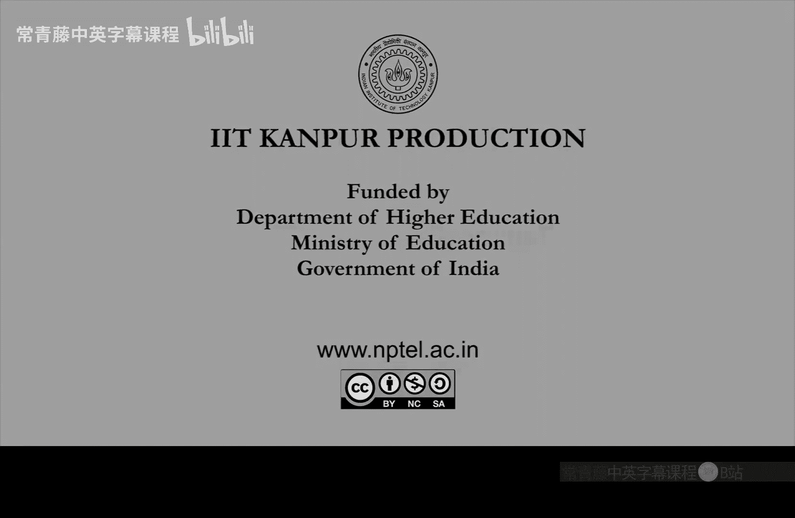

# 007：从停机问题到P与NP类

在本节课中，我们将学习计算复杂性理论的核心概念。我们将从不可计算问题出发，引入“归约”的思想，然后定义时间复杂度的概念，并最终介绍两个最重要的复杂性类：**P**（多项式时间可解问题）和**NP**（多项式时间可验证问题）。

---

## 停机问题与归约

上一节我们证明了停机问题是不可计算的，即不存在一个图灵机可以解决所有实例。这个证明技术被称为**对角化法**。

现在，我们引入一个在复杂性理论中至关重要的概念：**归约**。其基本思想是，如果你能将停机问题“归约”到另一个问题F，那么问题F也同样是不可计算的。

归约的形式化定义如下：假设你想计算函数 `f1(x)`。如果存在一个可计算函数 `F‘`，它能将输入 `x` 转换为 `F‘ (x)`，使得 `F(F‘ (x))` 的结果与 `Halt(x)`（停机问题的结果）相同，那么我们就说停机问题被归约到了问题F。这意味着，如果我们能解决问题F，那么通过这个归约过程，我们也能解决停机问题。因此，如果停机问题是不可计算的，那么问题F也必定是不可计算的。

---

## 有界资源与时间复杂度

现在，我们将从“可计算但可能耗时极长”的范畴，转向对计算**时间**和**空间**资源进行限制的研究，这将引出一系列**复杂性类**。

首先，我们定义图灵机的时间复杂度。对于一个图灵机M，我们定义其在所有长度为 `n` 的输入上运行的最大步数为 `T_M(n)`。这是一个关于输入长度 `n` 的函数。

我们通常使用**渐近分析**来理解这个函数。对于一个给定的时间函数 `T(n)`（例如 `n^2` 或 `2^n`），我们可以定义一个复杂性类 **DTIME(T(n))**。

以下是DTIME类的正式定义：
*   **DTIME(T(n))** 是所有语言（即判定问题）的集合，使得存在一个图灵机M，它能在 `O(T(n))` 的时间内判定该语言。

例如，`DTIME(n)` 包含所有可在**线性时间**内解决的问题，这类算法通常非常高效。`DTIME(n^2)` 则包含所有可在**二次时间**内解决的问题。

---

## 复杂性类 P：多项式时间

在理论计算机科学中，我们通常将**多项式时间**的算法视为“快速”或“高效”的算法，这与**指数时间**算法形成鲜明对比。

这引出了最重要的复杂性类之一：**P**（确定性多项式时间）。

以下是P类的定义：
*   **P** 是所有语言（判定问题）的集合，使得存在一个图灵机M和一个常数 `c`，使得M能在 `O(n^c)` 的时间内判定该语言。

换句话说，P类包含了所有能用多项式时间算法解决的问题。尽管在实践中，当常数 `c` 很大时（如 `n^10`），算法可能并不快，但在理论层面，多项式时间与指数时间的区分至关重要，并且P类作为一个数学抽象，成功地概括了“高效计算”的核心思想。

P类中包含了大量实际问题，例如：
*   图的连通性
*   算术运算
*   线性代数问题
*   搜索问题

---

## 实践中的难题与NP类

然而，并非所有实际问题都已知属于P类。存在一些“困难”问题，尽管它们可计算，但我们尚未发现解决它们的多项式时间算法。

以下是三个经典的难题示例：

1.  **旅行商问题**：给定一个带权完全图和一个整数k，是否存在一条访问所有顶点恰好一次并返回起点、总长度不超过k的环路？
2.  **子集和问题**：给定一个整数集合S和一个目标整数T，是否存在S的一个子集，其元素之和恰好等于T？
3.  **整数规划问题**：给定一组线性不等式，是否存在一组整数解（或布尔解）满足所有不等式？

对于这些问题，已知的最佳算法通常需要检查指数级的可能性（如所有排列、所有子集），其时间复杂度为 `O(2^n)` 或 `O(n!)`，属于**指数时间类 EXP**。

这些难题有一个共同的关键特征：虽然找到解可能很难，但**验证一个给定的候选解是否正确却相对容易**（可以在多项式时间内完成）。例如，给定一条环路，可以快速计算其总长度并与k比较；给定一个子集，可以快速求和并与T比较。

这个“高效可验证”的特性促使Cook和Levin定义了另一个核心复杂性类：**NP**（非确定性多项式时间）。

以下是NP类的定义：
*   一个语言L属于 **NP**，如果存在一个多项式时间图灵机M和一个常数 `c`，满足：对于任意输入字符串 `x`，`x` 属于L **当且仅当** 存在一个长度不超过 `|x|^c` 的“证书”字符串 `y`，使得图灵机M在输入 `(x, y)` 上能在多项式时间内接受。

这里的图灵机M扮演了**验证者**的角色，而证书 `y` 可以理解为问题的一个“解”或“证明”。NP类包含了所有其解可以在多项式时间内被验证的判定问题。

---

## 总结

本节课我们一起学习了计算复杂性理论的基础框架。我们从不可计算的停机问题出发，通过**归约**方法将问题的难度联系起来。接着，我们引入了**时间复杂度**的概念，并定义了基于确定型图灵机的复杂性类 **DTIME**。

我们重点介绍了两个核心复杂性类：
*   **P**：代表那些存在**多项式时间算法**解决的问题，被视为理论上的“高效”问题类。
*   **NP**：代表那些其解可以在**多项式时间内被验证**的问题类。许多重要的组合优化问题（如旅行商问题）都属于NP。

理解P与NP的关系——即P是否等于NP——是理论计算机科学中最深奥、最重要的未解问题之一，我们将在后续课程中继续探讨。