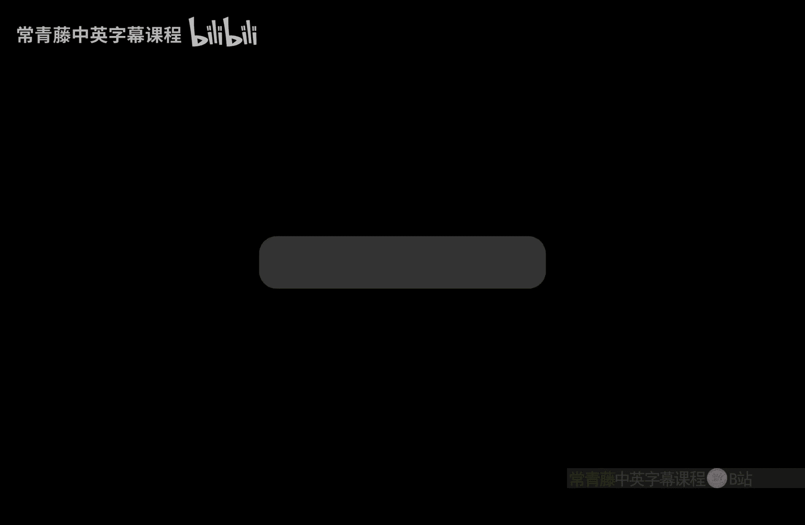
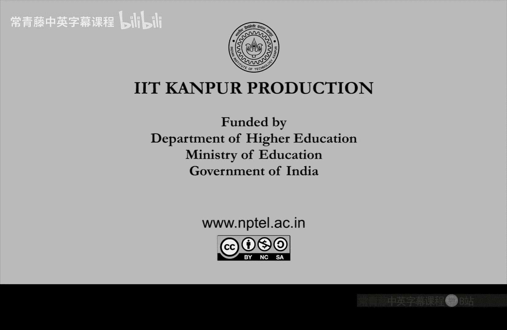

# 012：NP完全问题与coNP类

在本节课中，我们将学习如何将3-SAT问题进一步算术化，并引入一个重要的新概念：coNP复杂性类。我们将看到，即使对多项式系统求解问题施加严格的限制，它依然是NP难的。同时，我们将探讨coNP类的定义、其完全问题，以及它与NP类的关系。

## 二次方程系统求解是NP完全的

上一节我们介绍了使用线性不等式对3-SAT进行算术化。本节中，我们来看看另一种不使用不等式的算术化方法。

我们将3-SAT问题转化为一个模2的二次方程系统求解问题。具体来说，我们构造一个由二次多项式（次数为2）组成的系统S，其运算在模2（即二进制）下进行。我们只关心该系统的0/1解。问题是：系统S是否存在一个模2下的根（即满足所有方程的解）？这个问题被称为“二次方程系统求解（模2）”，它同样是NP完全的。

以下是证明思路：
*   **属于NP**：给定一个候选解（一个0/1向量），我们可以快速验证它是否满足所有方程。
*   **NP难**：我们需要证明任何3-CNF公式都可以在多项式时间内转化为一个等价的模2二次方程系统。

我们通过一个例子来展示如何将单个子句转化为二次方程。

考虑子句：`(x1 ∨ ¬x2 ∨ x3)`。我们引入一个辅助变量`z`，并构造以下两个模2二次方程：
1.  `(x1 - 1) * z = 0`
2.  `(1 - x2) * (1 - x3) * (1 - z) = 0`

**逻辑解释**：
*   方程1：要么`x1 = 1`（使子句为真），要么`z = 0`。
*   方程2：如果`z = 0`，则要求要么`x2 = 0`（使¬x2为真），要么`x3 = 1`（使x3为真）。
*   因此，原子句可满足，当且仅当这个由两个方程组成的系统有解。

对3-CNF公式中的每一个子句都进行这样的转换。最终，变量数量大约增加为原变量数加上子句数，方程数量约为子句数的两倍。这是一个多项式时间的规约。因此，模2二次方程系统求解是NP难的，结合其属于NP，所以它是NP完全的。

这个结论表明，即使是寻找非常特殊的（模2、二次）多项式系统的根，在计算上也是困难的。你可以尝试将这个证明思路推广到其他数域（如有理数域、实数域、复数域或其他有限域）上的二次方程系统求解问题，它们通常也是NP难的。

## 引入coNP复杂性类

现在，让我们从P和NP类出发，通过一个简单的操作来定义更多的复杂性类。第一个技巧是取“补”操作，我们称之为补类。

对于一个语言L，我们定义其补问题`co-L`就是L的补集。对于一个复杂性类C，我们可以将其中的所有语言的补集收集起来，定义一个新的复杂性类`co-C`，即补类。

由此，我们可以定义`coNP`类：
`coNP = { L | 补集(L) ∈ NP }`
换句话说，`coNP`包含了所有那些“补问题”属于NP的语言。

**直观理解**：
*   对于NP类，给定一个输入和一个“证书”，我们可以**高效验证**该输入是否是一个“是”实例（即属于该语言）。
*   对于coNP类，给定一个输入和一个“证书”，我们可以**高效验证**该输入是否是一个“否”实例（即不属于该语言）。

## coNP的完全问题：重言式问题

一个自然的问题是：coNP类中“最难”的问题是什么？就像3-SAT是NP完全问题一样，3-SAT的补问题自动就是coNP完全的。但我们希望有一个更自然的定义。

这个完全问题就是**重言式问题**。
*   **定义**：给定一个命题逻辑公式φ（通常表示为析取范式DNF），问φ是否是一个重言式？即，是否对于变量的所有可能赋值，φ都取值为真？

**断言**：重言式问题是coNP完全的。
1.  **属于coNP**：要验证一个公式**不是**重言式（即“否”实例），只需要给出一个使其为假的变量赋值作为证书，即可快速验证。因此，重言式问题的补问题属于NP，故重言式问题本身属于coNP。
2.  **coNP难**：我们需要证明任何coNP中的问题L都可以多项式时间规约到重言式问题。
    *   因为L ∈ coNP，所以其补集`co-L ∈ NP`。
    *   根据库克-列文定理，存在一个从`co-L`到3-SAT的多项式时间规约。即，对于输入x，我们可以构造一个3-CNF公式`ψ(x)`，使得`x ∉ L` 当且仅当 `ψ(x)` 是可满足的。
    *   那么，`x ∈ L` 当且仅当 `ψ(x)` **不可满足**。
    *   一个公式不可满足，意味着它的否定`¬ψ(x)`在所有赋值下都为真，即`¬ψ(x)`是一个重言式。
    *   因此，我们将问题L的实例x，规约到了公式`¬ψ(x)`是否为重言式的问题。这就完成了从任意coNP问题到重言式问题的规约。

## P、NP与coNP的关系

现在，我们来看一下P、NP和coNP这几个复杂性类之间的关系。以下是一些基本命题：

1.  **P = coP**：由于P类问题可以在多项式时间内直接求解，求解一个问题和求解其补问题的难度相同。
2.  **P ⊆ NP ∩ coNP**：显然，P类中的问题既属于NP（因为多项式时间解本身就是验证证书），也属于coNP。
3.  **如果 P = NP，那么 NP = coNP**：因为如果P=NP，那么coNP = coP = P = NP。
    *   其逆否命题是：**如果 NP ≠ coNP，那么 P ≠ NP**。这是证明P≠NP的一条潜在途径。
4.  **NP ∪ coNP ⊆ EXP**：NP问题和coNP问题都可以在指数时间（EXP）内通过穷举所有可能的证书来解决。

关于NP和coNP是否相等，是理论计算机科学中一个重大的未解决问题。普遍认为NP ≠ coNP，但这尚未被证明。如果NP = coNP，将会带来深刻的计算和代数意义，例如意味着存在一种高效的方法来验证一个多项式系统**没有**解（而目前我们只知道验证有解是容易的）。

---

本节课中我们一起学习了：
1.  将3-SAT算术化为模2二次方程系统，证明了后者是NP完全的。
2.  通过取补操作定义了coNP复杂性类，其特点是能高效验证“否”实例。
3.  证明了重言式问题是coNP完全问题。
4.  探讨了P、NP和coNP三类之间的基本包含关系，并指出了“NP是否等于coNP”是一个重要的开放性问题。