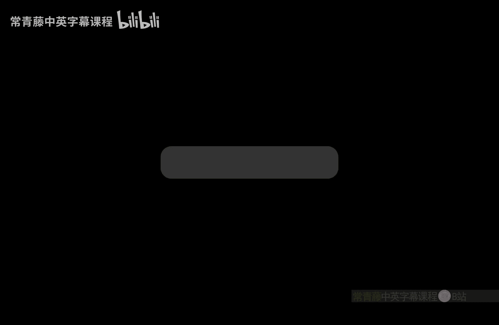

# 018：相对化与空间复杂性

在本节课中，我们将学习相对化证明技术，并探讨空间复杂性类及其关系。我们将看到，证明P不等于NP的某些方法无法通过相对化技术实现，并初步了解空间复杂性类，如L、PSPACE和NPSPACE。

## 相对化证明的完成

上一节我们介绍了通过构造预言B来区分P^B和NP^B的核心思路。本节中，我们来看看这个构造如何最终证明P不等于NP的证明不能“相对化”。

这个未确定的字符串必须存在。它确实存在。因为我们精心选择了步骤数，使其比字符串总数少1。步骤数小于字符串总数。这是简单的原因。既然步骤数小于2^{n_i}，机器M_i不可能查询所有长度为n_i的字符串。在步骤1中，总会剩下一些未被触及的字符串，它们仍然是“未确定”的。记住，最初在集合{0,1}^{n_i}中，所有字符串都是未确定的。只有步骤1在改变这个场景，在那个空间{0,1}^{n_i}中增长集合B。步骤2并不增长B。因此，在步骤3中，你总会找到一个字符串，并且你将那个未确定的字符串设为“是”（即加入B）。于是，1^{n_i}也变成了U_B的一个“是”字符串。

我们实现了什么？通过这个，我们得到了B的一个算法定义。它是一个迭代的、递归的，你可以称之为B的动态构造定义。从B等于空集开始。不变式得以保持：在第i阶段，机器M_i现在无法在2^{n_i} - 1步内解决U_B。因此，对于所有i，在第i阶段，M_i^B无法在2^{n_i} - 1步内解决U_B。在这个阶段，无论B的定义是什么，机器M_i使用预言的那部分，但无法解决U_B。这由定义的第3步确保。因为M_i^B接受了1^{n_i}，而我们从B中移除了整个{0,1}^{n_i}集合，所以1^{n_i}变成了一个“否”字符串，这意味着M_i^B与U_B不一致，并且是在这么多步内。这就是B的定义和性质。

现在，我们几乎完成了。记住我们最初想要证明的：我们想证明U_B不在P^B中。根据B的这个定义，实际上，U_B不在P^B中。这只是一个形式化的收尾，我们几乎完成了。现在，如果U_B在P^B中，我们考虑一个大的索引j。一个大的描述符j，使得M_j^B在多项式时间内判定U_B。即在n^c时间内，对于某个常数c。我的意思是，存在一个多项式时间图灵机，因为你假设U_B在P^B中。所以那个图灵机，或者说一个图灵机，有无限多个描述符。选取一个大的描述符M_j。“大”的部分稍后会说明。那么M_j^B在多项式时间内解决U_B。但这与之前蓝色的观察相矛盾。因为如果你取足够大的j，那么在那一阶段，B的定义会产生矛盾。这就是“大”的含义。所以，这与之前的观察，或者我应该说，之前的2^{n} - 1步的下界相矛盾。这里有一个图灵机在多项式时间内解决U_B，但之前我们已经证明这甚至在2^{n} - 1步内都不可能发生。这意味着M_j不可能存在。U_B不可能在P^B中。这意味着P^B不等于NP^B。因此，我们证明了存在预言B使得P^B不等于NP^B。这完成了Baker-Gill-Solovay定理。这意味着，仅通过“相对化”技术无法证明P不等于NP。它将需要更多我们目前尚不了解的关于P和NP的结构。我们通常说，P不等于NP的证明是“非相对化”的。这就是关于预言图灵机的内容，并展示了复杂性中这个主要问题（P vs NP）的一个很好的性质。

## 空间复杂性简介

现在让我们更多地讨论空间复杂性。我们能否将空间与非确定性、空间与预言等结合起来？我们还没有恰当地研究过这些。

让我为非确定性空间定义类。对于函数f，这些是语言L的集合，存在一个非确定性图灵机M，使用这么多空间来判定L。即，使用f(n)空间，其中n是输入大小。然后我们可以定义NSPACE(f)。它是非确定性版本的PSPACE。它是所有NSPACE(n^c)类的并集，对于所有c。所以那是非确定性多项式空间。一个直接的问题是，它与PSPACE相比如何？下一个定义是PSPACE。哦，这个我还没定义。我忘了。PSPACE是相对于空间n^c定义的。也许我们之前没见过空间类。PSPACE是所有多项式空间类的并集。NPSPACE是所有非确定性多项式空间类的并集。然后还有实际感兴趣的最小可能空间，即对数空间。所以L是那个类。它是SPACE(log n)。当然，根据定义，L包含在PSPACE中。这是你能想到的最小空间。这也可以说是感兴趣的最小的复杂性类。因为即使为了索引输入的一个比特，你也需要log n比特。因为表示从1到n的数字，你需要log n比特来表示它们。所以即使索引也需要这么多空间。一个基本的问题是，你能在L中解决哪些问题。

以下是例子：
*   **加法**：甚至乘法都属于L。作为练习，证明你可以仅使用对数空间将两个n位数相加。本质上，你只需要进行单次扫描，所以你只需要位置的索引，然后重用空间。
*   **乘法**：同样的事情，但这会更巧妙一些。

即使在L中也有非平凡的问题，我们稍后会看到更多。如果你将PSPACE作为P和NP的预言，会发生什么？再次，发生了一些预期的事情。P^PSPACE等于PSPACE。如果你将PSPACE作为NP的预言，你同样可以解决PSPACE。这与我们之前对类X所做的相同：如果你给P和NP一个解决X的预言，它们就变得等于X。如果你给P和NP一个PSPACE预言，P和NP就变得等于PSPACE。所以这并不令人惊讶。

稍微更有趣的命题如下。DTIME(f)也包含在SPACE(f)中。如果时间复杂性是f，空间不可能更多。因为最终，每一步都使用一些空间。如果它没有使用所有空间，那么某处存在一个循环，你可以移除它。并且SPACE(f)包含在NSPACE(f)中。并且NSPACE(f)包含在DTIME(2^{O(f)})中。让我们证明这一点。还有另一组性质。这意味着P包含在NP中。并且NP包含在PSPACE中。并且PSPACE包含在EXP中。这些是我们可以证明的简单性质。

证明这些观察所需的内容非常少，正如我所说，有一件事你需要证明：一个使用f(n)时间的图灵机，不可能使用超过f(n)的空间。因为在每一步，它都在做某事。或者换句话说，如果它使用了超过足够的空间，那么那些单元被访问过。如果那些单元被访问过，那么每访问一个单元就是一步。所以它也会超过f(n)时间。这是一个观察。所以DTIME(f)包含在SPACE(f)中。然后SPACE(f)平凡地包含在NSPACE(f)中。然后NSPACE(f)包含在DTIME(2^{O(f)})中，因为一个使用f(n)空间的图灵机最多有2^{O(f(n))}种配置。想想看，f(n)空间意味着工作带有f(n)个已使用的单元。所以对于二进制字母表，配置的数量大约是2^{O(f(n))}。事实上，即使它是非二进制的，我们也只需要这里是2^{O(f(n))}。在f(n)个单元中，配置的数量是2^{O(f(n))}，不会超过这个。这是图灵机必须处理的最大配置数。所以这是时间的上界，这意味着时间小于等于2^{O(f(n))}。这就是你如何从NSPACE(f)得到DTIME(2^{O(f)})。超过这些配置，超过这些配置意味着计算有一个循环。但然后，做一些计算并返回，然后重复那个循环，你可以移除那个循环。所以如果你看最小可能的时间，那里的配置必须是不同的。不同的配置。所以那个数以2^{O(f(n))}为上界。所以这使得空间具有指数级的时间上界。这完成了第一组包含关系序列。

第二组呢？这里也很容易。NP包含在PSPACE中，因为SAT在PSPACE中。因为人们可以在{0,1}^n空间中搜索。对于SAT，你只需要找到一个满足赋值。所以那只是一个n比特长的字符串。所以你可以一次检查一个字符串。所以它只需要n空间，不会超过这个。稍微多一点是因为你必须存储公式，但这是多项式空间。并且PSPACE包含在EXP中，因为根据我们上面展示的，这意味着PSPACE在EXP中。因为DTIME(2^{O(f)})，取并集，你会得到PSPACE在EXP中。这些是证明所有这些简单性质的思想。

## 开放问题与PSPACE完全性

有了这些复杂性类及其比较关系，我还应该在这里说明，其中许多是开放问题。当然，P是否严格包含在NP中，NP是否严格包含在PSPACE中，以及PSPACE是否严格包含在EXP中，这些都是开放问题。

带着现在研究PSPACE的目标，就像我们研究NP一样，让我们现在通过寻找在归约下最难的问题来研究PSPACE。这就是PSPACE完全性的主题。那么，一个问题何时是PSPACE完全的？语言B是PSPACE完全的，如果B必须在PSPACE中，并且对于PSPACE中的所有A，A应该在确定性多项式时间内归约到B。这是PSPACE完全性的概念。这就像NP完全性，但现在我们在PSPACE内部。但你能猜出一个实际上是PSPACE完全的问题吗？你也可以认为第二部分是PSPACE难的。B是PSPACE难的，并且B在PSPACE中，那么B是PSPACE完全的。

实际上，我们将从SAT中获得灵感。SAT有一个存在量词，这使它成为NP难的。如果我们添加许多量词，那么会发生什么？我们看到存在量词给了我们NP完全问题。那么如果我们同时使用“对所有”呢？如果我们对每个变量使用许多量词，一些存在，一些对所有，那会给你一个非常难的PSPACE难问题。这个我在课程概述中提到过，让我们在这里定义它。它被称为TQBF，真量化布尔公式。定义为：∃x1 ∀x2 ... Qxn φ(x1, ..., xn)。这个作用于一个布尔公式φ上。如果量词Qs是量词，φ是关于x的布尔公式，并且Q1 x1 ... Qn xn φ为真，则它被设为一个真量化布尔公式。这就是问题TQBF（真量化布尔公式）的定义，我们将在下一节课中研究它。

## 总结

本节课中，我们一起学习了Baker-Gill-Solovay定理，它展示了存在预言B使得P^B不等于NP^B，从而证明P不等于NP的证明不能仅通过相对化技术完成。我们还初步探讨了空间复杂性类，包括L、PSPACE和NPSPACE，了解了它们之间的基本包含关系（如 **P ⊆ NP ⊆ PSPACE ⊆ EXP**），并引入了PSPACE完全性的概念，为下一课学习具体的PSPACE完全问题（如TQBF）奠定了基础。