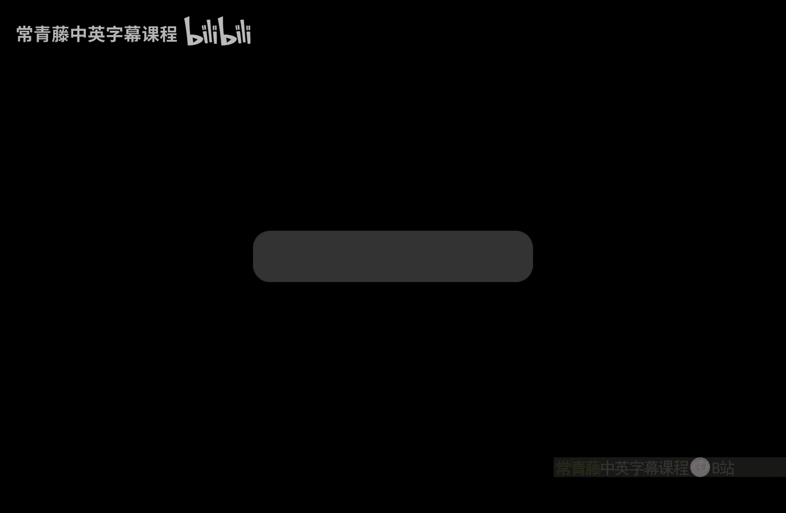
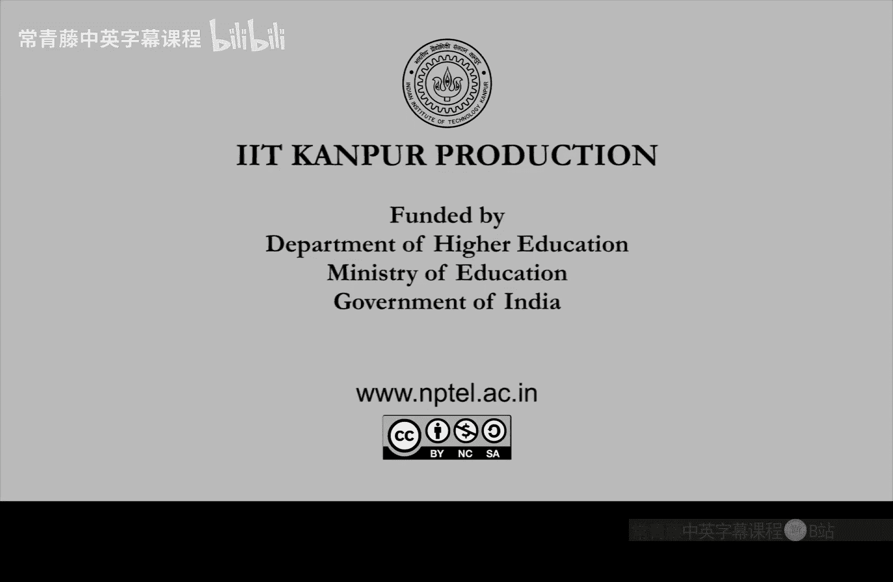

# 028：Permanent问题与#P完全性



在本节课中，我们将学习一个非平凡且有趣的#P完全问题——Permanent（积和式）。这个问题因其代数性质而引人注目，并与我们熟知的Determinant（行列式）密切相关。我们将探讨它的定义、与行列式的区别、其计算复杂性，以及它为何是#P完全的。

## 从行列式到积和式

上一节我们介绍了#P类的基本概念。本节中，我们来看看一个具体的#P完全问题。

积和式的定义灵感来源于矩阵的行列式。对于一个n×n的矩阵A，其积和式定义为：

**公式：** `Perm(A) = Σ_{σ ∈ S_n} Π_{i=1}^{n} A_{i, σ(i)}`

其中，`S_n`是集合{1, 2, ..., n}上所有排列（共n!个）的对称群。这个定义意味着，我们需要对矩阵A的每一行，选取一个不同的列（由排列σ决定），然后将这些位置的元素相乘，最后对所有可能的排列求和。

请注意它与行列式的相似性。行列式的定义是：

**公式：** `Det(A) = Σ_{σ ∈ S_n} sign(σ) * Π_{i=1}^{n} A_{i, σ(i)}`

唯一的区别在于，行列式的每一项前面有一个符号`sign(σ)`，它根据排列σ是偶排列（+1）还是奇排列（-1）来决定正负。正是这个符号的差异，使得行列式和积和式的计算复杂性截然不同。

## 计算复杂性的巨大差异

尽管定义中都包含n!项求和，但行列式有一个已知的多项式时间确定性算法（属于FP类）。这利用了行列式结构的对称性，在线性代数和工程中应用广泛。

然而，对于积和式，目前已知的唯一通用算法就是其定义本身，即需要枚举所有n!个排列，这需要指数时间。这是一个令人惊讶的数学事实：两个定义如此相似的问题，在计算复杂性上却天差地别。我们接下来将证明，积和式是#P完全的，这意味着它和#SAT问题一样，我们不相信存在多项式时间的精确算法。

## 0-1矩阵积和式属于#P

首先，我们证明0-1矩阵的积和式计算问题属于#P类。回忆一下，#P类包含那些解的数量可以在多项式时间内被非确定性图灵机验证的问题。

给定一个0-1矩阵A，其积和式`Perm(A)`等于满足`Π_{i=1}^{n} A_{i, σ(i)} = 1`的排列σ的数量。因为矩阵元素是0或1，所以乘积为1当且仅当选中的所有元素都是1。

我们可以设计一个非确定性图灵机N来验证这一点：
1.  N“猜测”一个排列σ。
2.  N在多项式时间内检查对于所有i，是否`A_{i, σ(i)} = 1`。
3.  如果所有检查都通过，则N接受这个猜测。

显然，这台非确定性图灵机N的接受路径数，正好就是使得乘积为1的排列σ的数量，即`Perm(A)`。因此，0-1矩阵的积和式计算问题属于#P。

## 积和式的图论解释

为了证明积和式是#P难的（即#P完全），我们需要一个图论视角。将n×n矩阵A视为一个有n个顶点的**加权有向图**G的邻接矩阵。顶点集为{1, 2, ..., n}，从顶点i到顶点j的边的权重就是矩阵元素`A_{ij}`。对角线元素`A_{ii}`可以看作顶点i上的一个自环。

接下来，我们定义**圈覆盖**的概念。图G的一个圈覆盖C是一个子图，它包含所有n个顶点，并且满足每个顶点的入度和出度恰好都为1。直观地说，圈覆盖就是由若干个互不相交的有向圈（包括自环形式的圈）组成的集合，它们覆盖了所有顶点。

对于一个圈覆盖C，我们定义其**权重**`w(C)`为覆盖中所有边的权重的乘积。

关键的观察是：**矩阵A的积和式等于图G所有可能的圈覆盖的权重之和**。

**公式：** `Perm(A) = Σ_{C是G的圈覆盖} w(C)`

为什么这个等式成立？思路如下：
*   在积和式的定义中，每一个排列σ都唯一对应一个圈覆盖：将σ分解成循环，每个循环就对应图中的一个有向圈。该排列项`Π A_{i, σ(i)}`的乘积，正好就是这个圈覆盖的权重。
*   反之，每一个圈覆盖也唯一对应一个排列（通过圈中顶点的映射关系），其权重就是积和式中对应项的值。

因此，这两个求和是等价的。这个图论解释是证明积和式#P完全性的核心工具。

## 实例演示

考虑一个3×3矩阵A：
```
A = [ 0,  1,  1;
      -1, 0,  1;
      -1, -1, 0 ]
```
其对应的有向图有三个顶点1, 2, 3。边及其权重为：1→2 (1), 2→1 (-1), 2→3 (1), 3→2 (-1), 1→3 (1), 3→1 (-1)。没有自环。

这个图有两个圈覆盖：
1.  顺时针圈覆盖：1→2→3→1。权重 = `A_{12} * A_{23} * A_{31} = 1 * 1 * (-1) = -1`。
2.  逆时针圈覆盖：1→3→2→1。权重 = `A_{13} * A_{32} * A_{21} = 1 * (-1) * (-1) = 1`。

根据公式，`Perm(A)` = (-1) + 1 = 0。读者可以验证，直接根据排列定义计算3! = 6项，结果也是0。

## 总结

本节课中我们一起学习了：
1.  **积和式（Permanent）**的定义：`Perm(A) = Σ_{σ} Π_{i} A_{i, σ(i)}`，它与行列式仅相差一个符号项。
2.  尽管定义相似，行列式有多项式时间算法（∈ FP），而积和式没有，且是**#P完全的**。
3.  对于**0-1矩阵**，积和式属于**#P类**，因为其值等于一个非确定性图灵机验证排列的接受路径数。
4.  积和式有一个重要的**图论解释**：将矩阵视为加权有向图的邻接矩阵，则积和式等于图中所有圈覆盖的权重之和，即`Perm(A) = Σ_{C} w(C)`。



这个图论视角是至关重要的。在下节课中，我们将利用这个视角，完成积和式是#P完全问题的证明，即展示如何将任何一个#P问题（例如#SAT）多项式归约到积和式的计算上。这将巩固积和式作为基础性难问题的地位。