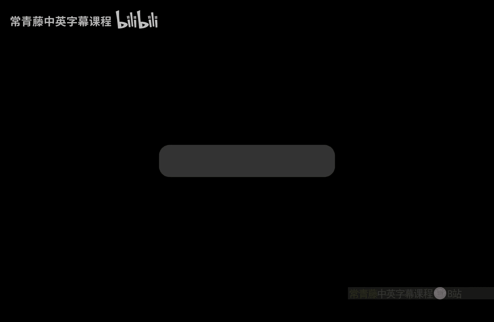
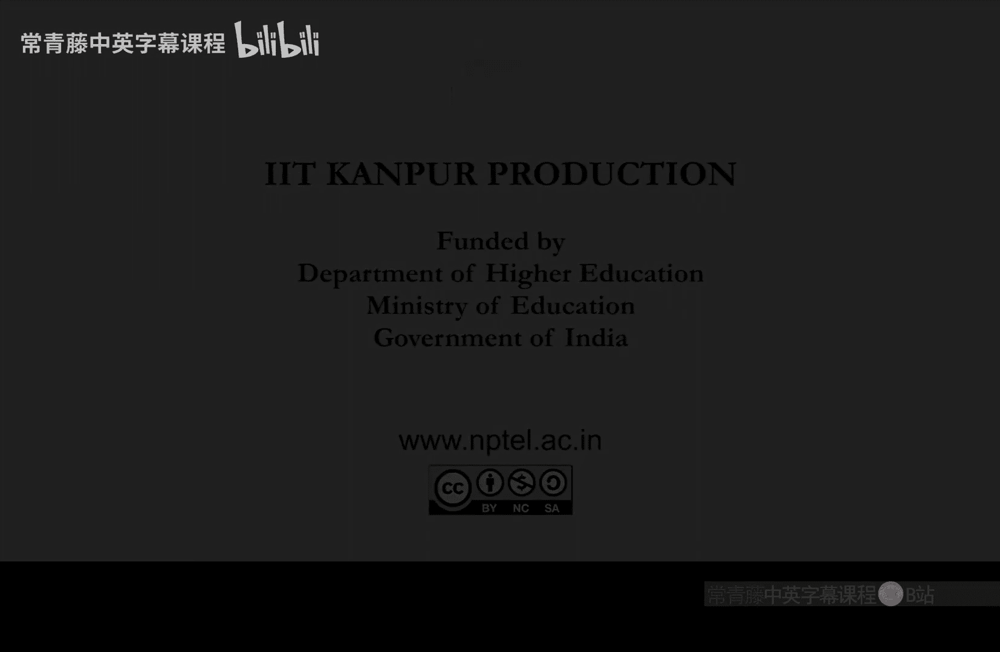

# 040：随机归约与图同构问题

在本节课中，我们将要学习随机归约的概念，并探讨一个经典问题——图同构问题。我们将看到如何利用随机化和哈希函数，将图非同构问题归约到其看似相反的问题上，从而证明它属于一个有趣的复杂性类。

## 随机归约的定义

上一节我们介绍了确定性归约。本节中，我们来看看随机归约。

我们说问题A可以随机多项式时间归约到问题B，如果存在一个随机多项式时间算法，能将问题A的输入x转换为问题B的一个输入f(x)，并且满足：
*   如果x是A的“是”实例，则f(x)是B的“是”实例的概率很高（远高于1/2）。
*   如果x是A的“否”实例，则f(x)是B的“否”实例的概率很高。

我们通常将“很高”固定为2/3，但正如之前所见，这个概率可以通过重复运行算法来放大。因此，只要概率与1/2的差距超过某个逆多项式，并且远离1（例如，1减去某个逆指数函数），就可以满足要求。

## 随机复杂性类

基于随机归约，我们可以定义一系列复杂性类。

以下是几个重要的随机复杂性类定义：

*   **BP · NP**：这是NP的随机化版本，包含了那些可以通过随机多项式时间归约到集合S的问题。
*   **BP · coNP**：这是coNP的随机化版本。
*   **BPL**：这是由概率图灵机在**对数空间**内解决，并允许**双侧错误**（即“是”和“否”实例都可能以一定概率被误判）的问题集合。
*   **RL**：这是BPL的**单侧错误**版本。对于“是”实例，机器以至少2/3的概率接受；对于“否”实例，机器总是拒绝。

可以立即证明以下包含关系：**L ⊆ RL ⊆ BPL**。其中L ⊆ RL是因为确定性对数空间算法可以看作是没有随机位的RL算法。RL ⊆ BPL则是定义上的直接包含。

一个不那么显然的事实是 **BPL ⊆ P**。其核心思想是：由于对数空间机器只能使用O(log n)个随机位，其所有可能的随机选择总数是多项式级别的。因此，一个多项式时间算法可以枚举所有可能的随机选择，计算接受路径的比例，从而确定性地模拟BPL算法。

## 图同构问题简介

现在，我们来看一个具体的问题——图同构问题。

图同构问题定义如下：给定两个图G1和G2，判断它们是否同构，即是否存在一个顶点重标号方案，使得两个图完全相同。其补问题图非同构则是判断两个图是否不同构。

关于图同构问题，我们已知：
*   **GI ∈ NP**：因为如果存在同构映射，验证者可以在给定该映射（作为证书）后，在多项式时间内验证。
*   **GNI ∈ coNP**：因为它是GI的补问题。

然而，一些关键问题仍然开放：
1.  GI 是否属于 P？（即是否存在高效确定性算法）
2.  GI 是否属于 coNP？（等价于GNI是否属于NP？）
3.  GI 是否属于 BPP？（即是否存在高效随机算法）

一个重要的突破是，Babai在2015年证明了 **GI ∈ 拟多项式时间**，即时间复杂度约为 $2^{O(\log^c n)}$，这介于多项式时间和指数时间之间，但更接近前者。

接下来，我们将证明一个稍弱但非常有趣的结果：**GNI ∈ BP · NP**。这意味着图非同构问题属于NP的随机化版本。

## 证明GNI ∈ BP · NP

我们的目标是构造一个协议，使得当两个图不同构时，存在一个简短的“证书”，使得一个随机多项式时间验证者能以高概率接受；而当它们同构时，无论提供什么证书，验证者都以高概率拒绝。

证明的核心思想是利用同构与非同构图对在“邻居”数量上的差异。

### 构造集合S

首先，我们固定顶点数n。定义集合S为所有有序对(H, π)的集合，其中：
*   H是一个n个顶点的图。
*   H与G1或G2同构。
*   π是图H的一个自同构（即H到自身的一个同构映射）。

我们记录π是为了精确计算S的大小。现在来计算|S|。

**情况1：G1与G2同构。**
此时，与G1同构的图H，也必然与G2同构。这样的图H有多少个？所有n个顶点的图共有 $2^{\binom{n}{2}}$ 个，但其中与G1同构的图的数量是：$n! / |\text{Aut}(G1)|$，这里 $n!$ 是所有可能的顶点置换，除以 $|\text{Aut}(G1)|$（G1的自同构数）是因为不同的置换可能产生相同的图。
对于每个这样的H，我们在S中存储的不是一个H，而是一个对(H, π)，其中π是H的一个自同构。H的自同构数正好等于 $|\text{Aut}(G1)|$。因此，对于每个同构类，贡献的对数为：$(n! / |\text{Aut}(G1)|) * |\text{Aut}(G1)| = n!$。
所以，**当G1与G2同构时，|S| = n!**。

**情况2：G1与G2不同构。**
此时，与G1同构的图H的集合，和与G2同构的图H的集合是**不相交**的（因为如果H同时与两者同构，则G1与G2同构，矛盾）。
与G1同构的图对(H, π)贡献了 n! 个元素。
与G2同构的图对(H, π)也贡献了 n! 个元素。
因此，**当G1与G2不同构时，|S| = 2n!**。

我们得到了一个关键的差距：非同构时集合S的大小是同构时的**两倍**。

### 利用哈希函数检测大小差异

现在的问题转化为：我们能否设计一个随机协议，来检测一个集合（此处是S）的大小是n!还是2n!？这正是BP · NP类擅长的事情。

我们使用哈希函数来压缩并探测集合大小。回忆在之前P与Parity-P的归约中使用的哈希函数族：
$h_{B, b}(x) = Bx + b \mod 2$
其中B是一个随机k×m布尔矩阵，b是一个随机k维布尔向量。它将一个m长的比特串x映射为一个k长的比特串。

哈希函数具有以下性质：对于一个固定集合S（大小为|S|）和一个随机选择的哈希函数h，考虑事件“存在某个x∈S，使得h(x)=0”（即0向量在S中有原像）。
*   该事件发生的概率 **至少** 为 $|S|/2^k - \binom{|S|}{2}/2^{2k}$。
*   该事件发生的概率 **至多** 为 $|S|/2^k$。

直观理解：每个x映射到0的概率是$1/2^k$，有|S|个元素，所以期望是$|S|/2^k$。上界由此直接可得。下界需要减去碰撞（多个x映射到0）的概率，这大约正比于$|S|^2/2^{2k}$。

### 协议设计

现在我们应用这个性质到我们的集合S。我们选择参数k，使得 $2^{k-1} < 2n! \leq 2^k$。这意味着 $2^k$ 大约是S大小上界（2n!）的两倍。

**分析：**
*   **如果G1与G2同构**，则 |S| = n!。此时，存在原像的概率上界为 $|S|/2^k \leq n! / 2^k$。由于 $2^k \geq 2n!$，我们有 $n! / 2^k \leq 1/2$。
*   **如果G1与G2不同构**，则 |S| = 2n!。此时，存在原像的概率下界为 $|S|/2^k - \binom{|S|}{2}/2^{2k}$。代入|S|=2n!，并利用 $2^k \approx 2n!$，经过计算（具体代数展开见附图），可以证明这个下界大于某个常数（例如 > 1/3）。

因此，我们得到了一个可检测的差距。

**最终的BP · NP协议如下：**
1.  验证者（Arthur）随机选择一个哈希函数 $h_{B,b}$（即随机选择矩阵B和向量b）。
2.  验证者将(B, b)发送给证明者（Merlin）。
3.  证明者需要找到一个“证据”：一个图H和一个置换π，使得(H, π) ∈ S **并且** $h(编码(H, π)) = 0$。如果找不到，则发送“失败”。
4.  验证者检查证明者发来的(H, π)是否确实满足：(a) H与G1或G2同构（这可以在NP内验证，因为同构映射可以作为证书的一部分），且(b) $h(编码(H, π)) = 0$。

**判断：**
*   如果证明者能提供有效的(H, π)，则验证者接受（认为G1和G2不同构）。
*   否则，验证者拒绝。

**正确性分析：**
*   当G1和G2**不同构**时，|S|较大，哈希函数将S中元素映射到0的概率较高。因此，**存在**一个证据(H, π)的概率很高。一个全能的证明者（Merlin）能找到它并提供给验证者，使得验证者以高概率接受。
*   当G1和G2**同构**时，|S|较小，哈希函数将S中元素映射到0的概率较低（≤1/2）。因此，**不存在**这样的证据的概率很高。无论证明者发送什么，都无法通过验证（除非他碰巧猜中一个极低概率的原像），所以验证者以高概率拒绝。

这正是一个BP · NP算法所需要的性质：对于“是”实例（GNI），存在一个多项式大小的证书，使得随机验证者高概率接受；对于“否”实例，无论什么证书，验证者都高概率拒绝。

## 总结

本节课中我们一起学习了：
1.  **随机归约**的定义，它允许归约过程有较小的错误概率。
2.  基于随机归约定义的复杂性类，如 **BP · NP**、**BPL** 和 **RL**，并了解了它们之间的一些基本包含关系。
3.  **图同构** 与 **图非同构** 问题的定义及其在复杂性理论中的地位。
4.  通过一个巧妙的构造，证明了 **GNI ∈ BP · NP**。证明的核心在于：
    *   构造一个集合S，其大小在“同构”与“非同构”两种情况下相差一倍。
    *   利用**哈希函数**的随机性质，设计一个交互协议（Merlin-Arthur协议），使验证者能够以高概率区分这两种情况，从而将图非同构问题归约到一个NP类的问题上。

这个结果是交互式证明系统早期的重要成果之一，展示了随机性和交互如何帮助验证某些看似比NP更难的问题。