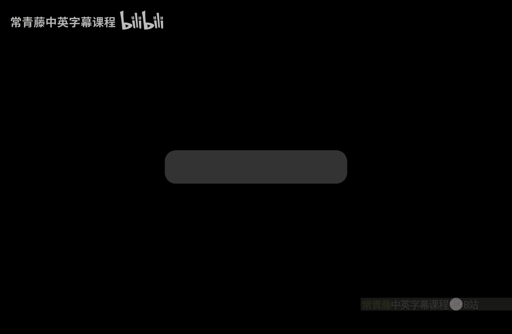

# 041：图同构问题的复杂性分析

在本节课中，我们将学习如何利用概率方法和复杂性类之间的关系，来证明图非同构问题属于 **BPP^NP** 类，并探讨图同构问题不可能是NP难问题的理论证据。

---

## 概率分析：集合大小与映射概率

上一节我们介绍了图非同构问题的核心思路。本节中，我们来看看如何通过分析集合大小与哈希映射概率的关系来构造证明。

当集合 **S** 的规模非常大时，我们希望给出概率的下界。我们希望证明这个概率是足够好的。

我们得到以下表达式：**S / (2^(2k)) * (1 - S / (2^(2k+1)))**。其中，**S** 现在是 **n! / 2^(2k)**。因此，表达式变为 **n! / 2^(2k) * (1 - n! / 2^(2k+1))**。

让我们进一步简化这个表达式。它大于等于 **2p**（根据 **p** 的定义）乘以 **(1 - 1/4)**。因为括号内减去的项 **n! / 2^(2k)** 小于等于 **1/4**。由此我们得到 **3p / 2**。

我们得出的结论是：当 **S** 较小时，概率低于 **p**；当 **S** 较大时，概率高于 **3p / 2**。这里存在一个概率间隙，概率相差超过50%。这个概率指的是：**S** 中某个元素映射到像空间中零点的概率。

这个概率间隙可以通过常规的概率放大技术进一步扩大。我们可以通过多次重复实验来放大各自的概率。

以下是放大过程的核心步骤：
*   我们使用大约 **1/p^3** 次重复实验和多个哈希函数。
*   重复多次后，统计有多少次 **S** 中的元素映射到了零点。
*   当计数大于等于 **5p/4** 次（即 **p** 和 **3p/2** 的平均值）时，我们就得到了显著的结果。

因此，最终的协议是：选取大量独立同分布的哈希函数，检查 **S** 中是否有元素映射到零点，并且这种情况是否在显著多于 **p** 次的情况下发生。当这种情况发生时，我们就有一定把握认为集合 **S** 的规模很大。

## 构建随机化证明系统

上一节我们分析了概率间隙，本节我们将利用它来构建一个完整的随机化证明系统。

当图是非同构时，这种“显著多于”的情况预期会发生。因此，当图是非同构时，这样的“证书”是存在的。这正是我们为 **GNI** 问题定义的 **MA** 类证明系统。

应用切尔诺夫边界，我们可以分别得到小于等于 **1/3** 和大于等于 **2/3** 的概率，具体取决于图对 **(G1, G2)** 是否属于 **GNI**。

*   如果图是同构的，那么集合 **S** 较小，因此在多次哈希函数中找到映射元素的概率也较小。
*   如果图是非同构的，那么集合 **S** 较大，因此概率也较大。

这样就得到了概率上的间隙。

另外需要注意，验证一个给定的 **x** 是否属于集合 **S** 可以在 **NP** 内完成。因为 **S** 的定义要求检查每个元素是否与给定的图之一同构，以及 **π** 是否是一个自同构，所有这些都可以在 **NP** 内验证。因此，这很容易是一个 **NP** 问题。

这意味着我们有一个从图非同构问题到 **BPP^NP** 的随机化多项式时间规约。这证明了 **GNI** 属于 **BPP^NP** 类。这就完成了 Goldwasser-Sipser 定理的证明：对于图非同构问题，存在一个小的证书来证明非同构性。

## 图同构问题的复杂性含义

上一节我们证明了图非同构问题属于 **BPP^NP**，本节我们来看看这对图同构问题本身的复杂性意味着什么。

我们已经证明，图非同构问题（以及图同构问题）属于 **NP ∩ coNP** 的随机化版本。认证一个同构是容易的，在随机性的假设下，认证非同构的存在也是容易的。

那么，这意味着图同构问题是容易的还是困难的？**NP ∩ coNP** 的性质暗示图同构问题不可能是“最困难”的那类问题。尽管在 Babai 提出拟多项式时间算法之前，我们并没有快速的图同构算法，但现在我们将给出理论证据，表明 **GI** 确实不是NP难问题。

如果 **GI** 是NP难的，那么多项式层级会坍缩到第二层。这是一个强有力的理论证据，表明 **GI** 不可能是NP难的，因此也不可能是NP完全的。

## 证明思路：反证法与层级坍缩

假设不成立，即假设 **GI** 是NP难的。这意味着 **GNI** 是 **coNP** 难的。核心思路是利用 **GNI ∈ BPP^NP** 这一事实，将 **Π₂** 问题转化为 **Σ₂** 问题，从而实现层级的转换。

由于 **GNI** 是 **coNP** 难的，我们可以将任何 **coNP** 实例（例如一个带有全称量词的公式）规约到 **GNI**。然后，再利用 **GNI ∈ BPP^NP**，可以将这个 **GNI** 实例随机化地转化为一个 **NP** 类型的实例，但会引入一个“对于大多数随机串”的量词。

现在的技术挑战在于，我们需要将“存在 x，对于大多数 r，存在 a ...”中的量词顺序进行翻转，将“对于大多数 r”提到最前面。如果能够做到这一点，我们就可以利用 **BPP** 包含于 **Σ₂ ∩ Π₂** 的结果，将“大多数”量词转化为“对于所有，存在”的形式，从而最终得到一个 **Π₂** 实例。

这样，我们就成功地将一个 **Σ₂** 实例转化为了一个 **Π₂** 实例。如果 **GI** 是NP难的，这种转化就意味着 **Σ₂** 和 **Π₂** 的等价，从而导致多项式层级坍缩到第二层。这构成了一个矛盾，因此原假设不成立。

我们可以将这个过程想象成一个矩阵，其中行索引是随机串 **r**，列索引是候选解 **x**。翻转量词本质上就是改变我们审视这个矩阵的视角，这将是下一讲详细讨论的内容。

---

本节课中我们一起学习了如何通过概率方法证明图非同构问题属于 **BPP^NP**，并深入探讨了这一结果如何作为图同构问题不是NP难问题的理论证据。核心在于，如果 **GI** 是NP难的，将导致多项式层级的不合理坍缩，从而反证其不可能性。