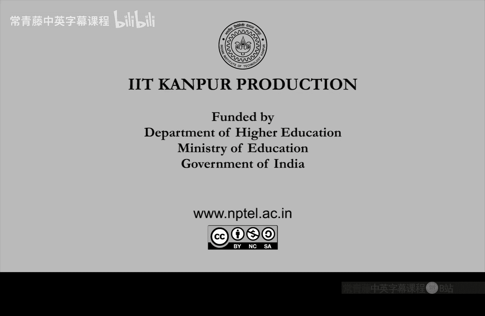

# 047：P完全问题与电路评估

在本节课中，我们将学习P完全问题的概念，并深入探讨一个关键的P完全问题——电路评估问题。我们将理解为什么这类问题被认为是“难以并行化”的，并探索电路在定义更高复杂性类别的完全问题中的作用。

---

## P完全问题的定义与意义

上一节我们介绍了P类和NC类，本节中我们来看看P完全问题的定义及其重要性。

一个语言L是P完全的，需要满足两个条件：
1.  L ∈ P。
2.  对于P类中的每一个问题A，都存在一个对数空间归约（log-space reduction），使得A ≤_L L。

P完全问题的核心意义在于其“并行化难度”。如果一个P完全问题本身属于NC类（即存在高效的并行算法），那么P类中的**每一个**问题都将拥有高效的并行算法，这意味着NC = P。然而，普遍认为NC ≠ P。因此，P完全问题不太可能被高效并行化。同理，如果P完全问题能在对数空间（L）内解决，则P = L，而这也被认为是极不可能的。

因此，P完全问题在“难以并行化”的意义上是“困难”的。

---

## 电路评估问题：一个P完全问题

理解了P完全问题的含义后，我们引入一个具体的P完全问题：电路评估问题。

电路评估问题定义如下：
*   **输入**：一个布尔电路 `C` 和一个输入字符串 `x`。
*   **问题**：判断电路 `C` 在输入 `x` 上的输出是否为1，即 `C(x) = 1` 是否成立。

直观上，要解决这个问题，必须模拟整个电路的计算过程。

我们将证明电路评估问题是P完全的。证明分为两部分：证明它属于P类，以及证明它是P困难的（即P中任何问题都可归约到它）。

### 证明电路评估 ∈ P

这部分相对简单。给定一个电路 `C` 和输入 `x`，图灵机可以按照电路的结构，从输入门开始逐层计算，最终得到输出值。由于电路大小是输入规模的多项式，这个模拟过程可以在多项式时间内完成。因此，电路评估问题确实属于P类。

### 证明电路评估是P困难的

这是证明的关键。我们需要证明，对于P类中的**任意**问题 `L`，都存在一个对数空间归约，将其转换为电路评估问题。

以下是证明思路：
1.  设 `L` 是P类中的一个问题，存在一个多项式时间图灵机 `M` 判定它。
2.  回忆**库克-莱文归约**（Cook-Levin reduction）的核心思想：图灵机 `M` 的每一步计算都可以转化为一个**常量大小**的逻辑电路（或公式）。这一步的转换只依赖于图灵机的有限状态控制和读写头位置。
3.  假设 `M` 是“ oblivious ”的（其读写头的移动模式仅依赖于输入长度 `n`，而不依赖于具体的输入内容 `x`）。这是一个可以经过标准化达成的假设。
4.  由于 `M` 在输入 `x`（|x|=n）上的运行时间是 `n^c`（c为常数），那么整个计算过程就由 `n^c` 个这样的常量电路串联而成。将这些电路连接起来，我们就得到了一个大小为 `n^c` 的**大电路** `C_M`，它精确模拟了 `M` 在**所有**长度为 `n` 的输入上的计算过程。
5.  现在，对于具体的输入 `x`，我们构造电路评估问题的实例：电路就是 `C_M`，输入就是 `x`。显然，`C_M(x) = 1` 当且仅当 `M` 接受 `x`，即 `x ∈ L`。
6.  关键点在于，这个归约过程（构造 `C_M`）只需要对数空间。归约器只需要存储当前步骤的计数器 `i`（`i` 最大为 `n^c`，其二进制表示长度为 `O(log n)`），并根据 `i` 和 `M` 的固定规则，动态生成第 `i` 步对应的那个常量电路。它不需要将整个巨大的电路 `C_M` 存储下来。

通过以上步骤，我们实现了 `L ≤_L CircuitEvaluation`。由于 `L` 是P类中任意选取的问题，这便证明了电路评估是P困难的。

结合两部分，**电路评估问题是P完全的**。

---

## 推论：电路可满足性问题

从上述讨论中，我们可以得到一个自然的推论：电路可满足性问题（Circuit SAT）。

电路可满足性问题定义如下：
*   **输入**：一个布尔电路 `C`。
*   **问题**：是否存在一个输入赋值 `x`，使得 `C(x) = 1`？

以下是关于该问题的两个事实：
1.  **Circuit SAT ∈ NP**：非确定性图灵机可以“猜测”一个赋值 `x`，然后在多项式时间内验证 `C(x)` 是否等于1。
2.  **Circuit SAT 是NP完全的**：经典的3-SAT问题可以轻易地归约到Circuit SAT（因为每个3-CNF公式本身就是一个电路）。更一般地，任何NP问题都可以通过库克-莱文归约转化为一个电路的可满足性问题。

因此，我们有两个核心的电路问题：
*   **Circuit Evaluation（电路评估）**：**P完全**，核心是**给定输入，计算输出**。
*   **Circuit SAT（电路可满足性）**：**NP完全**，核心是**是否存在一个输入，使输出为真**。

---

## 迈向更高复杂性类：简洁电路

电路的概念不仅帮助我们理解P和NP，还能自然地扩展到更高的复杂性类别，如PSPACE和PH。为此，我们需要引入“简洁电路”（Succinct Circuit）的概念。

一个电路 `C` 被称为是**简洁**的，如果存在一个多项式时间算法，使得对于给定的门索引 `i`（以二进制表示），该算法能快速输出第 `i` 个门的类型以及它与其他门的连接关系。

形式化地说，存在一个算法 `A`，对于任意门索引 `i`（|i| = n），在 `poly(n)` 时间内输出：
*   第 `i` 个门的类型（如AND, OR, NOT, INPUT）。
*   第 `i` 个门的第 `j` 个输入所连接的前驱门的索引。

**关键点**：简洁电路本身的大小（门和边的数量）可能是**指数级**的（例如 `2^(n^c)`），但我们无法直接存储它。我们只能通过高效的算法 `A` 来“按需”访问其局部结构。

基于此，我们定义**简洁电路可满足性问题**（Succinct Circuit SAT）：
*   **输入**：一个以简洁形式描述的电路 `C`（即提供访问其局部结构的算法 `A`）。
*   **问题**：这个（指数级大的）电路 `C` 是否是可满足的？

可以证明，**简洁电路可满足性问题是NEXPTIME完全的**。
*   **属于 NEXPTIME**：非确定性图灵机可以猜测一个指数长度的赋值 `x`，然后在指数时间内模拟这个巨大的电路 `C` 来验证 `C(x)=1`。由于电路是简洁的，每一步模拟（访问某个门的信息）只需要多项式时间。
*   **是 NEXPTIME困难的**：对于任何NEXPTIME中的问题 `L`，我们可以利用类似库克-莱文归约的思想，将判定 `L` 的指数时间图灵机的计算过程，转化为一个指数大小但结构描述非常简洁的电路。这个归约过程本身可以在多项式时间内完成。于是，`L` 被归约到了简洁电路可满足性问题。

---

## 总结与展望

本节课中我们一起学习了：
1.  **P完全问题**的定义及其在“并行化难度”上的重要意义。
2.  一个具体的**P完全问题——电路评估问题**，并详细分析了其证明过程，其中关键地运用了库克-莱文归约和对数空间归约的概念。
3.  作为自然推论，引入了**NP完全的电路可满足性问题**。
4.  为了研究像NEXPTIME这样的更高复杂性类，我们引入了**简洁电路**的概念，并指出**简洁电路可满足性问题是NEXPTIME完全的**。

电路为不同复杂性类别提供了统一而强大的描述框架。从P完全的电路评估，到NP完全的电路可满足性，再到NEXPTIME完全的简洁电路可满足性，这一系列问题清晰地展示了计算复杂性层次的攀升。电路的概念将继续帮助我们理解和定义更复杂的类别，如多项式层次（PH）、计数类（#P）以及多项式空间（PSPACE，其完全问题通常涉及量化的布尔公式，可视为特殊电路）。希望本课程为你打下了坚实的基础，鼓励你进一步探索计算复杂性理论的深层内容。