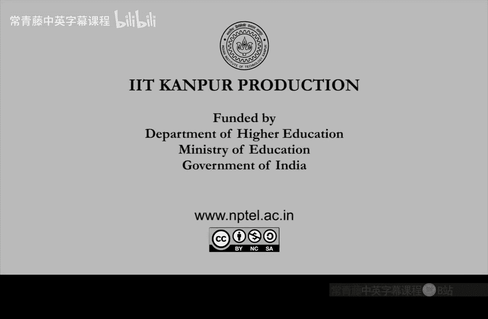
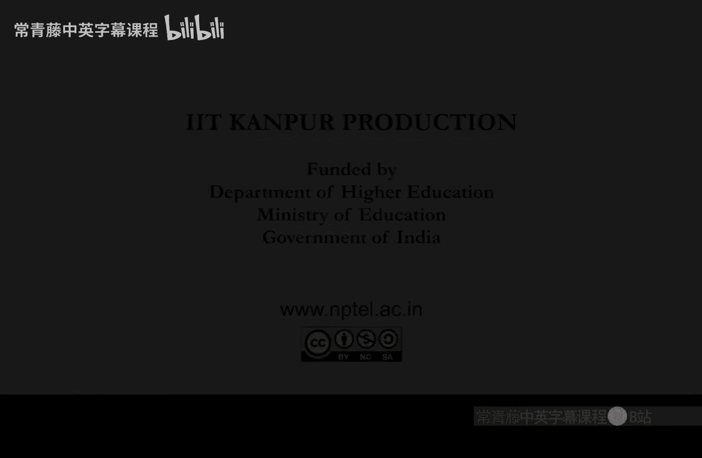

# 计算复杂性基础：1：课程概述与问题引入

在本节课中，我们将概述计算复杂性理论的核心问题，并介绍一系列关键的复杂性类别。我们将从停机问题等经典问题出发，逐步深入到公式优化、恒等测试、图可达性、矩阵积和式以及图同构等具体问题，并探讨它们所引出的P、NP、PH、BPP、L、RL、#P、IP等复杂性类别之间的关系。

## 章节概览

上一节我们介绍了课程的整体框架，本节中我们将具体了解课程将要探讨的核心问题及其对应的复杂性类别。

以下是本课程将要深入研究的八个核心问题：

1.  **停机问题与希尔伯特第十问题**：我们将在第一章探讨停机问题。希尔伯特第十问题将在第二章介绍。
2.  **P与NP问题**：这是计算复杂性理论中最核心的开放性问题之一。
3.  **P空间与NP问题**：探讨多项式空间与NP类的关系。
4.  **公式优化问题**：给定一个布尔公式Φ，判断是否存在一个更小的公式Ψ，使得Ψ与Φ逻辑等价。这里的“更小”指的是公式的**规模**更小。例如，公式 `x1 ∨ ¬x1` 可以简化为常量 `1`。这个问题引出了**多项式谱系**这一复杂性类别，并引发PH是否不同于NP和P的疑问。
5.  **恒等测试问题**：给定一个n元多项式f，判断f是否恒等于零多项式。目前已知的快速算法是**随机化**算法。这个问题引出了**BPP**类，并引发P是否等于BPP的疑问，即快速的随机化算法能否被确定性地快速去随机化。
6.  **图可达性问题**：给定一个图G和两个顶点s、t，判断是否存在从s到t的路径。问题的挑战在于要求使用极少的**计算空间**（相对于输入规模指数级小）。这个问题表明，可达性可以在**对数空间**内解决。它引出了复杂性类别**L**和**RL**（随机化对数空间），并引发L是否等于RL的疑问。
7.  **矩阵积和式问题**：对于一个n×n的矩阵A，计算其积和式。积和式的定义与行列式类似，但省略了排列的符号项。具体公式为：`Perm(A) = Σ_π Π_i A_i, π(i)`，其中π取遍所有排列。积和式在实践中非常重要，因为它本质上是计算SAT问题的**满足赋值个数**。这个问题引出了计数复杂性类别**#P**。
8.  **图同构问题**：给定两个图G1和G2，判断它们是否同构（即是否存在一个顶点重标号使得两个图完全相同）。这个问题引出了**交互式证明系统**复杂性类别**IP**，并引发IP是否等于多项式时间的疑问。需要指出的是，在2016年取得了重大突破，给出了一个**拟多项式时间**算法，时间复杂度为 `n^(O(log n))`。

## 复杂性类别关系图

以上问题引出了众多复杂性类别。以下是当前对这些类别之间关系的认知（大多数为开放性问题）：

*   **L ⊆ RL**：我们不知道它们是否相等。
*   **RL ⊆ P**：我们不知道它们是否相等。如果相等将非常令人惊讶。
*   **P ⊆ NP**：这是最著名的开放性问题。
*   **NP ⊆ PH**：我们不知道多项式谱系是否严格更大。
*   **PH ⊆ #P**：我们不知道它们是否不同。
*   **#P ⊆ IP**：我们不知道它们是否不同。但有一个著名定理表明 **IP = PSPACE**。
*   **PSPACE ⊆ EXP**：我们不知道多项式空间是否严格小于指数时间。
*   **P ⊆ BPP**：我们不知道它们是否相等，但猜想相等。
*   **P ≠ EXP**：这是我们**确知**的不等式。

总而言之，我们从多项式时间P开始，定义了越来越大的复杂性类别，但大多不能确定它们是否真正更大（只是猜想）。然而，我们最终知道，指数时间EXP确实严格大于我们出发的起点P。

## 问题的形式化

上一节我们概述了具体问题，本节中我们来看看在计算机科学中如何形式化地定义“问题”和“输入”。

对我们而言，一个“问题”总是指计算一个**函数**。该函数的输入和输出都是**有限的**二进制**字符串**。关键在于“有限性”。我们可以将其写为一个函数：`F: {0, 1}* → {0, 1}*`。这是一个将字符串映射到另一个字符串的函数，可称为多值布尔函数。

我们同样关注只输出单个比特的函数，即输出仅为0或1（是或否）。这对应**判定问题**。之前概述中的许多问题都是判定问题。更一般的函数问题通常可以转化为有意义的判定问题，这将是我们下一节课定义复杂性类别的基础。

为什么我们专注于比特？因为计算机底层电子电路用“有电流”（1）和“无电流”（0）来表示所有信息。因此，一切计算最终都需归结为对比特串的操作，并通过称为**算法**或**计算**的巧妙过程来执行。

## 课程信息与评分政策

如果你已注册本课程，评分政策如下：将有大约4次作业，占总成绩的40%；一次期中考试和一次期末考试，各占30%。课程资料可在我个人主页的“教学”栏目下找到。

本节课中我们一起学习了计算复杂性课程将要涵盖的核心问题集合、它们对应的复杂性类别以及这些类别之间已知和未知的关系。我们还形式化地定义了计算机科学中的“问题”。在接下来的课程中，我们将以此为基础，深入探索这些有趣的问题和类别。