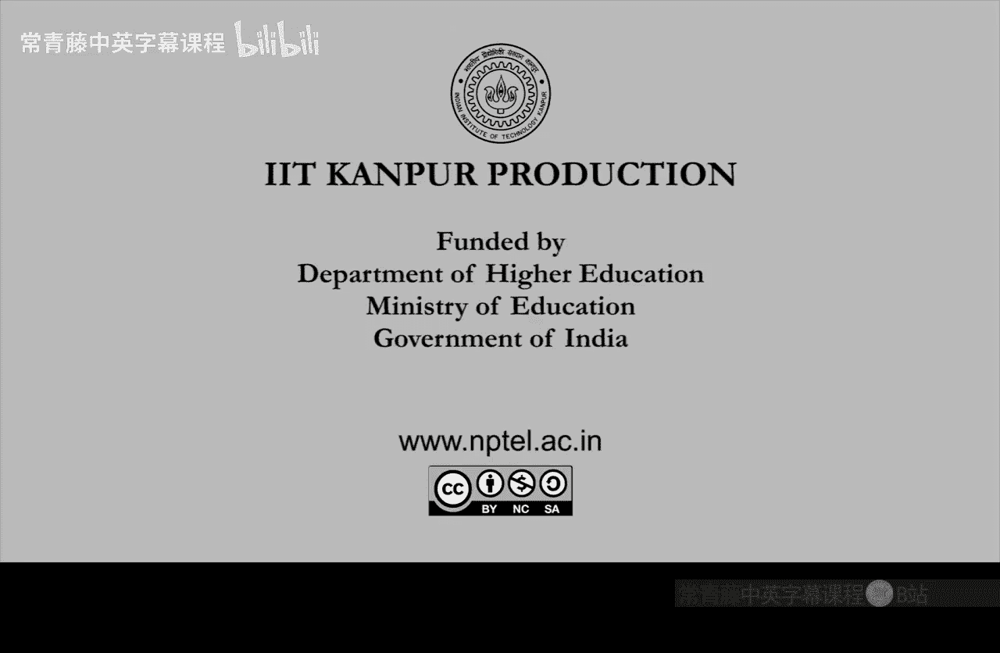

# 印度理工学院【中英⚡计算复杂性基础｜Basics of Computational Complexity】 p03 P3 -BV1LvkgBtEQN_p3-

So， last time。嗯。After the overview， we formalized。Problems。Comput problems and input to a problem。

Right， we started this。 So a problem is for us。Basically。A mathematical function。

From Boolean strings to Booleion strings。So 0，1 star to 0，1 star。And。

Bulllan strings are enough because you can encode any mathematical object as a。Bulin string。

Right integer， for example， you can express it in binary in base 2。

And since you can represent represent integer in binary， you can represent almost any other thing。

Read graph or vector or matrix or ring。And bits are good in computers because zero is like off state and one is like on state。

So this is how data is stored and processed。In hardware。At the very low level。然后嗯。

One important thing is that。Functions。Whose output is。A string。So， it's many zero ones。

Instead of that， we can also look at functions where the output is just。0 or1。 So it's a bit。So。

 those we call。Bulolean version or decision version of a problem。Right， so for the function。

 F we can come up with a G says that it maps 0，1 star to 0 or1， which is yes or no。Okay。

 so one example is。If you look at the plus operation。Right， this has。The decision version。

So you can add tool n bit numbers A and B to get a plus b， which will also be roughly n bit。

But instead of these looking at n bits you can also ask only about the I bit。So。

Its decision version can be thought of as plus comma I， which asks for。The I bit。In the summerli bee。

RightSo this is the answer is 0 or 1 only because Ih bit is just 0 or1。

And you can see easily that if you can solve plus comma I。By fast method。

 then you can also add to numbers because you can just ask for query 4 plus comma 1 plus comma 2。

A dot dot plus comma And so you can get all the ns。Right， so this will be a general strategy。

 convert functions into。Problems into decision problems， okay。

And what is good about a decision problem Well， because the what is good for us is。

A decision problem。F has an associated language。Lif。Well call it。Which is。Strings。X。Wwi。

F evaluates to one。Okay， so this will be the language。So language is nothing but a subset of strings。

And these are the yes strings。Right， with respect to this problem， F these are the yes strings。

 So you collect the yes strings and that becomes that is how we have formalized a decision problem into a language。

 which is nothing but a subset。And then you can talk about machines recognizing this language。

That will be the equivalent of。Solving the problem， if。So， again， the example is。

If you look at the plus comma I function。So， this will be。Those numbers， A and B。So。

 these will be numbers a comma b， which if you add the Ih width is 1。Okay。

 so in the sum I bit is on its one。So that is an example of how you construct a language out of。

A problem。 You first make the problem， a decision problem。

From a functional problem to decision problem， decision problem to language， so。The problems。

Computing a Boolean function， F。And decide。Or let me just say， computer boolean function。

So computer Boolean problem F。In fact， Boolean， this is just a function。And。The second problem。

 deciding language L。These are the same。you can take this also as a definition。

So computing a function， Boolean function decision problem。Or deciding the corresponding language。

 these two phrases mean the same thing。Okay， this is how we have。 We want to formalize problems。

This will this is not a very important or insightful thing， but。It helps us to。

Formalize things above problems， which are complexity classes， reductions。Okay。

 all these things that well do in computational complexity， they will be nicer to write。

If we go through this notation。So。So that is how we have formalized problems and input。

 so problems are now just languages which are just subsets of strings。And input are just strings。

Right， so yes， string will be in the language。 No string will be outside the language。

And a machine is to distinguish， which is which。So what is a machine。What does a machine do。Right。

 that's an important。Thing to formulaize。If you if you want to formalize computation at all。

So the best formalization that we know currently is。Or tu machine。Which Ill shorten STM。

So what tuuring machine M is described。By a couple。Gma。Q delta。So you already know。

 you probably already know the definition the definition of tuuring machine you have worked with also other kinds of computational models。

But for this course， I will just in the first week quickly give a recap， as I have promised。So。

Instead of going through everything， I'll just quickly talk about important things。

About this machine。So。Clearing machine M is nothing but a。Tle， which is gamma， is the。Alphabet。

Which you can assume to be 01。Using which you can form strings， Q is the set of states。

 Dlta will be the transition function。So this and two tape。You can also work with one tape。

 but for some complexity classes， in fact， only for one complexity class。

 we really need this second tape。So， this tuple corresponds to。finiteinite control。Okay。

 for those of you。Who have seen during machine， there are two parts。 There is a finite control。

 and there is an infinite tape， infinite memory。So this gamma Q delta， these are finite。

 and they represent。In fact， they signify finite control the two tapes。They signify infinite memory。

Because they will be infinite。Okay， so your computer is not a tuuring machine because computer doesn' not have infinite memory。

There is only a finite hard disk。But when you want to study a problem mathematically。

 you want the ability to。Look at all possible input。Stngs。Right。

 so you cannot the length cannot stop at any number。水。😔，If you just have 2，56 G， B hard disk。

What about 256 g， B plus one。Sized input， right mathematically。

 you should also be able to study that。So so hence， we don't restrict to finite computers。

 We restrict we actually look at。Infinite memory， although the control has to be finite。

 that is important。 Okay， so this is， this this will this seem slightly bigger than a computer。But。

At the end of the day， it will model the computer exactly。So。Yeah， so what are these。

SGmma is the alphabet， as I said。So， it contains。2 special symbols。 One is the start symbol。

This spangle。Oriented in this way， this is the start symbol。Then， there is a blank。It a square。

It doesn't matter how this looks。Yeah， you can have any start symbol or any square symbol。

 any blank symbol。And other symbols。So which you can think of as。0，1。 This will， this will suffice。

 Okay， so there are。Minimum you need is are these four symbols。In the alphabet。Then。

Q is the set of states。So states contains of minimum start。And finish。Start state。Finish state。

Or stop state。ett cea。Okay， so you， the machine has to start。With the start symbol on the tape。

And rest is all blank。Salls on the tape。And then the machine is to finish with something on the tape。

 which you can call as output。this is basically the idea in the middle。😊。

There can be hundreds and thousands of states， or there may be just one street or no state at all。

Machine may remain in start state。And then go to finish date。 That is also possible。

And machine can write alphabets on the table， erase them and so on。

So blank will be infinitely many because machine finite steps。 machine cannot really。

Go to all the cells on the tape。SoThose are the things you probably have already seen。And finally。

 Dlta is the transition function。So transition function tells you tells the machine。What to do next。

 right？ What state to move in。Soq。😔，It takes as input。The current state and the values。

That the machine is looking at on each of the tapes， so its one is from gamma。

 other is also from gamma， so gamma square。Then what state to move。And what to write， which is again。

 commma square。And where to look next。Like， so should the head go left， right。

Or should stay wherever it is。So stay or left or right。On both the tips。This is day。 This is left。

And this is。So move left， head moves one step， left one cell left or the cell on the right。

And this can happen in both the tapes。 So it's。It's squarequa。So what is the semantics of this。

Eventually。In case we have forgotten。So the tuuring machine semantics。

 you can think of it in this picture。 So the control is in。Some state。Let's say state Qs。

And there are two tape。Tieves have ss。 for st have cellss。Second tip has cells。And tipss have heads。

So， initially。In the start state， you start with the。Start symbol。

Head is looking at the start symbol， and the tape extends infinity。Infinite on the right。

So first step is called the input。Deep。Input， it can also have the output。

And the second one is called the work tape。So work tape has nothing in the beginning。

 so its says blank。Input tape has a string。And then， maybe blank starts。Okay。

 so a string in this case is just 10，1。 thats the input。

 and now the transition function will dictate what to do next Okay that this is what you can think of as the algorithm。

Which is solving。Your favorite problem。 So where to， where to move And then next， source。

 for example。Transition function may dictate to move right。 So then。Head is now reading one。Now。

 what to do when the head reads one。So transition function may say that write something on the work tape。

Okay， so then the head may go to the blank cell and write something。

So the thing is that work tape is editable。Input output tape is not。

Input output tape is only readable。Okay， you cannot edit it。Work tape you can obviously read。

 but you can also write the head can write。And this is the， this is the start configuration。He so。

In general， well use this word configuration。Which will basically mean what the control is。

At whats teeth。And what do you see on the input output tape。

 What do you see on the work tape and where are the heads。Right， that's a configuration。

 And here I depict。The start configuration。So， again， there are。2 heads。1 for each tape。And。

To see the tuing machine。Is that state Q。Input cell value I。And work cell value double blue。Den。

Delta on Q， I W。If it is equal to。Q prime， I prime。The blue prime。Epilon 1， Epsilon 2。

If the transition function dictates this， then。It means。That。In the next step。Or configuration。

State is。Move to state Q prime。Input cell value， write it。Replacease eye by eye frame。Okay。

 the work cell value to double prime。And then the heads will move according to Epsilon 1 Epsilon 2。

So， input head。Move right。Whatever appel one dictates。If it says stay， then stay left。

 then move left， right， then move right。And workhead。Which is work tape head。 This moves via。

SimilarSimilarly， Epsilon 2。Okay， so that is the。Semantics of how the machine is supposed to work。

Right control。Finite control， infinite tapes， heads。Two heads。

And the transition function coming from the control tells what。When you see something。

What should you do。Right and editable tape is only the second one。 the first one is only readable。

 so believe it or not。Every machine。Can be。Simulated like this。Okay。

 anything that that human beings can think of as a machine。Is sable in this model。

One more thing is that。Yeah， we are assuming， obviously， that no head。Move to the left of start。

Nor can it。Neither can this be erased。Okay， so the start symbol is scroan that cannot be re cannot be edited and the head cannot move behind。

 So the we are thinking of tapes only infinite in one direction。

So movement can happen back and forth， but it cannot kind of fall over。The star symbol。Okay。

This is just a notation you can also think of infinite tape both sides。

But these are simple exercises that。Model will not really change。Okay， so let us be。Concrete。

 and say that。Start symbol。You cannot go left。 You cannot erase it。Now， computation starts。

So what really is computation。Computation is just sequence of these steps dictated by the control。

 which is transition function looking at the input。So， every step。Of you。

 when you are applying the transition function that you can think of as。Timey passing。

You can think of that in fact， as one second， one step is like one second。

Or you can think of it as one billioncond。And as time passes， the steps。Keep on happening。

 And at some point。They stop。So， computation starts with。The start configuration。Which is Qs。Startt。

 start symbol。This is QS is from Gamma and start start is from。Sorry Qs is from Q thats the state。

And the gamma square part， thats both our start symbol。It starts。And then， it stops。Or holes。

At the street。Qif。😔，So when the machine reaches， when the finite control reaches Q F immediately it holds。

 Okay， there is no transition function cannot be applied after Q F。 So Q F goes to itself。

 nothing changes。So， that's the whole。Finished it。And now whatever is there on that work tape input tape。

 in fact， input output tape， that is the。You can think of it as the output， the answer。

So this is such a nice formalization。Of machine enhanced computation。That from this， you can。

Recover the definition of time。Or make sense of the definition of time， space。

And all the other resources。Okay， so what is。What are those things now。So the number of steps。Bekin。

By the tuuring machine。Is called。Time taken by Mx。To halt。

Now it is possible that machine was in infinite loop so it never stops then the time is infinity。

 Those computations are not of interest because not of our interest。

Because if your program never holds， then what's the point。Of analyzing anything。

RightSo in this course， we will assume that programs always halt so。

Time will make sense only when the program haul this algorithm or tu machine hall and then the number of steps。

To reach that point is called the time taken by M on this input X Note that as input changes。

 time is expected to change。And as the tuuring machine description M changes。Then obviously。

 everything can change， right that machine has changed。 Then obviously， time will change。

But even for a given machine based on what input you started with。Configurations change。Hence。

 time changes。The number of。Work tip cells。Used。This is called。Sppeace taken by Mx。Okay。

 so both time and space can be now defined beautifully。For this machine。And as you can see。

 it is independent of any。Actual hardware architecture。Right， everything here is。Just mathematically。

 abstractly defined。Any computer architecture， any computer， any computing device。

 even a non computer。Whatever it does。You have to remember that or you have to recognize that every step is very simple in a machine。

 right one step is simple。It's only after many， many steps that things become complicated overall。

The same thing with tuuring machine。Here， every step is simple。But yet， when it halt。

Maybe something miraculous。Has happened in the output。So that's the， that's the idea。

So one thing I should say here is that。The input output tape I said that it is only readable。

 but you you are allowed to write the output on that。So， let me write that。So， writing。In fact。

Eiting of input tape。Is disallowed。But。M can write。The output strain。我跟说。The output string。

 it can write one by one on the input tape， but nothing else。In particular。

 writing as writing on top of。A bit， a cell。So， erasing。

And then writing those things are not allowed。But the output can be gradually written incrementally written on the。

Input output tip， so。In that sense， input tape is mostly just readable。It's not an editable。

These are not editable cells。 Work tape is for that。Okay， so that is a lot of lot of definition。

 although I hope you have already seen it before。 So this is just a revision。Just a recap。呃。Anyways。

 let me。Just。Exhibit this definition。 Exemplify this definition through。Paarity computation。Su。

Let's design。Ding machine。To compute parity。off。Input string。X 1 to x， n。Right recall parity is。

Paity is just， as the name suggests， you。Sum up x1 to x。 These are bits。

And see whether the sum is odd or even if it's odd， output 1。Even output 0。Okay， so。So roughly。

 the tuuring machine has tips。So first step is read a bit of x。Now。If the bit is 0。

 then whatever parity you have computer till now， you dont have to change it。If the bit is1。

 then you have to flip it。Wai， because one plus one is。0， but 0 plus one is one。Right， so。

That's what you do。 So you just change the state。If it's one。Flip the state。elsese not。The。

 the state remains unchanged in the。Other in the zero case。🎼。

