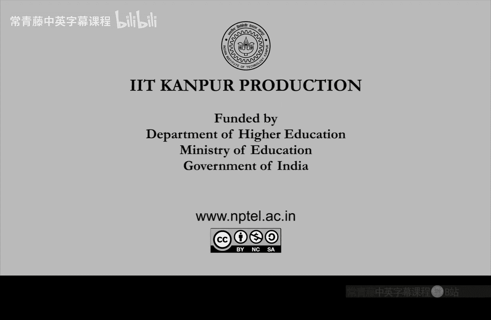

# 印度理工学院【中英⚡计算复杂性基础｜Basics of Computational Complexity】 p05 P5 -BV1LvkgBtEQN_p5-

So， we were doing。Asymptootics。Right， we have defined。Biggo， bigomega， Theta， smaller， small omega。

O till the end。Oomega till la。So this omega tilde was big omega。We goomega tilde， and similarly。

 you can also define smaller o tilde and。small omega tilder。

So points here or maybe we do some small examples first。Su。😔，If you look at the function。

N plus n square times 00。 Okay， N is the。Formal variable。Think of it as input size。

 So if you have a algorithm that has this much time。So， this weakens writers。Big of N square。Simply。

 right， because hundred is a constant factor。 we can drop it。

And then in n and n square n squared dominates。So you can actually say that the whole thing is kind of n square。

 So that is what。B go of n square。Signifies。But we can also say that this is actually。B5倍가円 square。

Right， because。It is not only。Upper bounded by a multiple of n square it is also lower bounded by a multiple of n square。

So ultimately， it's actually thehi times square。It's all three。And it's also。Sll路。

Let's say of n to the 2。01。Right， because in plus n square will be smaller then。En raised to2。Point。

Something。😔，So if you can put 0。001。0，1。1。So LHS left hand side will be strictly smaller than this right in the limit limit of the ratio is0。

 On the other hand， it is strictly bigger than。And square by login。

It n square by login is strictly smaller than n square， So n plus n000 times。

N plus n square is actually。Strictly bigger than this。 Okay， Another example is。

Which you will often see and log in。So what is n login， n login。Is upper bounded by。

Let's say this power n to the 1。01。Right， and login is is almost a linear function。 So anything。

En to the wonderfulrous eilon。That will be larger。And in fact。

 it is smaller of n to the1 plus epsilon。For any。Positive， real。Number episodeil。In the limit。

 because log n by n to the epsilon tends to 0。 that is important to remember。

 So login is exponentially smaller than。Any polynomial in in。So in general， you should remember that。

En to the sea is always smaller than。Tourist twin。For all constancy。Okay。

 polymial is always smaller than exponential。 This is what we are saying here。 This asymptootic。

You should always remember。 this is important。 is some more remarks。Suddi。😔，As。

Mention before the input output tape。Is only for writing the output strain。Okay。

 you are not allowed to do anything else on the Io tape。For all the other stuff， use the work tape。

And sometimes you may not even need to write the output。

You can also just place it on the workta if it is small enough。

 especially if it's a decision problem， Okay， a second。

Important remark is that you you know this binary search algorithm， right？So is binary search really。

Log in time。 So in terms of during machine， it cannot be。 so you can search。A name in a directory。

In login steps。In fact。Cote unquote， login steps。But。

This is actually not possible on the on the tape。Right， because on the tape。

Your head can only move one cell at a time。1 cell to the neighboring， one of the neighboring cells。

So， it cannot really jump from。One end to the bit point。Of the input okay， that jump is not possible。

 so that jump will actually already take n by two steps。So， so this login step algorithm。

 which you keep seeing in binary search， this is actually。Not in the tuuring model。Okay。

 there you assume random access。En tuuring machine does not have random access。So， it doesn't mean。

login time。Okay， this is not the time complexity in terms of tuuring machine。Why， because。

You need to assumem。Indexing。And random access。Which requires。Andd to be fixed。Or constant。Okay。

 so this actually works in directories well because directories are finite。诶。Len strings。

Diy will only have names and names are finite。呃。The trees cannot be infinite really。

 so that is why saying log in there makes sense。But and also， you have to jump。

 You have to jump from endpoint to the midpoint。And so on recursively neither of those things are possible inuring machine enduring machine。

 it will really be end steps order end steps going from end point to mid point。Moreover。

Indexing is not possible。 I mean， you cannot just number the cells and say that I directly jump to cell。

Okay， so those things actually are only possible when any is constanttrain。

And n is not constant in during machine。 this input size is assumed to be arbitrary。

At least when you， when we talk about time complexity。Okay， so this might be a。

Common confusion when you compare， when you try to do binary search in the tuuring model。

So if you in any algorithm where you need to look at。A long input。You will have to scan， scan it。

 It will be at least linear time。So once you， once we have gone through the definition of tuing machine。

 a definition of problems。Ting machine。Time complexity， asymptotics。Now， we can talk about。呃。

What can be simulated on a Ting machine。So the church during thesis， comes into。The picture。

And what does it say。So it says that everything can be simulated on a turing machine。So。

 every realizable。😔，Computing device。Okay so it could be。Transistor based。In the old days。Or now。

 silicon based。Or in the future。Dna based。Or neuron based。They are neuro cells。Or in the future。

 quantum based。Or any event for now alien technology。Everything can be simulated by。Or simulated on。

Duting machine。Okay， this is the thesis。 Obviously， you cannot prove it。You can only disprove it。And。

To date。In the last one century， it is。Never been disproved。Okay。

 so whatever computing device is invented。Or thought of。They are all simable honor during machine。

Okay， so in this sense， during machine is， is the universal machine。Can simulate anything。

So the problems which are tuing machine solves。Theyre called what。They are called comput。Decidable。

Or recursive。these terms mean the same thing。啊。And。

So a problem is computable if it can be solved on a tuuring machine by an algorithm。

And a problem is decidable or a problem is recursive。If there is a Turing machine for it。Now。

 there is another term which is slightly， which is more general than recursive。

 which is recursively innumerable。So recursively new is a more general concept。Okay。

 just I wanted to note that。That innumerable， when we say it's a different term。

So recursively there are recursivelynumer problems which may not be recursive。

 which may not have atuing machine an algorithm。Okay。

 so innumerable just means that there is a tuuring machine， which can。

Output the year strings like keep printing the year strings。

In some order all the yes strings will be printed。呃。But。That。

Somehow is not the same thing as computability。In compability you will be given and the T machine will be given an input。

And then the tuing machine has to halt and say yes or no。Year string or no string。

So I will not go into this because this is already covered in theory of computation a lot。But。Yeah。

 the most general thing you can think of is recursively innumerable。And recursive is more special。

And what is more special if which we study in this course is。Efficiently solvable problems。Okay。

 so what are the。Su。Function F， we will call。Polynomial time comput。Okay， polynomial time computable。

 not just computable， but computable how fast so polynomial time。That's the time complexity。

And obviously， you can define it as if。They exist steering machine M。For f。With time complexity。

With time complexity， T N。And T， N has to be。A poly function。Polomial name。So， end to the C。Okay。

 we see an absolute constant。What does constant term means constant means doesn not depend on n on the input size。

Okay， so that is independent of。Of the input size。 and this is what we will always mean constant。Oh。

Variable will be n input size。Because you want to study all possible inputs。

And constant will be something that doesn't change within。Okay， so C is a constant。

 it is actually a universal constant。 Think of C S 10。And the functions， which。

Have a turing machine that holds in this much time into the sea time。At most。Those functions。

Those problems are called polynomial time computer。So we will usually shorten it to poly time。

And informally， we can call these。Ting machines， efficient algorithms。So， informally。Call。😔，Such if。

Or maybe we call。Such tuing machines。Oral gardens。嗯。Efficient algorithms。Okay， so almost always。

Efficiency or efficient algorithm will mean。Tering machines。With time complexity， a polynomial。

Even if it is N to the 100。We are calling it efficient， because。As remarked before。

 N to the100 is smaller than tourist is to end。Okay， so two is to end， we call inefficient and。

And ways to see we call efficient。So， let me。Give you an exercise。So， any C program。Okay。

 you write if you are looking at a C program that is efficient。

 its time complexity is polynomial in the input size。Any efficiency C program can be written。

As in efficient during machine。And。Conversely。Any efficient tuuring machine or algorithm。

Can be converted into a C program。Efficiency program。Okay。

 so just do this simple exercise just to so that you understand the relationship between。

Actual C programs and these abstracting machines。Or mathematical tuuring machines。The I mean。

 the reason why this efficiency translates is。Or captured by tuuring machine is， is。Obviously。

 during machine steps。Each step is so simple， you can simulate it by a C program。

And so if the steps are few entering machines， steps will be few in C program execution。

For any computer program execution。Converse is true because whatever C program will do or a computer program will do during execution on an input。

嗯。It can be faithfully。Simulated by during machine steps。

So the tuuring machine will also have a few steps，Just convince yourself。How about this。

So what this means is。This is kind of。Kind of an efficient version or variant of chart during thesis。

 if you will。Get all these realistic computations， which are fast。

They are fast because the Turing machine implementations are also fast。So。So， thus。If a problem。

Is hard for tuuring machines。Then it is also hard in real life。Right。

 so that is why tuuring machines are so popular amongst。Theoreticians， because。

If we show that some problem is very hard for killinging machine， then。

It must be very hard also for it will be very hard also for。Any kind of realistic computation。嗯。Now。

 notice that churchs during thesis was a bit more general it didn't talk about efficiency。

 it only talked about computability。So。嗯。That has held true。

Efficiency part in the future it may change because for example。

 it is known that if you can design quantum computers。Then they can solve problems faster then。

Existing computers。Okay， so。So， let me just remark that。This efficient， if you will。Church。

 during thesis。Might feel。Or it it will fail。If。😔，If you build a quantum computer。This is known。

He will not do it in this course， but you can do it in quantum computation。Cses。Okay。

 so this is why this there is a problem in efficient。Version of church during thesis。

That it may not be true。That any efficient problem can be solved on real computers。

 there might be some other architect some other architectures or physical devices which may solve a problem faster。

O， for example， quantum computers could possibly solve。嗯。Let me call this mate。

So certain problems we believe are solve well faster on quantum computers than current computers。But。

Remember that this says we are only comparing efficiency， computability is trivial。

Computable the problem， whether you solve it in this much time or much bigger time。Computability。

Is not concerned about that compatibility is only concerned about。Finite thing。

So that ch string theesis stands solid。But efficient version。Is not。So powerful or so realistic。So。

Can you feed a tuuring machine。To another Turing machine， as input。Okay， which is like saying。

Can you， can a C program take another C program as input。So， of course， yes。

 because compilers do that all the time compilers take。As input right So let's do that here。

So free tu machines。To themselves。So how do we formalize that。It's not difficult。

Because during machine remember has finite control。So it's a finite string。

You give that to another tuuring machine as input。So tuuring machine has finite description。

Right alphabet state。Transition function or think of the state diagram it's so completely finite。

And by definition， it is finite。So。You can think of giving that picture to a turing machine， right？

Su。😔，We can encode it。Ass a boolean string。Okay， so there might be many ways to encode let us fix one。

So let us fix some encoding。So， for example， one option is。First， the gamma is presented in binary。

 then comma is put and then Q is presented in binary and then delta is then comma is put and then。

The transition function Dlta is put in binary。So that's a string。

And that represents a tuuring machine， and you can give this to。

Your algorithm or your tuuring machine Okay， so tuuring machine taking a Turing machine that is possible。

And for。A string alpha。We can write。M alpha。To be the tuuring machine that string alpha represents now since the encoding is fixed in some way。

 maybe not every string is a tuuring machine。Is describing a tuuring machine。 So if it doesn't。

 then you in that case， you take。The tuuring machine， M Al。To be just some trivial to machine。Su。😔。

Okay， so let me define it in two ways。 So the M L file is the tuuring machine。

That alpha encode codes。If alpha does encode。Otherwise。The tuuring machine。

Computing the zero function。If alpha。Doesn't encode。Okay， so this is a definition by two cases。

 so either alpha does encode a turing machine。Then you just use that during machine as M alpha。

M sub alpha， if alpha doesn't encode a during machine， then you take the0 during machine。So。

So yeah now strings correspond to Turing machines， and that is amazing。

RightThat any string can be seen as an algorithm。So every string is also an algorithm。Right。

 so you can think of strings as algorithms， algorithms as strings。

If you think about it when you write a C program， it is already a string right it is a string in your。

English language， for example。So just， so just that idea， but。Abstracting it mathematically。

Will be very helpful， so。No。You can。See that。Did it exists。universalivers。Ding machine。

U that on input alpha x。Sims。M alpha on x。Okay， so now。You can design a tuuring machine。Called you。

Which will take another Turing machine with its input。

And then run the cururing machine on the given input。And either hold， give answer or doesn't halt。

All that depends on what alpha was。Right。So， what is this steering machine design？So this again。

 is you can do it as a homework exercise。So you。Let me just say it's a proof idea。

 not the formal proof。Foral proof you can write down。So， you reads。The transition function。

Delta of M alpha。And decide the next step。remember that you have also has two tapes input tape on which alpha Com is written and there is a work tape so it can actually divide its own work tape into。

I mean， you can reduce。To simulate。Ts4。M alpha right so the only thing which is missing in alpha these tapes。

Which M alpha would have had？They are missing because alpha is just a finite string。

 there is no infinite memory there。But memory u has u has two tapes， in fact it has this work tape。

 so on the work tape it can simulate whatever M alpha wants to do。W， it can， in fact。

In the worst case， it can divide。Its you can divide its own work tape into an。

Input part and work tape part and whatever MLl for C is it can simulate that。So。So， do that。

As complete this proof as homeworkomic size see whether what the time complexity of U is。

Is it is it as good as M alpha， Is it much worse。And。

Just with this definition and this observation now you can show that halting problem。

Its terribly hard。So， this problem is。The following language halt， right。Let me use capital。

To avoid confusion。 So halt is the language。Consisting of strings， which are turing machines。

With inputs。TheM holds on X。And outputs a bit。Okay， so these are the as halt suggests， name suggests。

 these are tuuring machines with inputs on which they halt and give an answer。🎼。

