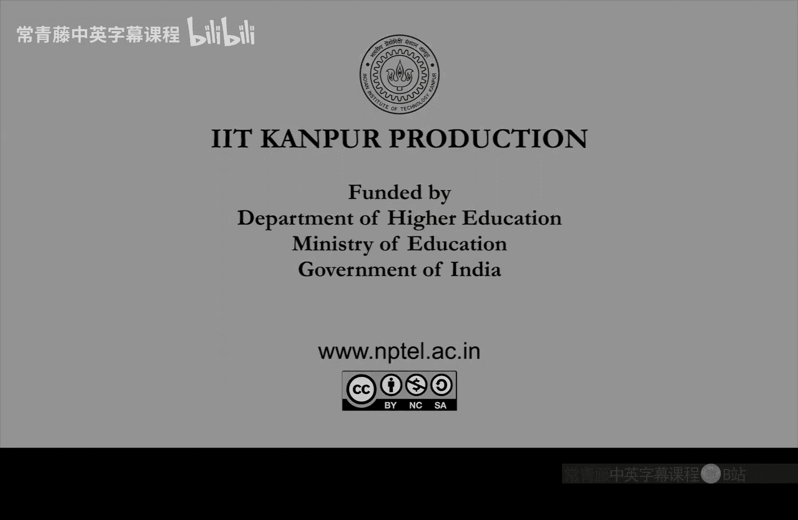

# 计算复杂性基础：P8：NP类与非确定性图灵机

在本节课中，我们将学习计算复杂性理论中的一个核心概念：**NP**类。我们将从NP的定义出发，通过例子理解它，并探讨它与P类和EXP类的关系。最后，我们将引入**非确定性图灵机**的概念，并解释NP类名称的由来。

## NP的定义与验证

上一节我们介绍了P类问题，即可以在多项式时间内解决的问题。本节中我们来看看另一类重要的问题：**NP**类问题。NP类由库克和莱文独立提出，其灵感来源于那些看似难以求解，但一旦给出一个“答案”，就很容易验证其正确性的优化问题。

NP类包含了所有满足以下条件的判定问题：存在一个多项式时间的图灵机M（称为**验证器**），对于问题的每个“是”实例x，都存在一个字符串u（称为**证书**），使得验证器M在输入(x, u)后能在多项式时间内接受。反之，如果x是“否”实例，则不存在这样的证书。

以下是定义的核心要点：
*   **验证器**：一个多项式时间的图灵机M。
*   **证书**：一个字符串u，其长度是输入x长度的多项式倍。
*   **验证过程**：对于“是”实例x，存在一个证书u，使得M(x, u)接受。

## NP问题示例

为了更具体地理解，让我们看一个NP问题的例子：**子集和问题**。

子集和问题的判定版本是：给定一个整数集合S和一个目标值T，问是否存在S的一个子集，其元素之和恰好等于T。

对于这个问题的“是”实例（S, T），一个自然的证书就是那个和为T的子集U本身。验证器M的工作非常简单：
1.  检查U是否是S的子集。
2.  计算U中所有元素的和，检查其是否等于T。

这两个检查步骤都可以在多项式时间内完成。同时，证书U的大小不会超过输入(S, T)的大小。因此，根据定义，子集和问题属于NP类。类似地，像“一-in-三 SAT”这样的问题也属于NP。

## P、NP与EXP的关系

现在，让我们将NP类放在我们已知的复杂性类中进行定位。一个重要的结论是：**P ⊆ NP ⊆ EXP**。

**P ⊆ NP** 的证明是简单的。如果一个语言L在P中，意味着存在一个多项式时间图灵机M可以直接判定它。我们可以将这个M本身看作一个验证器，并取证书u为空字符串。这样，对于“是”实例x，M(x)本身就接受了，满足NP的定义。因此，所有P类问题也都是NP类问题。

**NP ⊆ EXP** 的证明思路是**暴力搜索**。对于一个NP问题，其“是”实例x必然存在一个长度不超过|x|^c的证书u（c为常数）。最笨的算法就是枚举所有可能的证书字符串（最多有2^{|x|^c}个），对每一个候选证书，用多项式时间的验证器M进行检查。验证器M检查一个候选证书的时间是多项式时间，设为O(|x|^d)。因此，总时间开销是 `2^{O(|x|^c)} * O(|x|^d)`，这仍然是一个指数时间算法。所以，任何NP问题都可以在指数时间内解决，即NP ⊆ EXP。

## P与NP问题

虽然我们知道P ⊆ NP ⊆ EXP，但它们之间是否是真子集关系是计算机科学中著名的开放问题。

*   我们**不知道**P是否等于NP（即是否所有NP问题都能被高效解决）。普遍**猜想**是P ≠ NP。
*   我们**不知道**NP是否等于EXP。同样，猜想是NP ≠ EXP。

一个有趣的事实是，在本课程后续内容中，我们将能够证明**P ≠ EXP**，即多项式时间和指数时间确实是不同的复杂度类。这说明P和EXP之间存在巨大的鸿沟，而NP就位于这个鸿沟之中，但我们尚不清楚它更靠近P端还是EXP端。

## 非确定性图灵机

最后，我们来解释NP中“N”的含义。**N代表“非确定性”**，全称是**非确定性多项式时间**。

为什么叫这个名字？这需要引入一个新的计算模型：**非确定性图灵机**。它与我们熟悉的确定性图灵机类似，但关键区别在于**转移函数**。

*   在**确定性图灵机**中，给定当前状态和读头下的符号，转移函数**唯一确定**了下一个状态、要写的符号和读头的移动方向。
*   在**非确定性图灵机**中，给定当前配置，存在**多个**（通常我们简化为两个）可能的下一步配置。你可以将其视为转移“关系”而非“函数”。

NDTM在计算时，每一步都可以“选择”走其中一条分支。我们如何定义它的接受准则呢？

*   我们说一台NDTM **接受**输入x，当且仅当**存在至少一条**计算路径（即一系列选择序列）最终进入接受状态。
*   反之，如果**所有**可能的计算路径都最终拒绝，则NDTM **拒绝**输入x。

NDTM的时间复杂度定义为：在所有可能计算路径中，**所需的最大步数**。这是一个理论模型，并不对应现实的计算机，但它为理解NP类提供了另一个视角：**NP恰好就是那些能在非确定性图灵机上以多项式时间判定的语言集合**。验证器猜测证书并验证的过程，正对应了NDTM在多项式时间内“猜中”正确解路径的行为。

## 总结

本节课中我们一起学习了：
1.  **NP类**的正式定义：存在多项式时间验证器和短证书的判定问题集合。
2.  通过**子集和问题**的例子理解了验证过程。
3.  证明了复杂度类之间的包含关系：**P ⊆ NP ⊆ EXP**。
4.  探讨了**P与NP问题**这一核心开放性问题。
5.  引入了**非确定性图灵机**模型，并解释了NP名称的由来。

理解NP类是进入计算复杂性理论更深领域的关键一步，它为研究NP完全性等概念奠定了基础。