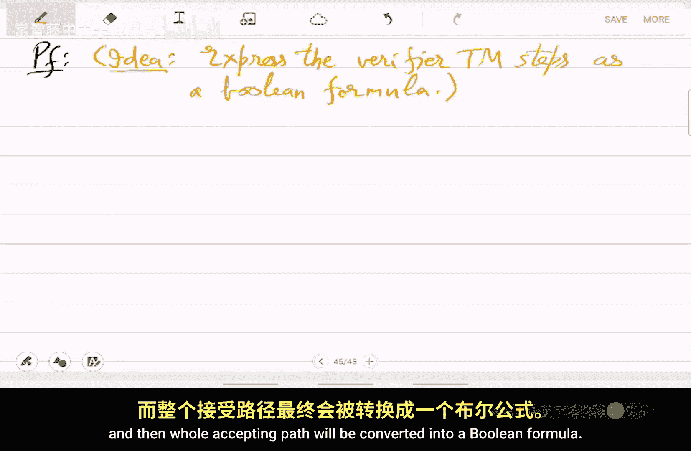
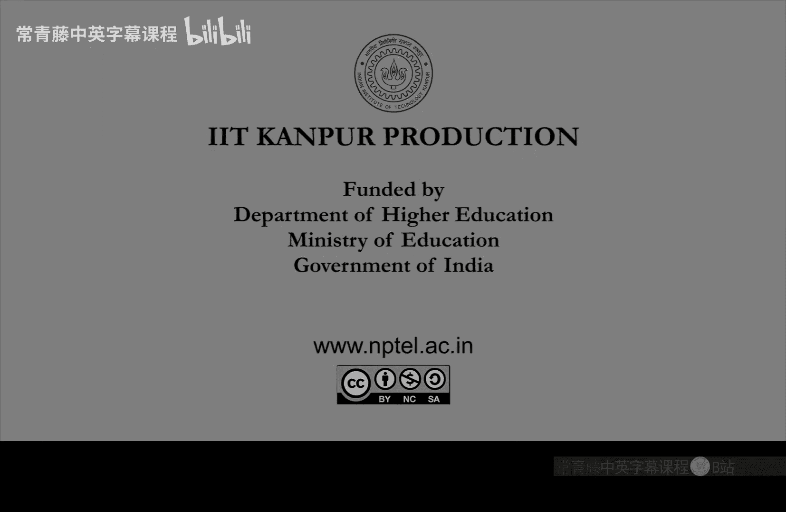

# 印度理工学院【中英⚡计算复杂性基础｜Basics of Computational Complexity】 p09 P9 -BV1LvkgBtEQN_p9-

So in the last class， we。Soaw these。Hard problems， which will be typical in this course。

So TSP subset some integer programming。These optimization problems are difficult to solve。

 They have not been solved yet efficient。Or in deterministic polyial time。

There are no practical algorithms， but if a solution is given then it can be checked。

 it can be verified。Right， so that inspired us to define NP by verification protocol or verification verifier tuuring machine。

Given a certificate。And we showed that NP is in。Ex exponential time and。

Contains polyial time algorithms。it's in the middle。So now to make more sense。

 or at least to redefine。NP in a different way， will discuss。

Non deter restrict tuuring machines where in every step。ThereThere are two possibilities to move。

Okay， the transition function is actually a relation。We simplify it。

By saying that there are two transition functions， delta 0， delta 1。

And machine can take any of these。 We don't know what choice it will make。

But we say that M accepts a string if。There is some accepting path。And it doesn't。It rejects。Input。

 if there is no accepting path， read all the parts。Reject， but number of accepting parts remember4。

T steps， the number of parts is two race to T so it is exponential in the time。

RightSo this really you cannot implement it efficiently in practice。This is a。Theoretical construct。

 entityium。So time taken by M1 x is defined as the maximum。Over。All the possible parts。Okay。

 so what is the。Longest path， which leads to hard， that is the time taken。

And this is important because to decide whether it is an ex is a no string。

 you have to go over all the parts。Su。In particular。None of the past should be infinite。Okay。

 the every parts should be finite and amongst those。What is the maximum。That's the time。So。

 as Ive already said， N DTms。Are much more abstract than the tuing machines。So in particular。

 we cannot identify。With a physical device。W a physical device， like a computer or。

Even quantum computer， we can't really identify NTM with those。Because it is kind of。

Checking all the parts。 and they are exponentially many parts。 So there is no way to。Efficiently map。

This to a physical device。I mean， if you try to map it to a physical device。

 then the time becomes exponential， it becomes a bad algorithm。ok。

So N DTms motivate the following class， complexity class。Anlogs to D time。And this will be。Gold。

En time。T of n。So those languages or decision problems that are decided by N DTM。In this much time。

P entity M M。Lindim。We go of。Right， so it's the same definition as D time except now you are using N DTM instead of team。

And the time is around P of n。 So all the parts there of length。嗯。Around your of end。

And the tuing machine is essentially going over all the parts。And。

Checking whether all of them reject。嗯。Some input string x。So。

 it is not in L or an x is put in l if x is in L if and only if。One of the parts。Excepts。

Is an accepting path in this N DTM computation and。The theorem is。

What is this end time now to do with NP right that is the question and。It， it's actually。

Another characterization of N P， so。If you take the union over all these。

Problems which are solvable in non deteromistic polynomial time。Then the union is exactly N。 Okay。

 so what this is saying again is。Any problem， which is。Efficiently verifiable。Has a fast entity。

And any N DTM。Fast in DTM。Any problem that is being solved by fast NDTM it has。It is easy to verify。

So that's what we'll do in the proof。So let L be in NP， which means there is a verifier。

Doing machine M。And the setting。So x is a yes string， if I only leaf。There is a certificate。

Which is not too big。Just。Slightly bigger than the size of the inputex。On which the verifier accepts。

That is a definition of NP via verification。By very fire， and。How do you put it in end time。

So you can think of now this verifier m as a N DTM which doesnt know the certificate。You。

 it just tries to guess it。Okay， so in every step whenever you is needed。

 it just guesses that bit of you。The guess will be either 0 or 1。And that makes。M and N D T M。Okay。

 this is a simple idea。So， define。N DTM N。As。On input x。So， n will be。In the first。

Ex to to the X to the sea， many transitions。Or steps。Delta 0 write。Aziro。And， respectively。

Delta 1 writes。Of one。on the tape。W on the work tape。So。

By either picking delta 0 or delta 101 string has been written， which is of lengthex to the c。

This is the initial。Part of computation of n。On inputex。

And then it will use this string as a certificate you。Okay。

 it will pretend as if this is a certificate。And it will do the computation of X comma U。Based on M。

So in the first these many steps， delta 0 delta 1 writes on the work tape。😔，And moves right。So。

 after n has written。This x to the sea bit string。Doub blue。It simulates。A on x， W。Okay。

 so now simulation happens and whatever is the result， it is outputted by n as the answer。

 so clearly。If。X is in L。Then， at a certificate。W， and will accept。Otherwise， and reject。

For all the blue。For all the blue guest。Right， because。

There is no certificate so whatever guess n is making in the beginning initial part。It will fail。

 and M will keep rejecting x commander blue。 That was guaranteed by definition of。Ein p。

So this means that we have shown L to B。Solvable by a non determinedmin by an NDTM in how much time？

So initially， there was this end to the sea。Many steps to find， to guess the blue。And then on that。

 it was。Ento the day time。We enter the D。嗯。Time is4。Simulating。Amon， X blue。

Right so that finishes the part that NP is contained in union of n time NP is contained in some n time n to the c now the converse converse means that we will take L in n time into the c and show that L is in。

NP。So， conversely。Let L be in。End time N to the C prime。With the N DTM n。Of time complexity。

Less than n the C。Okay， so。Remember time complexity is around into the c prime right so instead of saying around into the c prime I am just fixing it to be into the c。

Something just smaller than into the sea。So that is the time complexity for an ND team to solve this language L。

Now you want to show El in N。Right， so you have to give a very。Vifying during machine。

Duringuring machine that can verify certificate。So that turing machine will actually be。Just in。

And what is the certificate， the certificate is which。Part to take。

What choices to make Dlta 0 delta 1。In the steps， so that。It accepts。Given input。So， define verifier。

Duringing machine M。That on input X。And。String you。Does what。Just what。And the also simulate n on x。

Using the transition。Given by。You， for each step。Right， so n will require this。Information。

 what choice to make because it's an N DTm。Those choices will be given by you。

Or you will be used for those choices。 And so。

That makes an deterterministic tuuring machine， it is fast。And。If there is a way。For n to accept。

If there is a certificate you then it will accept。 So this means that。L is， in fact， in N P。Right。

 it's ultimately what we have shown。We have shown all together， that NP p。

Is equal to union of N time and to the sea。Right that is what we started with in the claim every problem in N is in some n time enter the C。

 every problem in n time n the C。Is in N P。RightSo which means that N DTM is a perfect way to。

Characterize。Problems that are easy to verify。And maybe hard to solve。Read all these examples we saw。

 they were quite hard。Okay， so， so that completes definition of NP and the discussion。Via it。

And D teams now， let me。Let us focus on a single problem in NP。Which is very important。

And that's called satisfiability。Su。😔，So now we present a problem。That is。The hardest。In all of MP。

Okay， so we will focus on one problem that actually every problem in N。Reduces to。

So if you solve this one problem， it' is called satAT。

Then you will solve all the other problems in NP and by solving we I of course， mean。

Practical algorithm。Okay， and formally deterministic polynomial time algorithm。

So we in the course overview， we have discussed this， let us now formalize。It's called sat。

It contains Boolean formulas。Fhi is。A boan formula。In CNNf。CNF is conjunctive normal form。

 So it is basically。Andollf。Cluses where each clauses and or of。Variables。

And the variables can be either the original one like x or negation of that negation x not x。

So they are called literal。 So it's a。Conjuction of disjunction of literature， so。

The key thing here is satisfiable。Fi is a satisfiable。Bulion formula in CNNF。And the CF is。

Conjunction of disjunction of litorals。conjunctive， normal form。It is called。So。So， that is。

Formula 5hi。Actually， is given by。So， in fact， let me also mention the variables。

He is given as and off。All of。Literals or variables。P Hs。Where。The this VIJ is in。

Ex1 to extend or their negations。And this is called a lital。Okay， and。This is a C F。Forula。

And this thing in bracket or of VIjs， this is called a clause。So， it's a conjunction of。Cls。And。

Let's see a simple example。Okay， let me also mention what is。Satisfiability， if you have forgotten。

So far is called satisfiable。If there is an X。In 0，1 star。Or n variables。 So N。0ero1 values。

 you can also think of it as false true。Such that。5hi U next is one。

So so satisfiable just means that the formula becomes one or formula becomes true。If this happens。

 then。We say that fire is testisfiable， otherwise it is unsatisfiable。

 or you can also say that otherwise fire falses。Okay， just， it is just a contradiction。

So example for example， x1 or x1 bar。X2 bar， let's say。Disclo with。The second clause x1 bar。Okay。

 this is， is it satisfiable or not？嗯。So you have to set x1 to be false。

 otherwise second clause will not be true。And even after setting it falses， the first clause。

 you can set x2 to falses and first clause becomes true。So this is actually satisfiable。

 it since sat。While if you take x1 and x1 complement。Now。Whether you try  one or 0。

 one of the clauses will remain 0 and it's a conjunction so you will get。Zero。

 so this is not satisfiable， and you can see clearly y because。It actually hides a contradiction。

It' is saying x1 is true and also its complement is true and this is indeed the only way。

To have an unsatisfiable。Formula there is a contradiction inside。 So first lema we show。

Easy observation。About sight。Is that Sa is an N。W because given a formula and an assignment。

 you can check whether it's satisfying or not。So， except Form fire。If I only leave。They exist in x。

Says that phi x is1。So that is what the verifier will do。And if you want。

 you can think of this as you also。That's the certificate。So this is easy to verify。

Byeruring machine。And this is the certificate。So basically the certificate and the verifier certificate is just the assignment。

Aerger assignment and verifier is just the one that algorithm that will substitute in Phi and evaluate the value since this is just a formula you can easily calculate the value。

Bioering machine by an algorithm。 So now comes the。Hardness part， right， So this is saying that。

SAT has a verifier and hence it also has an N DTM。But we now prove something much stronger。

 will show that。Every problem in N。Can be reduced to set。So， let。LBN NPP problem。Then， L。

Can be reduced to set。In deterministic poly time。Which means that。Which means that there exists。

A polytime reduction algorithm。 let's say， during machine n。Such that。For all inputs。X is an L。

 if an only。Inex is in。So that's the reduction。N is the tuuring machine that reduces。Original input。

 which was you wanted to check with the Excel gest string of L。It will N will transform that string。

 but O efficiently。Into another string， and that will become a boolean formula。

Which is satisfiable if and only leaf x was a yes string。Okay， so what what lemma 2 is claiming。

Is that this n exists？We have to build this algorithm。That can transform any input。Of a。

Easy to verifiable problem well。Into a boolean formula。Right， how will you do that？

 That seems impossible。 How do you convert。Arbitrary inputs to boolean formulas like you we suppose you were given a graph or a number。

How do you convert it into。呃。These and are not gates。

So the way we will do this is we'll use the verifier of L。That's the idea。The idea is。

Express the verifier algorithm。V fire during machine steps。As a boolean formula。Okay。

 so this will be a translation。It will translate every step。Into let's say。

 a clause and then whole accepting path will be converteding into a Boolean formula。

So， the boolean formula being satisfiable。Will actually mean that there is a certificate that existed。

For x and L。Okay， so the when you are translating steps into Boolean formula。

 the unknown values are these。Guess is the freedom that。

And DTM had or the verifying algorithm needed the U。The certificate， so if it exists。

 then the company they live an accepting path。If it doesn't exist， all parts are rejecting。

That's the idea。So， let's do that。Let's implement this idea。So S L is in and P。

There exists of poly time。Douting machine M。Which we keep calling verifier。Such that。

X is a yes string， if you only leaf。There is a certificate。That M accepts。That M1 x U is one。😔，So。

 say， M takes。Les than T steps。To halt。So tea is the time complexity that we are talking about。

M is the gain verifier use the certificate Tse the time complexity。And L was the original problem。

Which means that there are t max atmost T configurations are there for the Tring machine。Execution。

So， with each configuration。Ci。😔，We associate。A bunch of variables。Right。

 so configuration is has to store。Everything there is。

It's a snapshot of the Teaing machine execution， right？So in particular， what is the state。

What is there on the。Input where is the input tape head， where is the work tape head。嗯。

What is the work tape。stringing。Yeah， so that exactly defines a configuration so let us。Write that。

So a bunch of variables is state。😔，Had position。Of the two tape。

P prime and PR basically pointers where the head is。What is there on the input tape。

What is there on the work tape。So this is the state variable。This is the head position。On input。Dip。

😔，Head position。On work tape。That's P of C。This is the input tape string。

Remember this input tape has it is infinite， but it has only finitely many。Filld。Clls， right。

 the others are blank。So blank， we don't care。And this is the work tapepe string。

So that is a configuration and these values will keep changing。Step by step。

But we will use the transition function。So we have to encode whether every step is correct。

 it is following the transition function。So， final formula。For the execution of the verifier。

am on inputex comm U。Looks like。The start configuration C1。

Should look as the definition of during machine demands。Then， a computation。

Sequence of steps from configuration C 1 to C 2。 So this will break further。

I'm just only giving the top view for now。And then， stop。With configuration C2 accepting。X comma U。

 right， except configuration。So now let us look at the details。

