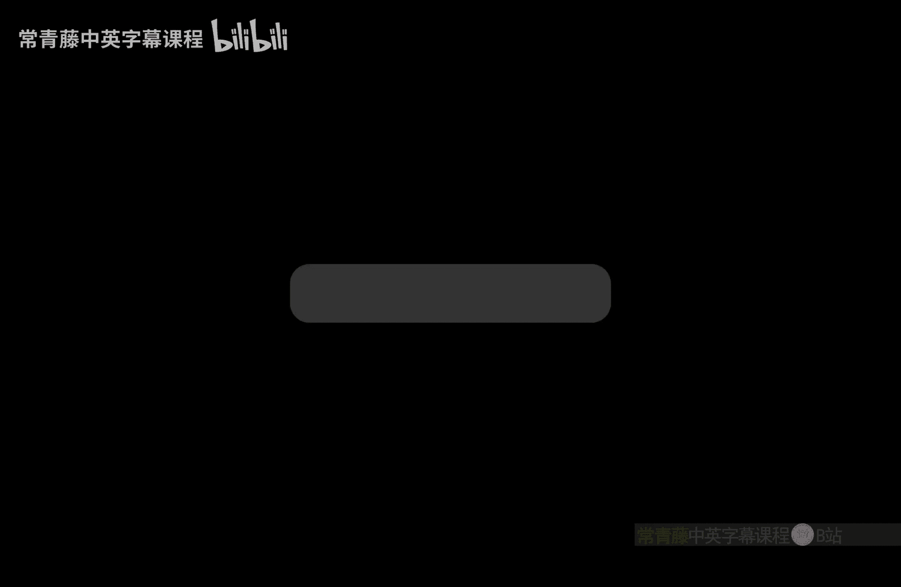
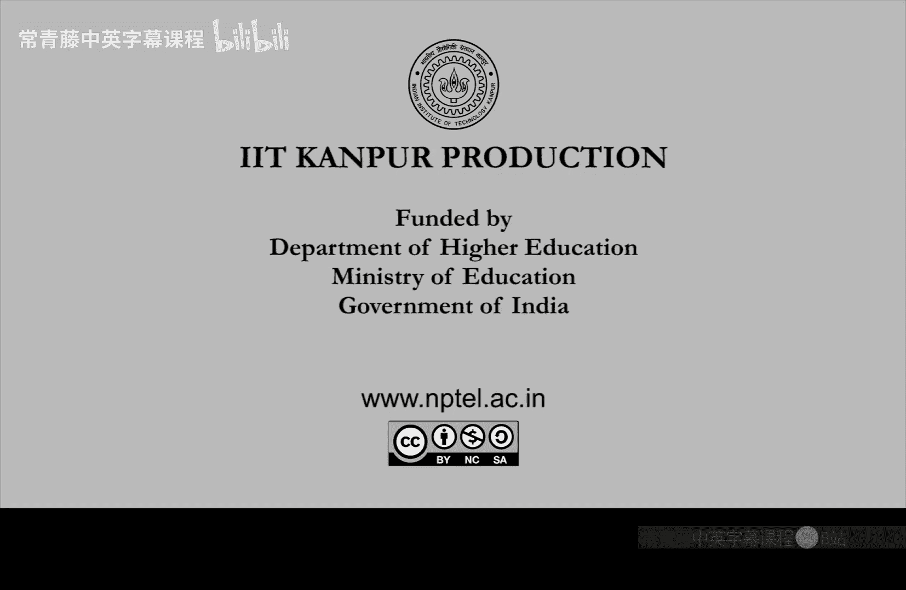

# 印度理工学院【中英⚡计算复杂性基础｜Basics of Computational Complexity】 p11 P11 -BV1LvkgBtEQN_p11-

So， last time we started。Satisfiability。Studying the sizeisfiability problem。

So it was easy to see that S is in N because。A satisfiable formula can be easily verified。

 because if you are given。An assignment。But the harder thing is that any problem in N it can be efficiently reduced too。

The question of sat， So take a problem L in n。And will show why it can be written as a。

Buling formula。So the idea was that you take the tuuring machine that is。

Or the NdTium that is solving L。You think of it as a verifier。During machine aim is a verifier。

 which is looking for a certificate you or which is given a certificate you， it will check whether。

U certifies x via this verifying to machine name。So。

U is something which you should think of as formal variables， unknown， the unknowns。

X is the known variable。 and in terms of U will get a。Buling formula。Which， in the end， we call。Oh。

Okay， we haven't reached the end。 but so the formula will basically be capturing how one configuration changes to the next via the transition function。

Okay， so configuration is a set of variables as many as。

The cells used on the tapes input tape work tape。 So it basically captures this a0 prime to a prime t minus1 and。

E 0280 -1。And， of course， the state and the。Head position。Right， and we saw that。First。

 we break it into the start configuration。Compute steps。 and stop configuration。

Start and stop for easy。Compute， we further break it down into。Steps， right， assuming。Time T。

 there will be T steps。So here is the the description of compute going from C 12。C 2。

R7 was the stock configuration。 C2 was the stock configuration。And。Essentially。

 it boils down to checking。Whether C 3 to C 4 configuration follows transition I。

Of the transition function， delta。And that we can capture。

The only point here was that while capturing this。One needs this k prime and k which are the head positions。

So what are the head positions， how will you find out the head position in the middle of the computation。

So that for that， we actually assume the tuuring machine to be oblivious。So that。The advocate kidss。

A step。Or it the Iot step。Where the head is that will be predetermined independent of x。Okay。

 this can be assumed。I as a function， the head position as a function of I， this can be assumed。

You don't need to know x or U U anyway is unknown。But even x is not needed for that。

Just the length of x will be needed。So this will be an assignment problem。

How do you convert a tuing machine into oblivious tuing machine。And with that。

Since K is known as a function of i， so this step I can be。Easily written as a。嗯。

As an end of equal and equal you convert into。And or not。So it's a boolean formula in the end。Okay。

 so。Next。Is 05。Whi is。So the formula that we obtained， what did we call it。Did we call it anything。

So in the end， we get the formula。5hi x， u。And the properties。That phi。Xu。Is satisfiable。

Satisfiable with respect to you， right， so you can fix u to be 01 string。If and only。

Use a certificate and hence the tu machine accepts and hence5 x U is true。Which will happen when。

If and only leave。X is yes， right。 Only X is a yes string。 there will be a。Certificate。

So we write that in the middle。Iffinly。There exist certificate to you。

Which will happen if you only leave。X is in it。So this input string， yes。

 will will be a yes string if and only if the formula is satisfiable。And。

What is the size of this formula。It's not a big formula， right， in terms of P， you can see that。

What we have done is essentially， we have these T steps。Step I， and。Within step again。

 there are these。At most。T comparisons happening。 So it's T square。Order T squared。Okay。

 so this now finishes the proof。Thus。We have reduced， efficiently reduced。L to set。And we write it。

L less than equal to。Set。P referring to the polynomial time reduction that we just gave。

So any problem in N。It reduces to。Set。And that is what we。Promise to prove。Okay。And in fact。

 we can make this cF。This formula fire that we constructed， we can make it even more special。

The C formula。Phi can be reduced to another formula。Can be simplified。Dusai。😔，Which is。

 which has clauses with only three litals。Such that。Si is satisfiable。If you leave。

Phi is satisfiable。Okay， so。In general， the CF， you can always convert into。CN f Phi。

 you can always convert to c f Pi， which has。Only three litals in each clause。 This is called a3 cF。

So what's the proof of this claim。So a clause， which has， let's say。4 litals。

 we can break it up into more clauses， each having three literals。By introducing a new variable。So。

 idea is convert。A close with。Greater than three litals。读。嗯。More clothess。Yiing。3 lits。

We need a new variable for this。 So let's just。See this in in an example， and that will suffice。So。

 let's take P to be。X1。X2 bar。X 3， x 4 bar。You can convert it to。Saai。

Where you look at the first two， essentially。And the last two。Okay， so you use x 1 x2 bar。

With a new variable Z。And then。Use that compliment。Right， so you can see that these two are equal。So。

 just check。That Phi andsi are indeed the same。Okay， because。嗯。If both these clauses are true。

 it sits an and right， so both these clauses are true。 So if both are true， you suppose that is 0。

Then it means that X1 x2 bar parties has to be true。And if that is one。

Then it implies that x3 x4 bar part has to be true。We have broken it into two cases。

 It's basically a case analysis。So， in this way。Any close。In k laterrals。Has an equivalent3 cF。Right。

 so this3 cF is as mentioned before conjunction of clauses。

Conjuction ofju thesejunctions where each clause has only three litals。And。

The result that you get now。Out of this。Is that three set。What is three set it is now。

Collection of satisfiable 3 CF。So far such that。Fhi is a satisfiable。3 cF formula。So， three set is。

As heard。Sect。Right， so， so that is where we are。That if you are given in the input。

Conjunction of disjunctions where disjunctions are only on three litals。

And the question is whether it's satisfiable or not。Then that is as hard as the whole of NP。Okay。

 three set NP complete。So here one question that you should do as an exercise。What about two set。And。

What about special cases of three set。Okay， so two set will have only two litals in every clause。

And you may also look at settings between two set and three set so you can come up with such。

Special cases and see whether three set can be further。Simplified。Okay。

 so a hint is that two set is actually in polynomial time。Okay， but they are。

They M might still be interesting things between two set and three set。That you can come up with。

So let us now formalize this reduction that we just did。So， language E。Is polytime car producible。

Dbi。To a language B。If there exists a poly time during machine M。Such that。X。The question。

The x is in a is a yes string。Of E or not。This question machine M will transform x to M of x。Inbi。

Okay， so polytime car producible means that that input you can transform efficiently into a different string。

Which then corresponds to yes string of the N H if only。 Okay， this is。

 this is a very strong type of reduction， equivalence between A and B。And this is what we define as。

E reduces in a strong way。So polytime car producible。To big。So B is called NP heardd。If。嗯。

Every problem in N P reduces to be。Great， this is the term you must have heard。嗯。Before。

Whether whether a problem is NP hard or not or just whether a problem is hard or not。

 so generally what is meant is that it is so hard， be so hard that if you solve it。

 then you solve every problem in。En p。In this way， by using a car production。

Poly time car production reduction is， is there。Okay， so strings are kind of。Mapping。From A to B。

And finally， N completeness means that B itself is in N。The bes called。And be complete。If。

Bes and P hard。And it's in N P。Okay， so it's both。NP hard and in N， then you call it N complete。

So the problem is complete for N。And we can， again， rephrase what we have。Just proved。

As the following theem。Due to cook and living。That three set and be completelete。Right。

 so this was shown half a century。Ago， exactly half a century ago that three set is a problem。

 which is n complete。And still now， what we don't know is。Whether we can solve it in polynomial time。

Right so conjecture is that MP complete means that you cannot solve it in polyial time。But。

 there is no proof。Though this completeness result， we have just shown。So， we have shown。

That for every language in N P。E reduces， too。Polytime car producible to three set。And also。

3 set itself is an MP。There is no doubt because， again， this three set is just a formula。

So when given an assignment， you can verify it and it trivial。There is a verifier。

 so3 set is both in NP and it is NP hard。Swes。Bound to B N P complete。So， reductions actually。

Are very important in computer science。 we use use them all the time。

They are also important in mathematics， but。Somehow it is not formalized as such。

 but in computer science， we formalize it and we use it all the time。

Releions can also be thought of as calling a program subroutine。

So you produce your problem and solve it somewhere else。That basically is the programming idea。

Consistent this reduction is consistent with that programming idea。So。

 some easy properties of reductions。So if a reduces to B。Reduces to sea。Then， E reduces to C。Right。

 this transitivity is。It follows from the definition， because。Whatever we you will convert x in a to。

Let's say M1 x in B and then convert that to M2 of M1 of x in c。To take composition， And you have。

But from A to C。A reduction from A to C。So， E is N P hard。And A is in P。

So what does this mean if an NP hard problem you have found an algorithm。

 then you have shown every problem in NP is easy。So you have shown that p is equal to N p。

And if you have shown P equal to NP， then。Then any problem in P can be thought of as。And be heard。

Right， so actually， these two things are equivalent。It's if only。So he is in Pihar， and。

E reduces to B。Then what。What can you do。So NP hard problem if you are reducing it to B then B must be harder。

T， so be is then at least 10。So that is the sense in which we think of。

NP hard NP complete problems as the hardest。So N P complete problems。Are the hardest。In N p。

Right because to whichever problem you will reduce it to。That problem will also become。NP hard。

If it is an idea too， so basically this third point is how we can read it like this。

The N complete problems are the hardest every problem reduces to them。

And if they're reduced to something， then。Again， by proposition1。Of。

Your new problem also becomes NP complete。So three side SA and three set are kind of the canonical。

Examples of N complete problems。 What are the other examples， Are there other examples。

 Natural examples。So， other examples are。Which we， which I mentioned in the overview of the course first lecture that traveling salesperson。

Subet some。Or sub sum。Integer programming。These are all n P complete。Okay。

 so these are some practical problems， which are。Dont to be N complete how do you show them N complete first you see that they are in NP that is easy。

Next， you have to reduce from3 set。To TSP to subs to integer programming。Okay。

 so every reduction you have to work hard。Reductions may not be very easy。두감 봐。

So we will not do all these reductions in this course。 we'll do some simple ones。

But you can read of the literature， these reductions。It's not important for this course。

Because there are actually hundreds and thousands of MP complete problems known。So， hundreds of。

NP complete。Have been studied。Lixi。😔，So MPP complete problems may be infinitely many， but。

There are hundreds， which are actually。Easy to pose。The so called natural problems。

And people have shown reductions。 They have given proofs that three side reduces to。All of these。

So let let us do one simple reduction。So。Lets show， let us show that。In digital programming。

Is N P complete。Let's see the proof sketch。So we have already shown that it' is in NP。

Let's restrict to。Bolean solutions。That is Xs is between 0 and 1。

So if you restrict to this just 01 solutions。By introducing these inequalities。

 it' is clear that it will be an NP。Because if there is a bullying solution。

 somebody gives it to you。 you can verify it。And。Now， the NP hardness part。This will need more work。

So in P hardness part， we will。start with a3 c nF， Let 5hi be 3 cF。So， let's convert。Each clause。

To an inequality。Okay， let's do that。So， for example， if the clause is。X 1 or x2 bar， or x 3。

Then you can write it as。So first of all， we want x1。X 2， x 3 to be between 01。

That is the first thing we want because we want to identify exercises false and true。Next。呃。

We want to make sure that x1 or 1 minus x 2 or x3 one of these is。At least one of these is one。

So we just write that down。This is。Btter than equal to one。Okay， that's the。

 that's the in the system。Integer programming system that we have written。Notice that x1。

1 minus x2 and x3， all of them cannot be 0。In other words， x1， x2 bar x3。

 all of them cannot be false because if that happens， then you will get1 less than equal to 0。

So this inequality actually is implying that the clause is true and you do this for every clause。

Every clause is giving a new inequality。So， that's the proof。So， this implies that。3 set。

Reduces to integer programming。And integer programming with just。With bullolean。嗯。Points。Bullion。

And just。3 variables。3 variables per inequality。It so it's very， very special。

You are not even using the full power of integer programming。

 You are just using integer programs that have。That are only looking at 01 solutions。

 boolean feasible solution points， and each inequality has at most three variables。Already， this is。

NP complete。 So since the special case of Nger programming is NP complete general cases also。

So this conversion， which which we did from boolean clauses to arithmetic。

This is naturally called arithmeticization。From Boin。😔，CNF 2。Algebraic polymial。

This is called arithmeization。You can also call it Lgization。

So this arithticization or algebraization is。We are basically making the。

Original combinatorial question。We are bringing it into arithmetic or algebra。

So you saw this linear system， we can also get higher degree systems。

Which we'll get in the next example。

