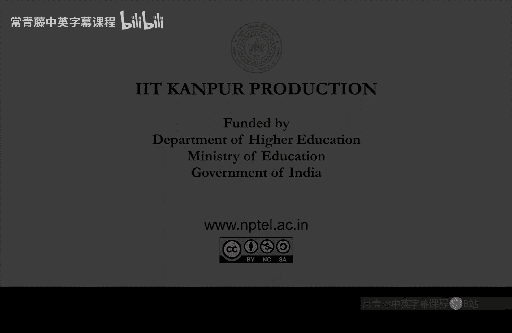

# 印度理工学院【中英⚡计算复杂性基础｜Basics of Computational Complexity】 p15 P15 -BV1LvkgBtEQN_p15-

So the theorem， this is the third hierarchy theorem we are doing。

So it says that if g is a function bigger than F。Okay， asymptotically bigger， so g by f tends to 0。

Oh sorry， F by g tends to0 G by F tends to infinity。Then。The non deteristic time。FN problems。

 They are smaller than。Those of G and function。So the idea is that。

But the problem in using just vanilla diagonization like we have been doing before。

For time and space hierarchtherians， the here， the problem is that。Nigation of an NDTM output。

Is difficult， because。Remember。😔，Accepting path， you only need one。But when you negate it。

 then you have to check all the parts， whether they are reject or not。Right。

 so that simulation you cannot again do by an NtM。Or at least it is not known how to do it。

It seems to be harder than。呃。The yes instances。Su。So instead。

 what we will do is something called lazy diagonization。So what will happen here is。

When we negate the output of an N DT M。Will simulate it by your deteristic duringing machine。

And this is only possible when the non domestic bits are very， very few。Okay， so。Sil。

Then only navigate the output of an entity where the input size is very， very small。

So let's see how this is done。 This is a bit more。Complicated， than， earlier proofs。

So we find a function S it says that G ofs is bigger than。Two is to G on the previous value of s。

Okay， so you can think of this as。Power of two。So， S I。Is like a tower of tools。Of itos。Okay。

 so this is something like very roughly speaking， it is tourists to tourist to tourists to soon on。

It's I2s tower of lengthhi。So， use this function is。To define the。Not domestic duringing machine。

 So let's do that next。So， define。N DTM D。Such that on input x。What it does is。It will only work on。

Unity。Inputs。Okay， or when the input has a0， then it will output 0。It will reject the string。

And when the input string X is only a string of ones。Then it will do something more complicated。

 Okay， so we are actually looking at a unary。Ened him。So if x is not one star。X has 0。Then， simply。

 output 0。Okay so this is a no string。So x is now in this case， this is the L case。 So x is。Unity。

X is 1 to the n。Now， let us see。Upper and lower bounds of n。In terms of S。Okay， so C S I。

And S I plus 1。N is in that range。Therell be a unique eye like this， right。

So this eye will be unique。So find that I， and then。In this case。Similulate。The tuuring machine。

Described by I。1，1 to the n plus one。Okay， so this is a weird thing。

This eye is a Turing machine descriptor。If it is not， then just output 0， that is not very important。

So this I we are assuming it to be。During machine descriptor。And。In fact。

 it' is an N DTM descriptor non deter during machine descriptor。Okay， so the Turing machine。

 non domestic tuuring machine， which is described by I。

The number I use that description and simulate。It on the input  one to the n plus one。

 which is one length longer than。X。4 G steps。Right，5 g in steps。 that should be clear。

 because we want。Kind of a diagonization argument。 So we will construct this language B。

Why are the N DTM D。Which is in end time Gn， but not in end time Fn。Right。

 so we can only afford this much time。So simulated for Gn steps。

And whatever happens is your output right either1 to the n plus1 is accepted or rejected or the tuuring machine doesn' not hold。

Or MI I is not even a turing machine。 So in those cases， you just output and finally step 3。

If x is unary and。It's on one corner。Okay， it's not in the interval a I to a I plus one。

 but is actually equal to。S of I plus when it's in the image office this。So when that happens。

 that is the only possible case left。So when this happens， this is the place where you。呃。

Similulate and ne。Okay， till now we haven't ned anything。But to go out of end time effort。

 now we will negate。So that will be output 1。If and we leave。What happens， this descriptor I。

And D team， M I。On one race， too。1 plus S I。Rejects。Yun。G O1 plus S I。Sts。Okay， so here we have。

We have， we are actually simulating。Remember，1 is1 to the n is the input here you are we are simulating the previous one。

 which is a c plus one。V or1 plus S。And whatever is the answer we are。If it rejects。

 we save output 1， if it accepts， then we output 0。

And steps that we can afford is again just G of that。

 We cannot afford more steps because we want to remain in n time G。Right。

 so this is the best we can do now。One exercise that you have to。Sool。😔，Is that。N DTM simulator。

In step 2 here。Can be done in linear time。Okay， which is unlike。

Deterministic during machine simulation。So deterministic tuuring machine simulation by the universal tuuring machine。

We have seen trivially it doable in t square quadratic time。In the assignment one。

 you have to do it in T lock T time。That's the best known。However。

 N DTM simulation only takes auto tea time。Okay， so this is because。Yeah。

 do this formally as an exercise， but。Intuitively， why they should be true is because。

While this universal tuuring machine is simulating an N DTM。It doesn't have to go back and forth。

In the work tape。From the beginning to the end。 So instead of jumping to the end， it can just guess。

What bit is there on the left or on the right。Okay， so whatever it wants to read， which is far away。

 it can actually。Just guess it and ultimately verify it at the end of the computation。

 So based on that idea， this is actually doable in linear time。 what this means is。So， step 2 is in。

En time， geon。Okay， that should be clear。 input was1 to the n in step 2。

And you just have to simulate an N DTM up to GN。Steps， So n time G N is the。Complexity。

That's one observation。 What about step 3， So step 1 was。Trivial， that's not a problem。 step 2。

W this NDTM simulation， this is fast。And step 3， what happens is。嗯。This is about rejection。Right。😔。

So this you cannot simulate by an N DTM。Efficiiently， you have to。Actually， look at all the branches。

 but how many branches are there。 So deterministic simulation takes。Takes time。

All the branches will be。Two race2 G。1 plus S I。It takes this much time。And two is2 g1 plus SI。

 we have assumedd。By the construction of S， that its less than equal， to。S， I plus1。

Which is less than equal to G of S I plus 1。And。What was the input in step 3。

 it was1 to the s of I plus  one。 So this is just G N。But so step 3 is also in end time G。So。

 what we have deduced is。D decides。A language， L。Which is in end time G N。

Right so that means around half of our work is done。 we have actually designed。Language。

Which is an n time G of n and it doesn' not look like it will be n time f of n because we have。

This diagonization idea， hidden in step 3。Right， so let us just verify that。So， suppose。And DTM M。

Dcides。L in time。C of FN。Which is equal to small of G。It constant multiple of FO n。That's n time F。

So， suppose。L is an N time fn， which means that there is a N DTM M。Deciding ill。Much faster。

 K and C times F n。Non deteristic time complexity。So。

 so we want to get a contradiction using now step 3。So。

 we will basically use a descriptor this i in step 3 will use a descriptor for M。

And it should be large enough。 so that contradiction。Gms。So， pick a large。Descriptor。Zi。😔。

Suchs that m is equal to。Mji。So what is the meaning of large here。So， we mean。For n。

 greater than S of g。So for large end， which are bigger than this S of g。

G off should be greater than。C， F， N plus 1。If you don't have to read this right now。

 this will be used later， but this is the meaning of large。So descriptors。

 there are infinitely many descriptors right， so you can pick a large node descriptor G。

Says that S of G is， I mean， once n is bigger than S of G。G should be bigger than F。At that value。

Okay， well need this because。We want to contradict with step 3。 So in step 3。You can see that。

N is this S of 5 plus  one， and。The time complexity of this step is G of n， right。

 So we want this G of n to be bigger than f of n。 That's the roughly roughly the idea。

So that this step should not be possible in less than g。And certainly not in c times F steps。

 So with this descriptor now， let us do the return on the argument。So， by a definition of D。

Step 2 gives。That， for all in。Between S G。Is g plus one。Right， strictly between。

S G and S G plus1 for those in you know。Step 2 defines the answer。It will match M G。

So D of one to the n。Wr this。 So that step 2， we have working with one to the end。This will be。

Mj will be simulated on  one to the n plus  one。So the trick here that that step 2 is doing is。

On input one to the n， it is giving kind of the next answer。Okay，1 to1 to the n plus one answer。

And since J is a descriptor。Which defines kind of D itself。The kind this am itself。

 the Turing machine entity itself。So well soon get a contradiction。Okay， so what this means is。

Let's write it。Here， so for these n。Since M G。Is M。Which is also D。Or in on input。

 So actually M J 1 to the n。Has become equal to M J 1 to the n plus1。This on consecutive values。

Consecutative inputs。It's equal valued。As long as n is in this open interval， which means that。

For these。Actually， this means that so let's instantiate this on。On what。So。S of g plus 1。

 So let's instant on S of g plus1。The least end， right。So what you will get is that。M J 1。

2 D S of J plus 1。Is it equal to M G。Next one is Sj plus2。So keep doing this till you reach。

S G plus 1。Right， so you start with the minimum n。Then keep applying this equality。

 So from s G plus1， you can only reach to the。Upper end。

 which is S of j plus1 you can't go beyond that because。You cannot take N to B S of g plus1。

But anyways， this will be good enough。So， at this。At the least end to the。S of D plus 1。

 everything is equal。4MG。But this， if you notice。Is contradicting step 3。But by step 3。Of D。😔，Vhard。

That the tuuring machine D， which is the same as M G， actually。1 to the S of g plus 1。Right。

 this was made。To behave opposite of。M J on1 plus S I。So1 plus S G here。

So which means a contradiction。Right， that' is the contradiction。

 So step3 and step2 the are in contradiction。So， which means that。What does it mean。

 What had we assumed。Theump of。L being decided faster。 That was wrong。Okay。

 L cannot be decided in time auto f。M cannot exist。Which means that。En time， Fn。

Is a proper subset of n time gene。Okay， so as long as F is strictly smaller than G。

The two end time classes are。Also。strict。 So note that this exercise war is important that N DTM simulation can be done faster than deteristic during machine simulation。

Okay， that is why we are getting a stronger result here。 If you compare theorem 3 with theorem 1。

In theorem 1， we needed G much bigger。Or slightly we。F times log if。So here it's。Optimal。

So that those are the hierarchy theorems。And， let's continue。F the more examples of。

Diaagongnoization。Dagonization proofs。So。An interesting thing that well show now， based on。

Taglization argument。Is this question。Are all。The problems。That are in N P， but not in P。I mean。

 obviously， we don't know whether P and NP P are different， but suppose they are。

So is it true that problems which are outside P， they are NP complete。

Many people think who have not done this course。The problems that are that don't have fast algorithms。

 they are NP P heart。So is that true， So are all problems in n p minus p。And be complete。And be hard。

RightThis seems to be an obvious thing that they should be NP hard because they don't have parliament algorithm。

 but will show。The opposite。Okay， we'll show that actually。Not all the problems in N minus P。

R NP p heard， even after assumingsum P not equal to NP p。So this is called Laner theorem。So。

It says that P not equal to N p。I plays that。There exists a problem in N p minus p。

That is not in be completele。Okay， well show this now。

It will be a brilliant example of digagonization， again。So how do you show such a thing。

When you don't even know whether P and P are different or not。

But suppose they are different than you then you know for sure that SAT is not in P。

And you know that that ist be complete。So in the proof， what we'll do is well。Pad sat。

 So we will apply padding。On the problem of set。And we apply enough padding so that it becomes。

Easier than N heard。Okay。Super。Sad enough。So， that。It's no more。NP heardd。Okay well use。

 well use padding on。Satisfiability。So we'll assume P not equal to N p。Given in the hypothesis。So。

 that。SAT is not in P。So basically， S is an N p minus p。It said was said was N P complete N P hard。

So when p and and P are different， then satAT will be the difference will be in the difference if not。

 if S is in P， then actually P and and P become equal。 Okay， that's the that's the argument。So。

 for some。Function each。Consider the padding。Take instances of set。And pad it with lots of ones。

So fire is insert。And。Linten solinten。Satisfiable formulas you pair them with N to the H of n。Right。

 if each ofn is a growing function， then。This is super poorly。Paaddding of set。

So that is the padded set by each。This sides of each。So。

 we will make a sequence of observations first observation is that if HN is a growing function。

 as I just said。Then this padding is so much。That it should simplify that。 It should make that non。

And be hard。So， we'll show that。If each on each of n tends to infinity。Din。Stage。Is not N P complete。

You suppose it is。Then it means that s reduces to s。Inter domestic polynomial time。

Suppose each is growing。And sat reduces。To pad set。So then what is happening is。See if say。😔。

Of size n。Rduces two。Pad it set。Some5 with0。1， each and N H。In fact。

 I shouldn't say that I should talk about the length of fire。Okay， so padded set， which is this5hi 0。

 And then how many ones。Whatever is the size of fire is to each of size of fire。Of size。

Remember that it is deterministic poly time reduction。So， this pad set。Is of size。 And to the sea。

For some consttuancy。Right， so， so what does this mean， So this actually means that。

The size of fire is to each fire。Is only polynomial in in。Right， which means that。

The size of Phi A is much less than n。That's the only thing we need to reduceuce。

So this means that size of5 plus。1 plus。This thinging。Is into the sea。At most。

Let me say big off into the sea。Which means that for size of phi is。Strictly smaller then。And。Okay。

 this is really a small。So this just follows from you can see it like this。It is。

En to the sea by edge of fire。And since H of5 is a growing function。This is actually smaller， often。

As in grows this ratio。N to c by E H divided by n。This will tend to 0。Okay。

