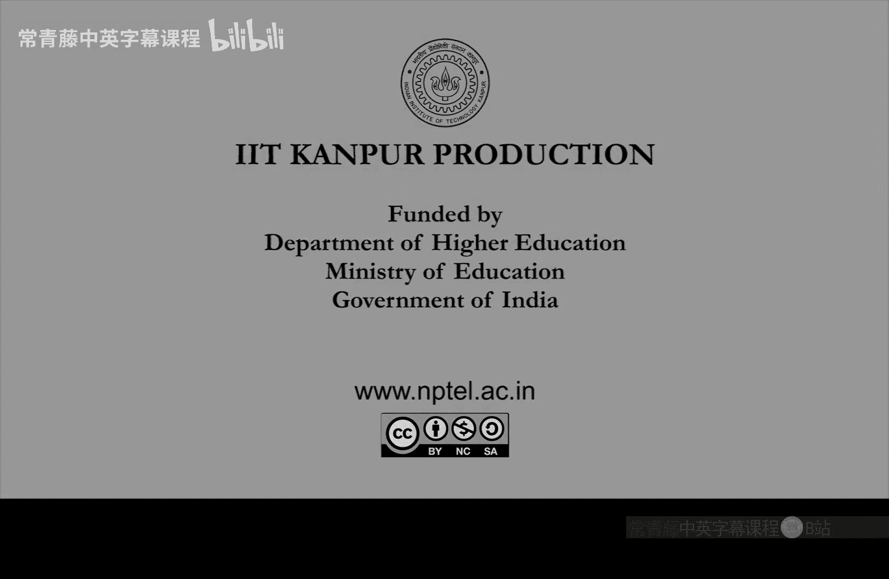

# 计算复杂性基础：P16：Ladner定理与Oracle引入


在本节课中，我们将学习Ladner定理的证明思路，并了解如何通过“填充”技术构造一个既不属于P类，也不是NP难的问题。课程结尾，我们将引入“Oracle”（谕示机）的概念，为理解相对化证明做准备。

## 填充集合不是NP难的

上一节我们介绍了填充集合的概念。本节中我们来看看，通过精心选择填充函数h，我们可以证明填充后的集合`SAT_h`不是NP难的。

假设`SAT_h`是NP难的，那么存在一个从SAT问题到`SAT_h`的多项式时间归约。对于一个大小为n的SAT实例φ，它将被归约为一个`SAT_h`实例`(ψ, 1^{h(|\psi|)})`，且归约后的实例大小至多为`n^c`（c为常数）。

观察这个大小限制`n^c`，这意味着原始实例φ必须**极其小**。换句话说，一个大小为n的实例φ被归约到了一个**小得多**的实例ψ上。这可以表示为：
```
φ (size n) 归约为 ψ (size << n)
```
如果重复这个归约过程多次，最终SAT实例会被归约到一个常数大小的问题，从而使SAT问题变得平凡可解，即`SAT ∈ P`。但这与我们假设的`P ≠ NP`矛盾。因此，`SAT_h`不可能是NP难的。

至此，我们完成了第一个观察：填充集合`SAT_h`不是NP难的。为了证明Ladner定理，我们的目标是证明`SAT_h ∈ NP - P`。我们已经证明了它不是NP难的，显然它在NP中。剩下的就是证明它不在P中。

## 构造缓慢增长的函数h

前面我们证明了`SAT_h`不像NP难问题那样“难”，现在需要确保它也不像P类问题那样“容易”。为此，函数h不能增长太快，而应该增长得非常缓慢，以便允许我们进行对角化论证。

以下是函数h的定义方式：
```
h(n) = 最小的 i，使得对于所有长度 ≤ log n 的字符串x，图灵机M_i在时间 i * |x|^i 内判定x是否属于填充集合SAT_h。
```
如果这样的i不存在，则定义`h(n) = log log n`。

这个定义看起来复杂，但其核心思想是：`h(n)`本质上是在寻找一个能快速解决小规模`SAT_h`实例的图灵机编号（即时间复杂度的指数i）。这是一个递归定义，但因为只涉及长度≤ log n的字符串（数量很少），所以`h(n)`本身是容易计算的，时间复杂度约为`O(n^3)`。

## 证明SAT_h不属于P类

**断言1**：对于按上述方式定义的h，`SAT_h ∉ P`。

证明采用反证法。假设存在图灵机M在多项式时间`n^c`内判定`SAT_h`。我们可以选取一个足够大的描述符j（j > c），使得M就是图灵机`M_j`。

根据h的定义，既然`M_j`能在时间`n^j`内判定`SAT_h`，那么对于足够大的n，必有`h(n) ≤ j`。这意味着`SAT_h`的填充长度最多是`n^j`个1。由于j是常数，这只是一个多项式规模的填充。因此，如果能解决`SAT_h`，就能在多项式时间内解决原始的SAT问题（只需去掉填充即可），即`SAT ∈ P`。这与`P ≠ NP`的假设矛盾。因此，`SAT_h`不可能属于P。

## 证明函数h趋于无穷

**断言2**：按上述方式定义的函数`h(n)`满足`lim_{n→∞} h(n) = ∞`。

这个断言可以从断言1推导出来。既然`SAT_h ∉ P`，那么对于任何常数i，都不存在一个图灵机`M_i`能在时间`i * n^i`内解决所有的`SAT_h`实例。换句话说，对于每个i，都存在足够大的n，使得`h(n) ≠ i`。这意味着`h(n)`不能永远停留在任何一个常数值上，因此它必须趋于无穷。

## 完成Ladner定理的证明

结合断言1和断言2，我们得到了一个多项式时间可计算的函数h，它满足：
1.  `h(n)`趋于无穷。
2.  对应的填充集合`SAT_h`属于NP类。
3.  `SAT_h`不属于P类。
4.  `SAT_h`不是NP难的。

这便完整地证明了Ladner定理：如果`P ≠ NP`，则存在一个既不是P类也不是NP难的问题，它严格位于`NP - P`之中。

## 引入Oracle（谕示机）的概念

既然对角化论证如此巧妙，一个自然的问题是：仅凭这类技术，能否证明`P ≠ NP`？为了探讨计算证明方法的局限性，我们需要引入Oracle（谕示机）的概念。

Oracle提供了一种思考方式：假设我们拥有一个“外星”设备，它能瞬间（在一个时间单位内）解决某个特定难题，比如SAT问题或停机问题。那么，借助这个强大的Oracle，我们能解决哪些其他问题？这引出了**相对化复杂度类**的定义。

以下是Oracle图灵机的形式化描述：
我们称图灵机M是一个关于语言O的**Oracle图灵机**，如果M拥有三个特殊状态：`q_query`（查询状态）、`q_yes`（是状态）和`q_no`（否状态）。M可以配备一条专用的Oracle磁带。

其工作流程如下：
1.  当M想向Oracle O提问“字符串y是否属于O？”时，它将y写在Oracle磁带上，并进入状态`q_query`。
2.  在下一个瞬间，Oracle会给出答案。如果`y ∈ O`，M进入状态`q_yes`；如果`y ∉ O`，M进入状态`q_no`。
3.  无论问题y本身多难求解，这个回答过程**只消耗M的一个计算步骤**。

这种模型使我们能够定义像`P^O`（拥有Oracle O的P类）和`NP^O`（拥有Oracle O的NP类）这样的复杂度类，并研究在不同Oracle存在下，`P`与`NP`的关系是否保持不变。这有助于我们理解哪些证明技术是“相对化”的，即它们在这种Oracle模型下依然成立，从而判断其能否用于解决`P vs NP`问题。

---



**本节课总结**：
我们一起学习了Ladner定理的核心证明。通过构造一个缓慢增长的填充函数h，我们展示了如何构建一个位于`NP`中但既不属于`P`也不是`NP难`的中间问题。最后，为了探讨证明技术的局限性，我们引入了Oracle图灵机和相对化复杂度的基本概念，为后续学习奠定了基础。