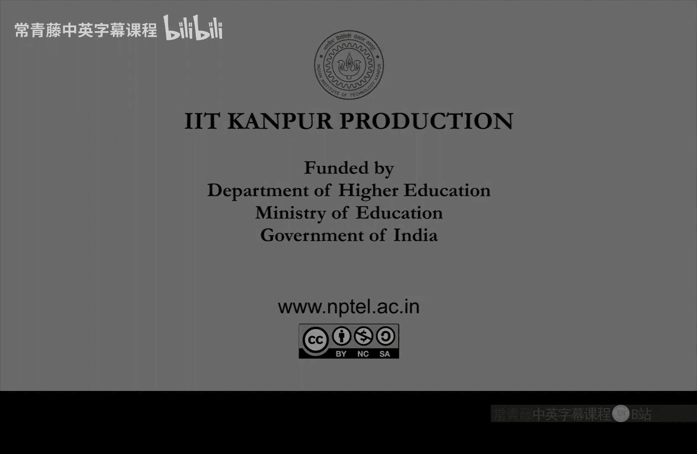

# 印度理工学院【中英⚡计算复杂性基础｜Basics of Computational Complexity】 p17 P17 -BV1LvkgBtEQN_p17-

Yes， so in the last class。We defined oracles。And we had finished。Ldness theorem。Right。

 hierarchy theorems， laner theorem。And。Now， we'll start a new way。

Learn a new view of defining complexity classes， which is via oracles。

 It will be actually be a new kind of tuuring machine。 We have seen deteristic tuuring machine。

 non domestic tuing machine。 Now， this will be an oracle tuing machine， which。Refers to a oracle。

오ac클5。So， what it does is。It has three special states apart from the usual states which so it goes into this query state。

With by putting a string。Y on the orracl tape。That this is the third tip。So input tape。

 work tape and or al tape。And。Once it puts y n goes into queryry Street。

In one step in the next step it will go either to Q yes or Q no。Okay。

 so you yes will mean that y is in the url language is it a yes string。

N will mean Q N will mean that it's a no string， you know。Okay， so in one step。

 big problems get solved。By referring to。A hard re。Sou。😔，With this in mind。

We can define complexity class。Bu。Okay， so this is the set of those languages。

L has poly time orracl Tm。Using O。Okay， so this， these are not the set of languages which have poly time during machines。

 right This quick can be actually much harder。Because it is referring to this oracle O。And similarly。

 there is NPO。Which is。L says that L has poly time。Oracle， N DTM。Usinguu。That's the only difference。

Languages， which have poly time。Oracle entity team。

So what we NM do N DTM is the same definition except again it has these three special states Q query  Q is  Q no and it puts a string on the orac tape y y string on the oracle tape and then。

Accordingly， according to O。Whether y is in no or why not in know， it will go to the next。

Special state。Okay， so。Now we have mixed non determinism with oracle。

So you can solve difficult problems now， I mean， you cannot really practically solve。

 but theoretically this class has difficult problems。Depending on how hard O is。

So let's make some quick observations。So， O complement。Can be solved using O。

That's what this is saying。A complement of a O just requires negation。

In which you can do in polyial time。It so its P to the U。So， if O is in P。

If you are using a polytimeoracle， then this is not very powerful。So P is2 always the same S。Right。

 because。This polyial time tuuring machine doesn't need to query you。 It can just。

Solve the problem by itself。So every language in p is 20 is in P。And30 is。If you define。

Exponential computation。Plus。As follows。During machine M， that on in protectex takes time。

Tourist twin。This tu machine。The yes strings are essentially tuuring machines M。That accepts。

In exponential time。So with this definition of exponential computation。It is like X right。

 but this is a single problem this is a single language which is in X。

And if you use this as anac oracle， what happens？So， P is2 Xcom。This is equal to X。

Because any problem which can be solved using Xcom。Can be sold in exponential time。

Because Xcom itself is in exponential time， so。That's the maximum you need。

And any problem in exponential time can be solved using Ecom。Right， because。

There is a tuuring machine that runs for exponential time and solves it so。The same thing。

Pries to excom can do。 And the last。Interesting thing is that it's also NP P to the X chrom。Okay， so。

P and MP P become equal under this oracle。Equal to X。Okay， because N P is not。I mean。

 the anonymousgnostic tuuring machine， when， wherever it is using。

Xcom oracle that can be simulated in exponential time and wherever it is using non domestic bits。

 they can also be guessd in exponential time。So that basically is the proof， but let's。

Write few words about this。So one only needs negation， so negate the answer of4。

M that can be during polyial time。 That's the proof of。Point1。Point2 where you want to show that。

P time， polyial time oracle。Doesn't change P class。So here the proof is simply。Ignore the oraku。

Ignore the rauckle tape。Instead， use the polytime duringing machine。off哦。

There is a polyum during machine for those who use that。No need for a ra。Third。

Which is PD is2 x comm equal to NPp2 x comm equal to x。So that is just show that X。Yin。P is to excom。

Okay， any problem in exponential time this can be solved using。A。It's steering machine， which。

Is exponential time touring machine？And it can use this oracle， Xcom oracle。

Only thing to note here is that this we set tourist is to end time。For xcom。Whileile exponential。

EXP problems may require two race to enrich to have silent time。Or two is2 is to sea time。

Largeger time， right， so but that you can。Also simulate because on the oracule tape you can put。

A larger string into the sea。You can pad on the use padding on the oracle tape to achieve this。

Could pad the query string。That's just a small point that you should。Use in this containment。

This is automatically。Trivially inside N to the Xcom。Because P is in N P and then。

This can be simulated in X。Wei。Because。N DTM。Uses。Onlypoliized。Certificate。And query string。可 so。

Everything in an NDTM is actually policy size so you can guess the certificate and you can also。

Find the answer to your query string next。Texol。So， once。

You have understood oracle duringuring machine。And this。

Orracle based complexity classes we can also we can now define a concept related to proofs。So proof。

About complexity classes。C1 equal to C 2 or。ItC1 not equal to C 2。Okay。

 so equality proof or inequality proof， it is called relativizing。Really。😔，Devising。😔，K relative。

 relativizing relativization。If。😔，It doesn't change under oracle。So if， for all， O。7，0 equal to c，20。

😔，Repectively， C ， O not equal to C 20。Also， follows。Okay， so。

A relativizing proof is one which not only shows inequality， for example。Between。Complexity classes。

 but also。Under any miracle。So， so here one。Remark， I would like to make。So， in general。

7 equal to C 2。Does not mean。7，0 is equal to C 2。Okay， this may not be always true。

 two complexity classes may be the same， but under oracle。

 they may behave differently case this is not not a trivial thing。

So just think about this as an exercise。Why is this the case。

But if you show c equal to c2 or7 not equal to c2， I should also say here。Not equal to。

Okay so under oracle， everything may change， so this is not a given。But diagonization proofs。

Actually， this implication follows。So， let's。Write that down。Dagagonization。Is reivising。

And the reason for this is the two properties that we showed before Pro  one and proposition 2。

 So because you can take the complement in the recall So as long as that is the case。

The organization is reising。To use propositions。Do I need three。No， just one and 2。

So diagonization proofs generally that we have seen that we have seen till now。

They have all been relativizing because of this。Of this。

 of this simple property that you can use negation。 And if O is in this complexity class P， then。

P is too0。 doesnn't change。So this at the level of general tuuring machines， not just polyial time。

 but general tuuring machines。What happens is。J we always design the tuuring machine via a descriptor to give a proof by contradiction。

Okay， so in that case， it actually doesnt all you need is the negation operator to be sim。

If you can simulate the negation operator， then that design goes through。So， that's the reason。Okay。

 so based on this， we will show that。P not equal to NP p。Requires。Are non relativizing。Bufu。😔，Okay。

 so this was shown by。Baker Gil Soloa。1975。So， this was shown by。Giving by designing languages。Yanbi。

Such that。P is2 A's， and P is2 a。But。Per is to be is different from and periods to be。Okay， so。

With E as an oracle， P and P look the same with B as Oracle， P and P look different。Now。

 if you can show p notut equal to NP using a revis proof。

Then this difference was not possible the same。I mean， since you can do negation in polynomial time。

The diagonization argument will actually work。In showing that P S2 A is not equal to NP S2A。

But that is not the case。 So this means that the proof。If it exists for p not equal to  NPp。

It has to be。Non retizing， so。Notice that E I have already shown you a is just take a to be X co。

This exponential computation language。Makes P and p equal。So， we have already seen。

That e equal to x comm。Works。So what remains is to design。The language， B， or equal B。So。

 well design。Bi。Vre diization。Okay， so this is interesting because。

Will show that diagonization proof will not work。In fact， by using the aization itself。

 So let's first define。What is called the unary language of B。So， for any。B。😔，Define the unary。

Language。😔，Yubbi。Which is the collection of those one to the end。

For which there is some string of that length in B。Okay， so that's the unique language。嗯。

Related to B。B is binary。UBs unity， it's only in one。 and you can immediately see because of this。

 they exist。Quantification that。Yubbiin。😔，N p to the B， right， So if you use。Or Rael B， then。

Then what happens， I mean， the verifier guesses， lets just quickly do the proof here。

Verifier guesses x。And verifies。X in B。Okay。So the guess part it will do by an N Dtm。

And the verification part it will just use the oracl be So if x is in B。Den。

This one to the n is in U B。Such that x is equal to n。Okay， so then it will know whether n is。

1 to the end is a yes string or a no string of UB， So UB is an NP to the B。

It can be solved by guessing。And using the I be。Okay。

 so now we just have to design a piece that UB is not in PB。That's the idea。So design B， such that。

U B is not in P， B。Byi。😔，Recursion。 so we will use。Use recursion in the definition。Okay， so we'll。

That's the main idea。 we want to find a piece is that the unary language be。Is not in PB。

 it's of course， in NP to the B。And well design it by recursion。So recursion， and of， obviously。嗯。

The organization will use some tuuring machine descriptor and simulate it and then negate the answer。

 Those kind of things well do in the proof。So，lect。Ama。I is an。Orracul Ting machine description。

It is a descriptor for tuuring machine button then oral duringuring machine， okay。

Without knowing what the orracule is。Right， because the tuuring machine description， you。

 it doesn't need to know what the urracule is。It will just go in Curi state and immediately transfer to Qius or cuno。

 let this be。And enumeration。Of Oracle team。In increasing auto fire。Okay。

 so we are enumerating the Ra teams。By descriptors， increasing descriptors。

So now idea is incrementally。Construct B。In the I8 stage。En sure。That MI I be。Does not decide。Ybi。

In exponentialponential time。Let's start with B empty。This is the initialization step。And let us now。

 So the。Kind of invariant in every stage will be this thing written in orange。 This is the invariant。

Okay every time we we will make sure that in the I stage MI I be。This orracule tuuring machine。

Which is using。Qury strings， which are smaller than。The part of B that has been constructed。

 so MIb will work。But it will not be able to solve U B。On that part， in exponential time。

So initially， we take P2 be empty。 How do we grow it。 Thats the interesting part。So， in the I stage。

So， we have declared。Before。Only a finite night。Number of strings。Yin。Or out。

Of b in the up to i 1 stage， certain strings have been declared to be in or out of b。

So their status is fixed， but there are only finitely many。 so lets go beyond that。Lth， so choose。

And I。To be larger than that length。Okay， that's the NIE。Which is still undeclared。

We have not fixed whether its in B or not that we have not decided yet and that we do in the I stage。

So， here you run。M I B。On one to the N I。For two race to N I-1。Sts。As follows。So。

 to decide whether N1 to the N will be a yes string or no string in or route of B。

We will do the following will。 This is how we will do it。

Remember this ultimately diagonization trick has to come so you have to use somewhere negation of the simulation。

So problem with this MI running MI is that what if。A Ie。Refers to a string queries a string。

 which is。Undclared。So B current B will not be able to answer it。Right。

 remember that this is not the final B。 This is only a current B。

So it may not have answers for everything。 It is not an all powerful recall。Right。

So that is why we have to do describe how to。Run this。So， if am I。Gus。😔，B。On undetermined strings。

Whose answers B doesn't know。Right。Then， declare them。Not in。

So which means that now B grows in this step， B will grow。Okay， second， if MI queries。

On determined strings， strings whose status is determined。Then in this case， just be consistent。Okay。

 so whatever status。Of the string is， yes or no。That be be will be able to give and then you use that to continue the execution of MI So with all this。

If。In two is2 n-1 steps。A I be accepts。1 to the N。K the way we have described above using one and2。

Answer the Ra queries like this。M IB accepts 1 to the N。

Then now is is the point to negate this answer。By doing what。Don't put an island strings in U。Then。

Dclare all。Of 0，1， to D， N I。Out of be。And if MI I B rejects one to the N or cannot give any answer。

Then what happens。 So then。Put a string of length and eye。Put。😔，An undetermined stream。Of0。

1 to the N I。Yin。Yinbi。Okay， so yet undetermined string。

 there will be some string in 01 to the I of this type put that in。In B hands。

You have put one to the N I in。Q逼。😔。

