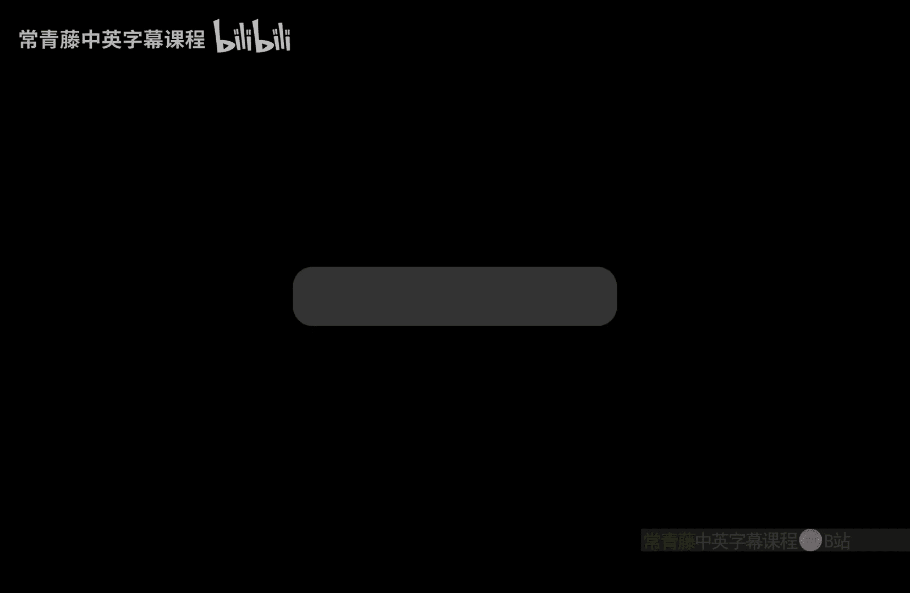

# 印度理工学院【中英⚡计算复杂性基础｜Basics of Computational Complexity】 p20 P20 -BV1LvkgBtEQN_p20-

This is very well motivated this problem of Tq Bf that we defined。It's coming from SAAT quantifiers。

Not just their exist， but a mix of that exist for all。But， it's。Even nicer。

It's if we look at it as a game。Okay if you think of they exist。As。Yourself and for all， as a。

 as an opponent。So there exist a strategy says that for all the strategies of your opponent。

And so on。Okay， so let us formalize this as a game called the QBF game。So， the truth。Of Q B F。Sorry。

Which has there exist x1 for all x2。They exist， x 3。Dot， dot， dot。Did it exist X。

So the odd ones are they exist， even ones are for all。Onfei。X 1，2， x 2， n。

So truth of this can be interpreted。As a two player game。Okay， so well see this as a two player game。

 So think of their existence as youth for all。As your opponent， So you will pick x1。D X1。

Says that no matter what your opponent picks。Which is x2。You will have a choice for x 3。

Sas that no matter what x4 is picked。You have an X 5 again， soon。

Such that ultimately phi becomes true， which is。A con which is the state where you win。Okay。

 so this is。It's actually fixing the。Fixing a strategy for you。So that you win the game in。

Twin rounds。We will twin steps or end rounds。Right in round U。You move for you take a step。

 your opponent takes a step and then repeat。So say， player 1。Bixix。Values for。

You can think of yourself as player 1。So， you are。Your choices are by the odd variables。And player 2。

Ps values for。Even once。So， we declare。Player won the winner。There is only one winner。

 right you don't want to have a tie。 You want to win。 So player one will be declared the winner if。

Phi is true。Indian。Right so p is the target value and that has to be true if you want to win so how should player  one and player2。

 how should player  one choose。Says that without knowing player 2 strategy， player 1 always wins。

Right so the TQ BF is essentially the problem of whether there is a winning strategy。So， deciding。

The Psi is in TQB F。Signifies。Whetherer。Did it exists。A winning strategy。4 player1。Right。

 so Tq Bf is the question of。That there is a winning strategy。

 So note that instead of talking about whether there is a satisfying assignment。

Where there is a true assignment we are now talking about， whether there is a winning strategy。

So from values， we have moved to strategy level。 So this is a much more general setting。Then。

 in Pharness。And。So， this suggests。The peace space hardness。off。General board games。I mean。

 both games are finite games， but if you make it。Growing， if you keep。Making your bold。

 say number of squares in chest board more and more。Then。The sequence of these problems。

 they become harder and harder and in fact， be space hard。Okay， so this is what the above suggests。

Example。Chess。On end by end board。Go on inin board。Checkers on in board。Right。

 so we have not proved it， but。This strongly suggests that these board games should be。

Quite difficult。Although puttingin this rigorously will。Require a lot of effort。

 This is just a suggestion。If you look at this， with NP is。Different from peace space。So now。

 we have a good。Let's say， physical interpretation of this question。In terms of games。

 so this question is saying that whether games are harder than puzzles。

RightSo puzzles is what SAAT signifies because you have to find one assignment true assignment。

 satisfying assignment。While games， you have to fund a strategy。Great sweet so。

It it's at a higher level than just finding a satisfying assignment。

 So whether games are harder than puzzles this is。In computer science。

 the question whether NP is different from PP， this is an open question。So currently。

 we don't know this。One more。Important consequence of this theorem by。

Theorem of peace space completeness。Is that we can study end space。Using it。Su。In fact。

 let me just say lema 2。So lema 2。Is a nice weight。Is a clever。Way to study。End space。So。

 what will show。Is this， is this studentum by savage。From 1970， that n spaces。

Can be simulated if you have， I mean， the nondeism part can be removed。

Non at bits can be eliminated in space as square。Okay， so。Let the。Ambi。😔，As sense space。En D team。

Deciding。Language L。Which is in end space S。And。Note that this。Is not believed to be true for time。

 So N time as。You will not expect it to be in time as square， you will expect it to be in tourist2s。

But for space， why is this happening？The why， why do we expect end spaces to be。

Sivil level in quadratic space。嗯。In a quadratic blow up space。So。

 that is because in lema 2 we gave we wrote the whole computation as a Tq be。Instance。

And that TQBF you can actually solve。In small space。Okay， that's the reason。

Small space allows you to look for。嗯。All the solutions。That's the idea。Rightite，si m comma X。

And solve it。Okay， that's what we'll do。So， as。In Lema 2。We design a QB F。Si m commma X。

Which is side D S N。Remember we had this constant multiple ofsN that much of space was being used and so we bounded the number of steps to be two ways to Ds。

And then we looked at the mid points and broke up。By recursion or route design formulas by recursion。

 So path from start configuration。Du。😔，Except。But in lema2s proof we used the deter。Tuting machine。

But will it。Matter。So you observe that it will actually not matter whether it is deter or non domestic during machine。

Because。嗯。On the top， there is a they exist configuration quantifier。

 so you just want tuuring machine to have some path。That's all。

So the same proof actually works also for NDTM。So， with the modification。That。Fi。😔，Eex。C prime。

Captures。To possible。Transitions。Instead of a unique one。Because now M is an N D team。

Right so you just capture the existence of C prime prime in the middle。And yeah， so in lemma2。

 what was phi。Yeah， so you just work with this。Transition C to C， prime。Yeah。

 just work with transition C to C prime。But think of this as I mean。

 express this as two possible transitions。Is sort of a unique one， given by the。Transition function。

Given by。The transition function M， del time。Okay， so that will still give you a formula of similar size。

So you can observe that。Ciex。Remains QB F。Of size。B go of a square。

And next you can actually solve it， which means you can check it in the same space。

As we see saw before， Lemma1。Withai lemma 1， we saw this algorithm， which was linear time。Sou。Now。

 by Lema van。S x。Chable。In space。Bgo of essence square。In fact， first we。Say linear in the size。

Which is then。A soft squ。Right so this way we have shown that end space session。Specs square。

So with the problem， L has gone inside。😔，Space， Sof and square。

Any problem that is non domestic space S。Can be solve in space just quadratic this quadratic group is coming from lemma 2 Okay。

 not from lemma 1 okay。So， in particular。呃。What did you learn。So you learn that。NP space。

Is equal to P space。Right， because N space will just。The blow up in space will be only quadratic。And。

That is not cheat the not going out of peace space。 Okay， it's still a polynomial。

 peace space is the union over all the polynomial， so。

And P space immediately becomes equal to p space， which is why for P space we will not talk about nonatism。

Noism does not help。Okay， there is another way to interpret what we did here in Savage's theorem。

 which is by looking at the tree of transitions。Over configurations。 Okay， let's do that。

So another way to。Interpret this。Is true。The configuration tree。Of N DTM M。

So configuration tree means that you look at。This tree that starts with at the root。

 it has sea start。😔，And then there are two possible transitions。Let's call it C 0， C1。

C 0 has another two possible transitions，0，0，01。C 1 has C 1，0。😔，Cwenwen。Right， and then it。

Expands like this。So that is the configuration tree in the leaf。Of this tree。

 So the configuration the。Computation direction is top to bottom， right。

That is how the computation is proceeding， but in every step there are two possible transitions。

Because we are in N D team， otherwise， it was just a line。

But here it becomes a tree with the depth being。So， depth is the number of step the time complexity。

 which we have shown to be。Tourist to big of S。This much time it will take。

And each configuration has size。Also， be of us。Right， so each configuration has size around S and。

The total number of configurations is tourist to that， and tourist to O is also the number of。

Configurations in any path from root to。The leaf， which is called。Dippped。Su。Specifying a location。

In the tree。Requires。Howome much space？So you have to basically specify at what depth。

 in fact you just have to specify this string right there is 00，0，1，1，0，11。So， that length。Yzunli。

Log of the size， basically。Log of the。Size of this tree。Which is。Logue of tourists to be office。

Which is big office this。To this much space。Right， so you can sp。

 you can specify any location in this stream in。B go of S space and then in that location。

 how many bits are there。Size of a configuration。Is also big office。Which altogether means。

That reachability。Of sea star 2。Ctop。Start configuration to stop configuration。

 whether there is a path in this tree。Right， that's a reachability question。This can be solved in。

In how much space。呃。In big of S times S。Which is big of a square。Space。

But you can basically do a depth first search kind of an algorithm。

And this tree is given to you only implicitly because it is exponentially large。

But you can attempt this。Reachability algorithm that you knew from graph theory。

Competitional graph theory and the the space complexity of that will only be。嗯。Order of a square。

Because that is。Product of。Lent of the pot。And times。The space you have to maintain。

When you are at any vertex。Also。In tourist to big office。Space。And two is 2。Bgo office time。

You can also solve reachability alternately。You can basically work with the whole tree。

 which is of size tourist tobigo office。I mean that much time you can solve it just by Dfs right So there is also a space time trade off。

Either you take space time roughly equal， but then it becomes exponentialer。

Or you reduce the space a lot。Which is。Only quadratic。But then， time will blow up。Su。😔。

You can use the trade off。There is a cr off that you can do。

 So these are the simple observations just looking at the tree and the reachability problem and the reason why I gave this alternate。

Interpretation is because。Well actually use it now in a new class that we will study。

 which is the lock space class。So， reachability。Plays an important role。Y。Small classes。Leil。😔，N L。

 etc cetera。け so。In the next class， we look at the。Structure of Nl。No at atic lock space。

And we'll introduce the concept of。Anil completeness。Okay。

 everything in Nl will be doable in polymerial time because of this tree idea。Right。

 because if you take S to be log。Log n then two race to s is just n so。

Everything can be done in polynomial time。So these are actually。

 this is why Ellen and are small classes。But still we can make comparisons and through the structure。

