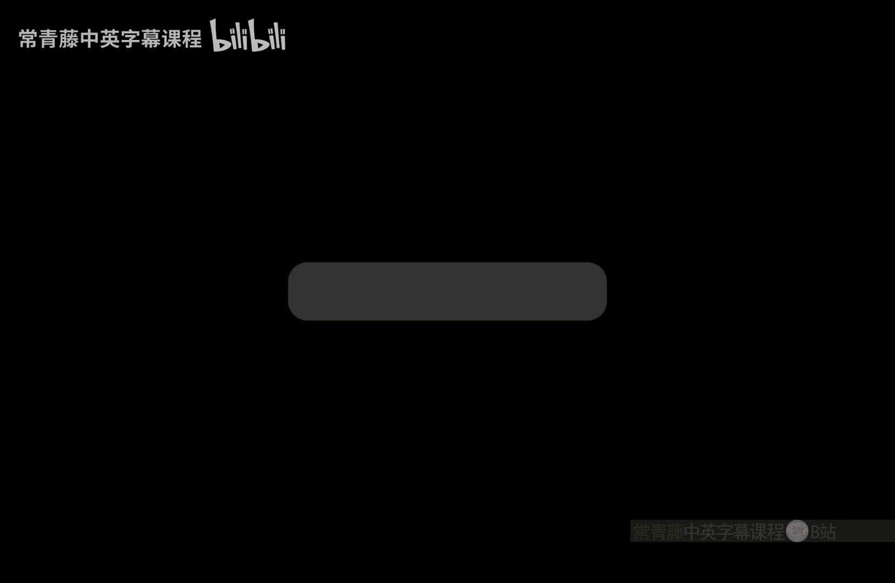
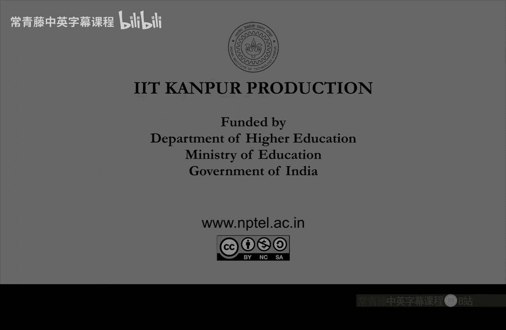

# 印度理工学院【中英⚡计算复杂性基础｜Basics of Computational Complexity】 p22 P22 -BV1LvkgBtEQN_p22-

So。In this way。Using the。En DT him。Of yi。EnTM M of of the problem E。We can convert。

Any input instance to a graph instance。And in the graph。

All you have to do is find a path from check whether。C， start to C， except。There is a path。Right。

 there will be a path， if I only leave。Ex isor yes string of a。

And all this can be done in the reduction is actually。Implicitly illcomputable。

Remember that we call implicit because call it implicit because this work tape is too small to store G commerce committee。

So we cannot store f of x， but we can access any bit in that much of。Works with。So， overall。

 this means。That we have reduced a2 path。Okay， as claimed and lemma 1 and lemma 2 now they together give you。

That path is an illcomplete。OkaySo directed reachability ist ancompte problem。

So solving it fast means solving it better means that。You are actually simulating L better than。

The trivial。 That's an open question。With N L。Equals L。 That's an open question。

A corollary of this theorem。Is that complement of path。This is Q N L complete。Right。

 so path is little complete。 So for the core class。

 you take the complement that will be co n complete using the same reduction。So， by the same if。So。

 directed unreachability。Nexts。The hardest problem in Co N L。

And the question you can ask again like N Co and P， whether these two things are equal。

Whether n L is equal to co nl。And here there will be a big surprise that。

Will actually be able to prove it。So we can actually prove that n is equal to co n。 and of course。

 we don't know whether it is。It is ill。So let's look at this amazing proof。N L equal to Q and L。

So this is a theorem by。I mean， independently proved by two people。So， Imerman。And。😔，Slip。😔。

Slelip in。It's an old result， but it was a。Stun result。Because， I mean， a， people thought that。

NL equal to Q andL should be like n p equal to Q and P question。But in this case。

 actually because of reachability being such a special problem directed unreachability actually。

Convers to。Tected reachability。Making an equal to col。So let us look at this nice proof。

This elementary。呃，不。So， what will show is。It suffices to show。De part。Compliment。Is in an L。

unreachability is in Nl。So， we design。😔，A lock space algorithm。Yi。Such that。

For input G comma S comma T。There is a sequence of guesses。You。For a。Such that you will accept。

He will accept， if you only leave。Actually， there is no path。Okay， so note this negation。

 so S2 T there is no path in the graph sheet input graph sheet。And in that case。

There will be a certificate to you。4ri。Which he can verify in lock space。That is what we will。Design。

So how will we achieve this， So the idea is。Simple to state， it is just by path counting。

Scount parts。Yinz。😔，Okay so it's by path counting。SoLet's implement the idea。

Let me specify more that。Coownbos。Of length equal to I。In the graph G， so it will be a detailed。

A path counting in the given graph。And the certificate you will be。Based on that。

Is based on discount counts。So let's do this。 Let's implement this。Solect in。

With the number of vertices。And C I be the set of vertices。Reachable from us。In I steps。

 at most I steps。Please remember this important。Object C the set of vertices which are。

At distance that most I from。The source vertex。Now。Immediate observation is。Whether V is in C。

For a vertex。Okay， this question。呃。This question is in N L。This is certifiable in lock space。

This question why is it in N L， Well， Because if v is in C then。

There will be at most I vertices leading you from S to V。So you can just guess them。One by one。

 you guess them。And just like we showed the path in。And then is the same thing。Same proof works。

 right。That you remember。So， let's know。Design。A lock space machine。Let's now， certify。The following。

In lock space。So these will be more interesting。 The first is。Complement of this。Wai。

 we not in Syria。How about that。 That is what we are interested in。In the theorem statement。

So we will do this given the size of C。So， vertex。V not in Si。Given C。Size。And。😔，Now。

 how will you find out the size of C that also you have to do in Nl。W。

At least you have to certify it。So， let's certify this。So C equal to C。Given the previous one。

Size of C I -1， and obviously C。け so。Vertex， not in C。This for this。

 well actually use the count the size of C。And to。Compute the count or to certify the count will use the previous count。

Right so so it will be a kind of recursive algorithm。But remember it is just to just a certification。

 so it is not computing C。 it is just certifying。Right whether this is the correct answer。

 So if we do this。Do both these things in lock space， then。This will imply。That path is in coll。

Or the complement of paths。Is in N L。Right， which will mean n equal to Qnl。Why is that Well。

 Because that's what it is checking。 It is checking whether T is。Not in C n。

That would mean that S are disconnected using。Citi。And C T itself， it will verify y。

Guessing its size， which it will verify by it。诶。Going back to C T C and -1。Like so c N， cn 1。

 cn minus-2， those guesses can be made。So by this knowledgeistic lock space machine。

You can ultimately check whether T is in is not in。C n。So these two points。

1 and 2 is all we have to now verify。So， let's do it。So， certifying。We not in C。Given the size。

So how is that done。So， the certificate。Of this， of unreachability here。This will just be。呃。

Guess all the vertices which are in C。Once you have guessed them and verified them， check。

Just check that V is not there。So the certificate is simply。Is the list。Of vertices。Fiwen。😔，ordered。

 let's say， of ordertices。certificateert is an order list。Of what this is。We won less than we2。Tt。

 thoughtt。V the size of C。So is that all of them are in C。And none equal to v。

Rightai so this will be a this is clearly a certificate for V not in CI。You know all， I mean。

 you just guess all the vertices in C。In this order and none of them equals v。

And they are size of C many the only thing is how do you verify that your guesses are correct。

So the verification will be as follows。Or will。How do you correctly guess these。So， to do this。嗯。

Guess， Viji。Guess V J， Vj plus 1。And then， check。Gss VJ less than VJ plus 1。And check。

That both of them are in C。 that was discussed before。Any vertex can be。

Verify to be in C right that is by the path problem in Nl。So check with the VJ， VJ plus1。

 both of them are in C and then finally。Jick。😔，That C， many Vs。Were correctly guessed。Right。

 so that's a lock space machine， which can guess。The whole of C， everything。

 all the vertices it can guess。 remember that it doesnt have to store it。Right。

 because it is going in this order。Su。😔，It will just keep reusing the space。

 So reusing of space is important here。Otherwise， you will be out of space because C may be N。

In size see the trick is that during this N DTM will just guess v1 remove it。

Or guess we won in V too。And then guess V2 and V3 and V 4， V 5 and V6 and so on。Okay。

 and keep checking。Each time。Whether that particular vertex is in C and UF。Done this C many times。

 so keep a counter for that。So this is then dubilin Nl。That's what you learn。So， it only takes。

Login space。And what have you achieved we achieved one point number one。

 certifying we not in C given the size of C。Next is to actually compute this size by guessing。你头丢。

Check that your guess is correct size of C C。Let's do that now。So， certify。So next， what we will do。

Is okay。 Let me。Change tactics here。So， two will be。Donone。In two steps。So first。

 what will be done is。Certify。That V is not in C。Given the size of C， I， -1。Can， after this。

 we will show how。2 will be done。So let's do that。 This will actually not be very different。呃。

Here you are given C minus-1 size， not C。But that is just moving to a neighbor。Okay。

 so it's the same。Certificate will be similar。 So again， you， the certificate is。Is， again， a list。

We one less than we2。Itll be shorter now。V C， I-1。All of them should be in C -1。N equal to v。

Or we' neighbor。Right， so essentially。Here， do you have V。😔，And here you have a pre neighbor of we。

 let's say you。So since you are looking at and here， you have S。Right， so。Basically， these C -1。Vtic。

They are at distance。Are you -1 from S。And you want to certify that v is at distance more than I。

 right so。Neither V nor its neighbor you should be C -1。Wai， because if a neighbor is in C -1。

 then we also will be in。We will win C so that you don't want。

 So hence both V and U should be out of this。 So that's that's the only extra check。

So once you do this， then you have verified v not in C。So， to do this。Guess V J and V J plus1 again。

Like before， right， and check。That V J， VG plus one。第二点。C I -1。Okay， so that's it。Finally， check。

That C， I-1， many。V Gs were guest。So， this is。Identical。

 almost almost identical to the previous thing。So even when you know C minus1。

 that is enough to certify v not in C。By ensuring that both V and its pre neighbors。

 all the pre neighbors and in and we。They don't appear when we enumerate C -1。Right， so this is。

 again。They are not being stored in the workspace。 they are being guessed one by one。And then。

 checked。That every guess isnt C -1。And that these many C minus-1， many Vjs work actually guess。

 so we guessed everything。And。That's a certificate that V is not in CI。Okay。

 so finally coming to item 2， which is。35。That C is a given is is what。Bez guest， see。

Given the length a size of。C a -1。So how do you do this？Given the previous size。

 how do you certify that the current size is C， So yeah， the only way is you guess all the C。

Vertices。 so for every。F in the vertex。V and C I。Respectively。We not in C。Are ctifiable。

In lock space。Given。Size of C， I，-1。It is whether a vertex is in C or not in C。

 this we have shown that given size of c minus1 it is Certiifiable。Yeah。

 so do you go over all the vertices。That's all。And。Gount。That gives you exact count of C。Su。So。

 go through what it says。In that order。1， less than 2。Up to end。And。😔，Cound the correct。Size of C。

Right so that can be then checked。With C。Compared with C。So again。

 we are it will not store the vertices or the information。 it will just store the count and。

It level to certify whether C is indeed C or not。Right， so that finishes both one and 2。

 which finishes。Our proof。So， both1 and 2。Orru。35 billion L。Which means that。N L is equal to co N L。

1 and two， we have observed that it implies and equal to coial。

So that finishes the proof of Imer and。Slip c。ok。

