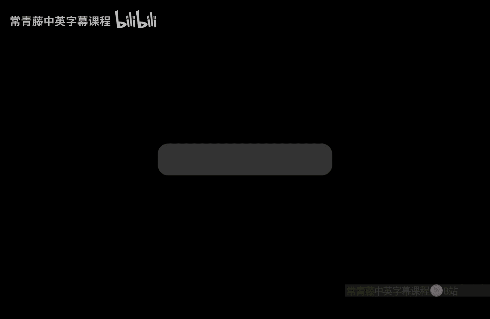
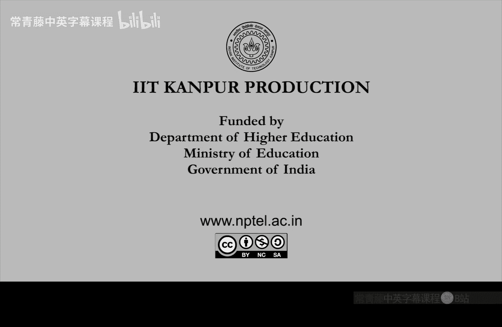

# 印度理工学院【中英⚡计算复杂性基础｜Basics of Computational Complexity】 p23 P23 -BV1LvkgBtEQN_p23-

So， in the last class。V。😔，Finish the proof of n equal to coll。Right。

 so recall that N L is essentially the。Question of graph reachability。In directed graphs。

Right and Co andl is the directed graph unreachability problem。And we showed。

Which was a surprising result， that。These two classes are the same。

 so unreachability can be converted into reachability。The way we did this is we use non determinism。

To count the number of parts。Okay， so。So these yellow points。

 these are the important points which helped us in actually just enumerating。All the parts。

To distance I。 So once we have shown this， we actually can say something about n space and co n space as well。

So what we can see now is。That， for all functions。At least， log in。Right so。

NL and above all these classes。N space is。They are also the same proof works。Okay。

 so n spaces is co n spaces as long as S is。At least login， the login function。

So how do you show this。So， you do the。Same thing as was done above。Solect M B。It's in space。

N DT him。Deciding a problem or a language， L。Now you know that the configuration graph G of Mx。Okay。

 this is a based computer。As。SN is login。So， that。X can be indexed。

RightSo every entry of x just to locate an entry location。You will need login bits。

 but once you have this much of space。Then you can essentially compute。In big office in。

Whatever you want in the。Configuration graph。Here also， I can put biggo to be safe。Okay。

 so the configurationag graph is computable in essence space。And computable means， I mean。

 you don't want to output the whole configuration graph， but just。啊 the。Any vertex and its neighbors。

Okay， so locally。That information can be computed in a space。And so。This means that。X is not in L。

If and only leave。G， the start configuration。And the accept configuration。Is not in path。Right。

 so in the graph。X， not being L。Converts to this unreachability。Problem。

And this unreachability problem， you do exactly what within the previous proof。So， now， invogue。

The previous proof method。To deduce。That。😔，E complement is in end space。Okay。

 so L complement reduces to unreachability， unreachability or path path you can reduce2 path。

As we did in the previous proof。N l equal to Q andl proof。Which means。That end space。

S is co and space， S。Take containment both ways。 Okay， so that finishes。

 so that means we don't need to worry about core classes of。Non deterministic space。

Right and remember that n space is contained in the space as square。So that also， we can make a note。

That co and space。S is contained in。Space， a square。If essay is greater than。Logan。Okay， so。

Up to a mile blow up。End space。 Go in space。They are all actually in space。 Okay。

 this is this is an amazing thing about space， which is not known to be true about time。 Okay。

 so this topic is done。 now what we will。Begin。Is。New way to define complexity classes by oracles。So。

 now。Next， we build。Classes。嗯。Using。Or records。So。The topic is called。Poul normalmal hiarchki。

So the motivation is in computability theory。This has been done before。We can create。

A hierarchy of problems。By using the halting problem， so。Basically。

 what are the problems that you can solve using the halting problem。Yeah。

 if you have asked that question， then you will get problems that are。

Even harder than halting problem。So， consider。Hall tuuring machine。As an oracle。And consider。呃。

Problems which can be solved using。Ding machines。With halt as in， given as in orracly。Okay。

 so whenever。Ha the instance is to be solved， it will be written on the ra tape。And immediately。

 halt will solve it。 okay in one step。Willll I immediately go to this these new states。

 Q yes or Q no。So hole can be queried， So now what can you solve by such tuing machines。

And once you have this， then you can。Go to the next level， which is。Ding machine。

Duringururing machine， halt。So let me instead rewrite it like this。The set of problems here is C。

Then， each to the halt。And so on， okay。So during machine。With the wholean oracle。

The problems which you can solve like this。嗯。In， in it give let me instead right like this。

Duringing machine with H。 Okay， so next is。This is H2。Okay， so duringuring machine halt。

 then duringuring machine with halt as and oracle， then。

Those problems given as an orral tuuring machine。A new class， H2 appears， and so on。

So these are the new classes。诶。And you can show by diag argument that they are all。Becoming harder。

So these are probably getting harder。So each so hold will be easier。Then， each one。

Each one will be easier than each two。And soon。This。

 you can show by diization argument as an exercise。So now the question is。

 what is the complexity analog of this？Okay， so similar thing can we can we also take a supposedly hard problem like like sat。

And then build a problem that is harder than that。And then use that problem to。

Build a problem harder than。That， and so on。So this infinite hierarchy。

 can we build an infinite hierarchy。And will we be able to give a proof that it is actually a hierarchy。

 strict hierarchy。 Okay so towards that。We will show， or well define。The Pa hiki。So， P。

Will be a generalization of N。N P and Q， N P。And it will lie well below these space。

So in other words， we will attempt。To create a hierarchy of hard， harder problems。Increas。

Har complexity classes within while remaining within peace space。

Its such a thing you had seen also inside PNP。Wre loudness the。Now， well go actually outside N。

End up in peace space。 Okay， in fact， below peace space。So。To motivate that。

Well actually define it in two ways。 today， we will define it via quantifiers next time we will define it via。

Oracles。So。Let us motivate by a problem。 So consider the following optimization question。

Which I mentioned in the overview of this course， it's called min DNF。So what is mean DNF？It's those。

Formula instances that are already。Optimal， they cannot be made smaller。So，fi is。DNF formula。

Not equivalent。To any smaller D NF。Okay， so if you look at its size。It cannot be further。

Reduced if you reduce it， then it will not be equivalent。

 if you look atsi smaller than phi then psi and Phi will not be。Equal， so another way to define this。

So， alternatively。Man DNF is。It is the collection of those formulas。Sas that for all DFsi。Size of Pi。

 less than size of Phi。Means that。There it exists and is。

Satisfying minute assignment says that sizeius。Is not equal to5s。Okay。

 so for every DNF size that is smaller。There is a。Distinguishing assignment。Okay， so。

That's what mean DF is collection of minimum D NFs。And if you think about this。

 this seems to be harder than set。 Okay， it's a valid。 It's an interesting optimization problem。

But it looks harder than set。Why is that Because it has two quantifiers there is a for all。

 and then there is a they exist。Let me not use implication here。For all DFs。Withhi size less than5。

They exist in S。 O， after for all， there is a the exist。Double quantification。 So it seems。Beyond。

Andbi。Which is。Kind of defined by their exist quantification。And Co and P。

Which is defined via for all quantification， negation of their exist。As。Mean DNF。Uses。Boot。😔，For all。

 they exist quantifiers。Right so since it uses both， it's like。Co in P stackgged over NP P。Okay。

 its a。This is exactly the place where you should。It should remind you of oracles。Okay。

 so then it intuitively mean DF should be。Har than。Anything in N P or Co N B。On the other hand。

If you want to give a brute force algorithm。What you will do is you will go over all the size。

 right and check whether fi are are equal or not。That there exist this。Distinguishing assignment。

 as or not。That you can implement in peace space。So， on the other hand。Been DF。Isn't peace space。

And doesn't look。As hard。😔，S Q B， F。Right， it doesnt look as hard as QBF quantified bulling formula because in QBf all the variables were。

Quantified， there were n quantifiers alternating here。 There are only two。So。

 it doesn't look as hard as QBF， it is in P space。And looks harder than sat and toology sat and taught。

 right somewhere in between。 So this deserves。A class of its own。So， let us do that。So。

 this motivates。A class of its own。Which is the subject of this lecture。So。Language L。Is put in。百度。

Okay， this is what we are defining。So p pie sub sub two and super。Bi。Right superscript is P。

 subscript is 2。So language L is in pi 2 if。There exists poly time。Duringing machine M。

In a constant sea。Such that。For all input strings x。X is in L。If you will leave。For all。So。

 we are quantifying。This new string U with for all， right。Of this blown up length。Ex to the sea。So。

 for all。Large enough strings， you。Or slightly bigger strings U there will there is a certificate V。

Okay， such that。It sort of So think of we and you and V。呃。

As extension of the certificate string that you used to have in NP。And think of M as。

Extension of verifier during machine。So the verifier x should accept。M。X， u v。Equals 1。Okay。

 so x will be set。I'll X will， X will be a yes string， if and only leaf for every string。You。

 there is a certificate。Okay， and the lens and the time of M everything should just be a polynomial blow up in the input size。

 which is size of x。So if I remove U， it is NP。If I remove V。It's Co and P。 So let me maybe。

Mention it so that it helps you to read。So this is kind of the Co P part。

And this is kind of the NP part。And we are mixing the two here。Right。And。Now， for all there exist。

 if I flip it to there exist for all， then I define。Then I call it sigma 2。So， language L。

Is in sigma 2 P。If there exists。A poly time toing machine。M。And this constant。C greater than 0。

 such that。For all input。X is a yes string， if I only leaf。There exists。 A you。

This sizes as as above this again， just some poly blow up。Of the side of the input。And for all we。

M X， U V。Should be one。 Okay， So you can think of this part as。It the verifier。In pi2。

 it was co Co N p kind of definition， then N p kind of definition， then a verifier。In sigma 2。

 it's the opposite。 It's the N p kind of definition， then co N P。And then， the verifier parts。Right。

 so for all there exist gives you p 2 there exist for all gives you。Sigma 2。And you can S show。

As a simple exercise， that。Sigma 2。P is equal to。估闭肚片。Okay。

 so sigma 2 and pi 2 are just comp the core of each other。Right， because when you do negation。

 you can see that there exist flips to， for all。So since migation of the exist is for all。

Inneigation overall all is they exist。 And yeah， so。We can also define。Sigma 1 p。As N P。And sigma。

2 Ps。Guini。😔，So sigma 1 p and pi 1 p。Okay， so the the sub denotes。What level you are at。

 So first level will be N p O and P。And the second level will be。Sigma 2 pi 2 as defined above。

This is also the number of quantifiers。And the P here is just the denoting polynomial time verifier。

This， I hope this definition is clear， though it looks very long。 It's just a truncation of Q BF。

Okay。Q BF had n quantifiers here。 You just have one or two。And。Yeah。

 you can all go down and define actually sigma 0 and pi 0。Ass just polyial time。Okay。

 so these are the definitions at the low level。O。So let's quickly see some properties。

So first is this Min DNF problem。This now has its class。Which is。百度。Right。

 because if you look at the definition of mean DNF。Language。

It's for all they exist and then a simple test。Right， for all。si there exist S。

 and then a simple verifier。So it is of that form。Which is by actually， by design。

So min DF is in pi 2。If you look at the union of NP and Co N p。Okay， both of them I mean。

NP is actually contained in。Sigma 2。And NP is also contained in pi 2。So is the intersection。

K note the intersection。So NP is in the intersection and similarly co N is also in the intersection。

 So the union of NP co N is in the intersection of sigma 2 and pi 2。Okay。

 so sigma 2 pi 2 are really above NP O N okay their intersection contains this。I mean， again。

 conjecturly， we don't know for sure。And where is the。Where are these new classes sitting。

What's an upper bond。So at this point， the best upper bound。That we can think of。

Is the same that we had for QBF right when you have lots of quantifiers。

You can do an implementation in piece piece。There is an algorithm in P space。

 so similarly sigma 2 pi2 also。Sit in peace space。Right， so。So， you can actually。Think of。Sigma 2。As。

They exist for all。Bi。And pi2， similarly， you can think of as they exist for all。For all， they exist。

Bi。You can think of sigma 2 pi 2 as this that its the polymial time class over which。I。

 if you put for all quantification and the exist quantification， then you get sigma 2。

If you do the opposite。That then you get pi 2。 Okay， just as a。Think of it as a shorthand。

For that long definition， which。We just saw。And once we have this， why stop at2 quantifiers。

We can actually go on quantifying as we like。And create these new complexity classes。

So we can define。 Let me first write that。Defined sigma， I。Baiaii。By I， many。Alterernating。

Quantififiers。Okay， so i equal to1，1 quantifier equal to 2，2 quantifiers， i equal to 3。

3 quantifiers and so on。So a general definition would look quite complicated it's here。So。

 L is in sigma， I。If。😔，There exists。A poly time。Tuting machine。M and constant。AC。Such that。For all x。

X is a。Yesesting of the language， if you only leaf。There exists， A U1。Okay， and then for all you2。

In a quantifier。This goes on alternating and the Ieth quantifier is， let's say Q I。

 it either they exist or for all depends on the parity of I。 If I is odd， it there exist。

 if I is even its。For all。A accepts。Okay， it ends。 the quantification ends with the verifier test。

 which has to be polymering。So， these are strings。Of length。At most x to the C。

 So you want to U are these。Kind of certificates。Certificate strings。Not too large。

And this quantification， this kind of QBf。Tranated QB F should be。True for the yesterday string。

🎼Yeah。

