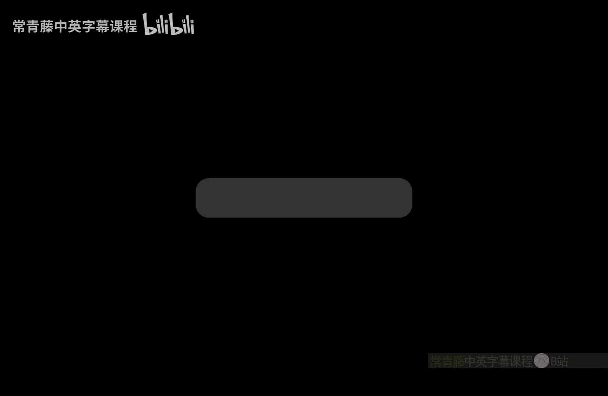
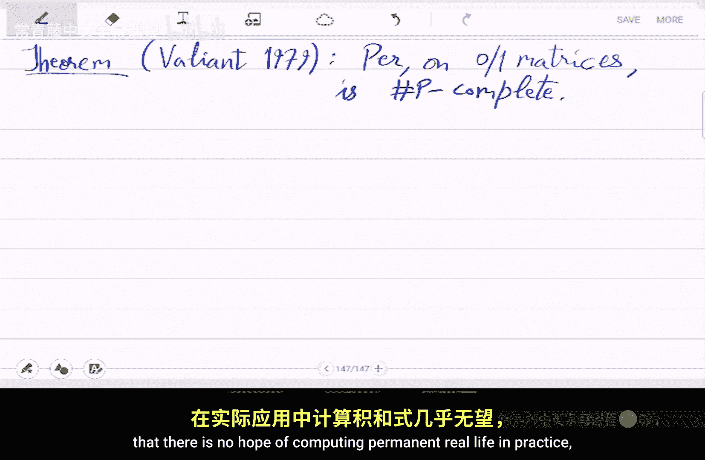
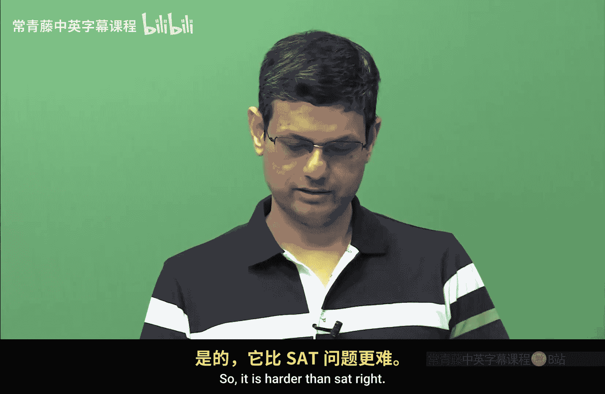
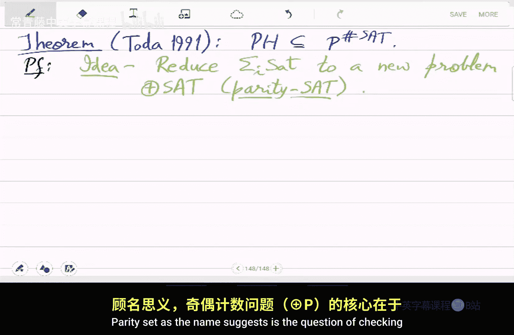
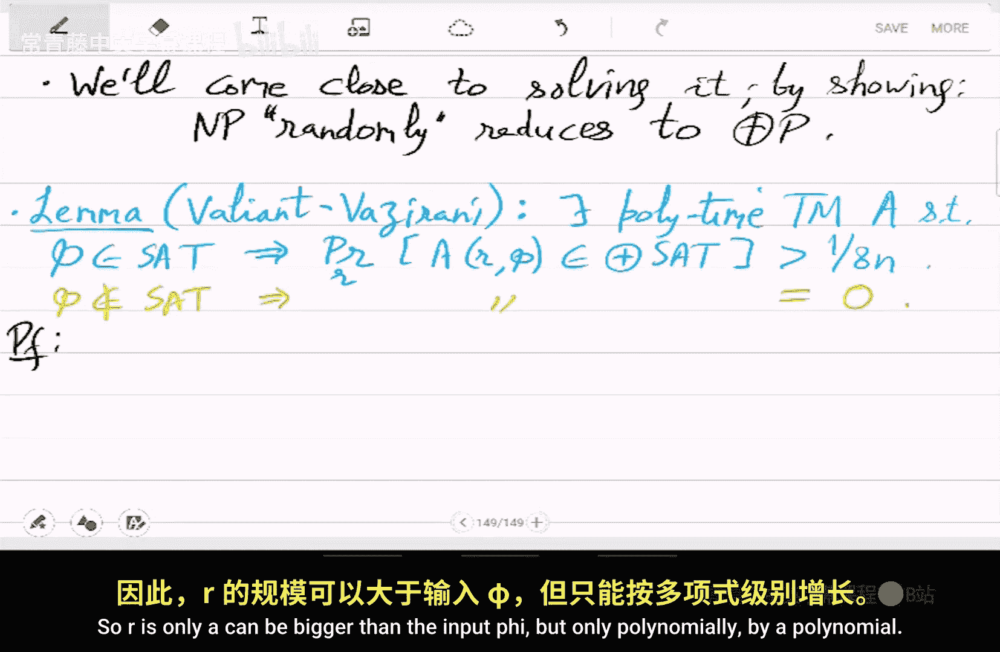
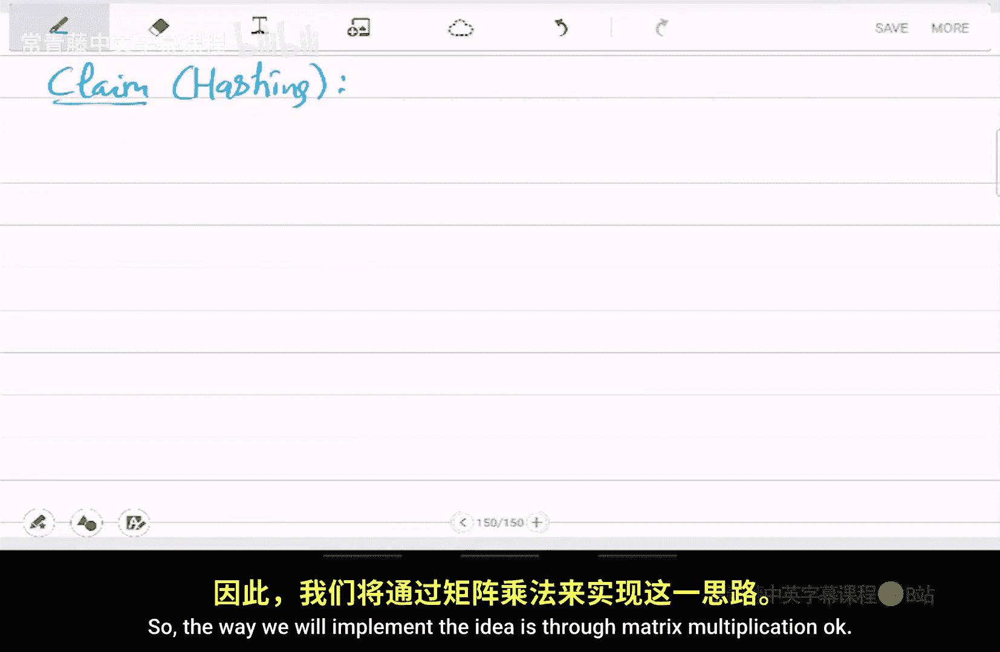
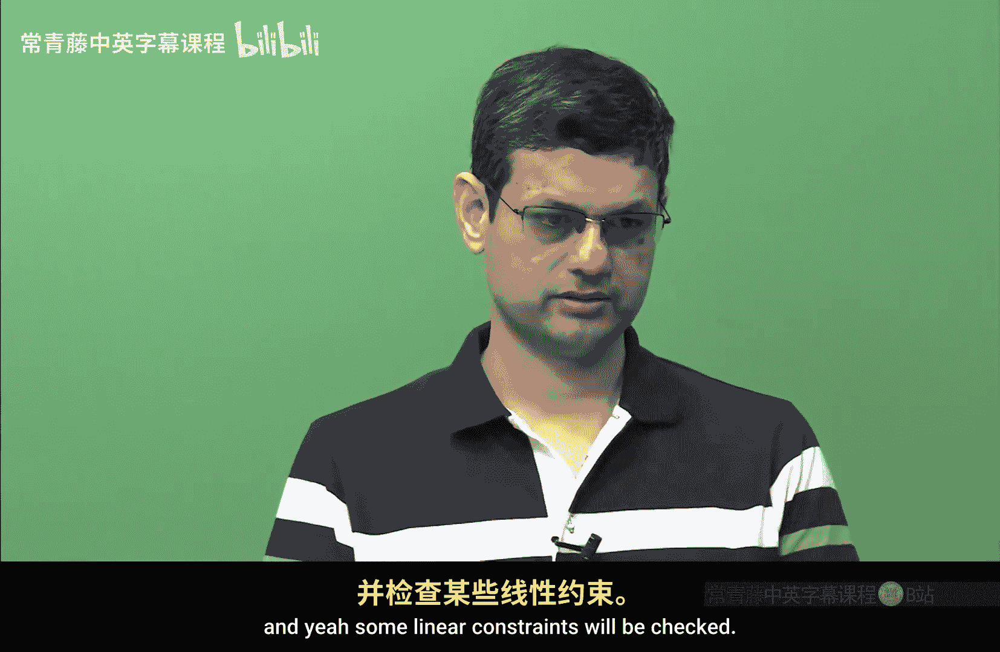
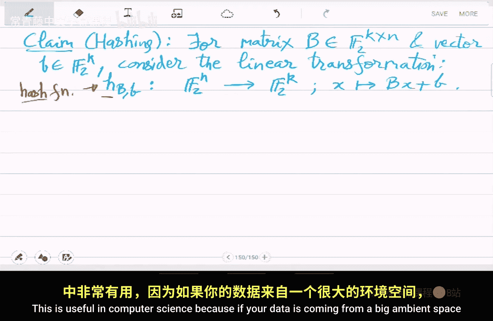
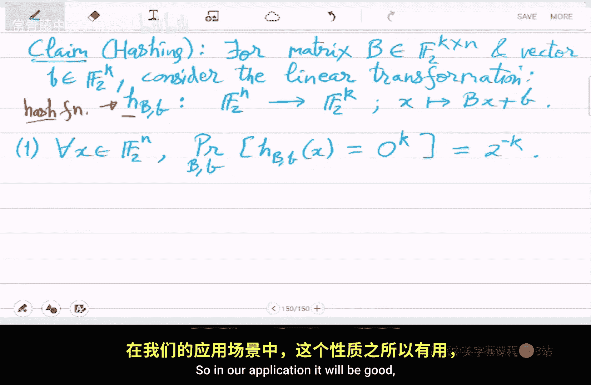

# 印度理工学院【中英⚡计算复杂性基础｜Basics of Computational Complexity】 p31 P31 -BV1LvkgBtEQN_p31-

Last time we finished the proof of。Sharp peak completeness of this。

Special problem of computing permanentmanence on。0，1 metrices。Right。

 so let us write down that theorem， which we proved。So， this theem is。Due to valiant。It's quite old。

So it's we showed that permanent。On 01 metrices。Is sharpie complete。Okay， that's what we should。

 So Shaie completeness means that if you can solve permanent， then。

There is an efficient tuuring machine。Deterministic poly time。It can actually compute。

Any problem in Shop。In that much time。 And so that。Makeixs permanent。Very。

 very different from determinants。Because in a way。

 it means this means that there is no hope of computing permanent。In real life， in practice。

 because Shaie complete means that in particular， it is harder than shops shop set。

As Hard shop said， it is harder than set。Right so it is harder than NP P hard so what well do next is we will compare these two new things pH and sharp P。

these are really new complexity classes， so let's compare these two and how they fit in piece space。

 both of them are piece space。T in peace so。P， H and sharp P。Are both。Natural generalizations。Of Np。

B， H uses。Alterations。alterations。And the second one Shaie， this uses counting。

So either quantifier alternations， they exist for all alternating。On strings， right。

And only constant money for P。If you make it non， if you make it unboundunded， then you will get PP。

 which is where pH is。And Sharp uses counting okay so instead of there exist it asks how many strings exist。

grounding questionation。And that also you can do in peace piece。So the interesting question is。

 how do they compare？Are they unrelated？Or is one contained in the other？Then which one so。

In the 80s， it was thought that there are。Incomparable。

They were thought to be incomparable because pHH has NP and NPs can be solved using Sha P。

But then N to the NP looks like something very different because it has for all quantifier。

Right so we don't know how to convert it is not very clear whether for all can be reduced to counting as well。

And then there exist for all， whether that can be。Reduced to counting。

So they were thought to be an incomparable。So it was surprising when they were shown to be tightly related。

So。Eventually。Sotoda。Proveed。In 19189。That。PH is actually contained in。Be to the shop be。And hence。

 also。BB。Oracle。 So if you are given a P or a shop urle， then you can solve。

Anything in polymer hierarchy， not just N， but also N to the N in。So on。

 And this is a highly interesting proof because it will use randomization。 Notice that this is a。

Containment of deterministic classes， but this will be shown amazingly using randomization probabilistic methods。

So， prove unexpectedly。Users。Randomization。Okay， it's not clear why it should use randomization because it's。

There is no random bits in the question。That's what we will do。 So this will be a very long proof。呃。

So， let's begin。Therell be the basic ideas will be very interesting and novel。For you。食多啦。😔。

9 ninety one。That P。Is in。P to these shops set。In other words， if you can solve shopet。

 then you can solve NP。NP to the N。Sigma 3 and so on。 So what is the， what is the overall idea。

So overall， idea is we give a reduction。Basically， reduce。Sigma， I set。Du。A new problem。

That will call。Paity set。Okay， so this will be stronger than。I mean。

 this is we are we will not just reduce it to shop set， but actually something weaker than shopet。

 which is parity set parity set as the name suggests is。The question of。

Checking whether the number of satisfying assignments is odd。Okay， if it is odd。

 which in particular also means that there is some assignment。Because odd number starts with1，1，3，5。

 so on。And if there is no satisfying assignment， then that is0 so that goes in。嗯。

That's a no instance of parity side， but it may， it is also possible that。

Number of satisfying assignments is two or4 or6。 They also are no instances。

So let us define this problem and the new complexity details。 Let's do that。 So well。

Do this by randomization。Using hashing。Okay， so we will actually reduce s set sat sat to parity set by by hashing hash functions that is the。

Place where randomization will help。 So let's define。Few things。So。Paity sack。Is the problem of。

Identifying whether a given Boolean formula fire。Is a bullion。Formula。

With number of satisfying assignments。Od。Okay， it's not。0 or non zero， but odd versus even。So。

 odd ones are the。Number of5hi odd。Yes instance， number I even， no instance。That's the problem。

 That's the language。And a language， L。Is set to be in parity P complexity class。If。

There exists an NDTM。M。Such that。For all inputex。X is in L。If and only leave。

Number of accepting parts。Of M1x。Is odd。Okay， so parity P is the class of those。 It is。

Weaker version of you could say Shaie where we are not interested in exact counting。

 but only the value mo 2。Right， so whether it's。Or or even。So， clearly parity SAt is partp complete。

That is im。Under P time reductions。So， under poly time reductions。

Pity set is the hardest problem in partp， this is kind of the definition of partp itself。

Like you solve it。Shoopie。And what is open is is it a really difficult question or is it easy that is not very clear。

So is parity p not equal to p。And what is also not clear is， is it related to。

N P not equal to P question。So if we show parity P is equal to P， then。

Does it mean n p is equal to p？Or if you show parp is not P。Does it mean。NP is not B。Right， because。

This is only。More too， counting。From more to reducing。Exact zero or non zero。That we don't know。

 It's not very clear from the definition。Just from the definition。 So let us continue exploring this。

We will actually give evidence that pariteat is harder than。St。Should be as hard as shops said。

 in fact。Will come close to。Solving it。So， what will show is。By showing。That N P。Randomly reduces。

2 par T P。Okay， so then it means that parity P is hard if NP is believed to be hard then parity P is also hard。

 so if NP is not。Equal to P， then parity p is also not equal to P。

 although we don't get a full proof because this is under randomized polynomial time reductions。

And that is where an interesting new idea you will see so。This is the lemma。 we will prove now。

Sovet was Iranian theorem。It's called。So there exists poly time tu machine。E， such that。

If Phi is satisfiable。Then the steering machine， A will。Modify file。

To get odd number of search assignments。Its the probability。That e with using the random bits。

 it will modify phi。To an or to parity set。Int， with high probability。And if P is not in。Then。

 this probability。Is 0。OkaySo lets read this again so we will transform phi using random bits。

To another formula bullolean formulas， lets say psi or E psi is e of R comma P the domestic polymial time except that it is using these random bits R now and not too many right because you have to do it in poly time。

So r is only can be bigger than the input phi but only polynomly。

By a polynomial amount。So this formula psi will be a parity will be in parity set。

Which is equivalent to saying that by definition it is odd number of service string assignments。

With decent probability。

And if I was unsatisfiable， then this will also be。In fact， it will be unsatisfiable。

 So in particular， we are just saying that probability of this happening will be 0。 So。

 so idea here will be to prove something stronger。So， transform Phi。嗯。To a formula。That has。A unique。

Respectively，0。Satisfing assignment。If。F is satisfiable。Respectively， unsatisfiable。

Okay so not only will we make it odd versus even we will actually make it 1 versus 0。Okay。

 so this transformation give will be so powerful。It'll actually make。

Any number of satisfying assignments to 1 and0 assignments to 0。So， this will be achieved by。

A very useful trick in computer science。 That's called。Hashing into buckets。Su。Yi。😔，Basically， hash。

The tourist to。Satisfying assignments of fire。Into that many buckets。K of wheel apply hash function。

And。Map these two 2K assignments into suitable number of buckets。

And so you have to see the details of this to understand the。How this thing is done。

How this thing works。 Okay， this is the rough idea。So， that's the hashing claim。

So the way we will implement the idea is through matrix multiplication。

Okay， the hash function will essentially be multiplying by a random matrix。嗯。

So a satisfying assignments will be multiplied by a。Biometric。And。

Yeah， some linear constraints will be checked。So。So， for a matrix B。😔，Which is， let's say， K cross n。

Elements from。Elements are 01。 It is a binary matrix， but 01 we think of it as。

This elements of finite field。Of two elements。And a vector B。Consider the linear transformation。Y。😔。

With this big B and small B parameters as parameters。So， it'll send。So， think of。

Satisfing assignment or in any assignment that is it's an element。 it's a binary vector。

Thought of it。 Think of it in。In the space f 2 to the n。 So we'll map it to。F 2 to the K。So。

The number of buckets that we are mapping here is actually tourist2 k。So， that's an important thing。

 so。0，1 to the n is map 2。To is2 k。Okay， that is the idea。 So the space of the ambient space shrinks。

So that technically we achieve it by using linear algebra。So F2 to the n。

Is shrunk to f 2 to the K where the relevant parameter T is coming from how many satisfying assignments there were。

Okay， so let's， let's move forward with this implementation。So the way it's done is。X is map 2。B。

 x plus B。Okay， so that is。Think of x as a column vector。And multiply on the left。With this matrix。

 this is possible because b is K cross n x is n cross 1。Right so what you get is a K cross1 vector。

 which is also B so you can then add。So this is shrinking the ambient space from。

Two is to n to2 to k。And this function here is called a hash function。Okay。

 think of Hs as hash function。If you have seen hash functions before， if you haven't。

 then this is the definition。Okay， just a linear transformation。Just a linear map。

Shrinking the ambient space。 This is useful in computer science， because。

If your data is coming from a big ambient space， but you know that the data has small amount of information。

Then you can try to shrink the big ambient space into small ambient space preserving the information。

Okay， so it saves space， it saves communication。And。It saves， it may also save time。

 so that is why these functions are very important。Your passwords， for example， are also hashed。

So it also helps could help in secrecy。So， the properties that are。That make it useful。

Are that for every。Element in the big ambient space。Element X。The probability。They're the hash。

Hashed value of x。Is 0。As you pick。The the matrices randomly。Matrix， big B and vector small B。

 this probability is。1 by the number of buckets。Okay， so remember that in the。Image space。

 there are two is2 k。Possible values， and。The probability that。And X。

Randomly hashed will map to this one element0 to decay。That's uniformly。The uniform probability。

 which is 1 over 2 is2 k。 So why is this good。So， in our application。

 it would be good because if we already knew that there were tourist2 assignments。

Then， when we。Use a random hash。Then， this。The number of satisfying assignments which will map to0。

That will be unique。Okay， so we have come up with a transformation which suddenly makes satisfying assignments two ways to K to 1。

Okay so think of it like this with a decent probability。

So the probability is probability will calculate， but for that we will need this property one。Okay。

 this is for the probability calculation。 So we， we have to， in the end， calculate the chance that。

Two race2K assignments， maps2。The single。The2 to this specific element，0 to decay K。

 So what is the chance that x is unique， that probability will come out to be good。

So this is think of this as falling in a bucket。So X falling in。In a bucket。

 what is the probability of that， Then second property is。For different excess prime。

So we need this for probability estimation。 Okay that so these are technical lemas that we will need。

So， now the probability。😔，That x and x prime have the same hash value。0 to k。Okay。

 this probability is even smaller。So this is why the hash function is good。

 random hash function is good。Probabilities again， on this， on this。Prameters of the hash function。

And。So， which means that。With good chance， X and X will be mapped differently。Okay。

 these satisfying assignments， they go into separate buckets。 So that's the main。Ting。

Elements going into distinct buckets。Should they get separated。

So that's the probability that probability is will show it to be square of the previous one。

 so read this as。2 falling in a bucket。It2 falling in the same bucket。 That probability is。Ler。

And third will be。This is the relevant application we are interested in。

So let S P the set of satisfying assignments。 You can think of it like that。

With the number of satisfying assignments。Let's say， it's between。2 is 2 k -1 and2 is 2 k -2。Den。

The probability。That。Number of。X is in S。That map to 0。Is one。Okay， over random hash functions each。

So you pick a so the experiment is you pick a random hash function by picking random big B and small B。

These are binary matrices， boolean matrices。And then look at where the satisfying assignments are going forward bucket。

So the number of those xs that go to the0 bucket。That's， that's only one， it's unique。Okay。

 the probability of this is。We will show。 its pretty good。So this is。

 we show that this is greater than  one by 8。So with a decent probability。If you are able to。

Make the satisfying assignment unique。So unique X。That's what we have achieved here， okay。Yeah。

 so if you have if you haven't seen hash functions， this may feel very mysterious。

 so let us go through the proof。How such a thing is。How these properties are shown。

It's actually simple probability。So。poof of this claim。So the first property。

So think of first speaking。Bi。Randomly。So if you have only big B big B in your experiment。

Then all that remains to be picked a small be。RightAnd you have to pick it so that b x plus b is 0。

So， the probability。Of picking。B equal to minus bx。RightThat's what b x plus b equals 0 means。

So picking vector B exactly this。What is the chance of it？Well， the number of choices of B is。

Tourists， tourist2 K。 So the probability is inverse of that。This is， this is equal to one over。

The size of f2 to the k。 That's the。Domain of small B。 So that's one over22。Okay。

 so that proves the first property。Now， let's do the second one。

 So the second one we are interested in。嗯。So B x plus b and b x prime plus b。

 both of them should be 0。So， that probability is equal to。B x is minus b， which should also be。

Bx prime。Right。That's the equivalent condition。And so these are two events。 so we can。

 it's an intersection of two events。 So let us use conditional probability。So， you will get。

Probability of。B X prime being minus B given。B X is minus v。Times the probability that。B X。-3。Okay。

 and then we'll simplify this。

