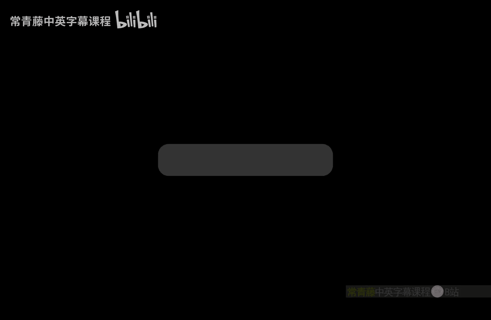

# 计算复杂性基础：P33：Toda定理的证明（第二部分）

在本节课中，我们将继续学习Toda定理的证明。Toda定理指出，多项式层级（Polynomial Hierarchy）可以归约到奇偶计数类（⊕P）。上一节我们介绍了⊕P类，并利用Valiant-Vazirani引理将SAT问题归约到Unique SAT，进而归约到⊕P。本节我们将看到如何利用奇偶（Parity）量词本身，将带有交替量词（∃/∀）的布尔公式归约到⊕P问题，并处理归约过程中的概率放大问题。

## 奇偶量词替换

我们的目标是处理一个带有交替量词的布尔公式ψ。具体来说，我们希望将ψ转换为一个公式ψ‘，使得如果ψ为真，则ψ’以高概率属于⊕P；如果ψ为假，则ψ’以高概率不属于⊕P。这是一个双边错误（two-sided error）的随机归约。

证明思路是逐步替换量词。我们通过归纳法，将公式顶部的∃和∀量词逐一替换为奇偶量词。

考虑一个具有特定量词结构的布尔公式ψ：
`ψ = ⊕_z ∃_x ∀_w φ(z, x, w)`
其中，`z ∈ {0,1}^L`， `x ∈ {0,1}^n`， `w ∈ {0,1}^k`。

首先，我们利用Valiant-Vazirani技术将`∃_x`量词替换为`⊕_x`量词。对于随机字符串`r`，我们可以构造一个公式`τ(x, r)`，使得：
*   如果`∃_x ∀_w φ(z, x, w)`为真，那么以高概率（≥ 1/8），`⊕_x ∀_w [φ(z, x, w) ∧ τ(x, r)]`为真。
*   如果`∃_x ∀_w φ(z, x, w)`为假，那么`⊕_x ∀_w [φ(z, x, w) ∧ τ(x, r)]`必然为假。

这样，对于单个固定的`z`，我们成功地将`∃`量词替换为了`⊕`量词。

## 概率放大问题

然而，当我们考虑最外层的`⊕_z`量词时，问题出现了。对于每个`z`，上述转换成功的概率至少为1/8。由于`z`有`2^L`种可能取值，为了保证整个公式`ψ‘`的正确性，我们需要对所有`z`的转换都成功。这导致整体成功概率急剧下降至大约`(1/8)^(2^L)`，这对于一个高效的随机归约来说是远远不够的（我们通常要求成功概率≥ 2/3）。

因此，当前的核心问题是：**如何将对于每个`z`的成功概率从1/8提升到一个接近1的常数？**

解决方案是进行**概率放大**。对于一个固定的`z`，我们不再只进行一次Valiant-Vazirani实验（使用一个随机串`r`），而是独立重复进行`T`次实验，使用随机串`r_1, r_2, ..., r_T`。

以下是具体操作：
我们检查这`T`次实验中是否**至少有一次**成功。只要有一次成功，我们就认为对于这个`z`的转换是成功的。

**成功概率分析：**
*   **当原公式为真时**：单次实验失败的概率至多为`1 - 1/8`。`T`次实验**全部失败**的概率至多为`(1 - 1/8)^T`。因此，至少一次成功的概率（即放大后的成功概率）为 `1 - (1 - 1/8)^T`。通过选择足够大的`T`，我们可以使这个概率任意接近1。
*   **当原公式为假时**：根据Valiant-Vazirani引理，单次实验**永远不会**成功（输出为真）。因此，`T`次实验的“或”结果也永远不会为真。错误概率为0。

这样，对于每个固定的`z`，我们成功地将转换的正确率提升到了接近1。

## 处理所有`z`的取值

接下来，我们需要考虑`z`在所有`2^L`种取值上的情况。我们希望整个公式`ψ‘`的成功概率（即`⊕_z`量词下，内部转换对于足够多的`z`都正确）足够高。

**整体成功概率分析（当ψ为真时）：**
我们使用**并集界限**来估算误差。对于每个`z`，转换失败的概率至多为`(1 - 1/8)^T`。因为有`2^L`个`z`，所以存在某个`z`转换失败的总概率上界为 `2^L * (1 - 1/8)^T`。
因此，整体成功的概率至少为 `1 - 2^L * (1 - 1/8)^T`。

现在，我们选择 `T = 16 * n * L`（其中`n`是`x`的长度）。通过计算可以证明，此时 `2^L * (1 - 1/8)^T ≤ 1/3`。
因此，当原公式ψ为真时，我们构造的新公式ψ‘为真的概率至少为 `1 - 1/3 = 2/3`。

类似的分析也适用于原公式ψ为假的情况，可以证明ψ‘为真的概率至多为`1/3`。

至此，我们完成了随机归约：`ψ` 可以随机归约到如下形式的公式 `ψ‘`：
`ψ‘ = ⊕_z [ (实验1成功) ∨ (实验2成功) ∨ ... ∨ (实验T成功) ]`
其中每个“实验”都是应用Valiant-Vazirani变换后的公式：`⊕_x ∀_w [φ(z, x, w) ∧ τ(x, r_t)]`。

## 消除逻辑“或”操作

新的公式ψ‘中仍然包含一个逻辑“或”（∨）操作，这阻止了它成为一个纯粹的奇偶量词公式。我们的最后一步是消除这个“或”操作。

考虑一个简化问题：如何将 `(⊕_x F1(x)) ∨ (⊕_y F2(y))` 转换为一个单一的奇偶量词公式？

我们引入一个关键的构造：**“加一”操作**。
对于一个公式`F`，定义`F^{+1}`如下：
`F^{+1}(u, x) = (u=0 ∧ F(x)) ∨ (u=1 ∧ (x=0))`
这个操作的效果是：**将公式`F`的满足赋值的数量精确地增加1个**。

利用这个操作，我们可以构造一个新公式。以下是具体步骤：
1.  对`F1`和`F2`分别应用“加一”操作，得到`F1^{+1}`和`F2^{+1}`。
2.  将这两个新公式取合取（∧），得到 `G = F1^{+1} ∧ F2^{+1}`。
3.  再对`G`应用一次“加一”操作，得到最终公式 `H = G^{+1}`。

现在，我们断言：
`(⊕_x F1(x)) ∨ (⊕_y F2(y))` 为真 **当且仅当** `⊕_{x,y,u1,u2,u3} H(x, y, u1, u2, u3)` 为真。

**原理简述：**
*   如果`F1`和`F2`中恰好有一个具有奇数个满足赋值（即原“或”式为真），那么`F1^{+1}`和`F2^{+1}`中也将恰好有一个为奇数。奇数与偶数的合取`G`是偶数。偶数再加一`H`是奇数。因此，最终奇偶量为真。
*   如果`F1`和`F2`都具有偶数个满足赋值（即原“或”式为假），那么`F1^{+1}`和`F2^{+1}`都变为奇数。奇数与奇数的合取`G`是奇数。奇数再加一`H`是偶数。因此，最终奇偶量为假。
*   其他情况（如两者都为奇数）也可以通过类似分析得到一致结果。

通过这种方法，我们成功地将一个“或”连接的两个奇偶量词表达式，转换为了一个单一的、带有额外辅助变量的奇偶量词表达式。将这个技术应用于ψ‘中的大“或”式，我们就可以最终得到一个纯粹的、只包含奇偶量词的布尔公式，从而完成整个归约。

## 总结

本节课中，我们一起学习了Toda定理证明的核心部分：
1.  **奇偶量词替换**：利用Valiant-Vazirani引理，将布尔公式中的存在量词（∃）替换为奇偶量词（⊕）。
2.  **概率放大**：通过独立重复实验并取逻辑“或”的方法，将每个子问题的成功概率从常数提升到接近1，以应对外层奇偶量词带来的指数级挑战。
3.  **消除逻辑“或”**：通过巧妙的“加一”操作构造，将逻辑“或”操作编码进一个更大的奇偶量词公式中，最终得到纯粹的⊕P问题实例。

这些步骤共同构成了从多项式层级到奇偶计数类⊕P的随机归约，是理解Toda定理的关键。