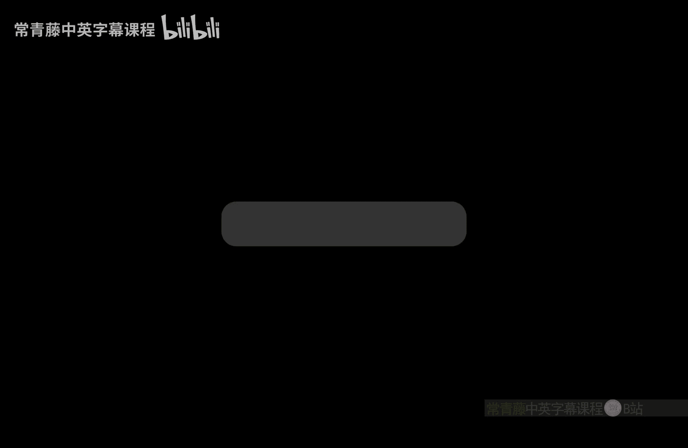

# 计算复杂性基础：P34：Toda定理的证明（第一部分）

在本节课中，我们将学习Toda定理证明的核心部分。我们将看到如何将多项式层级（PH）中的问题，通过随机归约，转化为一个仅涉及奇偶性（Parity）计数的问题。这是理解PH与计数类关系的关键一步。

## 从多数量词到单一奇偶性

上一节我们介绍了证明的整体框架。本节中我们来看看如何将带有交替存在和全称量词的布尔公式，归约到一个仅使用奇偶性量词的公式。

我们从一个具有交替量词的布尔公式开始。目标是将其转化为一个形式更简单的公式，同时保持其真值的奇偶性信息。核心思想是通过引入新的变量和构造，逐步“消除”量词。

以下是实现归约的关键步骤：

1.  **消除“或”运算符**：通过归纳法，我们可以随机地将一个公式归约为另一个公式，其满足赋值的数量恰好增加1。这允许我们移除公式中的“或”运算符。
2.  **合并量词**：利用上述构造，我们可以将形如 **∃z ∀w φ(z, x, w)** 的三重量词结构，归约为仅包含两个量词的新公式 **φ'(z, x, w')**，其中只涉及奇偶性和存在量词。
3.  **转换全称量词**：利用逻辑等价关系 **Parity_x ∀y φ(x, y) ≡ ¬(Parity_x ∃y ¬φ(x, y))**。因为对于固定的x，φ(x,y)的满足赋值数加上不满足赋值数总是偶数（等于2^|y|）。所以，如果满足赋值数是奇数，则不满足赋值数也是奇数；反之亦然。这样，我们就将“奇偶性-全称”组合转换成了“奇偶性-存在”组合。
4.  **递归应用**：重复应用步骤2和3，可以将任意常数层（c层）的交替量词最终归约为一个单一的奇偶性量词公式 **φ''(z, x, w'')**。由于每次归约只引入多项式规模的膨胀，且量词层数c是常数，因此整个归约过程最终只导致公式规模的多项式膨胀。

通过这一系列变换，我们实现了从多项式层级 **Σ_c^SAT** 到奇偶性类 **⊕P** 的随机归约。这证明了引理1：**P^⊕P** 可以对 **⊕P** 进行双边错误归约。然而，这只是一个随机归约。要证明PH包含在 **P^⊕P** 中，我们需要一个确定性的多项式时间归约。

## 去随机化：从模2提升到模2^m

上一节我们完成了随机归约。本节中我们来看看如何将这个随机过程去随机化，从而得到确定性的结果。

核心想法是将奇偶性运算从模2算术“提升”到模2^m算术，其中m是一个较大的数。如果m大于归约中使用的随机比特数，我们就可以对所有可能的随机串进行求和。原始公式的真假将对应于这个和值是“大”还是“小”。

具体而言，我们需要一个代数引理（提升引理）：

**引理2**：存在一个多项式时间确定性图灵机T，对于给定的布尔公式φ和自然数m，可以输出一个新公式φ'，满足以下性质：
*   如果φ的满足赋值数为奇数，则φ'的满足赋值数模2^(m+1)同余于 **-1**。
*   如果φ的满足赋值数为偶数，则φ'的满足赋值数模2^(m+1)同余于 **0**。

这里，-1和1在模2下是等价的，但在更高的模数（如模4）下则不同。这个“间隙”（0 与 -1/1）正是我们去随机化的关键。当我们对所有随机串r对应的公式φ_r'的满足赋值数求和时，根据原始φ的真假，这个和值在模2^(m+1)下会落在显著不同的区间，从而允许我们确定性地判断φ的真值。

## 构造提升：加法与乘法

那么，如何构造这样的提升呢？证明是归纳式的，基于m进行归纳。我们需要学习如何从模2提升到模4，这是基础步骤。

我们通过定义布尔公式上的“加法”和“乘法”运算来迭代构建φ'。

以下是这些运算的定义：

*   **公式加法 (F + G)**：引入一个新的选择变量u。新公式定义为：`(u=0 ∧ F) ∨ (u=1 ∧ G)`。直观上，这分支执行：如果u=0则计算F，如果u=1则计算G。因此，新公式的满足赋值数等于F和G的满足赋值数之和。
*   **公式乘法 (F * G)**：保持F和G的变量集合不相交。新公式简单地定义为 `F ∧ G`。因此，新公式的满足赋值数等于F和G的满足赋值数之积。

有了这些运算，我们就可以从初始公式φ0 = φ开始，通过加法和乘法的组合，构造出φ1，使其满足赋值数在模4下根据φ的奇偶性分别为-1或0。这正是归纳证明的起点。

本节课中我们一起学习了Toda定理证明的前半部分。我们看到了如何将PH中的问题随机归约到奇偶性问题，并介绍了通过模运算提升来实现去随机化的核心思想。下一节，我们将完成提升引理的归纳证明，从而最终将PH包含到 **P^⊕P** 中。