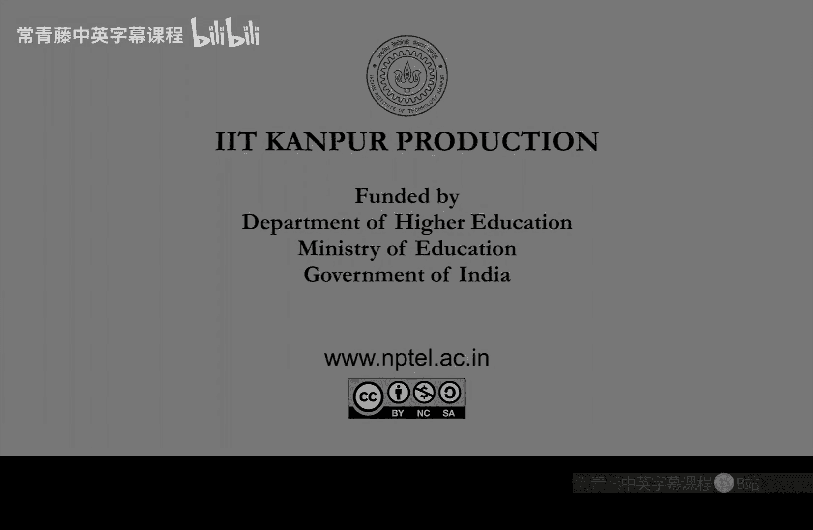

# 计算复杂性基础：P35：Toda定理的证明与去随机化


在本节课中，我们将学习如何完成Toda定理的证明。Toda定理指出，多项式层级（PH）包含于P^#P。我们将通过去随机化之前建立的随机归约来完成证明。

## 回顾与目标

上一节我们证明了多项式层级可以随机归约到奇偶性P类（Parity P）。这是通过将存在量词和全称量词替换为单个奇偶性量词实现的。因此，如果我们能解决#P或奇偶性集合问题，就能在随机多项式时间内解决PH中的任何问题。

然而，我们的原始目标是证明**确定性**的包含关系。Toda定理声称PH实际上包含于P^#P。所以，如果我们能解决#P集合问题，就能在确定性多项式时间内解决PH。那么，我们如何证明这一点呢？这就是去随机化的问题。

## 提升引理：放大模数

我们将通过首先放大奇偶性差异（0/1模2）到更高的模数来去随机化这个随机归约。我们将从模2提升到模2^(m+1)。这样，当我们对所有可能的随机选择求和时，公式值的幅度会变得很大或很小，从而消除了对随机选择字符串R的需求。

**引理2（提升引理）**：给定一个布尔公式ψ，我们可以将其哈希值从模2提升到模2^(m+1)。具体来说：
*   如果满足赋值的数量是-1模2，它将提升为-1模2^(m+1)。
*   如果满足赋值的数量是0模2，它将保持为0模2^(m+1)。

我们将使用加法和乘法运算符来实现这一点。

*   **加法（F + G）**：引入一个新变量u。当u=0时，值为F；当u=1时，值为G。这会使满足赋值的数量相加。
*   **乘法（F * G）**：创建变量x的副本y，并取F(x)和G(y)的与（AND）。这会使满足赋值的数量相乘。

以下是构造过程：

1.  初始化：令 φ₀ = ψ。这在模2意义下是正确的。
2.  迭代定义：我们定义一个巧妙的公式来迭代提升模数。
    ```
    φ_{i+1} = 4 * (φ_i) + 3 * (φ_i)^4
    ```
    这里的加法和乘法是上述定义的运算符。

这个构造的**核心性质**是：如果φ_i的满足赋值数量是-1模2^(2^i)，那么φ_{i+1}的满足赋值数量就是-1模2^(2^(i+1))。如果起始值是0模2^(2^i)，则保持为0模2^(2^(i+1))。

**证明思路**：通过模运算验证。假设`#φ_i ≡ -1 + 2^j * q (mod 2^(2^j))`。
计算`4*(-1 + 2^j*q) + 3*(-1 + 2^j*q)^4`，展开后，在模2^(2^(j+1))下，高阶项（2^(2j)的倍数）会被消去，最终结果简化为-1。对于起始值为0的情况，计算过程类似，结果保持为0。

通过归纳法，只需迭代`i = ceil(log m)`次，我们就能得到满足引理2要求的公式φ_i，其满足赋值数量在模2^(m+1)下具有所需性质。虽然公式的变量数和规模会增长，但增长幅度是多项式级别的（约为O(m²)），因此变换是多项式时间的。

至此，引理2的证明完成。

## 去随机化归约

现在，让我们回到引理2之前的问题：如何对PH到奇偶性P的归约进行去随机化？这将是完成Toda定理证明的最后一步。

**证明思路**：将随机比特替换为非确定性比特。

根据引理1和2，对于PH中的任意问题L，存在一个多项式时间非确定性图灵机M，以及一个多项式m（随机字符串长度），使得：
*   如果x是L的“是”实例，那么对于至少2/3的随机字符串R，M(x, R)的接受路径数为-1模2^(m+1)。
*   如果x是L的“否”实例，那么对于至多1/3的随机字符串R，M(x, R)的接受路径数为-1模2^(m+1)。
*   此外，对于所有x和R，M(x, R)的接受路径数只能是0或-1模2^(m+1)这两个值。

现在，我们构造一个新的非确定性图灵机M‘：
*   M‘在输入x上，**猜测**一个字符串R（而不是随机掷币）。
*   M‘接受当且仅当M(x, R)接受。

那么，M‘(x)的接受路径总数就是对所有R的M(x, R)的接受路径数求和：
`#M'(x) = Σ_R [#M(x, R)]`

由于每个`#M(x, R)`的值是0或-1模2^(m+1)，我们可以分析总和：
*   如果x是“是”实例，至少有(2/3)*2^m个R贡献-1值。因此，`#M'(x)`的幅度接近2^m（很大的负数）。
*   如果x是“否”实例，至多有(1/3)*2^m个R贡献-1值。因此，`#M'(x)`的幅度接近0。

这样，在“是”和“否”实例之间，`#M'(x)`的幅度存在一个明显的间隔。因此，**计算M‘(x)的接受路径数**（这是一个#P问题）就能区分x是否属于L。由于L是PH中的任意问题，我们证明了PH ⊆ P^#P。

## 总结

本节课中，我们一起完成了Toda定理的证明。关键步骤如下：
1.  **随机归约**：利用奇偶性量词将PH随机归约到奇偶性P类。
2.  **模数提升**：通过一个巧妙的公式迭代（`φ_{i+1} = 4φ_i + 3(φ_i)^4`），将奇偶性值的模数从2大幅提升到2^(m+1)，从而放大“是/否”实例之间的差异。
3.  **去随机化**：将随机选择的比特串R改为非确定性“猜测”，并计算所有猜测情况下接受路径的总和。由于模数提升后产生了显著的幅度差，这个总和本身（一个#P函数）就足以判定原问题。



这个证明虽然较长，但引入了随机化作为简化工具，并巧妙地运用了哈希函数和模运算技术，是复杂性理论中的一个经典范例。