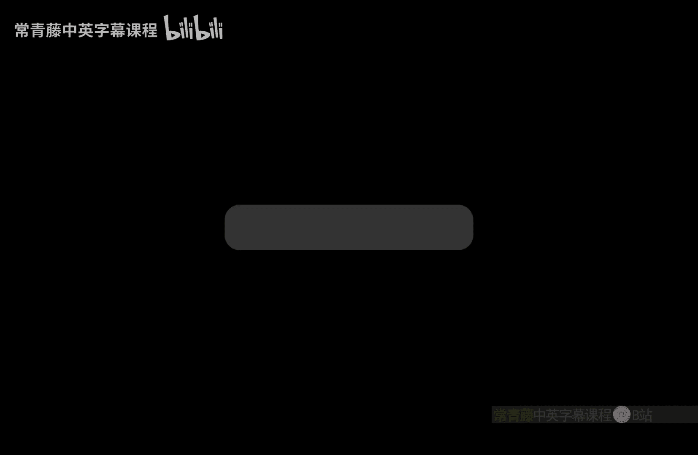

# 印度理工学院【中英⚡计算复杂性基础｜Basics of Computational Complexity】 p36 P36 -BV1LvkgBtEQN_p36-

So in the last class， we。Finish this proof。Showing that。

PH is and P to the Shopie and then we started。Randomization as a resource。In tuuring machines， right。

 we call it probabilistic duringuring machine。So， B PP is。The first class we define。

This is essentially probabilistic tuing machine， which is。Deter which is polynomial time it a。

It's basically what we call we can call it probabilistic polynomial time or randomized polynomial time algorithms。

 and this is a very fast version of P you can see。Okay， it's between P and P。And。

Then we were looking at examples of such algorithms。

Which are very practical algorithms they are widely used。 So first is the question of primity。Okay。

 given a number n。In binary is it prime So for this the randomized algorithm that was first given by Soishtroen is picker random a number a。

And then， compute。This exponunciation here is 2 n minus1 by 2 modern。

This will come out to be plus minus1 and you compare it with the yakobe symbol e by n。

 which is also plus minus1 if the two are the same。Then you。Output yes。

 and is prime otherwise the output no。You can show that this has one sided error。

No error on prime on end prime， but。Some error on。嗯。Composite and。And this shows that。

 let me call the。Clla primes。This shows that the class primes is in B， P P。

You can actually make the probability smaller than one third by boosting boosting also we will see in this class。

Because of one sided error。You can actually show that it's in B PP。 Okay。

 the second example will be that of。Pnomial identity testing。So what is this problem？

So as the name suggests， you want to test for identities。Okay， whether。

Some expression A is equal to another expression B。So we formalize it as follows given。A polynomial。

In n variables。And some coefficients from some field， big。You not come back to。What's a compact way。

For example， as a circuit。Okay， so L G brakes circuit。Expresses a polynomial in a compact way。

 you can act。Inports。Coming on the wires， or you can multiply inputs coming on the wire。And then。

 given output。Okay， it's。Towards the end of the course， we will define what a circuit is but。

Just think of it from electrical engineering viewpoint。That is where the name comes from。

So polymial is given in some compact way and you want to check whether it is0。So， check。Whether F is。

The zero polynomial Okay， so being0 is what is called an identity。

 So you want to check this identity， test this identity。Now you can show as an exercise。

Or let me in the。Previous style， Let me give the algo。 So the algo will be。

The algorithm is just pick a random。Point alpha。From F to the n。An output， yes。If。😔，L， F L4 vanishes。

Okay， so on a random point， if F vanishes， then you suspect it to be。

Identally0 and identity if it doesnt vanish， then you know that it is not0 your output no。Okay。

 and show that this is a good algorithm。This is a good， practical algorithm that you can。Utilize so。

Again， you can show here。Once side did。E off。呃。One third or whatever you want， actually。

Assuming that the field is large。 So you basically， that is one thing you will need。

So without loss of generality， you assume that the field。Is more than。I mean， the。

 let me just say field is large。Okay， so if the field is large， then with a small little probability。

 this algorithm will work。 and it's also one sided because in the。When f is 0， then。

It will always say， yes。If F is not0。Then it may make an error。

But the error is limited by one third probability。And again。

 this means that P I T is in B PP show that。Okay， this again， is by boosting the。Probability。

And there are other examples。In fact， many other examples。So， for example。Finding square root。

Model or prime。In graph theory， there are many examples finding a matching。

So matching has a randomized algorithm。All。As I once mentioned， also connectivity。So， undirected。

Connectivity。In lock space。Okay， that also has a randomized algorithm so。There are many such things。

嗯。Many such problems， which have randomized。Algorithms， either in。Pnomial time or in small space。

So this is go going to be a very useful resource， especially for practical。And algorithm algorithms。

Okay， you can see how these are all。Nothing but probabilistic toing machines。So what is open here。

 There are many open questions。About probabilistic tuing machines。So first is whether pms are needed。

So， whether P Ts。Are required。Okay， that is。The question of whether P is。Equal to B， P P， so。

Let me say R。Petts。Really need it。Are PMs really useful in terms of efficient algorithms or can every PTM be converted into a deterministic steering machine。

Okay， so that is the question of p equal to B PP。 it is conjectured that。

PTms are actually not needed。Up to polynomial time。 So there is theoretical evidence for yes。

Did exist。Theoretical evidence。In favor of this。Okay。

 which you can see in a more advanced complexity course。 Second question is is。呃。

This probabilistic certificate are weaker then。The NP， the。Certificate that a verifier needs。Okay。

 so it is conjectured that BPP and NP are different。

So this probabilistic certificate is much weaker than。The non deterministic。Certificate。In fact。

 later we will show。L P， collapses。Okay， so we will see later that if VP is NP P then the poly hierarchy will collapse so again there is theoretical evidence。

For BP not equal to NP。 So as I have said many times before。嗯。Bpp。BPP captures。Probilistic algorithm。

With two sided errors。Okay， so the error can be on the yes instance， but also on the no instance。

That is， if。ABDM。M decides L。Then， it。Mimic。And error。On x， regardless of。X in L or x not in L。Okay。

 for yes instance， it can make an error。For no instance， it can make another。

But the error has to be limited by  one third。That gets important。Half。Is not enough。

For practical algorithms。 So let us investigate this further what happens if we consider one side error。

Like we already saw in example。Algothms。So， once side did。Eor。Definines classes， R P。And Q R P。

Let's define that， formally。So a problem is is said to be in our time。

If there exists a probabilistic duringuring machine。Running in time。Bgo of T。Such that X is in L。

 So on yes strings。So let me define PMM。😔，The probability that m accepts x。

Or simply a x equal to one。This probability should be。As in BppP， but if it's a no string。Then。

 this probability。Should be 0。Okay， so this is the part which is unlike BPP。in BPP definition。

 some error was allowed here also but。In the definition of R time or what well call Rp。

There should be no chance of error on no strings。On yes strings， there may be some error。Okay。

 so that is what our time is。Running in that much。That many steps we go off to often。And。Yes。

 so then you can define RP P。So the class R P is overall polynomials。Okay。

 and this you can read as randomized。Polyine。Okay， so sometimes BPP RRP， co RRP。

 all of these we call randomized polynomial time and some quick observations that immediately follow。

From the definition。So first is various primes。The example that we gave， right。

 the example algorithm。So this famous randomized polymer time algorithm by Strozen So Solowetroin。

This will。This could make an error in the no instance。But never in the yes instance。

 So it's the opposite of R。 It's co Rp。So prime is in Co Rp。by the earlier。Algothm。

That's actually a co RRP algorithm。Okay， errors on， no， no errors on。Yeses。呃所以啊有。So yes， no errors。

And no there may beers。嗯。The same thing for P I T。This is again， by the。Previous al。Now。

Any RP algorithm is also a BPPP algorithm because the error restrictions are there。Right both sides。

 The error is less than one third。So this is automatically in B PP。The RRP and Q RRP both are in BP。

Now， what is the relationship with N。So one good thing in this definition of Rp is that。嗯。If。

So let me change this a bit。The M X comma are the random bits。And the probability is over。

RightSo now if for some random string or for some string are M accepts x， then it must mean that。

Then it has to be the case that x is a year string。Right， because for no string act。

 there is no such。So， actually， here。R is a certificate。Okay， so。So， R P problems are actually in。

NP they are certifiable。And similarly， Co Rp。Isn't Q and P。Right， so this is because。

Or is a certificate。And the pM M is the verifier。Note that on the other hand。

 we don't know whether BP is in NP right so that is。In the definition of BPP。嗯。

The R actually doesn't certify because error is on both sides， so。

Just by finding an R is that Mxr is1。You are not really sure whether X is in。L。

 whether x is a y string。Okay， so this was。Not really clear。 It didn't really mean。That it's in NP。

 okay。And。Can we use PTM？Where with no error。So are there pms with no error？嗯。Yeah。

 there is a way to define this and still not being completely deterministic so。We can do this。

By making。Make the time complexity。Or random variable。Okay。

 so we can talk about whether the what the time complexity is we can talk about the expectation。

And that is called zero sided error。Probabilistic tuuring machines。Okay。

 so that's Z P P complexity class。So this class will capture proistic tuuring machines which make no error。

But yet the time complexity is not deterministic。 Okay。

 it's random variable So you can talk about its expectation。

These are also called Las Vegas algorithms。So let's define this。So， consider。

Probilistic tuing machine M。And。Random variable。Daying。

Time complexity of M as a function of the input。On any input text。So， we see。That。M has。

And expected running time Tn。If。😔，For all input sex。The expectation。O。

Over the random bits that are that M will use。Okay， the expectation of this time complexity is。

And in fact， number of steps is。P of size of x。Because notice that we are not talking about any error。

 There will be no error， but the。Number of steps may be exponential， doubly exponential， whatever。

But then expectation will be will be t。Okay， so as for the C mix， as you change our。Uly。

Time complexity will be t or smaller。And based on this， we can define Z time。

So L is in this complexity class if。There exists a probabilistic tuing machine。That。😔。

Coectly decides。No error is made， although random bits are being used， but error is not made。呃。

L is decided correctly， in expected time。Around T of N。Okay， so the expected time complex is around。

To the order of T ofn。Then you say that l is in Z time1。嗯。😊。

And this as always immediately defines your。Notion of efficiency， which is Z， P， P。In this case。

It's the union。Over that time and to the C。Right all polynomials。 Now， this is an interesting class。

 It has quite interesting properties。 You can actually relate it with B PP， R P， Co R P， so。Let's。

Do a simple yet non trivial proposition。So， Z P is in。R P intersection， Co R P。Okay， so。

What this is saying is that Z P is actually。A better algorithm than。R P and Co Rp。Okay。

 so these are these problems are potentially。More special than the problems in RP P。And obviously。

 the in the previous proposition， we have shown that both Rp and Co RRP are in B PP， so。

This all this business is happening inside BPP。So this set of algorithms， they are called Las Vegas。

So the randomized algorithms of the ZP type we are called Las Vegas。Weil。😔。

Rranandomized algorithms of PPP type they are called。A。Monte Carlo。Okay。

 so these are some old fashioned names。But we will just refer to Z PPP， RRP， Co RRP， and BP。

 and this is the relationship。So notice what you have to show here is that this is no error or zero sided error。

This can be reduced to。嗯。One side it， but then the time gets fixed to polynomial。ok。

So the idea is that ZPP algorithm time is unlimited。You trunccate at some point。Okay。

 and then show that the error probability will be。Bound it。So you get an R。

This will be an interesting property。 Second， interesting property is。

Our more interesting property is that。If a problem has both RPp and coRP algorithms。

Then you can combine those two and get zero error。Okay， so intersection actually is equal to Z P。

That's the third property。So， ZPP is actually。RRP intersection， Co R P。And。The this RP is in NP。

 right that you。Remember。So， this is in。NP intersection， Co N P。Okay， so RPp core RRP said PP。

 they kind of overlap。And。These are very special。Algorithms。Okay， in fact， you can also。

 this is between。P and NP intersection co N P in particular you don't expect Z P。

To be solving NP heart problems。Okay， otherwise， the hierarchy will collapse。Okay。

 so let's see the proof。Let。L B in Z， P P。Let it be decided。By a probabilistic tuuring machine M。

With expected running run time。Do you。嗯。Now you want to show that L is in Rp。So let's do that。

 given an algorithm。So on input X， what you do is。You run。M of x。For three times the expectation。

Okay， so expected runtime is t of n， you run it three times the expectation。

And if the answer has come， it must be correct， output that if the answer hasn't come yet。Output， no。

So， if。output， no。If you no leave。X is not accepted。In these tips。Okay， so if x remains unaccepted。嗯。

The machine did not decide anything you output no if the machine decided。And said yes or accept it。

 then you say yes。Or if the machine has rejected in these many steps， then obviously you say。No。Okay。

 so do this and。Let's now analyze this from Z from R P perspective。It actually shows that L is in Rp。

So， if。Xs are no。嗯。String， then。Then definitely you will output no。Wait。

 because you will simply not see yes。In this green algorithm。 So you will output no。

So that's correct no error。If x is in L。Then what is the chance that the algorithm will not stop in three times the expectation？

Okay， so that chance is smaller than one third。So let me name this， actually。😔，M prime。

So probability that。M prime x。This new algorithm and rejects X this probability is。

The same as probability。That M。On x。Takes greater than。Three times。D of X time。

Which is less than equal to one third。But the definition of expectation。It is also called Markov。

Inequality。Okay， so by Markov inequality， you get probability less than equal to 1 third。Which means。

That we have shown。On yes， there is some error。On no， there is no error。 So L is in R P。Similarly。

 show。That ill。Compliment is an R P。By a similar approach， and this means that。

L is in R P intersection， Co Rp。whichch means that。Z P， P is contained in R P intersection， Co R P。

Okay， so that proves the first property。🎼。

