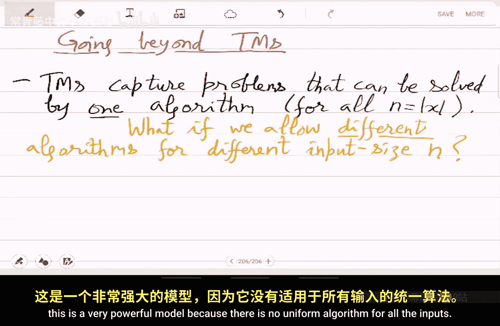

# 计算复杂性基础：42：图同构非NP难性的证明与布尔电路简介


在本节课中，我们将学习如何证明图同构问题不太可能是NP难问题，并初步了解一种超越图灵机的计算模型——布尔电路。

## 概述

上一节我们介绍了图同构问题属于BP·NP类。本节中，我们将基于此假设，通过一系列逻辑转换，证明如果图同构问题是NP难问题，将导致多项式层级在第二级塌陷。这是一个不太可能发生的结果，从而为图同构问题“不太难”提供了理论证据。证明完成后，我们将引入一种新的计算模型——布尔电路，它允许算法随输入规模变化而变化。

## 证明的核心思路

假设图同构问题是NP难问题，那么它同时也是coNP难问题。我们将利用这一点，将一个Σ₂（存在-任意）形式的语句，通过归约和量词转换，最终变成一个Π₂（任意-存在）形式的语句。如果成功，就意味着Σ₂ ⊆ Π₂，从而导致多项式层级在第二级塌陷。

然而，这里存在一个复杂之处：我们已知图同构属于**BP·NP**，而非简单的NP。这意味着归约过程中会引入随机性（“大多数”量词），使得证明比基本思路更复杂。

## 证明步骤详解

### 步骤一：初始归约

我们从Σ₂集合的一个实例ψ开始，其形式为：∃x ∀y φ(x, y)。

由于假设图同构是coNP难问题，我们可以将∀y量词后面的部分归约到一个图非同构实例。因此，ψ被转换为：∃G (G是一个图非同构实例)。

### 步骤二：利用BP·NP性质

已知图同构属于**BP·NP**。这意味着图非同构实例G可以被替换为：∃a (多项式时间图灵机T在输入(G, r, a)上接受)，并且这个陈述对**大多数**随机串r成立。

因此，ψ现在等价于：∃G [大多数r ∃a T(G, r, a) = 1]。

我们得到了一个包含∃、大多数和∃量词的公式。

### 步骤三：交换量词

我们的目标是交换“∃G”和“大多数r”的位置。如果能将公式变为“大多数r ∃G ...”，那么我们就可以利用BP·NP的性质将“大多数”替换为“∀∃”，从而将Σ₂语句变成Π₂语句。

我们通过一个矩阵来分析：行代表随机串r，列代表图G。如果ψ为真，则存在一列G，使得大多数行满足条件。这自然意味着，对大多数行r，存在某个G（可能就是原来那个）满足条件。因此，量词交换在ψ为真时成立。

难点在于证明当ψ为假时，交换后的语句也为假。ψ为假意味着：∀G，大多数r [∃a T(G, r, a) = 1] 不成立。即，对每个G，大多数r会拒绝（无论a取何值，T都输出0）。

为了完成交换，我们重新定义“大多数”：要求成立的概率超过 1 - 1/(2^(2n))，即错误率呈指数级小。设随机串r的长度m远大于输入规模n。通过概率放大和计数论证，可以证明，在这种情况下，“∀G，大多数r拒绝”意味着“大多数r，∀G拒绝”。因此，量词交换在ψ为假时也成立。

综上，我们证明了ψ等价于：大多数r ∃G ∃a T(G, r, a) = 1。

### 步骤四：消除“大多数”量词

最后，我们利用**BP·NP ⊆ Π₂**的标准证明方法，将“大多数r”量词替换为“∀s₁ ∃s₂”的量化形式。

于是，ψ最终被转换为：∀s₁ ∃s₂ ∃G ∃a T'(s₁, s₂, G, a) = 1。这正是Π₂语句的形式。

### 结论

因此，我们展示了任何Σ₂语句都可以在多项式时间内归约为Π₂语句。这意味着Σ₂ ⊆ Π₂，从而Σ₂ = Π₂，导致多项式层级在第二级塌陷。这是一个极强的、被认为不太可能发生的结论。所以，我们最初的假设（图同构是NP难问题）很可能是错误的。



这个证明技巧为许多同构类问题的非困难性提供了理论证据。它表明问题可能不“难”，但并未给出解决问题的具体算法。

## 引入新模型：布尔电路

随着课程接近尾声，我们将开始学习比图灵机更强大的计算模型。图灵机刻画了可由单一算法解决的所有问题，该算法不随输入规模n无限增长而改变。现在，我们考虑一种模型：允许为不同的输入规模n使用完全不同的算法。

这种模型非常强大，因为算法之间可能毫无关联，在实践中可能难以实现，但它能提供重要的理论见解。一个优雅的建模方式源自现实世界的**布尔电路**。

### 布尔电路定义

一个在n个变量上的**布尔电路C**是一个有根树，其组成部分如下：
*   **叶子节点**：是输入变量x₁, x₂, ..., xₙ。
*   **内部节点**：是逻辑门，类型包括**AND（与）**、**OR（或）**、**NOT（非）**。
*   **根节点**：是输出。对于需要输出多位字符串的函数，可以有多个输出节点（即多个根）。

计算从叶子（输入）流向根（输出）。

### 电路示例

例如，两变量异或函数 XOR(x₁, x₂) 可以用以下电路实现：
```
输出 = (x₁ AND NOT x₂) OR (NOT x₁ AND x₂)
```
其电路图是一个树形结构，顶部是OR门，它连接两个AND门，每个AND门再连接相应的输入或其否定。

### 电路的资源参数

与图灵机有时间和空间资源类似，电路有以下主要资源参数：
1.  **扇入**：一个门可以接受的输入线数量。
2.  **扇出**：一个门的输出可以驱动的后续门数量。
3.  **规模**：电路中门和连线的总数。
4.  **深度**：从任意输入到输出节点的最长路径上的门数。

### 一个重要观察

对于任意一个n比特的布尔函数f，总存在一个布尔电路来计算它，其规模最多为 **O(2^n · n)**。证明思路是：由于只有2^n种可能的输入组合，电路可以枚举所有输入并直接给出对应输出。

## 总结


本节课我们一起学习了如何证明图同构问题不太可能是NP难问题，其核心是通过归约和量词操作，推导出若该问题为NP难将导致多项式层级塌陷的矛盾。随后，我们引入了**布尔电路**这一非均匀计算模型，它允许算法随输入规模变化，并定义了其基本结构和资源参数。在接下来的课程中，我们将基于布尔电路定义新的复杂性类。