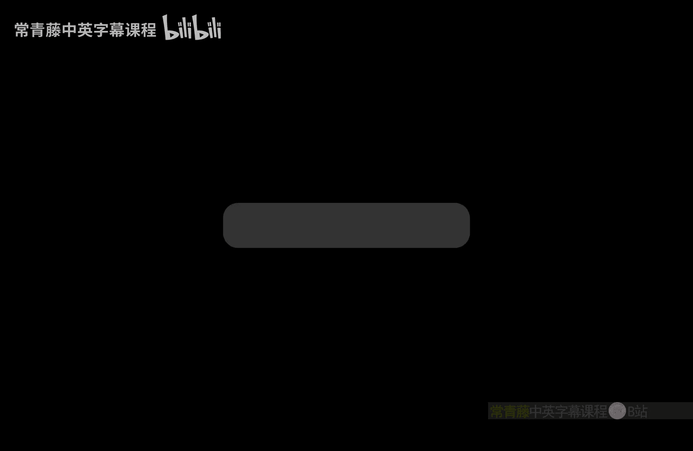

# 印度理工学院【中英⚡计算复杂性基础｜Basics of Computational Complexity】 p45 P45 -BV1LvkgBtEQN_p45-

So。There exist V5 Yucoma V where use is fixed。Is a sad instance because it is trying to find this satisfying assignment。

V。And since we assume that SAAT has policyized circuits， circuit family CM。

 so why not pick CM where is M is the size of the instance。And give this。U N Phi。Do see him。

And now it will correctly answer。It will answer one if the if there is a satisfying assignment and now let us try to find this assignment。

So， C can be used。To， in fact。Find。呃。A satisfying assignment， v。So how is that？Basically， fix V。

 So first， you'd have checked that。That CM U Phi is1。Wr this。 you have checked。

So then what you can do in the second step。Is fixed v 1 to 1 V12 0。So， now， if。Xin。😔，You gama fi。😔。

V1 equal to 0。If this is one。Then， we have found。Then， we have found we。is。If this is false。

 then it means that you have to set one to one。One of them has to work right both cannot fail if both fail then it means that CMU 5hi is unsatisfiable。

But that step1 is ensured it is satisfiable。So next， what you can do is。You go it。Yufei。😔。

And whatever we you found out。So we when we will not， we just use what we got and we too。

 we can now play the same game。So whatever we was fixed in step 2。The event was defined here to be。

0 or 1。 And now V 2， will try to fix。 So if v 2 equal to 0 works， then。Is。You set V 2 to B。Wen。

So now V1 V2 both are fixed and U。Keep going。And now， you can output。Values。V 1， V 2。And V。

 we didn't say how many variables there are in B。好。Suppose it was in。Cannot put that。

Okay so this is a satisfying assignment。That you have found。So this V is a satisfying assignment。O。

Fi。You go movie。So you see using CM， you can actually compute。A satisfying assignment。So。

 let's call this。Thing we just did。We can convert it into a circuit and call it C prime。So。

 convert this algorithm。Into a circuit。Call it。Xim plane。Okay。

 so CM prime basically output outputs the satisfying assignment。Suium prime， when given。Fi given。

We are writing it as U comma 5hi。Is equal to a satisfying assignment v。Assignment V。Off。F you。Okay。

 so it outputs an end stream。That's the circuit。Simbri。So， so this means。That now， we can write。

If there exists of V。If this is true。Did exist of we。

Of there is this satisfying assignment we then indeed。

We can just plug in instead of we we can plug in this C prime。Andt。V어 ver。

So if there is a satisfying assignment。😊，Then C prime ecomifies that， it works。

And if Cm prime you come up， I cannot give an output。That satisfies why you come a dot then。

It only means that。There is no satisfying assignment。 So now。You can。Rewrite S。

Right that that was for all their exist phi for all you。

 their exist p phi you come away that is why we can rewrite。So， doessi。Is it So so was what so was。

For all you， there exist， we。F yoga movie。Is equivalent， too。That there exists a circuit C M prime。

Says that whatever is， whatever you。String U is given。5re Yo comma C M prime。With p。Coma US input。

 accept。Okay， so this is the beauty of the circuit what it has done is。

It has flippedbed for all they exist to， they exist for all because now this there exist is acting on circuits。

Which are not too big。RightC prime is onlypoliized。Let me mention that。So。

 CM prime is a policy circuit which you are looking for exist if that exists then no matter what you is for all you。

5 you。Coma this output of C prime。Will force fight to accept。So size equivalent to this。

And that means that we have put。P2 S in sigma 2。Which means that。P 2 is sigma 2， which means that。

The poly hiarchy collapses to sigma 2 right So that finishes the proof of car ppton theorem that if sat and has boolean circuits。

Then the polymererarchy collapses。And there is a nice corollary to this， lets also do that。

So suppose that something even more drastic。Happens。Exponential time algorithms。 They are all。

 They all have。Policize circuits。So all the exponential time solvable problems can be solved by。

Doewing machines with advice。In polymial time。Then what will happen？

Then the same thing happens actually x becomes equal to sigma 2。This proof is。Similar to what we did。

 so。The idea here is。Simulate or check every step。Of the tuuring machine。Of the exponential time。

Duringeruring machine Okay， it is any problem L in will have an exponential time during machine。

 Look at its steps。 The steps are easy to check。And basically。

 there will be a circuit that can do that of the exponential time duringing machine。By using the。

Circuit。If there is a circuit that exists for X， then every step we will。Check by that circuit。Thus。

 simulating。呃。So expression machine， let's call it。 Give it a name M。The simulating M。By sigma 2。

Okay， let's， let's see the implementation of this。How is this done， So suppose。A is an exp。

And it has a。Policize circuit。L has exponential first exponential time tuuring machine。M。Assume that。

It has a circuit， also。Poly in size。Circuit， C N。The circuit family seen having polymial size。Comps。

The Geth bit。😔，Of the Iat configuration。Of M running on x。Okay， so this is implied by。Aen。

 P slash polyly。We have CNN。From。We have seen as。L is in P slash poly。Okay that basically。

If you want the Jth bit of the Ith configuration， any bit of the Ith configuration of M running on x。

 clearly that is computable in exponential time and since we have assumed x pin P s poly sorry wish I should say x pin P s poly。

Since we have assumed that x pi in P slash poly。This circuit will exist。Okay， which computes。

any bit you want your favorite bit from the I configuration。And now， we can。

Check each and every step of M。M of X。Using quantifiers。Let's do that。So。So， observe that。X is an L。

If and only， if and only for every。😔，Configuration， I。And for every。bitit。Position。Zhi。This。

 or did we use C。eight。😔，Susian on X comma， I comma J。Duxin。😔，Xコoma。I plus 1 g。😔，This is a。

Validt step of him。Right so what we have written here is something something obvious What what this for all。

Icomode checking is。Every possible configuration。To the next。Happened in the correct way。

Following the finite control of。Doing machine M。Given inputex of length end。Okay。

 this can be this is easy to check this is in polynomial time。This can be。

 this isn't poly time because you just have to look at the。What look at the finite control of M and。

A。😔，What that dictates like look look at the transition function basically。From there。

 it will follow。So this can be checked from。Easy to check。From the transition function， del time。

Right， so using the transition function， it can be easily checked whether this is a。

Valid step we have broken the combination two steps and。We have applied for all operators then。

Then M must be accepting。X so x is an L。 If and only if M of x is1。If anyone leave。This happens。

Now all you have to do is。😔，I mean， the circuit， you don't know。So that we can say。

Using existential quantifier。So this means that x is in L。If no leave。There exists a circuit， C。In。

Says that for all I。For all G。This chi。Bes2。Okay， that's all。So。If x is a yes string。

There will exist a circuit。So says that for all the configurations which which are exponentially many and for all the bits in the configurations。

 which is also exponentially many。嗯。If you do a check。Then the tick matches。Okay。

 and since the check matches， it matches， that is what M would be doing。Identally identical， I mean。

 it's a thorough check of the M of x computation。And。Hence， it is equivalent to。

X fingerer yes string。So this means that l is in sigma 2。Right， so X is in sigma to then。

And once X in sigma 2， what happens？So everything above sigma between x sigma 2 an x。

 they become equal。Sigma 2 then is equal to polymial hierarchy， which is equal to。P is to shopy。

Which is equal to in p space。And which is equal to x。Right， so。That was the。

That was what we had claimed。 So if x has polymial。Size circuits。Then， essentially， these。呃。

None of this do we believe， but it will happen。OkaySo this is theoretical evidence that Xs cannot have polymer size circuits。

 but it is an open question。So， that is open。That X is not in P slash poly。Okay。

 we conjecture that XP is not in P slash poly， but we don't know。For sure。 And obviously。

 we also conjecture that。N P is not an p slash， polyly。

Okay so these are the famous conjectures and we have shown theoretical evidence for them。Here。Okay。

 so what do we。Do next。Right，So tuuring machines with advice， even they cannot solve。St。Andng。

Let us and they are equivalent to polymial size circuits， let us give another interpretation。

Of circuits， third interpretation。If you will。That is to do with parallel computation。So。

 tuuring machine。Or algorithm。It's a。This is a sequential way of doing things。Of solving a problem。

Why is it sequential because duringuring machine algorithm gives you after one step what comes next？

And what comes after that and so on。There is no idea of solving many things at once。

That is what you want in parallel computation。So how do we model that properly。

 that' is the question。So what about parallel algorithms。Where do they live。Who models them。Soう。

Let us define some terms what do we mean by per so a decision problem。Or， in fact。It will not matter。

 so any problem。Functional as well， A problem L。We see。Has an efficient。Parallel algorithm。If。

On all the inputs。So for all length and in that length， all inputs。Whether x is in L or not。

Or doing this， I mean， given given input text solving the problem L。This Lx。Can be solved。Yinner。😔。

Polynomial in。Loin time。Which is very fast。Right for on input of size bit size n。

You want to solve a problem in polylogin time， which means you cannot not even see the whole input。

But what is parallel in this so for parallel we will actually say that the number of processors is is many so can be solved in polylogin time。

By a parallel computer。That uses。Polyan processors。Okay， so。This problem L。

 we will say it has efficient parallel。Algorithm。If for all imports of lengththan， asN is growing。

You can solve the problem on this input。Y。Ponomial in polylogue。Polylock time。And pollan processors。

Okay， this is important。So you when you talk about pal computation。

 you actually want many processors because one processor can do only one thing at a time。

But many processors can do many things。And since you have polyan processors。

 they can look at different parts of the input。They can overall cover the whole input。

And maybe together they can solve it much faster and this polyloggan is much， much faster。

So you have to， to note that。Bly log in。It is much， much less than n。Okay。

 so in terms of the input size。The time is much， much smaller。

 so this is the advantage of parallel computation over sequential。

Is there an interesting example which？Can be solved in parallel algorithm fast。

Or parallel computer fast。Yeah， so show that the。For n bit。Integers。X and y。X plus y can be computed。

In only login time。If you use many processors。So by using order end processors。Right， so。

While it will take， I mean， if you do it just manually by one processor。

You at least have to go through the。Lent of X and Y。So that will take order and time。

By one processor。So sequential algorithm will give you linear time but。Parallel computer gives you。

Exponentially lower than that。And this we will next time， model via circuits。

