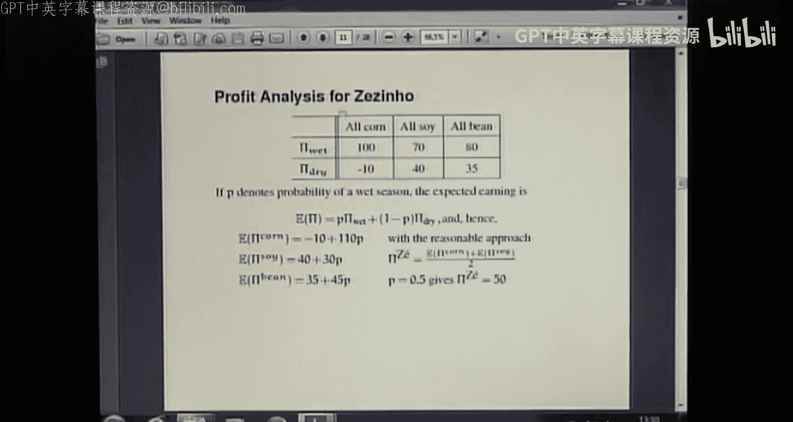
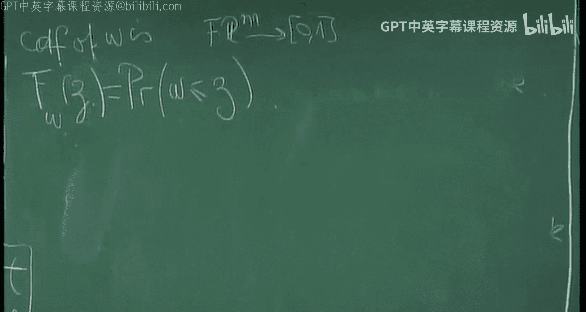
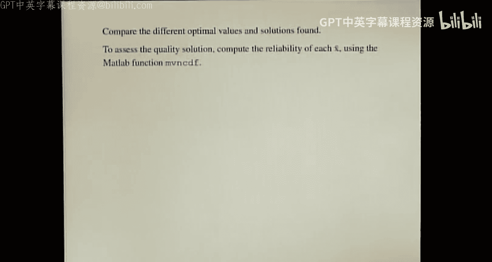

# IMPA《随机编程｜Basic Course on Stochastic Programming 2016》中英字幕（Claude-3.5-sonnet p02 -02-Basic Course on Stochastic Programming - Class 02.zh_en -BV1tH92YXEnd_p2-

Okay， he， welcome to our second lecture of the basic course in stochastic programming。 today。

 well have some blackboard writing and slides。 And before starting the blackboard。

 I want to point out a mistake that was pointed out。

By Cars here in the computation of the expected profit from corn， I had a 100 and it 110。

 So I I already uploaded the right version。 but just for you to know this is just so。

The sum of those twos， it's the the weight sum of those two options。 And then it is 110。Okay。

 so now we'll go switch to the blackboard because I want to revise with a slightly different notation of what we did last week。

 last week。 No， last class。 and then continue， I will continue with the slides。

 because today I would like to leave you a homework。

So I will prepare then the material for the homework by writing in the blackboard。Okay。

 so what we saw is that when we have a linear program of the form。Minimize C transpose x， subject to。

呃。A X。Leger or equal to B， and we have x。啊。We had this form。 We had written the problem in this form。

 Now， it would be more convenient to separate constraints that are deter deterministics from those that were subject to uncertain data。

 So the methods here had one line was a capacity constraint。 That was a deterministic。

 independent of the。Uncertainty， and then two lines that corresponded to the uncertain productivity and demand。

 So we will write the problem now in this form， minimize C transpose x。Sub to x。Let's write it nicer。

 X belongs to a set capital x deterministic。 This corresponds to the capacity constraints。

 And then we have。A matrix T times x larger than a vector H， where T is mat than M times。And matrix。

If x is a vector in R n。And H is a vector in R M。So for our example。

 we have two m equal to constraints that are uncertain。

 This correspond to correspond to the demand constraints。 and we also have two products。

 oil 1 and oil 2。So why we are doing that is because now T and H are unknown。

And the notation also prepares what will come when we study to stage program programs because T is the technology matrix。

 And you will remember the name。 And this is why the the it a capital T because it linked to the productivity right。

 it refers to how we call the produce gasoline from the two qualities of oils that we have。

 So all these stochastic models come from problems like the one in our example And so the notation。

 the user notation for the variable X that is the here and now variable is T X is T from technology。

Okay， so what is the paradigm of stochastic programming。 We don't know TNH。

 but we do know a probability distribution for the uncertainty。

So what this means that uncertainty is expressed。By scenarios or。喂。C爱 do。嗯。

Cnas means realizations of the uncertainty。 So different possibilities for the demand of each type of gasoline in our example。

And these scenarios can be a continuous number， an infinite number or a finite number。 So。

 and we know， so the we assume that the probability。That。The age becomes some。DJ。H gay。Is big gay。

And is known。 And these for a k that belongs to some capital K that can be a finite set or can be an infinite set if we consider the continuous case。

 for example， usually， of course， in the computations will have a k a finite number of sets of of scenarios。

Okay， so， and we will also consider today an even more simple case here that is where the technology matrix is deterministic。

 So only a certainty in the demand。So special case。The deter deterministic。Only age is。Uncertain。

And then we will write it。 We will write the equation。

 Then we have our equation on the stochastic inequality T X larger than E than H。 sorry。

 instead of writing H of of C， we will write directly。

And since we said that random variables were theynot by Greek letters， then we will write it。

Write it as T， X rather equal than some omega for omega。In R M， So it's as many as constraints。

 a random variable。A random variable and since we are specializing and specializing and specializing。

 we will consider that omega follows a normal distribution This is because I want to trade the ideas and the procedures of the different approaches。

 And in this way， it will be constructive approach。

 and you will be able to implement some models later on in Ma during the weekend。😊。

So the question was why I am specializing into the case of deterministic technology metrics。

 And it is because I want to be able to write explicit probabilistic constraints， just constraints。

I for that model to simplify。The make the calculations more explicit。

 even if they are still a little involved。ESo in our case。

 this means that we know for certain time how much oil will arrive from the platforms or from the international market。

In the hydrother problem， it means that we know。How much production will be available from each unit that is producing in electricity。

It is， It is the case actually for the， the planning problem in Brazil of energy。

 It is not the case if you， the if you have snow melting snow or things like this。

 then the technology metrics can be。A valuable。Okay， so， but now we are with a T that is not random。

 The only randomness then is in the right concise， and it's expressed by our Greek glitter omega。

Okay， and then as I said， we will go a little further in our specification。 Omega has。M components。

Omega I， and each one has a normal distribution。嗯。Follows a normal distribution with mean omega t the I and。

Valariance， sigma。I square。Okay， so。And look here that I'm considering each component independent is what I said when we about the were considering the variation in the gasoline in the demand of gasoline of premium type or of standard type to be independent。

 which is a simplification because we， we can think that when somebody doesn't have money to buy premium gas will buy more of the standard gas。

 But well， here we are in this it this is， as I said， it's a model。 And in this model。

 the components of the our random vector。Have an independent distribution。

 It's not a joint probability distribution for the vector in R M。 It's for each one。

Of the components， then for。I between1 and M。So I would write here a little。

What would be if they were the distribution was joint if it was， they were not independent。The joint。

Okay。呃A。Then we think omega now as a vector has a normal distribution。

With some mean that is omega tilde。 And here， instead of having yes， that be finish。

 instead of having a standard deviation will have a correlation matrix。And so， we will have sigma。

And静问て。Okay， so we have another question。买 the馒头。It's， it is。

 it is a model in the in the So the question is， what's the meaning of a negative demand in the model that you will use。

 we will have that the demand is 180。 I think it was plus omega。

So it will be variations over the right hand side that we already have。 For now。

 I will write like this because it saves some chalk。So。

 and then it will be sound because it will be variations that increase or decrease this deter deterministic number。

But it's important always to pay attention to the meaning of the model。 of course。

 it's what we were talking we were mention in the last class。Okay， so we have this setting。

That is simple， but still complicated enough to illustrate the issues。

 So that means that we have the problem。Then。M Ctranspo X subject to。X in capital x and。The X。

Bigger than omega。And this constraint， the problematic work， has to be satisfied。

For almost every omega almost sureably， which said if we have an infinite set K。

 then except for all the elements in the set， except for a set of set for a subset of an nu measure。

And then what is handling uncertainty。 Hand uncertainty is saying， well， okay。

 this cannot we solve this problem。 What we will do is to identify our problematic constraints the ones that prevent us from solving the。

 the problem。 and it will， they will become a goal。 This is goal constraints。 We can call them。

ItThis is what we want to achieve， but it is not what we will be solving。

And hundred uncertainty will be different， will be finding different ways of defining substitutes for the problematic constraints so that we get some response that means something with respect to our goal。

So， the first。A straightforward approach is that the the deterministic。嗯。They're the deterministic。

Model。Is the one that considers there is no uncertainty。So，No uncertainty。 And this means。

For example。That we， we take。I were were already a problem。Yeah， So solve。The original LP。

 And then well。Try to explain why things do not reflect the reality。

 The manager will not be able to attend the land because the refineries will not have enough oil and so on。

So the advantage of this for a model， There is some advantage is that it's simple cannot of the easier。

 The disadvantage is that it the response is inflexible and doesn't take into account any kind of uncertainty。

So。We leave it there。 Now， we also have the worst case model， we saw。Make it a little smaller here。

 almost everywhere。So the second model is the worst case。It's difficult to write high。 Sorry。

 it is not nice My letter。 Okay， so the worst case model。 What do we do in the worst case model。EWe。

 there are。Different ways。 There are fancy ways that is what robust optimization does。

 and we will do the na way in this model。 It is called we have what in the book of K is called the fat solution。

It is。Solve the in replace the almost show physical set。

 So we are we will be propose in models that replace in the physical set these almost sure inequalities by substitutes。

So the third solution， the substitute is the most conservative possible one， and it is。Sod。

 if you have the scenarios， then solve in your physical set include the con T X larger than omega K。

For O。In your set of scenario。Then you stay sure you find a plan of buying oil of the two types that will satisfy all the possible variations of the month。

😊，Then like this， what we， we have is again， deter deterministic problem with a lot of constraints。

 If we have many scenarios。 but still it's a linear programming problem with many constraints。

 Since we are in the city here， we can。 and this is what is called the worst case solution。

 We can replace all those constraints by one constraints that is T X larger than。The max of omega K。

4K in our set。And there is one constraint。So again。

 this is a linear programming problem a deterministic problem。 It can be solved。

 we then handle uncertainty by replacing our orders constraints by this only one unique one that considers we have to produce enough gasoline so that for the highest demands。

 we are always satisfying。 And then while the manager will have to deal with what is left if the highest demand doesn't realize。

 But it will always have， it will be probably a big waste。 This is conservative approach。😊。

It's expensive。A doesn't take any risk。 It is a safe one。 No risk taken into account。Okay。

 so there is another possibility before movingov into the。

But models that are the chance constrain with recourse that is called scenario analysis。

The scenario analysis is for。Each。K， in your set of scenarios。Sove the LP that results from solve。

AndPk。That is just consider what you would do if the case event realizes。Omega guy， only one。Again。

 this is an inner problem with one constraint that replies all the audience constraints。

 It's also perfectly solvable。What do we get a solution， What do we get then， we get an x bar K4 K。

In对。Set of scenarios。So。This is not a very sound model。

 It's a very popular one because it's super easy。But it is answering the wrong question。

 it what it helps to know how much we would need to produce if there was a certain demand of gasoline。

 What we need to know is how much we need to produce in case the demand of gasoline varies。

 and there are some different combinations of the amount of premium and standard gas that we are able to  fulfill with our production。

 So this and， in fact， is answering the wrong question。😊，嗯。Gives an answer to the wrong question。

Answers the wrong question。But I put it here。 It's not even in this slide because it is very popular。

嗯。But now you know that popular things are not always good。Okay， so a force model。

 a force model is one where。If you think a little bit comparing the deter deterministic with the worst case in the deterministic。

 we didn't care at all about uncertainty。While in the worst case， it was our major concern。

 We went from one extreme to the other regarding how to deal with uncertainty。

 how to deal with the variations produced by uncertainty。 So the probabilistic approach is the force。

Listic。Model， let say your approach。Starts it tries to answer to the question。

What will it mean for us that we have a feasible plan。 What does it mean， X feasible。Well。

 and this will be measured by a reliability function。 In fact。

 what if we look at our orange constraints， our almost， the， the almost feasible set。

Onmost also sorry feasible set。All feasible constraints。We can write them as X belongs to a set。

Sa I call it best。 Let me think， see。Yeah。To A said S that。I。The set of x in R N。Such that。

T X is larger than omega。For almost every omega。Right。

 and then our problem here will be solve minimize the cost subject to x in the intersection of capital x and this set S。

Okay， so if we consider now a T， then。Is an M times n matrix。 And then it has lines。

And each line see our vectors our column vectors will be the transpose of of a vector in R M。DI。嗯。

So we have D I in。R N for I。Between one and M。The lines of the matrix。The nice。Of the matrix。

I'm doing this because I want to write this vectorial inequality as a sequence of scalar ones。

 And these then。T X larger than omega is the same than saying that T I transpose X would be larger than each component。

 Oomega I of the random variable for a between1 and M。Okay， so now。I will go to the left。

Where do I go here， It is to close right to the weather there， okay。一铁。Okay， but。

Let me hear before we we go into the other blackboard story。 Let me write the sets is I。

It's the set of all the vectors in our N such the such that one line is satisfied almost everywhere。

 So T I transpose X is larger than omega I。So for one e component only。

 then our set S is intersection of all those sets as I。Right。So。对。All more sure。Feasible set。I。

S equals intersection。I between one and M of Si。Okay， so now we have to find replacements for。

E satisfyatifing the fact that x is in this intersection。

And the probabilistic approach defines reliability， reliability function。那对。呃，芳村。

That depends on the probability。B of x。Be defined as the probability that Tx is smaller than the value。

嗯。So saying that we want the fat solution says that this reliability function is non negative。

 it's positive everywhere。We will want a little bit less because a problem of these worst case situations is that we can even end up with an empty feasible set because we are asking too many constraint。

 We are asking the satisfaction of too many constraints。So。

What we will do is that we will replace our order set。最後。Here， T X， sorry， yes， yes。 Okay， Thank you。

 sorry。The x larger or equal than omega。So，we will replace our feasible set by the asking that the this reliability function has is a minimum acceptable level。

 So we will say for an epsilon that will be。Between C around1 half。嗯，否。Epsilom。

 betweenyon1 have consider。B of x。Larer or equal than one minus epsidon。嗯。

Then one minuspsilon is the minimum level of acceptability。

That I will admit in the solution X that as has been feasible in the point X for x to be feasible。

 So it will have if epsilon is 0。1。 then in 90% of the cases。

 we will have satisfaction of our constraint， if we are this constraint in our problem。

 So consider P of x less than equal and。Solve。Minimize C transpose X， subject 2。X in x and P of x。

Larger than1 minus epsilom。Cool， this is an easier problem than the one than the original one。😊。

But it is still not so easy because we need to know how to compute how to express on what is the。

 the meaning of this constraint。But already here， you can see that this model does take into account risk because epsilon。

Is the maximum tolerance to risk， the perception of risk of the perception of risk of the person who defines epsilom defines。

What is acceptable or not as declare feasible I I accept in the as， as a。Feaible point。 So。

 for the example。What we have is， if we choose Epsidon equals 0，1。

 we will be finding a production plan that will guarantee that the demand is satisfied in 90% of the cases。

It's not bad。 say it is a very nice modelling tool， Probabilistic constraints。 It's very。

 very beautiful because of that， because everybody understands what is 10% of unsatifa or violation of constraints。

 which it's something that is very easy to explain。😊，Now， how do we solve these problems。

 This is not that easy。 And for the very simple setting that I define in the same blackboard that I just。

 we we can do it we can make have an explicit expression。

 but you would see that it is a little bit involved。

 and it is for a very simple setting for a more complicated setting。

 It is only numerically and some approximations that can be done。😊，There is also a little problem。

 iss a problem now but concern regarding the modeling's we are taking care of risk。 Yes。

 because we have this epsilon that says， okay， the 10% worst cases of demand I will be in shortage。

 but the 90% less worse。 It will be okay。 but we don't know what happens with the 10% that is being violated。

 It is qualitative approach。 We know that the 10% worse is left out。

 but we don't know how bad is this left percent，It is not quantitative。 Records will be quantitative。

 and this is weather so。😊，第一次。Quallitative perception of risk。And while in some situations。

Leaving out the 10% maybe bad when the distribution of our uncertainty has a very fat tail。

 for example。 So what we are leaving out， it meaningful if it is a very seen tail in the distribution。

 Then it is maybe it's not a problem。 it is sufficient to controlled risk and volatility and all the uncertainty by this type of approach。

 assumingum that you can solve it。And then， to see that。We can， then。Enter a little deeper in the。I。

Statistics will probability。 have some writing here。Okay， so let me check my。To be sure。

 I'm not forgetting anything that I want to say。So。It is， this is good。

 And we want a solution that is reliable。 This is what is it is it is not by chance if these type of approaches where used in the Soviet Union because things were they wanted to do a planning that was safe and in advance without any change records that we briefly started seeing in the last class will be adapting to changes this while a probabilistic approach。

 No， it's the X that the plan that we have is once for all。

 And we don't have this possibility of correcting by buying gasoline in the market， for example。

So it is for this kind of six plants。 And there are a mother， there are。

Situations where it is sound to model them this way。Okay， so what is called a chance constraint。

 A chance constraint is a constraint of this type。A chance constraint。Is a constraint。Of the form。

B of x。Rather than one minus。Where P was the probability。That Tx。Is larger than omega。

 And we want this to be sufficiently reliable。 our plan。 So up to our degree of tolerance to risk。

 that is eyom。Okay， so now。Those who are studied。Statistics。

 now what is a a commm cumulative distribution function。 the CF。A function of the random variable。

 omega。I is a function if。哦没噶。That goes from our。M into 01。Such that for each item。 Well。

 R M is it is the actually， it is the probability space。 So let me， let me write it。Like this。

 if omega of itta。Is equal to the probability。嗯，方咩噶屋。到时你你报贴。It will be better。 let me see。

 I was doing。 yes， that the probability。That omega is smaller than C。

So this is the cumulative distribution function it measures shows a probability。😊。

And then why we are using it because， and then so it applies vectors in R M。And it goes to 0，1。

That is where the probability can be between0 and 1。Okay， so， why are we writing it。

 It's because now we can， we have our constraint， our chance， our constraint， chance constraint。

Yes。B of x。Large than the1 minus epsilon。 It is the same than say then then I would write like this1 minus epsilon smaller than the probability that the x is larger than omega。

And this is the CF。Of omega。Of vector Tx。Right。Its omegas more Z Z here is T X。So。EOur constraint。

 in fact， for a。can be read written as。Find an X such that the C F。

Of three times x is larger than1 nano sepsil。Okay， and here comes the magic。

 We can express this in an explicit way。😊，For random variables that are scalar and normal， explicit。

 more or less explicit， but we can write it in a in。

 we can write down a formula and obtain a deterministic constraints for those variables。

 because this involves here for any distribution。 This is the same than。😊。

Asking that T X is larger than the inverse of the Cf。Evaluated at1 minus epsilom。

 This minus here is the generalizingverse。 You can think that we are inverting。

 So this a this application that from Z we gives us the probability。 Well， So the inverse CF。

 Sometimes it is a right inverse or a left inverse。

 So this is a generalizedverse of this probability this CF function。

So for those who want the formal definition of the。Of the inver。See the F。Of omega。Is。If these9s。

欧omega。And I put datata， I think if here， let me， let me check not to。To afterward， be trap。

has to wait。嗯。Yeah， it it is because now we come from the random space。 So it is the smallest Z。

Who's。CDF。Is larger than it。This is a generalizing verse。 So you can see that well。

 it is way we are writing things like this because we started with T X larger than omega and we ended up with T X larger than something。

 So it's it's close to the way the the feasible set the initial feasible set has。

 except that to compute this quantity we are getting into this kind of expressions。

 And so it is clearly a very complicated expression， except for very。

 rare cases and where we can compute and it's we are dealing with normal variables。

 Gaussian variables and that our scalar， not in R M， but each component， omega I。 so。😊，呃。

Then this means， and I don't want to raise。They said here。 so I will come again here to the left。嗯。

哼没有。I can go here， okay。可以。Its。Okay， so we have that P x is larger than1 minus epsilon。

 It is the same than asking P X。Laarger than this inverse if minus in1 minus epsilon。哦我咩啊。Yeah。Okay。

 so if。一呃呃。Omega is scalar。And then， let's call it for。Let's start it。

 Let's say this way for scalar omega I。Omega I with a normal distribution。

With mean omega t the I and v in my I square。We know。 we have。We have an expression。

For the generalisings。And it's a nice one。 you will see。是我。Soize inverse。

So we will have the general inverse of omega I now。In1 minus epsilon。

It is the the mean omega t the I。plus。The inverse CF of the normal with mean 0 and standard deviation 1 variance 1 evaluated in。

1 minus epsilon。ETime， the deviation。嗯。So， well， this is。Statistic。Okay， and where fee then。

phi phi is the CF。Of the standard standardized So for a white noise。

 scalar normal distribution with mean 0 and variance one。And for that。

 there are tables so things can be computed here now。A， and if。Now， we this means that we can write。

哎呀。For one scalar variable， for each scalar variable。

 so we can write the expression the right hand side expression。 So， but we have， if you see here。嗯。

Here we have set the probability for each of all the components together。

 We want to satisfy our constraints and the probability over the intersection of all the S I。

 So we have to do yet another approximation here and say， instead。Of requiring。That。呃B of x。

Is larger than one minus epsilon。We will take each line of our matrix and require that the probability of each line is larger than one minus subsidom of satisfaction of each line。

 not of all the metrics together。HSo。What does it amount to。Sa little complicated。

 but well if you would read afterwards， you will， it's the first time you， you see this。

 It's a little complicated， but its not so much， so。哎呀。Instead of P of X， larger than one monopsilom。

We require。P I of x， larger or equal。T one minus epsilon。4 I between one。And am。So。

 the difference is。The difference。Between asking that the probability that X is in S。

Interction of all the S I for I between one and M。Larger than 1 minus M。And。Versus。

 let's say you have to compare the probability that x belongs to each one separately。

Is larger than one minus epsilon4 I between one。An end。Okay。

Here we are asking that we satisfy the demand of with probability sufficient3 hours So in 90% of the cases。

 our plan can attend the demand of both gasoline and standard and premium gasoline。

Here we say with probability，90%， our plants satises at the amount of premium gasoline。

And we probably the 90% our plan satis the pro the demand in 90% of the cases that would be mixed would be different for a standard or gasoline and premium gasoline Here no。

 here is the 90% the 10% worst combining of the of the two demands。 Here is each individual one。

 So they are not the same。 This is called individual transconstrained。

 This is called joint transconstrained。 This is individual。

 It's a set of probabilities all on variables that are scalealar。And this is P of x。 Then P of x is。

Probability。That x is an S I， and it is a probability that only one line。

 So T I transpose x is larger than omega I， only one。嗯。So，Then thanks to this。

 so simplification that is eventually it amounts。 If scenarios are independent things are alike。

 If scenarios are dependent things are not。 So we will have our chance individual。

 chance constrain model with individual chance constraints that will be of the form。没 see。

I believe it's near little more here what be also form。Then。Minimize C transse X。

Subject to x in the deterministic set。And now。Each one of the。

Reliability functions larger than1 minus son for I between one and m。But， thanks to the fact。

That each。哎哎哎。Omega I has a normal distribution。G。We obtain a。Eleina program your problem。

Minimize syntpo x subject to x belongs to x。嗯。嗯。DI。Transpose x。Is larger than。

The mean of the omega in question plus。Some number， a positive number。 then a -1 eon。

 This is a number， As I said， can be computed with tables， Sigma I for I between  one。An am。嗯。

If we want to go back， yes。join。It is。Well here， there will be something like the correlation matrix turning around。

 And in not all the cases， it can be expressed in。In a， in an explicit way， like here。

 because you need to know the inverse CF of a multivariate normal。

 And this is not not that easy to compute。 because for these， because of here。

 you need here to be able to， to make this manipulation。

 So if we write it in the matrix form to see how we are at with respect to our goal。

 Then this is the same than。Mimizing。Cit transpo x， subject to。

X then capital x and T of x is larger than the vector of averages。Plus phi-1。

 the beauty here is we use the same epsilon for all the constraints because we could also set different epsilon eyes。

 But if use the all， all the epsilons， this is the same factor for all。The components。

And here we will have the， the vector made by。With and。The vector。With components sigma I。

 So now this will be a constraint in Rm。And if you compare。So you see。

We have is as it is as if we are taking the expected value of our random variable。

 And as in a term that takes into account the volatility。

 the the standard deviation expresses this this So it is and so we have replace our problematic and solvable not well defined stochastic program by a linear programming problem with constraints。

 So in principle， things are okay。 we are we， we still have So we satisfy the demand of gasoline premium and standard。

 but。😊，A little bit more than the average or maybe a bit more。

 more than a little bit more depending on the volatility。 So this is a good model。

Provided we can do all those simplifications， right， that the uncertainty is。

EI normally distributed and with independent components。

 And we accept as a good measure of re reliability to establish probabilistic constraints line by line in each one of the constraints。

 not altogether。So good Well， this is， as I said， this a good model is the probabilistic model。

 but is's not the last one。 The last one。 Now I will pass to the slides。 It is。😊。

It is very concerned about。Preventing violations of the preventing invisasibility。

 because we want with 90% of confidence that we remain feasible。 in some cases， it can be okay。

 But in our model of oil production， Now， it's not the end of the world if we cannot satisfy the demand with our production。

 because we have the ability to correct the mistake made by the planner and go and buy outside the gasoline that is missing if there is shortage or we can even buy oil。

 maybe and produce if the refinery has capacity。 so we can。ECorrect， the， the in。Situations， so。

Pribabilistic models are more adequate if we really don't want any。Lack of feibility。

 But in our model， it is also， it is a possibility for our example。 So let's go and see the other。

 the， the model and the the slides now。 So now I， I get those from here， and I can。

I had opened it off， I changed。G。It's open。 Now， our second lecture。Good。So，As we had said。

 so we have two possibilities。 One is the model with constraints。

 the other with the model with records。 and the model with records what we'll do we had also seen that it this idea that if we lack if very feasible because we made a mistake in our planning。

 we can look in what is the realization of uncertainty。

 we will go and correct the mistake And this involves and then introducing variables that depend on their uncertainty。

 And this will be So this also sort of path which like here involves introducing the variables why that there is lack variables that depend on uncertainty we complete what is missing to attend the demand of each type of gasoline。

So these are select variables and are in this way。 So our feasible set。

 we will replace our orange set that is difficult。 And here we had still T。 That was dependenton C。

 We can't keep it。 now its it was mostly for being able to write these。

Pbilistic constraints that I I used the deterministic。

 So we have this set that now has more variables。 and there is a set of variables of wait and see variables per scenario。

 So we have many scenarios。 we will have a lot of more variables。

So now we have to decide this is the feasible set that replace。

 and we have to decide how much it will cost to be in shortage。

 There is that So we take the risk of being shortage， but there is a price to pay。So， for example。

 it is 7 and 12 here in this example。 And that means that we penalize our like variables with this term。

And。Okay， so then now we have to decide this is for one realization of uncertainty。

 There is shortage。 We know what is the demand， and then we'll correct by buying this amount。

 But the plan that we will define has to take into account into account a set of different realizations of uncertainty。

So for one future event， we have。This is the cost as a function of the realization。

If a sigma X tilder realizes， then the shortage will be known will be H1 and H2 of X tilder will need to buy this extra gasoline。

 And this will be the cost。 plus the cost the of making our plan。

So we can see the optimal value of this， of this program that is a linear programming problem。

As a function of x1 x2 and of the realization of uncertainty。 So when。

 and what we have to do is to choose X1 and X2 that is good enough for all possible relationshipss of uncertainty in our set K。

So we have， this is when we let X C Va I。 This becomes a random variable。

 and we need to find a way of measuring what is the best plan for all possible realizations of this random variable。

 And if we make the this。A distribution function of。EOf this optimal cost。

We have different situations for different。For different realizations of the uncertainty。

 we have these costs。And you can see here the， the optimal。This is like a scenario analysis。 we have。

 we produce nothing。 We produce we need 25 of each，5 and 18 and so on。

 different combinations for different realizationizations C tilda。

And then what we need is to find x1 and x2 that is good enough for all those costs。

Or the possibleisation。 Well， since this is。An activity that is being done customarily。

 It makes sense to decide that the cost of shortage impacts in our production plan in expected value We can take the expected value to choose the the criterium in general。

 what we we do is we define the functional that from the goes in the space of random variable into our。

That measures the goodness of this cost。 That is a random variable。And then， we'll minimize。

This is a measure。It is called risk measure in in optimization， this type of measure。

 The most common measure is expected value。 the， the， the first natural one。And so， and as I say。

 this is good for repetitive events that do not have very extreme variations to that say。Otherwise。

 well， it because it's a criterion that is new threat to risk。 we would see in the， in the course。

 other criterions that are risk hazard that express risk aversions like conditional value risk。

But for now， let's go with the value。嗯 then。Since the variables。

 X 1 and X 2 do not depend on the expected value on the random of variable。

 taking the expected value of the cost is the same then taking the spec the the living outside the deterministic variables and taking the expected value of the。

wait and see variables。 So the problem that we would be solvinglving。will be。Of this。

 of this form and。Here we have our feasible set。 We have or normal our almost sure feasible set here that we will be represented by a set of scenarios that set K。

 So we will have if we have K scenario we will have K K constraints of this type and K constraints of this type。

 and K variables， Y 1 and y 2。And then we will make the average weighed by the probability。

 because we know the probability of each， of each of those realization。So the this is， again。

 it is a linear programming problem。 We can solve it once we have discretereite the scenarios。

EIf not， if we have， if we keep the continuous wherever， we cannot solve it， right。

 And computing the expected value is an integral。It's we have infinitely many constraints。

 It is not possible to， to compute to solve the problem。

 The problem is not tractable for general distributions。But for many important cases。

 we have case scenarios。 Sometimes it's a sample of some continuous probability。

 each one one is probability。 And then we have a linear programming problem。 We have the sum here。

 This represents the expected value。 We will have realizations C I for I between one and K。

 And then we have our。Two times k， more variables， weight and C variables。

 And we have multiplly by K， each one of the constraints that were uncertain。

So it's big before we had linear progress with only one constraint。 Now， we have a larger one。

 and there will be as many as scenarios。 And for having a good representation of uncertainty。

 usually we want a lot of scenarios。Because it describes many more situations。

 If you have more scenarios。 And then this becomes a very big problem。it's difficult to solve。

 And then we need methods。4 water backward。But photo。We have a question here。

 maybe somebody wondering what happened。😊，哪。As very address， the question is， if here。

 this is a constant。 No， what I said is with respect to theed value of the cost is， as if I put here。

 theed value over C。But with respect to the variation of the random variable。

 this is the deterministic。Varis are a constant。 So the expected value of all these term is the same than the two terms plus expected value over the variables that。

But the， the variables are why， Y 1 and y 2。It is not So I will write in the blackboard。

 What is the problem， or maybe。Let me see if it is now with K forward。嗯。Okay， let me。

 I would write it。 I would write it here how it would be for the。Our oil production problem， it was。

Minimize2 x1。In plus 3 x 2， I think。嗯是不是都呃。It's one plus 62 smaller than 100。

And let me put only one constraint。 I don't remember if we go3 x 1 plus3 x2 smaller larger than 163 plus。

欧美噶。I C2， I think it was。不是。They下 one do。Now， I will convert this problem in a problem with records。

 Then what I will do， I look here。 what is a constraint that is problematic is this one。

 I'm sorry here I have to write for almost every C 2。

Then I will convert this problem into a problem with ana programming problem first， by saying。

C 2 is discretized。In a set。C，2，1， C，2，2。Until C 2 capital K。嗯。So then almost everywhere in C 2。

The comes。 and then let me write it here。类似。Then our constraint almost everywhere has to be satisfied for each realization。

Okay， so then I will say here。C，2 okay。For k between one and capital K。

This is the original problem once it is discretized。And now I， I look and say， look。

 it is very difficult to find X 1 and X2 that satisfy all the possible realizations here。

 I will allow to have shortage。 Then I replace。This constrain by。3 x 1， x 1 plus 3 x 2 plus。Y 2， k。

 larger than 1，63。Plus， C 2， K 4K within one。And capital， O。你出饭了不。And then。So。I can erase it。

Then I have this problem and I said， what is my cost of having to complete the production。

 Because I cannot satisfy the demand in scenario K。 It is。Some ghost to。12， okay， thank you，10。

 Y 2 K。I have to add it。 But this for each possible scenario。

 and I will count that it impacts on my cost as an expected value。So I will multiply by K。给比给。

And I will some。Overall， the。線ありです。So nothing is constant here。 This is a variable。 So now I have to。

 my optimization variables are x1， x2 and Y 2， k4 k between one。Okay。That is nothing in variableable。

 And this is how we measure that it impacts on us the this cost。

 If we have some friends who will give us for free the gasoline， then we don't put3 the cost。

 or we can put the maximum。 We only pay the maximum it is， this is the measure M。

 that if we know the probability， it makes sense to say， well， let's for this setting。

 let's use the expected value。 and multiply by the M。The problem。Okay know。Good。

 we have questions Eric Wellington。 No， okay。唔。Okay， so， but you can see that if we put scenarios。

 we get more and more constraints and more and more variables and the problem grows， grows and grows。

诶。And here was， as I said， the said that we choose of representatives of the uncertainty in a finite number can be a discrete version。

 It's a sample。Okay， so the first consequence of this scenario。 And this is a model with records。

 The records are the variables Y。 The first consequence of scenario representation is the explosion of dimensionality。

 So for the problem where we arise here。 We don't have the variables that I don't know why they are there。

 by the way， I have to， to eliminate them。 So these alpha and beta should not be here because now we're in the situation。

 T X larger than H。Then we only have H1 and H2。And what happens is that if what happens in terms of size。

 if from our original problem with the cell to a sample。K scenarios。

15 scenarios of demand of standard gas and 15 of premium gas。

 Then we have to make all the possible combinations， and we have 225 scenarios。Combine because we。

 we say from we choose order demands of gasoline of norm of common gasoline。 and then 15 of them。

 and then 15 of standard of premium gasoline。 And then we have to consider all the possible。

 possible combinations。So this means that we will have 225 scenarios。That are considered。

And with the linear program that we will have。We have the two original variables X 1 x 2 plus the wait and C ones each one per scenario。

Times 2， because we have two constraints here， Y 1 and 1，2， then two wait and C variables。

 So we us to 552 variables。With， only 15。Possibilities for each type of amount and for a very。

 very small problem。 It's a toy problem， this one。So this is the same as in yellow。

so for a very gross discretization of uncertainty， we got an ex combinatory explosion in the dimensionality。

 This is typical from models with scenario representation。 There is world no way out。

 unless there is only one uncertainties， one variable with uncertainties and special situations。

There is also another problem， another problem， or another difficulty。

 but this is good that there are difficulties because it makes it possible for you to be here and for us to learn and teach。

 because there are methods and ways to handle this。 So the impact is on reliability。 Remember。

 I said this color means we are going to once we solve our problem。

 We are going to assess its quality。 And let me just。Before entering into that。

 let me write here the form that for our。Problem this written in this way。

 What would be the form of the constraint proposed， the contrain set proposed by the records model。

 So 5 was the records model。Replacease the physical set。By。D X plus a y of C。La Y of omega， sorry。

Ls of than omega。4。我没啊，应给。So， we're replacing。Our goal constraints by satisfaction with some slack for the set of considered scenarios and。

Prialize。D slack variables。 this slack。Slack is naming linear programming in stochastic program。

 If they are called waitta Z because they depend on real， their realization， omega。为。嗯。C。Varis。

In the coast。So this is the the response or the model proposed by the records model to our by the records approach to our constraint。

 T X， largergon。 So now we come back。你铁。And we remember then that we have discretized our realizations of uncertainty。

 and we propose we extended we added the slacklu variables。

 And then if we solve this pro this linear programming problem with 552 variables and 222 scenarios。

 So here is the number that depends on scenarios， we have 38 and 20 of each type of oil。

 And the cost is 140。😊，Where the total cost here you， you see there is the cost。

 the objective function， and there is the cost of produce in the oil。

 the of these oil that we will buy。 sorry， is  one，38。 So there is some shortage。

 It this means that in some situations， our select variables， white variables will be non negative。

 and we will be buying。AGs from a retailer to complete our production。So we have these numbers。

And then the question is， how good is this x bar that would compute it。

Is clearly a point that is feasible for our feasible set。

 That means that for the 225 scenarios of demand that we consider。

 the production X bar 225 satisfies the constraints。

But this is a representation of a contiency to variability， uncertainty。

And then sorry it's not very nice we became cut。 The question is。

 what is the probability of x bar 225 to be feasible with the true problem with C continues that we know that has this normal distribution that is omega。

 for example。A order has a known distribution。Okay。

 so let's consider then that the vector is normal distribution to with it so that we can use this function in Matlab that computes here。

 you have the pro8 estimates the probability of so function。

 And here those are independent or not come independent or。So we are。 So this is the feasible set。

Evaluated our at our solution。And we consider different that the right hand side varies with a normal distribution。

 Now the continuous one。 And then Matla has this function that estimates a probability。

So the probability that this X bar is satisfies the demand this production plan satisfies the demand is rather high。

 we have in 91% of the case， if we will be satisfying the demand。 Okay， so here is a Matlaub command。

Because for the homework will need to， to do it。O， very well。 So with the records model。

 it is not too bad in terms of reliability。😊，We can do the same for the deterministic model。

 and the worst case。Thetermin had that solution 1836。 remember， in worst case。

 it's somewhere that we will have the table now。 So we can play the same game instead of putting X bar the the the one that comes from the records model。

 we check X bar that was provided by the other approaches。And see what is the probability。Well。

 here is very。E story。They're deter deterministic。Is feasible only in 25% of the cases。

 Look at the left column。 This is an important one。And what at least。

It's O because we didn't take into account any， any uncertainty。 So， of course， it has to be bad。Now。

 the worst case is the other extreme。 that it's， it's always feasible because we took into account too much uncertainty。

 Well， records， it's good because it stays in between Let's say it gave us the possibility of well corrective mistakes And we are still rather reliable。

😊，嗯。And if we want to be more reliable what we will do in records， we will use more scenarios。

The problem will become， of course， more air。A dimensionally larger and more difficult to choose to。

 to solve This game can be played until a point where you cannot solve your linear program anymore。

 And then well， you will get a solution that you cannot really trust。 So what you have。

 you have to find a scenario representation that is sufficiently good。

For for giving a good statistics or good reliability， but that this makes the。

Problem the model solvable by your computer。 which was usually trade off。Okay。

 so it is a good model for this production of oil， an example， because we can always go and buy。

 We can always correct our our wrong decisions when the realization of uncertainty well is too different from what we have taken into account。

So a shortage happens。Who will go on by gasoline。 But for some applications， there is no records。

 And here we have a very tragic sentence here。 That was Wellington。G。

 there is no records for love lives。 So for models where we are trying to prevent some catastrophe or a dam。

 We are building a dam and the dimensions of the dam well。

 if they are not well plant then the they can flat， you know， a place or well， they。

 the wall can break。 if it is not strong enough。 the wall of a dam。 So in those cases。

 there is no records。 They think the， the planning has to be done without mistakes with without corrections。

 And then for these models， for these。😊，Situations。

 the best models are the models withbil probabilistic constraints。

So when feasibility is seen as safety is more important than optimality。

 which happens in those cases。 Then it's more sound to use probabilistic constraintss。

 the model that we start a。We， we started this class with。 So for our example。

 what it means that we are in a place。 the， the manager is in a place where there is no gasoline around to buy from any provider because nobody wants to sell to this guy anymore。

 No know， something like this。 Then there is no records has to be then with enough reliability。

 The the， the plan has to be made and has always to attend the clients because maybe the client also already got tired of this guy。

 always making mistakes。 Who knows。 So in this case， we write。

AProbabilistic models with chance constraints， as I explained before here。

 So because the right hand side was supposed to be normally distributed。

 we can write this constraint And we are having here Epsilon E equal to 0。05。So。

Our we want a reliability of 95%。 so we can write the pbabilistic const using this formulation。

EAnd if we solve， so we get a linear programming problem。

 So this will be written as the constraint larger than the average plus this term that involves the standard deviationvi。

Then if we solve the problem。Okay， we specialize my So its a linear parameter problem。

 Then we get this solution。呃。IndividualYes。Okay， okay， then it is not that case。 It is another one。

 And then here you need a special problem program。😊，Probably you can too。 But it here is 21000。

Samson if， it's too wrong no。21 okay， it's the okay， because it's too much， too much of imported gas。

 Okay， so but and then we have this cost。 So now we have this is our production plan with the with the probabilistic constraint and the。

 the point that we found is feasible for our， our problem。 So it is 95% reliable。

 It's a very good program。 So。😊，We can compare now they all the optimal values。 You see。

 there are variations， and they。Yeah， the optimal values and the cost of each one of these。

And their feasibility。 And while， it is rather moral， I would say， because for if you have。

 if you want to be very sure of feasibility， then you have to pay for it。 it is a more expensive。

 the worst case。 While if you don't care about feasibility， it is it is it is cheap。

 but you will be in trouble，75% of the of the time。 at is measure Well， in this way。

 So and this is something like in between， it is more expensive because here it is more reliable。

 maybe put in 90% or 91。2 will could have compare。There is a question of them。 yes okay。

 So the question is， if there is an asymptootic bound between the records problem and the problems with just constraint。

 I don't know because I， I， I don't think so because it is a different model would have to ensure that eventually all the wait see variables Y are 0。

No， certain synthetic in the record model to become close to the chance constraint because this one doesn't have。

 So I don't know。 I think， I think no。 I think that the answer is no。So， I。Good， so now， you know。

 all the models， I think。Well。yes。Something that I should say， yes， as Wellington pointed out。

 is that when we take all the metrics， all the constraints together inside of the probability。

 this is a joint chance constraint problem。 And for the case of the random variable that has a normal distribution。

 but now seen as a vector。 This gives a con problem。

 second order count problem is no more a linear programming problem because in this constraint。

It is somewhere here。No， I don't have it， but we have。A constraint。

Here of the form T X was larger than。W plus phi-1 of1- epsilon。

 And here we have the vector of all the components of the standard deviation。 Well， here it and we。

 we will have something like the Co， the variance， but there will also be。

The term that comes here has formed the square root of x。Transpose。

Sigma sigma transpose X or some factor of this。 So we have a constraint that has a square root like of of x square。

 So like a norm。 And this is a difficult constraint is no longer a linear programming problem。

 It is a second order count problem with linear objective。

 And this is where the specialized methods come into place that we used to solve this example。Before。

 because all the constraints were together for the homework you would not have to use to take the probability over all the constraints。

 but only over the。Each individual is all probability。So as it is written here。

 computed probability numerically， it is only possible for a few cases。

 or otherwise we make approximations。And another issue is that the feasible set is not complexve So depending on the distribution。

 the distribution has to be log concave。 And so there are depending on the distribution of uncertainty。

 things get really nasty。 And when the random variable is discrete。

 like as we we when we choose those scenarios， the problem is mixed intesger nonlinear programming problem。

 So it is really， it's a very good source of examples for people who likes to develop algorithms in nonlinear optimization because it really a very challenging in problem if you put some probabilistic constraint。

Good， so we are getting to the end。 And while， as I said， we any specialized methods。

 And then here comes the homework。😊，says just one more slide and a little bit of the homework。So。

Well， this， this was not what was meant here。 I will put the right one。

 This was meant to see say a normal distribution with some mean and some deviation。

 So I will put we will upload the right version in there。In the， in the web page。

 So well have the right side。Demand that varies with according to some normal distribution。

 And then what you would like you to do is to generate case case scenarios of the that can be dependent or independent and solve the models。

 you can use Matlab or octave depends what is it that you have in your computer and solve the deterministic model。

 the worst case model make scenario analysis and the chance constraint。

 As I show there with individual chance constraints and with records。With a very high。

 high shortage cost。 And then try the models first with one scenario。

 And this is the sound thing when you try， when you implement some model in your computer， first。

 try the simplest case and see if things are sound， then try with 10 scenarios。

 If the compute computer you're using1 handle it matla， try with 100 scenarios。And compare。

Compare as we diss that we did， the different optimal values and the solution found are found and to assess the quality of the solution。

 then use the reliability function for each one of these optimal plans that were found with using the function in the NDF that was in the in the slides where where it's written。

 there are the command， how to use it。Okay， so with that， we finished in our class。 Thank you。

 everybody。😊。

And then see you next week。