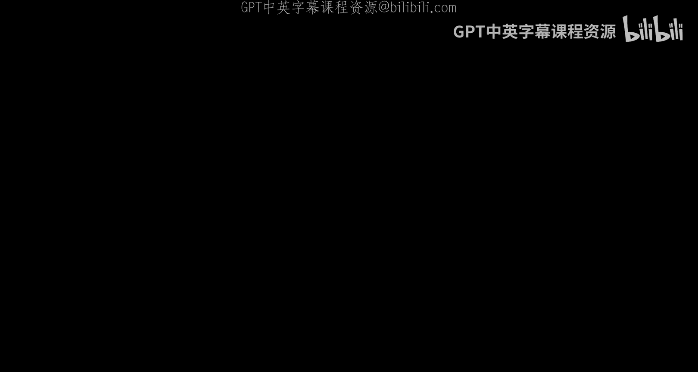
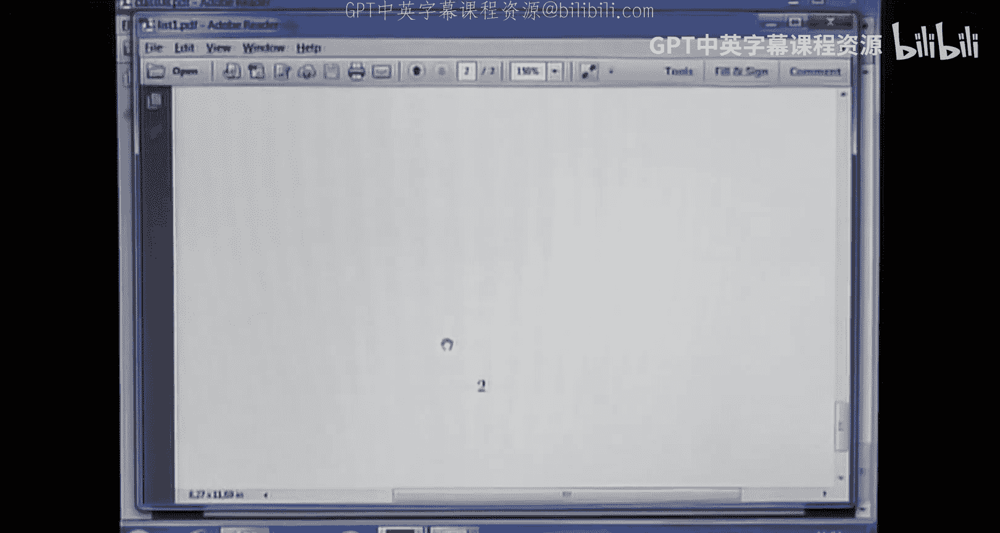

# IMPA《随机编程｜Basic Course on Stochastic Programming 2016》中英字幕（Claude-3.5-sonnet p09 -09-Basic Course on Stochastic Programming - Class 09.zh_en -BV1tH92YXEnd_p9-

A we。Okay， welcome to the ninth class of this basic courseursing of scratch Pararaami。

 Please look at the。

The spreadsheet， is。😊，A list of names。 Okay， this is here is。😊，The exercises that you deliver to us。

 and in this column is is the names。 So if you have a。

Have sent exercises for us and your name is not here。Please let us know。 Okay， Oh， you。

 do you have that， Can you give me。Okay， of course your name is not there， but there's no fraud。呃。

Okay， that's it。Okay， in this class， we are going to。We are going to。

To discuss some remarks about the some results we， we saw in the last lecture。 And after that。

 we are going to solve the， the list， okay。Now， hers it。Oh no， This is the wrong computer。C it， okay。

嗯。Let me。Here， okay， the last lecture we were working essentially with a problem like this。 Okay。

 as you may remember。This function G is convex。 function C is also convex。

 and we are defining this value function as the optimal value of this of this problem。 Okay。

 we are using here the infum， because maybe。There is no minimizer for that problem。😊，As we have so。

哎呀。The last lecture。😊，This problem V。I mean， this function V is convex。

 and we were working a little with a sub gradient of that function。 Okay。

 after making some computations and things like that。We arrive at this。

To this equality in the middle。And this inequality in this extreme。😊。

And we defined the dual function。AsA function by this。 Okay， this， this is called the dual function。

 that depends on the。On the multiplier move。Okay， that is called the the。They do a variable。嗯。

From this point， okay， we can。We come of time some interesting results。呃，For example。Remark。

It can be a re or even a proposition， okay？Well， we know that。For a fix it。Fixes。X。We know that。

This is less than this。For every。ForFor every dwell variable， mu greater zero。 Okay。

 this is called the。😊，Yeah。The wake dual， okay？And because of this， we can ask about what is this。

 the su。Affects me。You get to record down here that we know that this is this record than Vx。

 and maybe this optimization problem has solutions。 Okay， this problem is called the dual problem。😊。

Okay， and if it has solution。😊，We called that that solution， the dual solution problem。

The dual solution of the problem？嗯。Maybe even in the the optimal value of this probably。

 maybe strictly is strictly below this of this quantity。 And then the difference we call the gap。

The do chi up， okay？😊，What's interesting at this point is。え？If。呃。we know that。

Assume that there is a sub gradientient。😊，诶。Of the value function at the point X。 Okay。

 this is a very special case。 You can。😊，Assume that。Hi， and。And if there is。ノド相りが。路器。O。Okay。え。

Under these two assumptions， we are going to find interesting results。 Okay。

 I am not saying that the primal problem has solutions。😊。

I am not saying that the dual problem has solution， solutions。 I am only saying that。诶。

That there actually some some subgrading for this value function at point X and that there is no gap。

Okay。From that。We can write to， to what。Okay， since there is no already up， well。

 I am going to copy this result here。😊，Since。This that is s。By definition to this here。

 to this thing here。Plus。See minus x transpose me。Okay， I am going to put a bar here，😊，呃。Okay。

 since there is no directly gap， then we know that this quantity is equal to this other quantity。😊。

Oh no， no。 wait a moment。呃。Now， we should there's no to out then。Let me see， okay。嗯。

There is no world。If there's no up。Okay， okay， we know that this is great let me see this。Well。

 then the Supremepreme。Of this thing here。Oh， sorry。We just have something like this， Okay。

 because there is no Do check up。 Okay， so the supre of this。😊，All these should be equal to。V of x。

And we are asking about this stuff here。Let me think a little about this。嗯。哦啊 어。Oh。We。

This is something like this， okay。Mmhm。Oh。m。Well， actually， I was trying to。Not to to。

To remake all the computation we made the last time。

 but if you remember the last time here we had some results okay。Oh，Okay。即系。Here。

 remember for doing this？We have taken this dis subgraing at this point。 and actually。

 we were not asking any assumption about the existence of this minimizer， but we use it。

I mean device is sequence。 And after that， we have shown that。Oh， that's a very bad thing。

But we have shown was that， actually。诶。This are Southwest。Yeah， the。Essentially， we had。

Otained this result。Using all these， all these steps。 you， Do you remember that we， we had that this。

呃。This complementary condition in in an asymptotic way。 And we saw that in the limit， that mini。

That minimizing sequence was solving this problem。 and then that will leave us to。To this result。Oh。

 that's not。That is not so elegant。 But what we wanted to， to say is that we have a。

If we have under this notion， two assumptions that if we have notality gap。And we have this。嗯。

This sub gradient， then we can ensure that that sub gradient is going to be the solution of the。

Of the dlt pewl。Okay， so what I wanted to say is that there is if this is sub gradientdient and there is no validity up then。

Then。This is is。A world solution。That's what I wanted to show。 Actually， that is。

 I am quite sure that we can obtain that result from these inequalities。How we can show that。

Let me say。 Let， let me see。嗯。好呃呃。ok。😊，Okay， this is what we wanted to， to show。 Okay， and from this。

 actually it， it's quite simple。 since we have this， this relationship， we know that0。

 it's very similar to what we made the last time， okay。😊，Plus， new bar， for example。 Okay， from that。

 we know that 0 belongs to the， to this sub gradientient。 let's see。Plus， I don't know。

 maybe something like this。IZoom minus the6？Tranpose me bar Okay， when the equal to x。 Okay。

 that's the same thing。 That means that。X bar， x solves。Solves this problem。 the of the。Or V of c。

 okay。诶。Plus， zm in the suppose。ok。We have that。嗯。From that， we know two things。

 First thing is that since x solves this problem， we know that this happens here。Okay。

 since this is the optimal value of that and X solves this problem， we have that。😊，Here。

 plus x minus x transpose。Okay， so this is。The x y， Vx， okay。So okay， answers。

 all the values of the dual values are less equal than this。

 we know that mu bar solves the dual problem。😊，O。And since these two things are equal。

 then actually there is no dollar gap。😊，Actually， the result we have found is。That if。

If we have a subgrading， then this。This dual variable is a dual solution。And there is no。

There is no gap。Okay， that's the result I wanted to， to show you。 Oh my god。 I'm getting old。

My brain's not working us。Is used it to work。And actually what we have is also the。

The other direction， I mean that if。Uber is思。I'll do a solution。啊。If there is no doubt。There is。No I。

Okay， there what we want to show is。This。Okay。And。Again。

 this result came easily from that inequality。😊，Okay， now this is this conference from here since。😊。

We know that。Okay。Okay， and we know this。Oh， this is one I think in before。Okay。Okay。え。

This means that you solved the dual problem， okay？This is the definition of this dual pro。

 this dual function at the variable mu bar。And we are assuming that there is no validity gap。😊。

Then actually here we are going to have an equality。Because everything no very。From this。

 we want to show that the negative of this。😊，Of this dual solution is in the sub differential of the function B。

啊。So。Ho we can see that。Okay， from that we know that。V X， okay。

Is less equal than any other variable like this？Okay。This is forever。C。😊。

So what this shows is that x that x is the solution of this optimization probably。

 that means that0 belongs to this。So， differential。O。啊。Thats see equals。 And from this， we。

 we obtain easily this result。 Okay， so what we have is that。

The set of solutions of the dual variable。😊，Is exactly the negative of the elements of the。

Of the sub differential of the value function。 Okay， and at this point。

 we didn't make any special assumptions about the existence of solutions or anything like that。 Okay。

 so that these results are very quite general and。Are going to be very useful。

Any time you have you need。Existive results。Of course。

 we don't know about the assumptions we need to make。In order to， to ensure the。

To ensure the existence of solutions。 And here we have。呃。As they are that makes。

 some conditions to ensure the ex the the existence of solutions。 Okay。

 so here we are assuming that at a point。X， the optimal value is finite。

 That means is not Ma plus infinite。 That means that the problem is feasible。

 and is not minus infinite。 That means that the on the feasible set。

 the objective function is bounded。With those two assumptions。

 we can ensure that this is real and the other assumption we need is to prove the existence。

Of of this variable why such that the the cons is is called。In a strict wave。

 that's called the later condition。Under there are those two assumptions， we can show that actually。

 the dual probleming will have solutions。 Maybe the prim not。

 Do you remember that the last the last class we， we。

 we saw some examples where the primal probleming didn't， didn't have solutions and the dual。Half。

Okay， and there is no de gap。呃。The proof of this， Im going to give the proof of this。😊。

Of this theorem， because in the proof， we are going to see some other interesting properties of these sanctions。

So。呃。Well， another remark。嗯。Okay， well， since since。Since we know that。

See why this is strictly less than N， okay。Thenan。There exist。There existed。Absolutely。

 it isn't zero such that。啊。See why。It's less than that。For every that。In that。Oppping ball， okay。

I know that this is for example see， then I know that there is a small ball here。Of radioceptional。

 where every point at this in this wall is holds this strict。And。Inequality。From that point。

 we have the following。いああ。I think we call this this problem like P。

 the problem what's the name of the problem okay， remembering that。

This problem that depends on x is called it Px， I am going to use that notation。嗯。

We have the following。啊。And so。This why。So why is feasible。For all。And that's wall。O。We know that。

It is feasible because we know that for all elements of this world is that。😊，We have this inequality。

 so this guy is feasible。😊，嗯。And then we， we know that this。Optal value。Cannot be plus infinite。

 Okay， because there are feasible points。Okay， maybe this can be mine， minus infinite。 It could be。

 okay， maybe for some value Z， the optimal I mean， the object function is some bounding from below on the physical set。

 And then this could be minus the infinite。 But at least in this ball。😊，嗯。It' is not plus infinite。

 Okay， and what we want to show is that actually， in this ball。诶。The optimal value is a real number。

Okay， and showing that that in this world， the， the， the optimal value V。iss。It's a real number。

 We will have that we have a conve function。 We know that the， the。

 the value function V is a complex function that's going to be finite in this ball。

 then it is sub differentiable at all points on this ball， in particular in at the point X。 Okay。

 and since if it is sub differentiable at the point X。Okay， it has a sub gradientient。

 and then we can show from the remarks before that those sub gradientients will be solutions of the dual problem。

 and there will be not value to up。 Okay， so that's the proof of the of the。Of the。Of the theorem。

 But even more since we are inside an open wall that。That's of differential is going to be bounded。

 It's going to be a compact set， actually。 So we will know that at least for all points in this open world。

The solutions of the dual problems will be all of them compact。Okay， so that's an interesting thing。

Okay， that's what we want to do。 We already know that they are not。Plus infinite。 Okay。

 then what you want to show is that。They are going to be。Find that， actually。好 we go。

How we can prove that。Thatさ。Who can prove that this is going to be finite？啊。Let me see。

We already know that。We know at least that at this point， that problem is fine， okay。唉。Okay， from。

 from this， okay。嗯。Cocon。Well， since we are in an open ball， I am sure that at some point maybe here。

Okay。And I'm going to find a point。Is that hot okay？There is a point set to that on the other hand。

On the other hand。There exists。Point。They had。In that world。Okay。X。Such that。

That is strictly less than X。 It's easy to see。 Okay， I it's only to， to move a leader here。

 and we will have。A point like that。Okay， so。诶 actually。Since I have a point of this。😊，I I， I。

 I will can find。 I cant find another。A small ball here。Okay。And there exists。

Another epsilon greater than0， such that。That other ball。Is contained in the original ball。

I this strictly less than x。For， for all Z。On this。On this one。Okay。

I can find a small ball here such that all elements of this small ball are strictly below from permax。

😊，嗯嗯。And what we are going to prove now is that。At at least in on this small wall。

 the value function is finite。😊，Okay， we already know that in this weak ball。

 the value function is not plus infinite， but maybe it's still minus infinite in some points。

 But we are what we will prove now is that at least in this is on this small ball。

 they are not minus infinite。 So they are finite， okay。For that。How we can improve okay。诶。Asum。两样。

Assume that。My hat is feasible。My heart's feasible。4。The brawling associated to。To some。Oh。

 they had not another letter。They。First they。In this small ball， okay。Then。We know that since。

This is feasible for this problem。This is less equal down z， for example。

 and this is strictly less than x。This point is feasible。4。PX for the original problem， okay。

 since it is feasible for this。😊，Pro all in PX。We know that。Vx should release least or equal than。

G on y okay， because this is the optimal value for all feasible points on this problem。From that。

 we know that the X should be less or equal than。意思。Okay， and this is not plus infinite。Okay。

And this is not， Oh， sorry。us infinite。Plus， infinite， okay。So。Lizi。Is a。Is up。 now is a finite。4。哦。

Z， this is a small ball。Okay。So。Now already know what we have is。

The value function is not plus infinite in this big ball， and in this small ball it's finite。

Now what we want to prove is that actually is finite in this old ball。Okay。

 and they prove quite easily， quite， quite easy。I'm not going to give that proof。

 but you can do it at home very。Isly， because we are。Running out of time。Okay。Asum that here。

 there is a point one some point Z such that the the value， the optimal value is minus the infinite。

We want to prove that that point doesn't exist， okay。But we know that at this wall。

 all the points are finite。Okay， so you can look at this line， okay， and then there will be。

Something like some point here that is in the， that is in the middle of the segment。

 but this is still inside of this small ball okay。And you know that in this segment， the the。

The function is convex。 Okay， and we， we will get an a contradiction because， because why。

Imagine that you have the graph of this point z here， okay？Here's the point。呃。

The that is minus infinite， okay。That is minus same infinite。This is fine that I know。 well， okay。

 here is a ball that everything is fine at maybe something like this， okay。

 and here we have another point。😊，That I am going to call this point W， for example。Okay。

Thatati is it。But。We know that since the。The function is convex。 The epigraph is convex， okay。

And since it is complex， well， I know that this point， for example。Belongs to the epigraph， okay？え。

Well， imagine that the。The graph of this function is something like this。 Okay。

 I don't know how is it。But this convex， okay， so。This point belongs to the epigraph。

 then the segment。Belongs to the epigraph， Okay， so。This point here should be。

 should belong to the epigraph。 Okay， so that means that this point is greater or equal than VW。

 Okay， I am going to call this alpha， for example， then alpha should be greater equal than VW。

But since this is minus infinite， okay， is minus infinite。😊，I can take another segment。Below here。

 so I can。Do the same thing。 But now this value alpha is。え。Here， and we。

 I can continue doing that because I can go to the infinite。 And this value R is going to。

 is going to minus infinite as well。 And that will contradict the fact that this。We find it， okay。

So that is。Quite easy。Another thing that we can note as well at at this point is the following。

 If you assume that you have a ball around a X where the。Okay。

The question was if x at this point is the optimal value of B。The answer is no。

 because on the problem here。The definition of this problem。We are defining this。This optimization。

 this function as the optimal value of this optimization problem。 Okay， so for each check。

 you have some， something like this as， I mean， for fixed X。

 you have an optimization problem for that of the optimization problem。

 you can define the dual problem， you can ask about the so differential of this of this function V at。

 at this point， X， Okay， you can do all those things。 So all the theorem that we we have。😊。

So far r for a fixed x。😊，What。Find it。Yeah， under the assumption。

Under the assumption that for this fixed x， okay you have this this y and under this assumption again。

 we are fixed this x and we have some some y that such that this inequality is strict okay。😊。

And those assumptions， we have shown that actually， for that X， there is they exist and a small ball。

 Okay， where all values， optimal values V are finite for all of them。😊，Okay， and because of that。

 since the opt， since the function V is convex。 Okay。

 we know that there exist it is sub differentiable at every point here， in particular to x。

 And since it is subdiiable， we know that the optimal value。

 the dual value has solutions and there is no value gap。

For x here and naturally for for all other points in this is a small ball， okay。

That's what we have shown。ok。So okay， all what we all what we have done until this point。 Okay。

 was to prove that actually under this assumption here。

 we can prove that actually there system ball like this。 because what we wanted to prove。 well。

 we are trying to prove this theoryor。 Okay， okay， so what we what we want to prove is that the dual function has a solution and there is no validity gap。

 how to do that。 Well， from the remarks before， we know that if we I we have a some sub gradientient of the。

😊，Of the。Value function that existence of subgrading is enough to ensure that actually there exist。

Solution of the dual function and no Do gap。😊，So that is why we were doing all this。

 But what we found is that actually， there is more than that。 We can prove that the。

 the sub differential at this point， for example， is compact。 That means the。

Dual solutions are are compact because dual solutions are the negative of the sub differential。Okay。

And in the other hand， if for if you， if you know that around this point X the。呃。

The value function is finite net， for example， assuming that another remark here。😊，Assuming that。え。

V of the。Is finite。For all z。In a ball around the x，If you have that。え？Do you know that？

Then there exists。呃Some。Some x hat， okay。On that wall。Sucharch that。That X cut is。

Its strictly below x。That zelta is strictly below x，You know that。 And， of course， you know that。

This is。F it。 Okay， because we are assuming that we have a board like that。嗯。Since that。

 we know that。This is feasible。OK。Otherwise， this value would be plus infinite， its feasible。Okay。

And。If some guy had。Is feasible。It's visible for。呃。Okay， if I have that。

There is some point that is feasible， we know that already that point exists。We will have this。Okay。

 because there's a point feasible， but we know that。This happens。

So there is a point that satisfies this later condition。Okay， so if you have that。

 if you know that the。The value function is。Is finite around in in us in some world。

 Then you know that actually， there should be some。

 some point that is satisfying the later condition。Okay， so that's。That's a strong result。Okay。Oh no。

 this is not again。We are we are running out of time。我 not。M。Let me see。啊。No， more。No。😔，O。Well， okay。

 this is the。This is the list we。We gave to you so that you can sort them。We are going to solve it。

We going to solve it now。Well we are not first。诶Oh。We are not going to solve this last question。

 because。Question what number。Question8， because there is a discussion of the about this problem in the Lib in in the book of Shapiro Raincanin Sheva。

 Okay， actually， that is in the introduction part。 Okay， so if you have any。And you do you can。

 you can go to， to to read that part and。Okay， there's no problem。Here。Well。

 the first part how for the two stage linear linear programming program。

 assume that the random vector has。Find the super。Using the one stage equivalent formulation。

 the dose the optimality conditions for the two stage problem。 Okay。

 on the previous lectures with Clauddia， you obtained some optimality conditions for the two stage problem。

 okay。And from the。From the fact that。Now， this is， this。I'm going to put okay for the scenarios。

 okay？This is the first stitch problem。And the twot problem is something。啊。Like this。Yeah。Fe。Now。

 what's the variable you use here， Q？Yeah， it's cute。 if I。If I am not wrong。

Here you put some ladies。Maybe T this is。Random。This is。Okay。Here we have the two stage problem。

And we know that。I don't know，Okay， we know that this。Randombacter has a final support。😊。

Then we know that this prowling is equivalent。Exec too。So this one stage problem。Here on x。

AndIn this case。I wait。And thiss just in these two sets of variables， so sorry。

Here I was forgetting the expected value。here。We will take。What trans here。Okay。And。Here suppose。

 We can assume even that。Maybe this vector is also random， okay。For this， and， of course。Okay。

 so we we already know that this is。啊 big呃。Linear problem that is completely equivalent to this other two stage problem。

 we have shown that already。And since this is an expected value。😊。

The random vector has final support， we can actually replace this。For some。Mam。Pk， where Pk is the。

Pability of happening。This。Realization， okay， having that realization。 Okay。

 so here is everything is linear。😊，And we know that there exists so rich players。M。Okay。

 the point here is that there exists here， for example。

 some multiplier or lets call it lambda lambda K， maybe。😊，Here there will be other multipliers。Okay。

 something like that。And。Then we can write at this point the KkT conditions， okay？😊。

The humity conditions。R， well， the gradient of this of the objective function is going to be something like C here。

And on the other points， I'm going to。B1， Q1， for example， B2， Q2。Still here。Bian。Qan。ok。

A big vector here needs zero。And after relaxing， oh。No。

Here we will have another multiplier I was forgetting。Here we have another multiplier。

A name for this。Let's call Lada hat， okay。And here， another multi。 I am going to call a。Muha。

 then after。Relax in this。This constraint we will have。Something like。え？Aron suppose。L the heart。

Serious at this point， plus。Now， relaxing these constraints here。What we will have is。Is what。

We have something like。え。T K transposed。嗯。And here。Well， some sewrs maybe here。At some point。

 we will found some。 we will find some。Talut decay transport and more serious here。

All this multiply this。And。Whi player。And。We will some this。This lecture。Okay， this is。即。K entry。

Plus。Okay， well。Now， what do， we need to。Yyang。To relax our these two constraints here， okay。So。

We will have something like this。Here I am going to find minus。M here。 Okay。

 here I am going to find minus。Mu 1， minus mu 2。Musan。Okay。And complementarity conditions。

 the complementarity conditions are that。Okay。New bar greater record than 0。I or to to。2 x。At this。

Greatre equal and zero as well。And the other constraints here。And s。Okay。

Using these complementarity conditions， we can substitute these values from here。😊。

We know all these values here。Then we can substitute those values in this。

di complementary conditions。Then naturally we will have something like this。0ro， should we。

What's going to be here。Oh。Yeah yeah。🤢，C plus a trans the than the hat。Okay。Thats a。And the。

And this should be。Something like this or this is for k equal 1 to 2M。And in a similar way。

 we will have something like this other。Point。We have。毕 k。Q憩。啊。Plus。嗯。Okay。W caters suppose。Lambda。

 it's not cut here。Only that， yeah。Sir。This is okay。2M， O。诶。Here， what is interesting is that。

For our China the the， the same con。The same。Optimality conditions for the second stage problem。

Since。Since these probabilities are all of them greater than zero。We can。We can set。诶。

Lda系 equal P K for some other。Malue that's going to， we are going to to， to call Pi k。Okay。

 so at this point， what we will have here is that we will have。诶。bggy。By K and P at that point。

 And since all these values are positive， they are not going to affect these complementarity conditions so。

We will have something like this。And those are the the optimality conditions for the。

For the second stage problem。 So in that sense， we can。I am forgetting something here。

We can reduceuce all those optimality conditions。For the second stage for the two stage problems。

Okay， what I mean is that the only thing that was important at this point because everything was more or less straightforward is that for obtaining the optimal conditions for the two stage problems。

 we need to choose these multipliers here。😊，As that probability。Andload 물 supplier。Okay。

That's all what we needed。O。It's quite straightforward straightforward。 here， here the this， this。

 the， the second question was quite easy as well， because。

We are assuming now that the vector C has final support， okay？Has final support。

Has final support okay。ああ。We are asked to， to show that under this assumption。

 relatively complete recourse Recourse is equivalent to ask for this。Okay。

But the definition of a relatively complete recourse。😊，啊。Okay， if。Has呃。And。Has relative。Complete。

Records。诶。Means that。啊。For。For all feasible。Physical point。No， for all not。Yeah。

 for all feasible point， x free stage decision variable。😊，诶。The second is stage。Second problem。

Is feasible。For almost。For most of every realizations of the， the random vector X C。 Okay， but since。

诶。the random vector has a final support。 that means that。

All those realizations count't because all of them has a positive。Pability， okay。Since。

All realizations。Few realizations of。Of。え。Have a positive。Positive probability。Prob。Probability。呃。啊。

We have that。That's a。This second。Let stay。Proably。Is feasible。芙蓉。From O C， that means that。え。

Since the problem that defines this optimal value is feasible， it cannot be。Plus infinite。

 maybe minus infinite， but not plus infinite， okay。

AndThe other direction is clear because the definition only ask about。About almost everywhere。

Holding， okay， since we know here that for all for realizationization of C works， then it's。

 it's clear。啊。Question 3。Okay。Okay， so。Here we have the definition of this。Second stage， brilliant。

 That is。嗯。Fix the records， okay。嗯。Or maybe hereists something like this。This is only W here。Oh。

 sorry。啊。This is the second research problem。And we want to prove that all these three statements are a。

Are equivalent， okay。So， let's go。From A to B。We are assuming that the program has complete records。

If it has complete recordscourse， that means that。Well， let's assume that W is a matrix from。

With these dimensions， okay。So if the problem has complete recordscourse。

 that means that this set here。Wy。Such that y is great rec here。 of course， Y belongs to。All am。

This is exactly。RN。That means。That it has complete recordscourse。from this。

 we want to show that the dual the feasible set of the dual problem。😊，Is bonded for all Q。Okay。

And since。We know that this。Set。This is going to be。All pies that belong to。嗯。祖儿。Aan。Search that。

T suppose the。S， thank you。Okay。We want to prove that this set is bounded。Well， I。I can我。Enrase that。

唉。Okay。嗯。By contradict。Okay。え。Asue。Assume that。え。This is， here is。이산 바운드。ItSome。对啊。

We know that there exists a sequence。Byike。Okay， and this set。Se that。え？Okay。

The length of those those vectors goes to plus infinitefin。Okay，こ they are。You are feasible？

We know that this should happen。So called then큐， okay。And。We can。Do this here。And this here。

 and there will be no difference。 Okay， and since。呃。嗯。And since this set this sequence here。

Is bounded。Okay， it's bounded because all of them has length one， okay， they are an， there exists。😊。

A sub sequence， okay。Kj。Oh。A sub that is convey。It cons to some。To some vector。是吧O。He note that。

Now that。Ro has length one。Now，Using this sequence on this inequality， we will have that。Delimit。

Pular post。It's going to be less， less recall than the limit of。Q。几住 ok k。

But since this is a sub and。The original one was conversionver to plus infinite。

 This sub sub sequenceequence also is going to plus infinite。 And since Q is。Is fix it。

We will have that this limit that is equal to。那比如说。This Ri then。N zero， okay。Remember that。你是呃。

This role belongs to。To our。Aan。Okay。唉。Okay， finally。Finally，Since。Well。

 we have complete recourse here。诶。Since we know this happens， okay， there exist。X is Y bar。

On our end， such that。row is equal to this。Actually，This great reckon here。

Then what we what we will have。啊，O。Okay， so。Since this is less record than 0。

 and this is greater record than 0。The inner product。嗯。It's going to be less recording here。

But this in the product is actually。This one。Okay。But this is equal to。The norm row square。

 So this norm squared is less re here。 That means that。Raw should be 0。But， we know that。啊。

The length of row is one， so that's a contradiction， okay。That's a contradiction， so。

That contradiction comes for the fact that we have assumed that this set was unbounded。ok诶。

From partway to。To see。诶。Oh， that's， that's。I as well by contradiction again。😊，By contradiction。

By contradiction， assume。Asum there exists。There exists some pie hat such that。呃。Different from0。

 okay？Differentence zero such that。This is less less rec here。Okay， then。

For every T great frequencyency， we will have that。嗯。That， this。Will be lesser equal than V。

For every。By， that is。And this said Q。Piq。 okay， if I take that this pie on the。

On the dual feasible set， I know that for this pie， okay， I know that this happenss。😊，Equalality V。

 okay。And since。I know that。This inequality holds， and I multiply by t No negative。

 When I put this T here， there will be no difference， and I can add to this inequality。 I will have。

This this inequality。 Okay， that means that。That means that。Pi plus T。 pie hat belongs to。Thank you。

 okay。啊。嗯。For every tea greater here。And since。This element is non0。That implies that。

This set is unbounded。Okay， and second to here。Okay， so that proves that。

This inequality has a unique solution that is， of course，0。O。Now， from Siu。Again。

 we want to prove that。They said here。Yes， of course， this is coned。On R end。 Okay。

 what we want to prove is that they are actually the same。For that。诶。Assume that。

That there exists some point， I don't know what to call。Z that belongs to R n minus。O。

And we need to write a contradiction。This is a con。This is close。Come back， Come back。够。Okay。

 since that is a closer complexve con， you can use a。We can apply。Apply strict。A strongtro， actually。

A strong separation theorem。O。That means that。It mean that there exists song。So alpha bar。

 that belongs to。To end such that， thats that。Alpha is greater than some value。Yeah， I don't know。

Yeah的。And this is greater record land。That alpha bar。W Y。For R y greater re0。 okay， from this point。

 we can prove that the is should be greater equal than 0 and that this other inequality also holds。

Because it's a con。 Okay， since it's a con， if these were positive for some value of y。

 you can multiply by by a constant by a non negative number T here。 and that can。咁诶。

Become bigger than yet， and that's impossible。Okay。So， that means that。

Thatll we transposedse alpha ver。Y is less equal0 for every y that is greater equal than 0。

That implies that。This w。Alpha bar should be less equal than0，So alpha ver is a solution of this。😊。

Of this system。 Okay， and since there it has only one solution。

 that means that alpha ver should be 0。 But if alpha bar is is equal to 0， I am going to have 0 here。

0 here。 and strict inequality in the middle。 That's a contradiction。ok。跟在。Okay， we have 7 minutes to。

To solve the whole list。I think we can do it。Okay， yes。Should be different from 0， only that。Okay。

 what's the question then？Okay， okay， from the strong separation theory， Okay， okay， that's true。

 the strong separation theoryor already says that。I a virus different from 0， okay。

It should be because otherwise you cannot have this strict inequality。😊，诶。Number 4。Well。

 for number four， it's going to be quite easy because。We already know that。 well， okay。

 everything here is。诶。Its is's convex。 Okay， so this。Optimal value is convex as well。😊。

And if you have a and， if the dual probably has a unique solution。

 that means that the sub sub differential of this function is。Is has a unique element。 Okay。

 and if this sub differential of a convex convex function has a unique element。

 that means that the function is differentiable。And okay， so that means that。

This function is differentiable， and it's of it's derivative in this case， is minus the。

The dual solution。 Okay， and from that since， this is only a a composite of a differential function。

 You can， you can。You can write to the， to the expression of that。 Okay， so it's not。

There's no difficulty for。5。Oh，5 is more interesting。诶。Okay。

 this is a linear problem that is fixed and this。😊，These are random elements and of course。

TheThe dual solutions will depend on on the random vector C。 Okay。

 and what we want to prove is that the the dual solutions that will depend on C can be expressed in this way。

Okay。呃。嗯。There是 about。I can't。I think we can do it easily。

 the dual problem is going to be something like this。The little problem is。Maximize。

What's going to be that？Se on supposed pie， okay。嗯。P should be lessal than。Then。you see okay。And诶。

Only that。And okay， assume。Assume that。いいすね。Prima solution。Okay。

 assume assume that you have a primary solution， we have so on the previous lectures that this primary solution can be。

😊，The that can be。周生。20。Ma answer a word。Next。Okay。

The primary solution can be chosen as being measurable。Then。啊。You can see that。 this。

The door solutions will be something like this。呃。Bye， such that。This here。What happens， okay。

It should be feasible for the dual problem， of course， because it's a solution。😊，And。

This other thing should happen。啊。Should the list recall call down。Oh no，I think great Ri done。

The prim optimal value。 that means that should be something like this。啊。O。Okay， so。

Everything here is linear， the variables here are only are multiplying some vectors or matrixes。

 so both of them are cartoor functions。And if you defined a。嗯。This。As the maximum。Of those things。

And the other should be。ok。And the maximum of character functions is also character functions。

 It's not a problem because the maximum of meable function is measurable。

 The maximum of continuous function is continues。 So this is a character functions。

 And that shows the problem。😊，This his number。5。Number 6， I am not going to。To take that， actually。

 it， that was my error because for， for number 6， it is necessary to use some strong theorems。

 I thought it was possible to， to solve it without without that， but I was wrong。No， no。

 but you know， it's a line for it。 Okay， the， the question was， in this case， this is。

 this is a vector function。 Okay， so， of course the I。Technically。

 this is not a character function because there are vectors。 But if you look linewise。

 each line is going to be character function。 Okay， so you actually here。

 you have a lot of character functions。 Each one for lines here。 Well， this is actually。

 this is a character functions。 So you have a finite number of character functions。

 and the maximum of character function is character function。😊，So they moving the price。诶。

Question seven， there is a typo here， the transpose should be here。Okay。

 that was quite natural because otherwise this is only a number and this expression would not make sense。

 Okay， the transpose should be here。😊，And。Well。Let's do it in a minute。Because it's。Quite this。嗯嗯。

Okay， number seven。By definition。The variance of this thing here is going to be the expected value。

Of。This here。X。And minus。Is here here。X。square。This one。Okay， this is sl 2。D spec is value。Sposed。

 x minus。D spec value or。Since X is fixes， okay？It's not random。The square。This is SQL 2。Okay。

 this is called the move by the。By the question here。 So this becomes something like this。Okay。

Square。And of course， these are two numbers and this is equal to expected value。Of。Tranposedm。 Okay。

 this is a number。That is equal to this other number。ok。

So this X since is not random can be put outside this other as well。 And you have the。

TheAs I as I have said question8 is。呃。There is a section in the in the book from Shapiro and Sheva and Rosinski。

 So there will a prize。Okay， so that was all。Seize you next。 Well， I actually。

 I will not see you until the final part of the course that is going to be risk。 Okay。

 I think the next class is going to be。

Given by Claia over into cloudy， I think。Until the next time。

